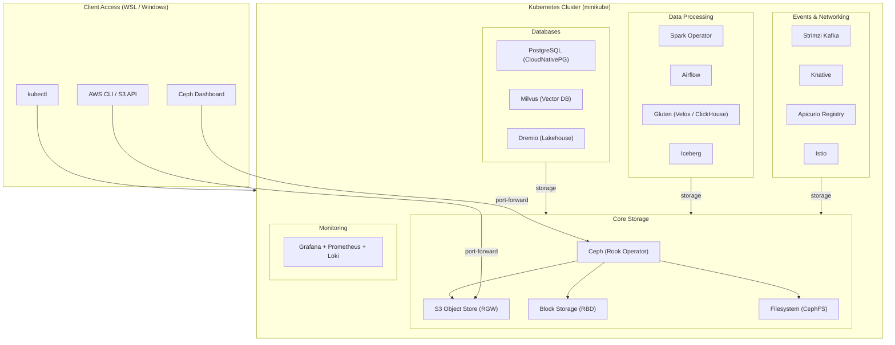

# Data Infrastructure Playground

A sandbox for deploying and testing data infrastructure components on Kubernetes. The core is a **Ceph S3 object store** (via Rook), with pluggable Helm-based components for databases, monitoring, and data processing.



**Components:**

| Component | Status | Description |
|-----------|--------|-------------|
| **Core** | | |
| [Ceph](components/ceph/README.md) | Core | S3 object store, block & filesystem storage (Rook) |
| [Monitoring](components/monitoring/README.md) | Pluggable | Grafana, Prometheus, Loki observability stack |
| **Databases** | | |
| [PostgreSQL](components/postgres/README.md) | Pluggable | CloudNativePG operator for PostgreSQL |
| [Milvus](components/milvus/README.md) | Pluggable | Vector database for similarity search and AI |
| [Dremio](components/dremio/README.md) | Pluggable | Data lakehouse query engine (EE v26.1), Ceph S3 backend |
| **Data Processing** | | |
| [Spark (Apache)](components/spark/apache/) | Pluggable | Spark Operator for Kubernetes |
| [Spark (Kubeflow)](components/spark/kubeflow/) | Pluggable | Kubeflow Spark Operator |
| [Airflow](components/airflow/README.md) | Pluggable | Apache Airflow workflow orchestration |
| **Data Engineering** | | |
| [Gluten](components/de/gluten/README.md) | Pluggable | Native Spark execution via Velox/ClickHouse backends |
| [Iceberg](components/de/iceberg/) | Pluggable | Apache Iceberg table format |
| **Events & Networking** | | |
| [Strimzi](components/events/strimzi/README.md) | Pluggable | Apache Kafka on Kubernetes |
| [Knative](components/events/knative/README.md) | Pluggable | Serverless event-driven workloads |
| [Apicurio](components/events/apicurio/README.md) | Pluggable | Schema registry for Kafka |
| [Istio](components/events/istio/README.md) | Pluggable | Service mesh |
| [Envoy Gateway](components/events/envoy-gateway/README.md) | Pluggable | API gateway |

## Deployment Methods

| Method | Platform | Driver | Best For |
|--------|----------|--------|----------|
| [Hyper-V (recommended)](#method-1-hyper-v-windows--wsl) | Windows + WSL | Hyper-V VMs | Fast image pulls, block devices for Ceph |
| [Vagrant + VirtualBox](#method-2-vagrant--virtualbox) | Any OS | VirtualBox VM + Docker | Portable, works without Hyper-V |

---

## Method 1: Hyper-V (Windows + WSL)

Runs minikube on Hyper-V VMs managed from PowerShell, with kubectl access from WSL.

### Prerequisites

- Windows 10/11 Pro or Enterprise (Hyper-V capable)
- WSL2 (Ubuntu recommended)
- PowerShell (Administrator)

### Quick Start

```powershell
# 1. From PowerShell (Administrator) - create cluster
cd C:\Work\playground\scripts\minikube-hyperv
.\setup-hyperv.ps1
```

```bash
# 2. From WSL - configure kubectl
cd /mnt/c/Work/playground/scripts/minikube-hyperv
./setup-kubeconfig.sh

# 3. Deploy components
cd /mnt/c/Work/playground
./components/ceph/scripts/build.sh
```

### Cleanup

```powershell
# Complete removal (preserves minikube.exe and kubectl.exe)
.\destroy-hyperv.ps1
```

See [scripts/minikube-hyperv/README.md](scripts/minikube-hyperv/README.md) for full documentation.

---

## Method 2: Vagrant + VirtualBox

Runs minikube inside a VirtualBox VM with Docker driver.

### Prerequisites

1. **VirtualBox** (6.1+)
   - Download: https://www.virtualbox.org/wiki/Downloads

2. **Vagrant** (2.3+)
   - Download: https://www.vagrantup.com/downloads
   - Install the Windows version (not WSL version)

3. **WSL2** (Ubuntu recommended)

### Project Location Requirement

**Important:** This project must be located on the Windows filesystem (DrvFs), not the WSL filesystem.

```bash
# Correct locations (Windows filesystem via WSL):
/mnt/c/Work/playground

# Incorrect locations (WSL filesystem - will NOT work):
~/projects/playground
```

### Quick Start

```yaml
# 1. Edit config.yaml
paths:
  host_project_path: "/mnt/c/Work/playground"
  host_data_path: "/mnt/c/Work/playground-data"
```

```bash
# 2. Create VM
./scripts/vagrant/build.sh

# 3. SSH into VM and start minikube
./scripts/vagrant/ssh.sh
cd /vagrant && ./scripts/minikube/build.sh

# 4. Deploy components (inside VM)
./components/ceph/scripts/build.sh
```

## Project Structure

```
playground/
├── config.yaml              # Central configuration
├── Vagrantfile              # VM provisioning (Vagrant method)
├── scripts/
│   ├── common/              # Shared utilities
│   ├── minikube-hyperv/     # Hyper-V deployment (Windows)
│   │   ├── setup-hyperv.ps1     # Create cluster
│   │   ├── destroy-hyperv.ps1   # Complete removal
│   │   ├── setup-kubeconfig.sh  # Configure WSL kubectl
│   │   └── README.md
│   ├── vagrant/             # VM management (run from WSL)
│   │   ├── build.sh         # Create VM
│   │   ├── destroy.sh       # Delete VM
│   │   └── ssh.sh           # SSH into VM
│   └── minikube/            # Cluster management (inside Vagrant VM)
│       ├── build.sh         # Start cluster
│       └── destroy.sh       # Delete cluster
├── components/
│   └── <component>/
│       ├── README.md        # Component documentation
│       ├── scripts/
│       │   ├── build.sh     # Deploy component
│       │   └── destroy.sh   # Remove component
│       └── helm/
│           └── values.yaml  # Helm overrides
├── docs/
│   └── NETWORKING.md        # Network access from Windows host
└── data/                    # Persistent storage (synced to host)
```

## VM Management

### Commands

| Command | Description |
|---------|-------------|
| `./scripts/vagrant/build.sh` | Create and provision VM |
| `./scripts/vagrant/start.sh` | Start existing VM |
| `./scripts/vagrant/stop.sh` | Stop VM (graceful) |
| `./scripts/vagrant/destroy.sh` | Delete VM completely |
| `./scripts/vagrant/ssh.sh` | SSH into VM |
| `./scripts/vagrant/status.sh` | Check VM status and health |

### VM Lifecycle Procedures

#### First-time Setup
```bash
# 1. Configure paths and resources in config.yaml
# 2. Build the VM (includes provisioning)
./scripts/vagrant/build.sh

# 3. SSH into VM and start minikube
./scripts/vagrant/ssh.sh
cd /vagrant && ./scripts/minikube/build.sh
```

#### Daily Usage
```bash
# Start VM (if stopped)
./scripts/vagrant/start.sh

# Check status
./scripts/vagrant/status.sh

# SSH into VM
./scripts/vagrant/ssh.sh

# Stop VM when done
./scripts/vagrant/stop.sh
```

#### Clean Rebuild
```bash
# Destroy existing VM
./scripts/vagrant/destroy.sh

# Clean VirtualBox leftovers (if needed)
rm -rf .vagrant
VBoxManage.exe unregistervm "data-playground" --delete 2>/dev/null

# Rebuild from scratch
./scripts/vagrant/build.sh
```

#### Re-provision (update VM software)
```bash
# From WSL, re-run provisioning without destroying VM
cd /mnt/c/Work/playground
vagrant.exe provision
```

### VM Credentials

| Item | Value |
|------|-------|
| Username | `vagrant` |
| Password | `vagrant` |
| SSH | `./scripts/vagrant/ssh.sh` or `vagrant.exe ssh` |
| Sudo | No password required |

## Persistent Data

Data is persisted to the host at the path configured in `config.yaml`:

```yaml
paths:
  host_data_path: "/mnt/c/playground-data"
```

This directory is mounted inside the VM at `/data`.

## Adding New Components

1. Create component directory:
   ```
   components/<name>/
   ├── README.md
   ├── scripts/
   │   ├── build.sh
   │   └── destroy.sh
   └── helm/
       └── values.yaml
   ```

2. Add configuration to `config.yaml`:
   ```yaml
   components:
     <name>:
       enabled: false
       namespace: "<name>"
       chart_repo: "https://..."
       chart_name: "<chart>"
       chart_version: "x.y.z"
   ```

3. Update `scripts/common/config-loader.sh` to load the new component config.

## Documentation

| Guide | Description |
|-------|-------------|
| [Hyper-V Setup](scripts/minikube-hyperv/README.md) | Minikube on Windows with Hyper-V |
| [Minikube Scripts](scripts/minikube/README.md) | Minikube management (Vagrant method) |
| [Networking](docs/NETWORKING.md) | Access K8s services from Windows host |
| [Ceph](components/ceph/README.md) | Ceph storage deployment |
| [Monitoring](components/monitoring/README.md) | Grafana, Prometheus, Loki stack |
| [Milvus](components/milvus/README.md) | Vector database with Ceph S3 + RBD |
| [Dremio](components/dremio/README.md) | Lakehouse query engine |
| [Gluten](components/de/gluten/README.md) | Native Spark execution (Velox/ClickHouse) |
| [Events](components/events/README.md) | Kafka, Knative, Istio, Apicurio |
| [Airflow](components/airflow/README.md) | Workflow orchestration |

## Troubleshooting

### "Host path of the shared folder is not supported from WSL"

This error occurs when the `host_project_path` in `config.yaml` doesn't match the actual project location.

**Solution:** Update `paths.host_project_path` in `config.yaml`:

```yaml
paths:
  host_project_path: "/mnt/c/Work/playground"  # Must match your actual project location
```

### Vagrant not found from WSL

Ensure Windows Vagrant is in PATH. Add to `~/.bashrc`:
```bash
export PATH="$PATH:/mnt/c/HashiCorp/Vagrant/bin"
```

### VirtualBox networking issues

If VM networking fails, try:
```bash
./scripts/vagrant/destroy.sh
./scripts/vagrant/build.sh
```

### Minikube won't start

Check Docker is running inside VM:
```bash
sudo systemctl status docker
```
