# Ceph Storage Component

Rook-Ceph provides distributed storage for Kubernetes using Ceph.

## Table of Contents

- [Architecture Overview](#architecture-overview)
- [Component Architecture](#component-architecture)
- [Data Flow](#data-flow)
- [Prerequisites](#prerequisites)
- [Configuration](#configuration)
- [Helm Charts](#helm-charts)
- [CSI Drivers](#csi-drivers)
- [Service Accounts & RBAC](#service-accounts--rbac)
- [Object Store (S3)](#object-store-s3)
- [Authentication (Keycloak + STS)](#authentication-keycloak--sts)
- [Performance Tuning](#performance-tuning)
- [Load Balancing](#load-balancing)
- [Monitoring](#monitoring)
- [Disaster Recovery](#disaster-recovery)
- [Usage](#usage)

---

## Architecture Overview

### High-Level Deployment

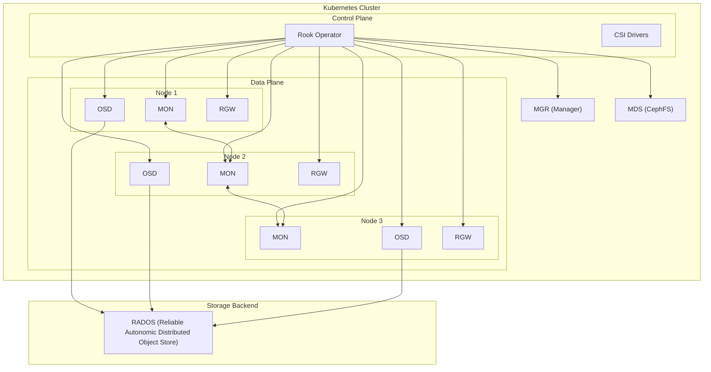

### Storage Services Architecture

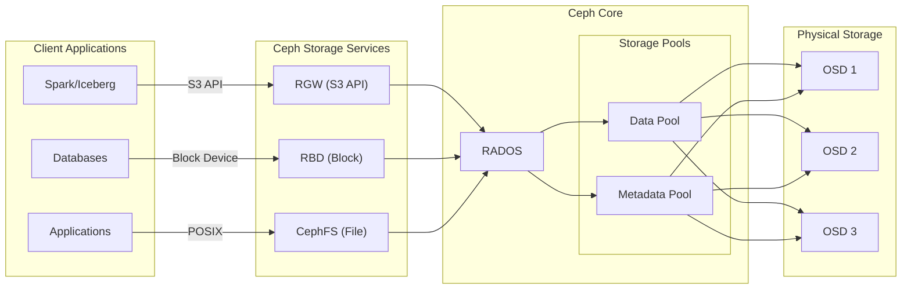

---

## Component Architecture

### Rook Operator

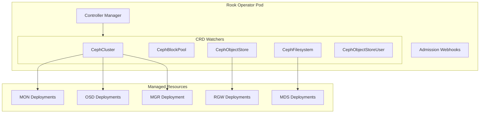

### Monitor (MON) Quorum

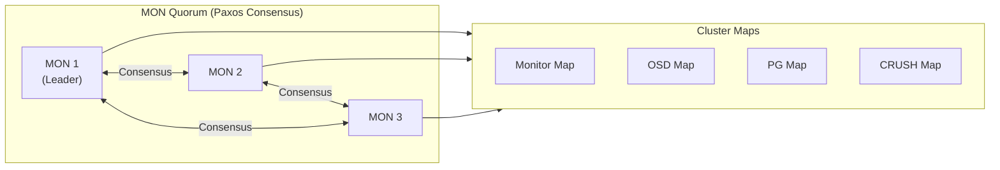

### OSD Data Flow

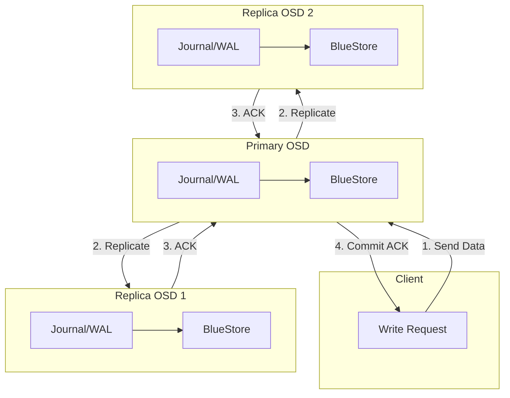

---

## Data Flow

### S3 Request Flow

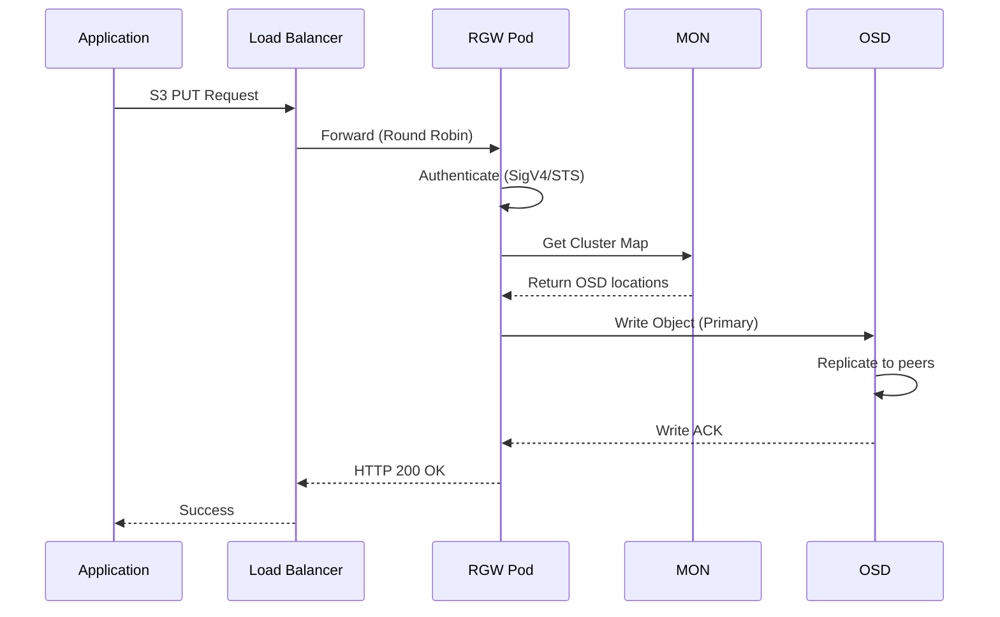

### Multipart Upload Flow

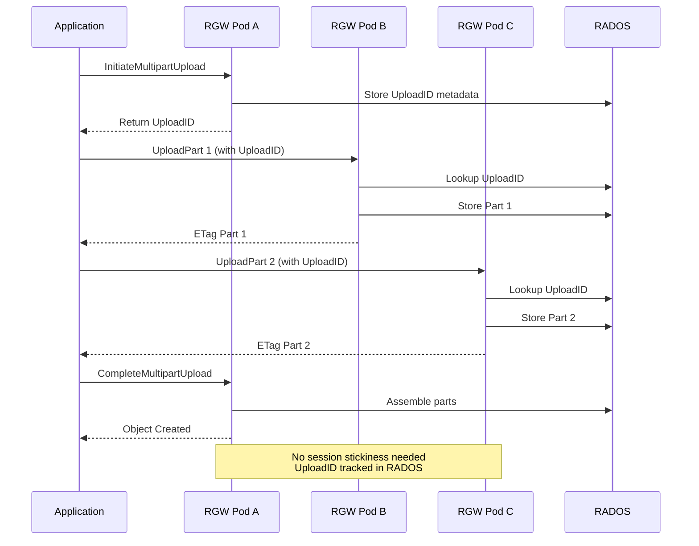

### CSI Volume Provisioning

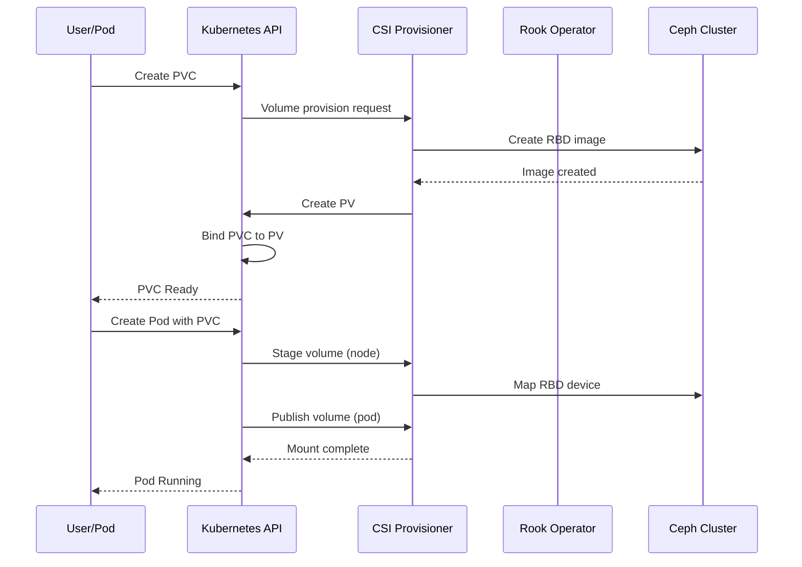

---

## Prerequisites

- Minikube cluster with at least 3 nodes (for production-like setup)
- Storage: raw block devices or directories for OSDs
- Minimum resources:

| Component | CPU | Memory | Count |
|-----------|-----|--------|-------|
| Rook Operator | 0.5 | 512Mi | 1 |
| MON | 0.5 | 1Gi | 3 |
| OSD | 1 | 2Gi | 3+ |
| MGR | 0.5 | 512Mi | 1 |
| RGW | 1 | 2Gi | 2+ |
| **Total Min** | **5** | **10Gi** | - |

---

## Configuration

Enable Ceph in `config.yaml`:

```yaml
components:
  ceph:
    enabled: true
    namespace: "rook-ceph"
    chart_repo: "https://charts.rook.io/release"
    operator_chart: "rook-ceph"
    cluster_chart: "rook-ceph-cluster"
    chart_version: "v1.13.0"

    storage:
      use_all_nodes: true
      use_all_devices: false
      directories:
        - path: /var/lib/rook

    object_store:
      enabled: true
      name: "s3-store"
      port: 80
      instances: 2
```

---

## Helm Charts

Rook provides two Helm charts:

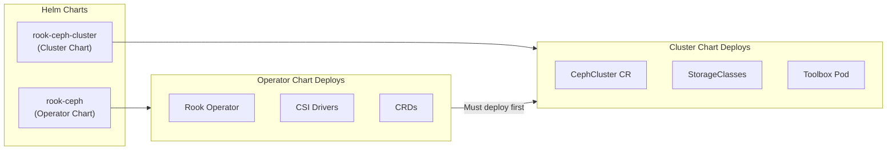

### Chart.yaml

```yaml
apiVersion: v2
name: rook-ceph
description: Rook-Ceph storage deployment
type: application
version: 1.0.0

dependencies:
  - name: rook-ceph
    version: "v1.13.0"
    repository: "https://charts.rook.io/release"
    alias: operator

  - name: rook-ceph-cluster
    version: "v1.13.0"
    repository: "https://charts.rook.io/release"
    alias: cluster
```

---

## CSI Drivers

### CSI Architecture

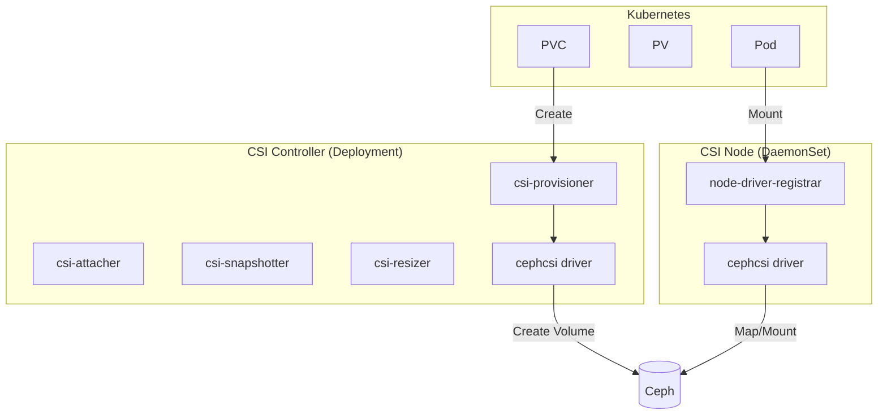

### CSI Configuration

```yaml
csi:
  enableRbdDriver: true
  enableCephfsDriver: true
  kubeletDirPath: /var/lib/kubelet
  provisionerReplicas: 1  # Dev: 1, Prod: 2+
  enableCSISnapshotter: true

  csiRBDProvisionerResource: |
    - name: csi-provisioner
      resource:
        requests:
          memory: 64Mi
          cpu: 50m
        limits:
          memory: 256Mi
          cpu: 200m
```

### Provisioner Replicas

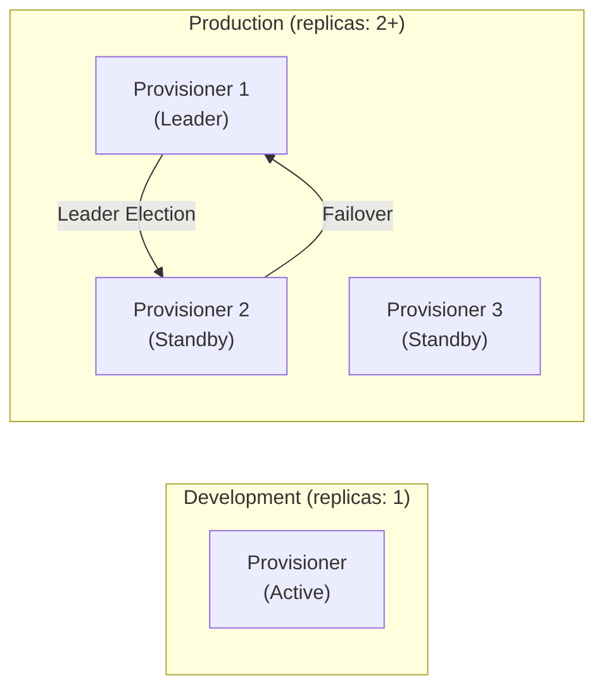

---

## Service Accounts & RBAC

Rook **automatically creates** all required service accounts:

| Service Account | Purpose |
|-----------------|---------|
| `rook-ceph-system` | Operator pod |
| `rook-ceph-osd` | OSD pods |
| `rook-ceph-mgr` | Manager pod |
| `rook-ceph-rgw` | RGW pods |
| `rook-csi-rbd-provisioner-sa` | RBD CSI provisioner |
| `rook-csi-rbd-plugin-sa` | RBD CSI node plugin |
| `rook-csi-cephfs-provisioner-sa` | CephFS CSI provisioner |
| `rook-csi-cephfs-plugin-sa` | CephFS CSI node plugin |

**No manual service account creation needed.**

---

## Object Store (S3)

### RGW Architecture

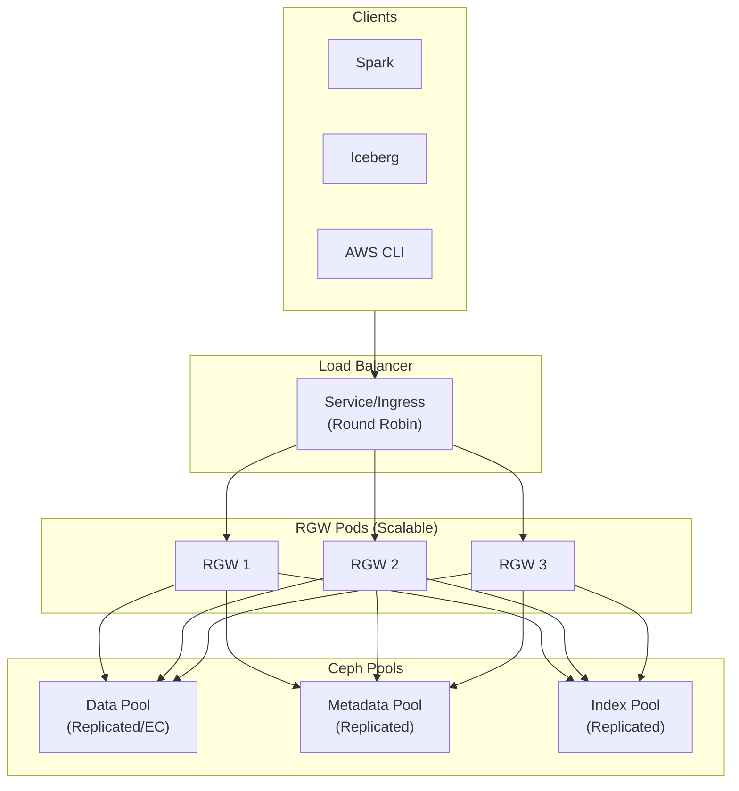

### CephObjectStore CR

```yaml
apiVersion: ceph.rook.io/v1
kind: CephObjectStore
metadata:
  name: s3-store
  namespace: rook-ceph
spec:
  metadataPool:
    replicated:
      size: 2
  dataPool:
    replicated:
      size: 2
    # OR erasure coding for large objects
    # erasureCoded:
    #   dataChunks: 4
    #   codingChunks: 2

  gateway:
    port: 80
    securePort: 443
    instances: 2

    resources:
      limits:
        cpu: "4"
        memory: "8Gi"
      requests:
        cpu: "2"
        memory: "4Gi"

    placement:
      podAntiAffinity:
        requiredDuringSchedulingIgnoredDuringExecution:
          - labelSelector:
              matchLabels:
                app: rook-ceph-rgw
            topologyKey: kubernetes.io/hostname
```

---

## Authentication (Keycloak + STS)

### Auth Flow

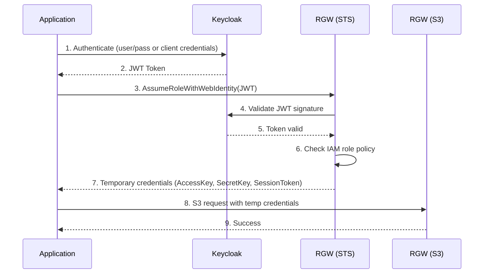

### Configuration

```yaml
# Enable in CephCluster
spec:
  cephConfig:
    global:
      rgw_s3_auth_use_sts: "true"
      rgw_sts_key: "your-sts-signing-key-min-16-characters"
      rgw_s3_auth_use_oidc: "true"
```

### Register OIDC Provider

```bash
radosgw-admin oidc provider create \
  --provider-url="https://keycloak.example.com/realms/myrealm" \
  --client-id="ceph-rgw" \
  --thumbprint="<keycloak-certificate-thumbprint>"
```

### Create IAM Role

```bash
radosgw-admin role create \
  --role-name=keycloak-s3-role \
  --path=/ \
  --assume-role-policy-doc='{
    "Version": "2012-10-17",
    "Statement": [{
      "Effect": "Allow",
      "Principal": {
        "Federated": "arn:aws:iam:::oidc-provider/keycloak.example.com/realms/myrealm"
      },
      "Action": "sts:AssumeRoleWithWebIdentity",
      "Condition": {
        "StringEquals": {
          "keycloak.example.com/realms/myrealm:aud": "ceph-rgw"
        }
      }
    }]
  }'
```

---

## Performance Tuning

### Scaling Guidelines

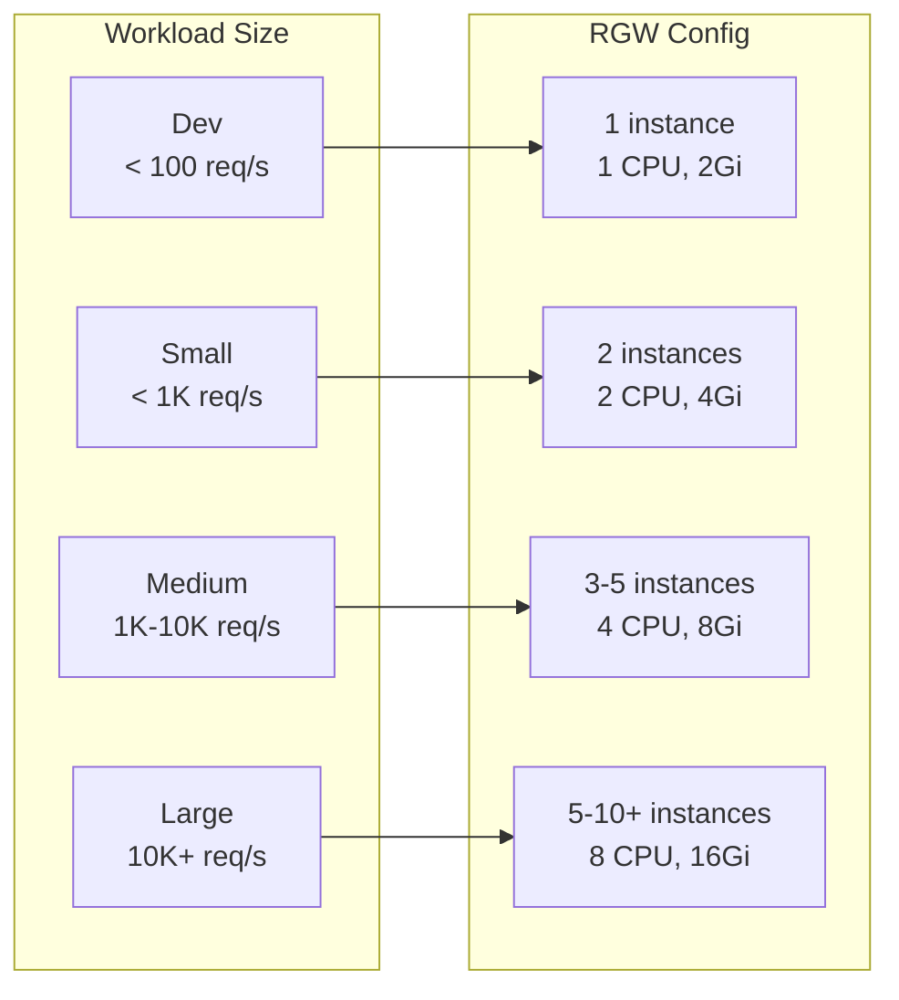

### RGW Performance Config

```yaml
spec:
  cephConfig:
    global:
      # Thread pools
      rgw_thread_pool_size: "512"
      rgw_num_async_rados_threads: "128"

      # Connections
      rgw_frontends: "beast port=80 num_threads=128"
      rgw_max_concurrent_requests: "1024"

      # Buffer sizes (for large Iceberg parquet files)
      rgw_put_obj_min_window_size: "16777216"   # 16MB
      rgw_get_obj_max_req_size: "16777216"      # 16MB
```

### Pool PG Calculation

```
PGs = (OSDs × 100) / replicas

Example: 9 OSDs, 3x replication
PGs = (9 × 100) / 3 = 300 → round to 256 (power of 2)
```

### Spark/Iceberg Client Config

```python
spark = SparkSession.builder \
    .config("spark.hadoop.fs.s3a.connection.maximum", "200") \
    .config("spark.hadoop.fs.s3a.threads.max", "64") \
    .config("spark.hadoop.fs.s3a.multipart.size", "64M") \
    .config("spark.hadoop.fs.s3a.fast.upload", "true") \
    .config("spark.hadoop.fs.s3a.fast.upload.buffer", "bytebuffer") \
    .getOrCreate()
```

---

## Load Balancing

### No Session Stickiness Required

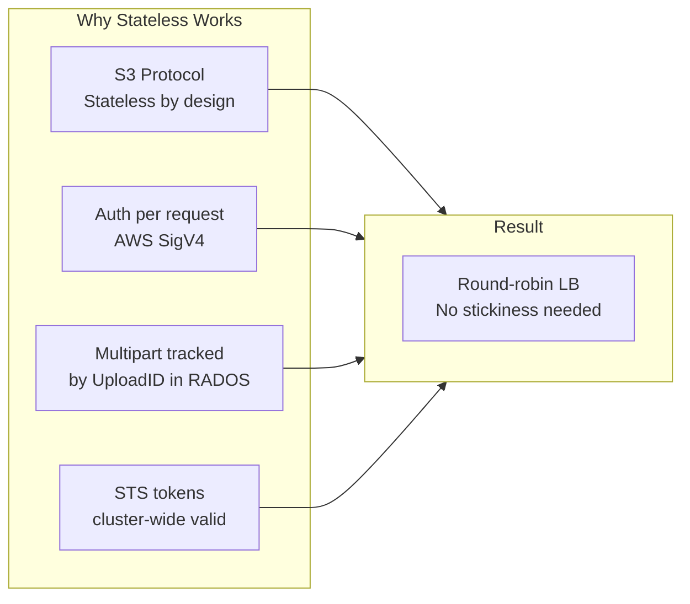

### Recommended Config

```yaml
apiVersion: v1
kind: Service
metadata:
  name: rgw-lb
spec:
  type: LoadBalancer
  sessionAffinity: None  # Round-robin
  selector:
    app: rook-ceph-rgw
  ports:
    - port: 80
```

### Ingress with Connection Pooling

```yaml
apiVersion: networking.k8s.io/v1
kind: Ingress
metadata:
  name: rgw-ingress
  annotations:
    nginx.ingress.kubernetes.io/load-balance: "round_robin"
    nginx.ingress.kubernetes.io/upstream-keepalive-connections: "320"
    nginx.ingress.kubernetes.io/upstream-keepalive-timeout: "60"
```

---

## Monitoring

### Metrics Architecture

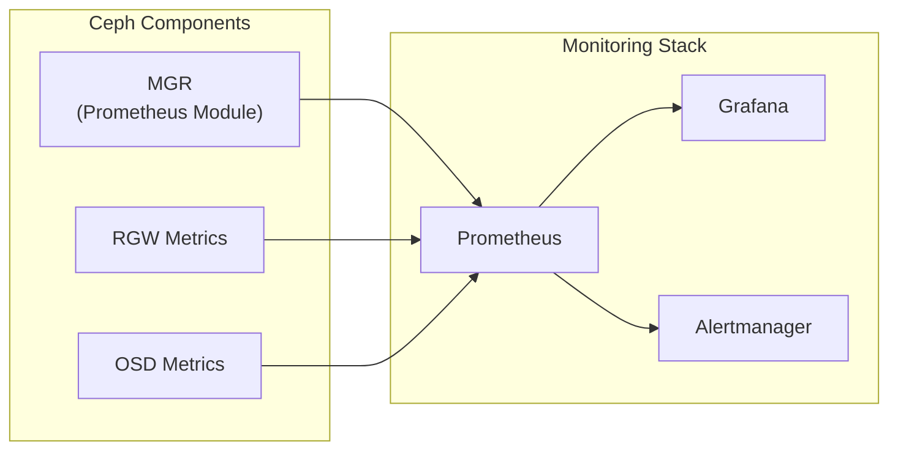

### Key Metrics

| Metric | Query | Alert Threshold |
|--------|-------|-----------------|
| RGW Request Rate | `rate(ceph_rgw_req[5m])` | - |
| RGW Latency (p99) | `histogram_quantile(0.99, rate(ceph_rgw_op_latency_bucket[5m]))` | > 500ms |
| Cluster Health | `ceph_health_status` | != 0 |
| OSD Latency | `ceph_osd_apply_latency_ms` | > 100ms |

### HPA for RGW

```yaml
apiVersion: autoscaling/v2
kind: HorizontalPodAutoscaler
metadata:
  name: rgw-hpa
spec:
  scaleTargetRef:
    apiVersion: apps/v1
    kind: Deployment
    name: rook-ceph-rgw-s3-store-a
  minReplicas: 2
  maxReplicas: 10
  metrics:
    - type: Resource
      resource:
        name: cpu
        target:
          type: Utilization
          averageUtilization: 70
```

---

## Disaster Recovery

### Backup Strategy

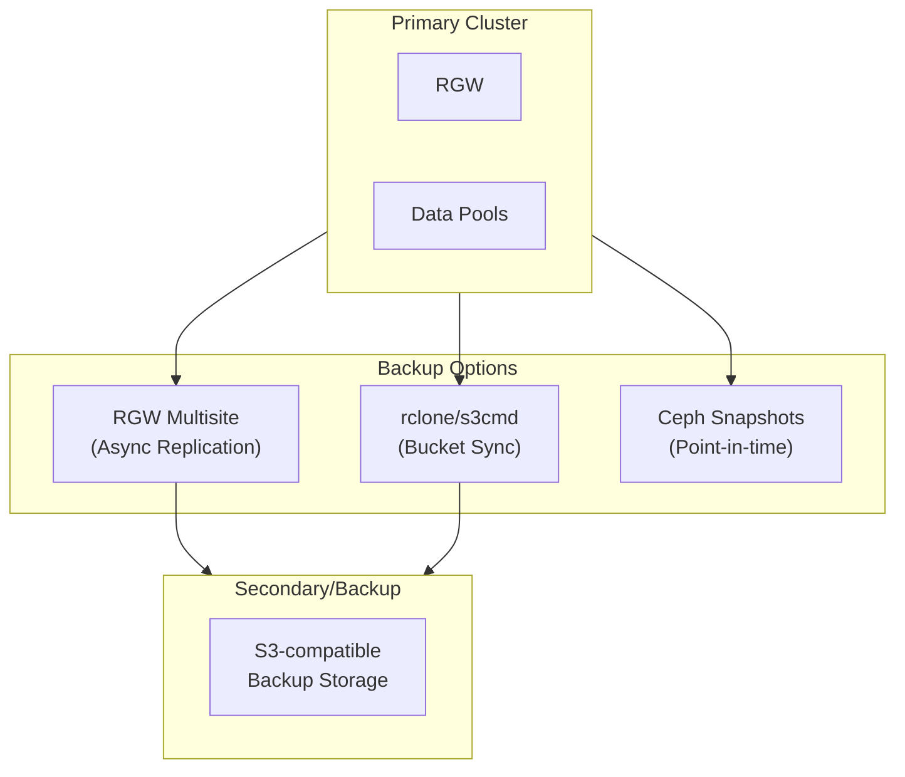

---

## Usage

### Deploy Ceph

```bash
cd /vagrant
./components/ceph/scripts/build.sh
```

### Check Status

```bash
./components/ceph/scripts/status.sh
```

Or manually:
```bash
kubectl -n rook-ceph get pods
kubectl -n rook-ceph get cephcluster
kubectl -n rook-ceph exec -it deploy/rook-ceph-tools -- ceph status
```

### Test S3

```bash
./components/ceph/scripts/test-s3.sh
```

### Get S3 Credentials

```bash
# Access key
kubectl -n rook-ceph get secret rook-ceph-object-user-s3-store-admin \
  -o jsonpath='{.data.AccessKey}' | base64 -d && echo

# Secret key
kubectl -n rook-ceph get secret rook-ceph-object-user-s3-store-admin \
  -o jsonpath='{.data.SecretKey}' | base64 -d && echo
```

### Configure AWS CLI

1. Install AWS CLI v2 (not available via apt):

```bash
curl -sL "https://awscli.amazonaws.com/awscli-exe-linux-x86_64.zip" -o awscliv2.zip
unzip -q awscliv2.zip
sudo ./aws/install
rm -rf aws awscliv2.zip
```

2. Set up port-forward to the RGW service (ClusterIP is not reachable from WSL):

```bash
kubectl -n rook-ceph port-forward svc/rook-ceph-rgw-s3-store 7480:80 &
```

3. Export credentials and endpoint:

```bash
export AWS_ACCESS_KEY_ID=$(kubectl -n rook-ceph get secret rook-ceph-object-user-s3-store-admin -o jsonpath='{.data.AccessKey}' | base64 -d)
export AWS_SECRET_ACCESS_KEY=$(kubectl -n rook-ceph get secret rook-ceph-object-user-s3-store-admin -o jsonpath='{.data.SecretKey}' | base64 -d)
export AWS_ENDPOINT_URL=http://localhost:7480
export AWS_DEFAULT_REGION=us-east-1  # Required: prevents InvalidLocationConstraint error
export AWS_DEFAULT_REGION=us-east-1  # Required: prevents InvalidLocationConstraint error
```

4. Use AWS CLI:

```bash
aws s3 mb s3://my-bucket
aws s3 cp myfile.txt s3://my-bucket/
aws s3 ls s3://my-bucket/
```

### Remove Ceph

```bash
./components/ceph/scripts/destroy.sh
```

---

## File Structure

```
components/ceph/
├── helm/
│   ├── values.yaml             # Configuration overrides
│   └── templates/
│       ├── cephcluster.yaml    # CephCluster CR
│       ├── objectstore.yaml    # S3 gateway + admin user
│       └── storageclass.yaml   # StorageClass definitions
├── scripts/
│   ├── build.sh                # Deploy Ceph
│   ├── destroy.sh              # Remove Ceph
│   ├── status.sh               # Check Ceph health
│   ├── test-s3.sh              # Test S3 connectivity
│   └── create-box.sh           # Create platform box with Ceph
└── README.md                   # This file
```

---

## Notes

- Single-node minikube: Ceph runs in degraded mode (testing only)
- Production: Requires 3+ nodes with dedicated storage devices
- Erasure coding: Better storage efficiency for large Iceberg parquet files
- STS + OIDC: Recommended for multi-tenant or production environments
