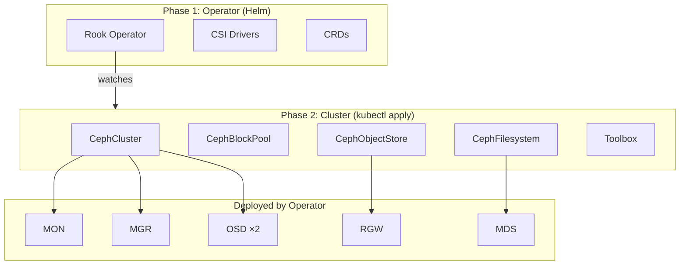
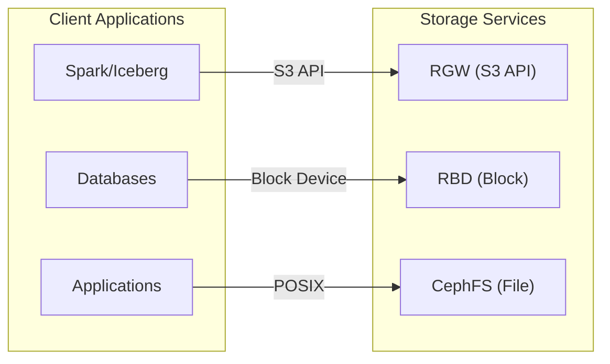

# Ceph Storage Component

Rook-Ceph provides distributed storage for Kubernetes using Ceph.

## Table of Contents

- [Architecture](#architecture)
  - [CRD Instances](#crd-instances)
  - [Running Pods](#running-pods)
- [Directory Structure](#directory-structure)
- [Prerequisites](#prerequisites)
- [Configuration](#configuration)
- [Usage](#usage)
- [Storage Classes](#storage-classes)
- [S3 Object Store](#s3-object-store)
- [Testing](#testing)
- [Troubleshooting](#troubleshooting)

---

## Architecture

Two separate concerns, deployed independently:

1. **Rook Operator** — Helm chart that deploys the operator, CSI drivers, and registers CRDs
2. **Ceph Cluster** — Static CRD instances (`kubectl apply`) that the operator reads to deploy MONs, OSDs, RGW, MDS, etc.



### Storage Services



### CRD Instances

These are the custom resources applied by `create-cluster.sh` from `manifests/`. The Rook operator watches them and creates the corresponding Ceph daemons.

| CRD | Instance | Manifest | Purpose |
|-----|----------|----------|---------|
| `CephCluster` | `rook-ceph` | `cephcluster.yaml` | Core cluster definition. Configures MON count, MGR modules, OSD storage nodes, resource limits, health checks, and `dataDirHostPath`. The operator creates MON, MGR, and OSD pods based on this. |
| `CephBlockPool` | `replicapool` | `cephblockpool.yaml` | RADOS pool for RBD block volumes. Uses `size: 1` replication (dev). Backing pool for the `ceph-block` StorageClass. |
| `CephBlockPool` | `builtin-mgr` | `cephblockpool.yaml` | Internal pool (`.mgr`) used by the Ceph manager for device health metrics and other internal data. |
| `CephFilesystem` | `ceph-filesystem` | `cephfilesystem.yaml` | Creates a CephFS filesystem with one data pool and one metadata pool. The operator deploys MDS (Metadata Server) pods to serve it. |
| `CephFilesystemSubVolumeGroup` | `ceph-filesystem-csi` | `cephfilesystem.yaml` | CSI subvolume group named `csi`. Required for the CephFS CSI driver to provision volumes within the filesystem. |
| `CephObjectStore` | `s3-store` | `cephobjectstore.yaml` | S3-compatible object store. Creates data and metadata RADOS pools, and the operator deploys RGW (RADOS Gateway) pods to serve the S3 API on port 80. |
| `CephObjectStoreUser` | `admin` | `s3-users/admin.yaml` | S3 admin user. The operator creates a Kubernetes secret (`rook-ceph-object-user-s3-store-admin`) with `AccessKey` and `SecretKey`. |

### Running Pods

Pods are grouped by source: operator Helm chart (Phase 1) or cluster CRDs (Phase 2).

**Phase 1 — Operator (from Helm chart)**

| Pod | Type | Count | Purpose |
|-----|------|-------|---------|
| `rook-ceph-operator` | Deployment | 1 | Watches CRDs and reconciles Ceph daemons. Runs OSD prepare jobs, manages MON quorum, handles upgrades. |
| `rbd.csi.ceph.com-ctrlplugin` | Deployment | 2 | RBD CSI controller. Handles volume provisioning (create/delete/expand) for block storage PVCs. Leader-elected. |
| `rbd.csi.ceph.com-nodeplugin` | DaemonSet | 1/node | RBD CSI node plugin. Maps RBD images to block devices and mounts them into pods on each node. |
| `cephfs.csi.ceph.com-ctrlplugin` | Deployment | 2 | CephFS CSI controller. Handles volume provisioning for filesystem PVCs. Leader-elected. |
| `cephfs.csi.ceph.com-nodeplugin` | DaemonSet | 1/node | CephFS CSI node plugin. Mounts CephFS volumes into pods on each node. |
| `ceph-csi-controller-manager` | Deployment | 1 | Manages CSI driver lifecycle and addon configuration. |

**Phase 2 — Cluster (from CRD manifests)**

| Pod | Type | Count | Triggered by | Purpose |
|-----|------|-------|-------------|---------|
| `rook-ceph-mon-*` | Deployment | 1 | CephCluster | Monitor daemon. Maintains cluster maps (OSD map, MON map, CRUSH map). Single MON in dev (3 in production for quorum). |
| `rook-ceph-mgr-*` | Deployment | 1 | CephCluster | Manager daemon. Runs modules: `rook` (orchestration), `pg_autoscaler` (PG management), `dashboard` (web UI). |
| `rook-ceph-osd-*` | Deployment | 2 | CephCluster | Object Storage Daemons. One per raw disk (minikube-m02, minikube-m03). Store data using BlueStore directly on block devices. |
| `rook-ceph-osd-prepare-*` | Job | 1/node | CephCluster | Scans node disks, prepares BlueStore (writes labels at 1GB and 10GB offsets). Runs on each storage node at cluster creation and after operator restart. |
| `rook-ceph-mds-*` | Deployment | 1 | CephFilesystem | Metadata Server for CephFS. Handles POSIX filesystem metadata (directory tree, permissions, locks). |
| `rook-ceph-rgw-*` | Deployment | 1 | CephObjectStore | RADOS Gateway. Serves S3 API, handles authentication (SigV4), translates S3 operations to RADOS objects. |
| `rook-ceph-tools` | Deployment | 1 | toolbox.yaml | Admin toolbox with `ceph` CLI. Connects to MON using the admin keyring for cluster management commands. |
| `rook-ceph-exporter-*` | Deployment | 1/node | CephCluster | Exports per-node Ceph metrics for Prometheus scraping. |

---

## Directory Structure

```
components/ceph/
├── helm/
│   └── Chart.yaml                     # Wrapper chart — tracks rook-ceph operator version
├── manifests/                         # Static cluster CRD definitions (hand-maintained)
│   ├── cephcluster.yaml               # CephCluster CR
│   ├── cephblockpool.yaml             # CephBlockPool + StorageClass (ceph-block)
│   ├── cephfilesystem.yaml            # CephFilesystem + StorageClass (ceph-filesystem)
│   ├── cephobjectstore.yaml           # CephObjectStore + StorageClass (ceph-bucket)
│   ├── toolbox.yaml                   # Toolbox deployment (ceph CLI)
│   └── s3-users/
│       └── admin.yaml                 # CephObjectStoreUser (S3 admin)
├── deployment/rendered/               # Rendered operator templates (reference, gitignored)
├── scripts/
│   ├── build.sh                       # Deploy Rook operator via Helm
│   ├── create-cluster.sh              # Apply manifests/, wait for cluster ready
│   ├── destroy.sh                     # Teardown (cluster | operator | all)
│   ├── regenerate-rendered.sh         # Render operator Helm templates (reference only)
│   ├── status.sh                      # Check Ceph health
│   ├── dashboard.sh                   # Open Ceph dashboard
│   └── test/
│       ├── test-s3.sh                 # Test S3 (create bucket, put/get/delete)
│       ├── test-block-storage.sh      # Test RBD (PVC + pod)
│       └── test-filesystem.sh         # Test CephFS (PVC + pod)
└── README.md
```

---

## Prerequisites

- Minikube cluster with 3 nodes (1 control plane + 2 workers)
- Raw block devices on worker nodes (no filesystem, no mounted partitions)
- Ceph enabled in `config.yaml`

### Minikube Hyper-V Notes

- Worker nodes (`minikube-m02`, `minikube-m03`) each have a 20GB raw disk for OSDs
- Control plane node has no raw disk — excluded from storage via `nodes:` in CephCluster
- `dataDirHostPath` must be `/tmp/hostpath_pv/rook` (root filesystem is tmpfs, wiped on restart)
- Device names (`/dev/sdX`) are unstable across reboots — Rook v1.19 handles this via udev fallback

---

## Configuration

In `config.yaml`:

```yaml
components:
  ceph:
    enabled: true
    namespace: "rook-ceph"
    chart_repo: "https://charts.rook.io/release"
    chart_version: "v1.19.1"
```

Cluster configuration is in the static manifests under `manifests/`. These are hand-maintained — edit them directly to change pool sizes, resource limits, etc.

---

## Usage

### Deploy (Full Stack)

```bash
# Phase 1: Deploy operator
./components/ceph/scripts/build.sh

# Phase 2: Create cluster
./components/ceph/scripts/create-cluster.sh
```

### Check Status

```bash
./components/ceph/scripts/status.sh

# Or manually:
kubectl -n rook-ceph exec deploy/rook-ceph-tools -- ceph status
```

### Open Dashboard

```bash
./components/ceph/scripts/dashboard.sh
```

### Destroy

```bash
# Remove cluster only (CRDs + disk data), keep operator
./components/ceph/scripts/destroy.sh cluster

# Remove operator only (Helm release + CRDs + namespace)
./components/ceph/scripts/destroy.sh operator

# Full teardown (cluster + operator)
./components/ceph/scripts/destroy.sh all
```

### Regenerate Rendered Templates

For reference only — see what the operator Helm chart produces without deploying:

```bash
./components/ceph/scripts/regenerate-rendered.sh
```

---

## Storage Classes

| StorageClass | Type | Access Modes | Provisioner | Default |
|-------------|------|-------------|-------------|---------|
| `ceph-block` | RBD (block) | RWO | `rook-ceph.rbd.csi.ceph.com` | Yes |
| `ceph-filesystem` | CephFS (file) | RWX | `rook-ceph.cephfs.csi.ceph.com` | No |
| `ceph-bucket` | S3 (object) | - | `rook-ceph.ceph.rook.io/bucket` | No |

StorageClasses include CSI secret references for provisioner and node-stage authentication.

### Example PVC

```yaml
apiVersion: v1
kind: PersistentVolumeClaim
metadata:
  name: my-data
spec:
  accessModes:
    - ReadWriteOnce       # RWX for ceph-filesystem
  storageClassName: ceph-block
  resources:
    requests:
      storage: 10Gi
```

---

## S3 Object Store

### Get Credentials

```bash
# Access key
kubectl -n rook-ceph get secret rook-ceph-object-user-s3-store-admin \
  -o jsonpath='{.data.AccessKey}' | base64 -d && echo

# Secret key
kubectl -n rook-ceph get secret rook-ceph-object-user-s3-store-admin \
  -o jsonpath='{.data.SecretKey}' | base64 -d && echo
```

### Port-Forward and Use

```bash
# Port-forward RGW (ClusterIP not reachable from WSL)
kubectl -n rook-ceph port-forward svc/rook-ceph-rgw-s3-store 7480:80 &

# Export credentials
export AWS_ACCESS_KEY_ID=$(kubectl -n rook-ceph get secret rook-ceph-object-user-s3-store-admin -o jsonpath='{.data.AccessKey}' | base64 -d)
export AWS_SECRET_ACCESS_KEY=$(kubectl -n rook-ceph get secret rook-ceph-object-user-s3-store-admin -o jsonpath='{.data.SecretKey}' | base64 -d)
export AWS_ENDPOINT_URL=http://localhost:7480
export AWS_DEFAULT_REGION=us-east-1

# Use AWS CLI
aws s3 mb s3://my-bucket
aws s3 cp myfile.txt s3://my-bucket/
aws s3 ls s3://my-bucket/
```

---

## Testing

```bash
# S3: create bucket, upload, download, verify, cleanup
./components/ceph/scripts/test/test-s3.sh

# Block storage: PVC + pod + write/read
./components/ceph/scripts/test/test-block-storage.sh

# Filesystem: CephFS PVC (RWX) + pod + write/read
./components/ceph/scripts/test/test-filesystem.sh
```

---

## Troubleshooting

### OSD prepare job hangs

If the operator is stuck waiting for OSD prepare jobs, check which nodes are being scanned:

```bash
kubectl -n rook-ceph get pods -l app=rook-ceph-osd-prepare
```

The control plane node may not have a raw disk. Ensure `useAllNodes: false` with explicit `nodes:` in `cephcluster.yaml`.

### StorageClass provisioning fails with "secret is empty"

StorageClasses need CSI secret references. Verify the StorageClass has `csi.storage.k8s.io/provisioner-secret-name` and `csi.storage.k8s.io/node-stage-secret-name` parameters:

```bash
kubectl get storageclass ceph-block -o yaml
```

Since SC parameters are immutable, delete and re-apply if missing:

```bash
kubectl delete storageclass ceph-block
kubectl apply -f components/ceph/manifests/cephblockpool.yaml -n rook-ceph
```

### Stale state from previous cluster

If OSDs won't start after a redeploy, disks may have bluestore data from a previous cluster:

```bash
./components/ceph/scripts/destroy.sh cluster
```

This wipes disks completely (Ceph v20 stores bluestore labels at 1GB and 10GB offsets).

### Check operator logs

```bash
kubectl -n rook-ceph logs deploy/rook-ceph-operator --tail=50
```

### Ceph health from toolbox

```bash
kubectl -n rook-ceph exec deploy/rook-ceph-tools -- ceph status
kubectl -n rook-ceph exec deploy/rook-ceph-tools -- ceph osd tree
kubectl -n rook-ceph exec deploy/rook-ceph-tools -- ceph df
```
