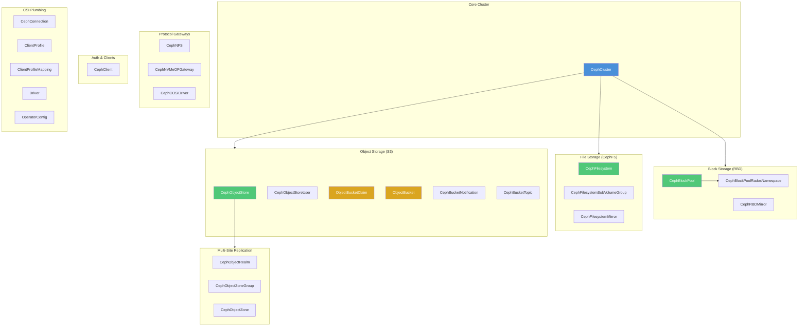
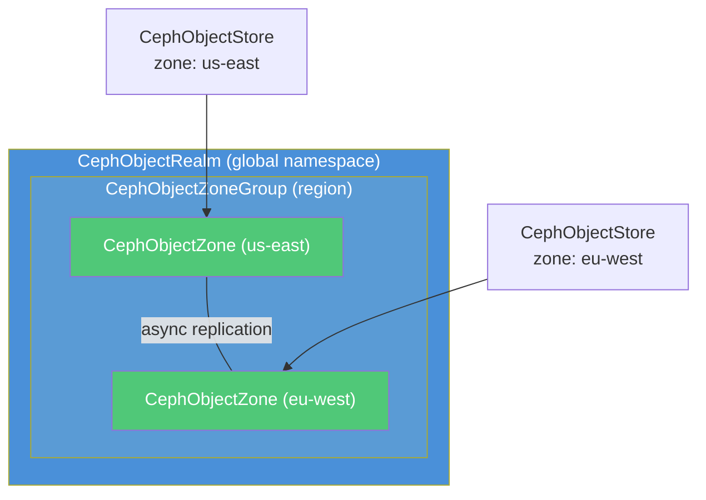

# Rook-Ceph CRD Reference

Complete reference for all CRDs registered by the Rook-Ceph operator (v1.19). Grouped by function.

## CRD Map



---

## Core Cluster

### CephCluster

The root CRD. Everything else depends on a running cluster.

| Field | Value |
|-------|-------|
| API Group | `ceph.rook.io/v1` |
| Scope | namespace |
| Created by | User (via `cephcluster.yaml`) |
| Operator creates | MON, MGR, OSD, crash collector, exporter pods |

Defines the entire Ceph cluster: MON count, MGR modules, OSD storage nodes, resource limits, health checks, network settings, and `dataDirHostPath`. The operator watches this CR and reconciles all Ceph daemon pods.

```yaml
apiVersion: ceph.rook.io/v1
kind: CephCluster
metadata:
  name: rook-ceph
  namespace: rook-ceph
spec:
  cephVersion:
    image: quay.io/ceph/ceph:v20
  dataDirHostPath: /var/lib/rook       # MON database, keyrings
  mon:
    count: 3
  mgr:
    count: 2
    modules:
      - name: pg_autoscaler
        enabled: true
  storage:
    useAllNodes: false
    nodes:
      - name: worker-1
      - name: worker-2
```

**Key fields:**
- `dataDirHostPath` — where MON stores cluster state on the host. Must survive reboots.
- `storage.nodes` — which nodes have raw disks for OSDs. Omit to use `useAllNodes: true`.
- `mon.count` — odd number (1, 3, 5) for Paxos quorum. 1 for dev, 3 for production.
- `mgr.modules` — Ceph manager plugins (`pg_autoscaler`, `dashboard`, `rook`).

---

## Block Storage (RBD)

### CephBlockPool

A RADOS pool used for RBD (block) volumes. Each pool has its own replication and CRUSH rules.

| Field | Value |
|-------|-------|
| API Group | `ceph.rook.io/v1` |
| Scope | namespace |
| Created by | User (via `cephblockpool.yaml`) |
| Operator creates | RADOS pool in the Ceph cluster |
| Consumer | StorageClass `ceph-block` references this pool |

```yaml
apiVersion: ceph.rook.io/v1
kind: CephBlockPool
metadata:
  name: replicapool
  namespace: rook-ceph
spec:
  replicated:
    size: 3                   # 3 replicas across OSDs
  failureDomain: host         # each replica on a different host
```

**Replication modes:**
- `replicated.size: N` — N full copies. Simple. size=1 for dev, size=3 for production.
- `erasureCoded.dataChunks/codingChunks` — EC (e.g. 4+2: 4 data + 2 parity). ~1.5x overhead vs 3x for replicated. Good for cold/archive data.

**Use cases:** Database volumes, Kafka persistent storage, any RWO PVC.

### CephBlockPoolRadosNamespace

A logical namespace within a CephBlockPool. Isolates RBD images within the same pool without creating a separate RADOS pool (which has overhead).

| Field | Value |
|-------|-------|
| API Group | `ceph.rook.io/v1` |
| Scope | namespace |
| Created by | User |
| Consumer | StorageClass can reference `pool + namespace` |

```yaml
apiVersion: ceph.rook.io/v1
kind: CephBlockPoolRadosNamespace
metadata:
  name: tenant-a
  namespace: rook-ceph
spec:
  blockPoolName: replicapool
```

**When to use:** Multi-tenant clusters where you want namespace isolation for RBD images (separate CRUSH rules, quotas) without the overhead of separate pools. Each pool consumes PG resources — RADOS namespaces don't.

### CephRBDMirror

Mirrors RBD images between two Ceph clusters for disaster recovery.

| Field | Value |
|-------|-------|
| API Group | `ceph.rook.io/v1` |
| Scope | namespace |
| Created by | User |
| Operator creates | `rbd-mirror` daemon pod |

```yaml
apiVersion: ceph.rook.io/v1
kind: CephRBDMirror
metadata:
  name: my-rbd-mirror
  namespace: rook-ceph
spec:
  count: 1
  peers:
    secretNames:
      - rbd-mirror-peer-token
```

**Mirroring modes:**
- **Journal-based** — every write is journaled and replayed on the remote cluster. Near-synchronous but adds write latency.
- **Snapshot-based** — periodic snapshots are replicated. Less overhead, but RPO = snapshot interval.

**When to use:** DR for stateful workloads (databases, persistent volumes) across geographically separated clusters.

---

## File Storage (CephFS)

### CephFilesystem

Creates a CephFS filesystem with metadata and data pools. The operator deploys MDS (Metadata Server) pods.

| Field | Value |
|-------|-------|
| API Group | `ceph.rook.io/v1` |
| Scope | namespace |
| Created by | User (via `cephfilesystem.yaml`) |
| Operator creates | MDS pods, metadata pool, data pool(s) |
| Consumer | StorageClass `ceph-filesystem` |

```yaml
apiVersion: ceph.rook.io/v1
kind: CephFilesystem
metadata:
  name: ceph-filesystem
  namespace: rook-ceph
spec:
  metadataPool:
    replicated:
      size: 3
  dataPools:
    - name: default
      replicated:
        size: 3
  metadataServer:
    activeCount: 1            # 1 active MDS
    activeStandby: true       # +1 standby for failover
```

**Use cases:** Shared filesystem (RWX), multiple pods reading/writing the same files. Jupyter notebooks, shared config, ML training data.

### CephFilesystemSubVolumeGroup

A subvolume group within a CephFilesystem. Required for the CSI driver to create volumes.

| Field | Value |
|-------|-------|
| API Group | `ceph.rook.io/v1` |
| Scope | namespace |
| Created by | User (via `cephfilesystem.yaml`) |
| Consumer | CephFS CSI driver |

```yaml
apiVersion: ceph.rook.io/v1
kind: CephFilesystemSubVolumeGroup
metadata:
  name: ceph-filesystem-csi
  namespace: rook-ceph
spec:
  filesystemName: ceph-filesystem
  name: csi                   # the CSI driver looks for this name
```

The CSI driver creates individual subvolumes (one per PVC) inside this group. Each subvolume is a directory with its own quota and snapshot support.

### CephFilesystemMirror

Mirrors CephFS between two Ceph clusters for disaster recovery. Similar to CephRBDMirror but for filesystems.

| Field | Value |
|-------|-------|
| API Group | `ceph.rook.io/v1` |
| Scope | namespace |
| Created by | User |
| Operator creates | `cephfs-mirror` daemon pod |

```yaml
apiVersion: ceph.rook.io/v1
kind: CephFilesystemMirror
metadata:
  name: my-fs-mirror
  namespace: rook-ceph
spec:
  peers:
    secretNames:
      - cephfs-mirror-peer-token
```

**When to use:** DR for shared filesystems. Mirrors directory snapshots to a remote cluster.

---

## Object Storage (S3)

### CephObjectStore

Deploys an S3-compatible object store backed by RADOS. The operator creates RGW (RADOS Gateway) pods.

| Field | Value |
|-------|-------|
| API Group | `ceph.rook.io/v1` |
| Scope | namespace |
| Created by | User (via `cephobjectstore.yaml`) |
| Operator creates | RGW pods, data pool, metadata pool, Service |
| Consumer | S3 clients, ObjectBucketClaim |

```yaml
apiVersion: ceph.rook.io/v1
kind: CephObjectStore
metadata:
  name: s3-store
  namespace: rook-ceph
spec:
  metadataPool:
    replicated:
      size: 3
  dataPool:
    replicated:
      size: 3
  gateway:
    port: 80
    securePort: 443           # optional, needs TLS cert
    instances: 2              # RGW pod count for HA
```

**Endpoint:** `rook-ceph-rgw-<name>.<namespace>.svc.cluster.local:<port>`

### CephObjectStoreUser

An RGW user with S3 credentials. The operator creates a Kubernetes Secret with `AccessKey` and `SecretKey`.

| Field | Value |
|-------|-------|
| API Group | `ceph.rook.io/v1` |
| Scope | namespace |
| Created by | User (via `s3-users/*.yaml`) |
| Operator creates | Secret `rook-ceph-object-user-<store>-<name>` |

```yaml
apiVersion: ceph.rook.io/v1
kind: CephObjectStoreUser
metadata:
  name: admin
  namespace: rook-ceph
spec:
  store: s3-store
  displayName: "S3 Admin"
  capabilities:
    user: "*"
    bucket: "*"
```

**Capabilities:** RGW capabilities control what the user can do. `bucket: "*"` = create/delete/list buckets. `user: "*"` = manage other users. For app users, `bucket: "read,write"` is typical.

**Pre-set credentials** (avoid auto-generated keys):

```yaml
spec:
  keys:
    - accessKeyRef:
        name: my-s3-keys          # existing Secret
        key: access-key
      secretKeyRef:
        name: my-s3-keys
        key: secret-key
```

### ObjectBucketClaim (OBC)

Request a bucket from a StorageClass. The Rook operator provisions the bucket in RGW and creates credentials.

| Field | Value |
|-------|-------|
| API Group | `objectbucket.io/v1alpha1` |
| Scope | namespace |
| Created by | Consumer (app teams) |
| Operator creates | RGW bucket, Secret (credentials), ConfigMap (endpoint), ObjectBucket |

```yaml
apiVersion: objectbucket.io/v1alpha1
kind: ObjectBucketClaim
metadata:
  name: my-bucket
  namespace: rook-ceph
spec:
  bucketName: my-bucket             # explicit name (or omit for generated)
  storageClassName: ceph-bucket
```

**What gets created:**

| Resource | Name | Contents |
|----------|------|----------|
| Secret | `my-bucket` | `AWS_ACCESS_KEY_ID`, `AWS_SECRET_ACCESS_KEY` (OBC owner credentials) |
| ConfigMap | `my-bucket` | `BUCKET_HOST`, `BUCKET_NAME`, `BUCKET_PORT` |
| ObjectBucket | `obc-<ns>-<name>` | Cluster-scoped binding (like PV) |

**Important:** The OBC creates its own internal RGW user that owns the bucket. This is a different user from any `CephObjectStoreUser`. Cross-user access requires a bucket policy — see the [README S3 section](../README.md#creating-a-bucket-with-a-custom-user).

### ObjectBucket

Cluster-scoped resource auto-created when the operator fulfills an OBC. Not created directly by users.

| Field | Value |
|-------|-------|
| API Group | `objectbucket.io/v1alpha1` |
| Scope | cluster |
| Created by | Operator (automatically) |
| Analogous to | PersistentVolume |

Tracks the binding between an OBC and the backing RGW bucket. Deleting the OBC triggers deletion of the ObjectBucket (and optionally the bucket data, depending on `reclaimPolicy`).

### CephBucketTopic

An SNS-like notification topic for S3 bucket events. Defines where event notifications are sent.

| Field | Value |
|-------|-------|
| API Group | `ceph.rook.io/v1` |
| Scope | namespace |
| Created by | User |
| Consumer | CephBucketNotification references this |

```yaml
apiVersion: ceph.rook.io/v1
kind: CephBucketTopic
metadata:
  name: my-topic
  namespace: rook-ceph
spec:
  objectStoreName: s3-store
  objectStoreNamespace: rook-ceph
  endpoint:
    kafka:
      uri: kafka-bootstrap.kafka.svc:9092
```

**Supported endpoints:** Kafka, HTTP (webhook), AMQP (RabbitMQ).

**When to use:** Event-driven pipelines — trigger processing when objects are uploaded. E.g., object uploaded → Kafka event → Spark job.

### CephBucketNotification

Binds a CephBucketTopic to a specific bucket. Filters which S3 events trigger notifications.

| Field | Value |
|-------|-------|
| API Group | `ceph.rook.io/v1` |
| Scope | namespace |
| Created by | User |
| Requires | CephBucketTopic, ObjectBucketClaim |

```yaml
apiVersion: ceph.rook.io/v1
kind: CephBucketNotification
metadata:
  name: upload-notify
  namespace: rook-ceph
spec:
  topic: my-topic
  events:
    - s3:ObjectCreated:*
    - s3:ObjectRemoved:*
  filter:
    prefix: uploads/
    suffix: .parquet
```

**Event types:** `s3:ObjectCreated:*`, `s3:ObjectRemoved:*`, `s3:ObjectCreated:Put`, `s3:ObjectCreated:CompleteMultipartUpload`, etc. Same as AWS S3 event names.

To attach to a bucket, add a label to the OBC:

```yaml
kind: ObjectBucketClaim
metadata:
  labels:
    bucket-notification-<name>: <notification-name>
```

---

## Multi-Site Object Replication

These three CRDs configure S3 object replication across geographically distributed Ceph clusters. They map directly to RGW's multi-site concepts.



### CephObjectRealm

Top-level container for multi-site. A realm is a global namespace — all zones in the realm share the same S3 namespace (bucket names must be unique across zones).

| Field | Value |
|-------|-------|
| API Group | `ceph.rook.io/v1` |
| Scope | namespace |
| Created by | User (on the primary cluster) |

```yaml
apiVersion: ceph.rook.io/v1
kind: CephObjectRealm
metadata:
  name: my-realm
  namespace: rook-ceph
```

### CephObjectZoneGroup

A group of zones that replicate data between each other. Maps to a geographic region.

| Field | Value |
|-------|-------|
| API Group | `ceph.rook.io/v1` |
| Scope | namespace |
| Created by | User |

```yaml
apiVersion: ceph.rook.io/v1
kind: CephObjectZoneGroup
metadata:
  name: us-region
  namespace: rook-ceph
spec:
  realm: my-realm
```

### CephObjectZone

A single zone within a zone group. Each zone is a separate Ceph cluster with its own RGW and pools. The CephObjectStore references a zone to participate in multi-site.

| Field | Value |
|-------|-------|
| API Group | `ceph.rook.io/v1` |
| Scope | namespace |
| Created by | User |

```yaml
apiVersion: ceph.rook.io/v1
kind: CephObjectZone
metadata:
  name: us-east
  namespace: rook-ceph
spec:
  zoneGroup: us-region
  metadataPool:
    replicated:
      size: 3
  dataPool:
    replicated:
      size: 3
```

**When to use multi-site:** Geo-distributed S3, active-active read/write across regions, DR for object data. Data is replicated asynchronously between zones.

---

## Protocol Gateways

### CephNFS

Exports CephFS or RGW via NFS (Network File System). Deploys NFS Ganesha pods.

| Field | Value |
|-------|-------|
| API Group | `ceph.rook.io/v1` |
| Scope | namespace |
| Created by | User |
| Operator creates | NFS Ganesha pods, Service |

```yaml
apiVersion: ceph.rook.io/v1
kind: CephNFS
metadata:
  name: my-nfs
  namespace: rook-ceph
spec:
  rados:
    pool: replicapool
  server:
    active: 1
```

**When to use:** Legacy applications that speak NFS but you want Ceph backing. VM workloads, NAS replacement, applications that can't use S3 or CephFS CSI.

### CephNVMeOFGateway

Exposes RBD images as NVMe-oF (NVMe over Fabrics) targets. High-performance block access over the network without iSCSI overhead.

| Field | Value |
|-------|-------|
| API Group | `ceph.rook.io/v1` |
| Scope | namespace |
| Created by | User |
| Operator creates | NVMe-oF gateway pods |

```yaml
apiVersion: ceph.rook.io/v1
kind: CephNVMeOFGateway
metadata:
  name: my-nvmeof
  namespace: rook-ceph
spec:
  port: 4420
  server:
    active: 1
```

**When to use:** Bare-metal or VM workloads needing high-performance block storage with NVMe-oF protocol. Lower latency than iSCSI. Requires NVMe-oF client support on the consumer.

### CephCOSIDriver

Deploys the Container Object Storage Interface (COSI) driver. COSI is a Kubernetes standard for object storage provisioning (like CSI is for block/file).

| Field | Value |
|-------|-------|
| API Group | `ceph.rook.io/v1` |
| Scope | namespace |
| Created by | User |

```yaml
apiVersion: ceph.rook.io/v1
kind: CephCOSIDriver
metadata:
  name: my-cosi
  namespace: rook-ceph
```

**When to use:** If you want to use the COSI API (`BucketClaim`, `BucketAccess`) instead of OBC for bucket provisioning. COSI is the newer Kubernetes-native standard but still alpha. OBC is stable and more widely adopted.

---

## Auth & Clients

### CephClient

Creates a Ceph auth keyring with specific capabilities. Used when applications need direct RADOS access (not via CSI or S3).

| Field | Value |
|-------|-------|
| API Group | `ceph.rook.io/v1` |
| Scope | namespace |
| Created by | User |
| Operator creates | Secret with the keyring |

```yaml
apiVersion: ceph.rook.io/v1
kind: CephClient
metadata:
  name: my-app
  namespace: rook-ceph
spec:
  caps:
    mon: "allow r"
    osd: "allow rw pool=replicapool"
```

**Capabilities:** Ceph auth caps control access at the daemon level:
- `mon` — cluster map access (`allow r` = read-only, needed by all clients)
- `osd` — data access (`allow rw pool=X` = read/write to specific pool)
- `mds` — filesystem access (`allow rw` for CephFS)

**When to use:** Applications using `librados` directly, custom Ceph tooling, or when CSI/S3 abstractions don't fit. Rare in Kubernetes — most workloads use CSI or S3.

---

## CSI Plumbing

These CRDs are auto-created by the Rook operator. They configure the Ceph CSI drivers that handle PVC provisioning and mounting. Not user-managed.

| CRD | API Group | Purpose |
|-----|-----------|---------|
| `CephConnection` | `csi.ceph.io` | Tells CSI drivers how to reach the Ceph cluster (MON endpoints, cluster ID). One per CephCluster. |
| `ClientProfile` | `csi.ceph.io` | CSI client tuning — read-ahead, kernel mount options, RBD features. Operator creates a default profile. |
| `ClientProfileMapping` | `csi.ceph.io` | Maps StorageClass parameters to ClientProfiles. Allows different tuning per StorageClass. |
| `Driver` | `csi.ceph.io` | CSI driver registration. One per provisioner (`rbd.csi.ceph.com`, `cephfs.csi.ceph.com`). Defines which node/controller plugin images to run. |
| `OperatorConfig` | `csi.ceph.io` | Global CSI operator settings — log level, leader election, feature gates. |

These are internal wiring. The operator keeps them in sync with the CephCluster state. If you delete them, the operator recreates them.

---

## Summary Table

| CRD | Scope | Created by | Used in playground |
|-----|-------|-----------|-------------------|
| **Core** | | | |
| `CephCluster` | ns | user | yes |
| **Block** | | | |
| `CephBlockPool` | ns | user | yes (replicapool, builtin-mgr) |
| `CephBlockPoolRadosNamespace` | ns | user | no |
| `CephRBDMirror` | ns | user | no |
| **File** | | | |
| `CephFilesystem` | ns | user | yes |
| `CephFilesystemSubVolumeGroup` | ns | user | yes |
| `CephFilesystemMirror` | ns | user | no |
| **Object** | | | |
| `CephObjectStore` | ns | user | yes |
| `CephObjectStoreUser` | ns | user | yes (admin, minio) |
| `ObjectBucketClaim` | ns | consumer | yes (iceberg-upload) |
| `ObjectBucket` | cluster | operator | yes (auto) |
| `CephBucketTopic` | ns | user | no |
| `CephBucketNotification` | ns | user | no |
| **Multi-Site** | | | |
| `CephObjectRealm` | ns | user | no |
| `CephObjectZoneGroup` | ns | user | no |
| `CephObjectZone` | ns | user | no |
| **Gateways** | | | |
| `CephNFS` | ns | user | no |
| `CephNVMeOFGateway` | ns | user | no |
| `CephCOSIDriver` | ns | user | no |
| **Auth** | | | |
| `CephClient` | ns | user | no |
| **CSI** | | | |
| `CephConnection` | ns | operator | yes (auto) |
| `ClientProfile` | ns | operator | yes (auto) |
| `ClientProfileMapping` | ns | operator | no |
| `Driver` | ns | operator | yes (auto) |
| `OperatorConfig` | ns | operator | yes (auto) |
