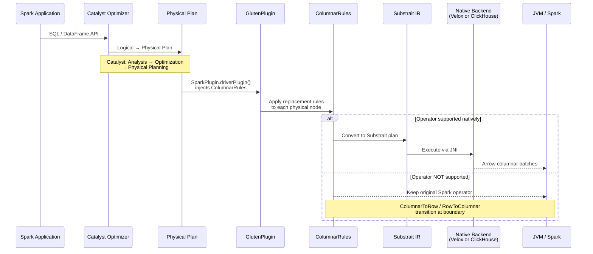
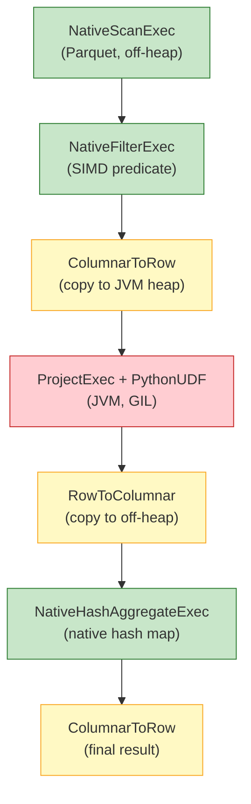
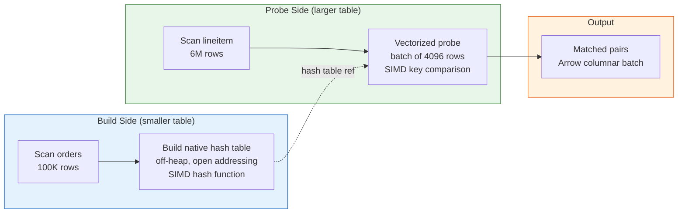
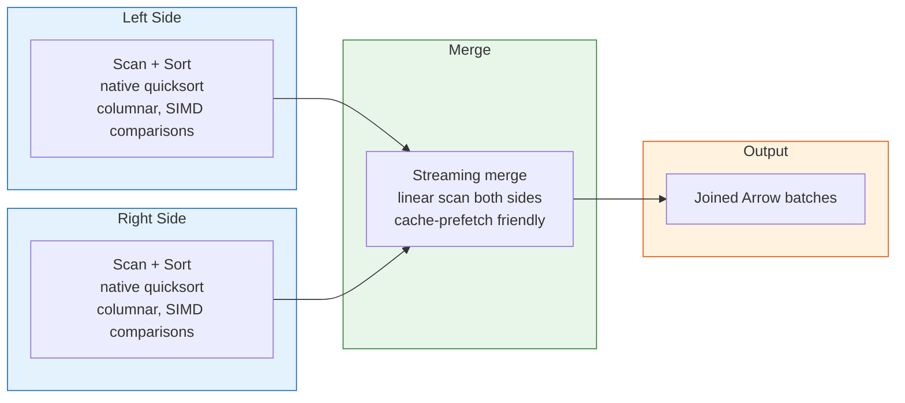
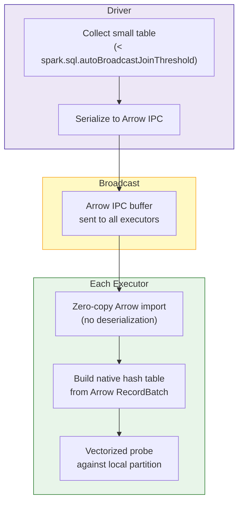
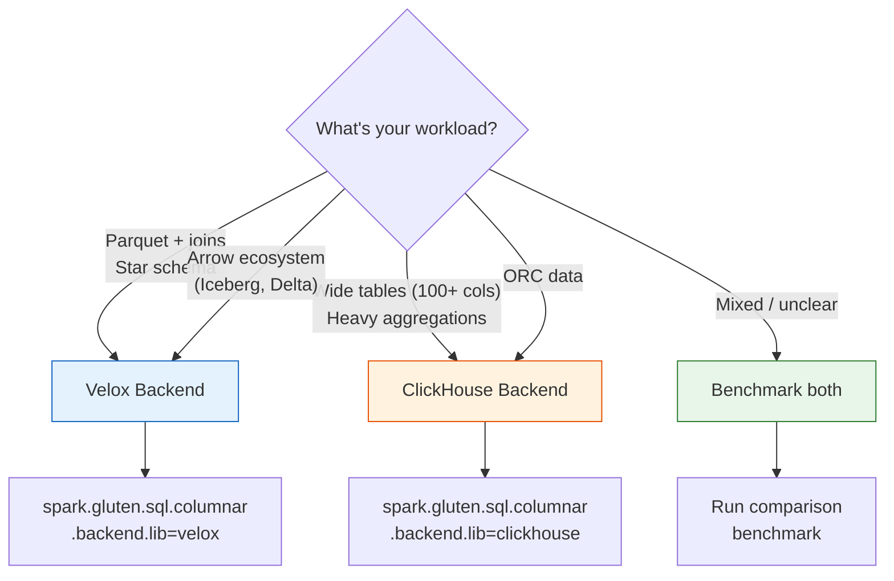
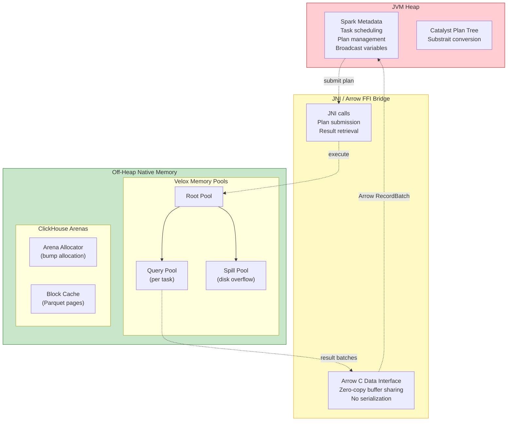
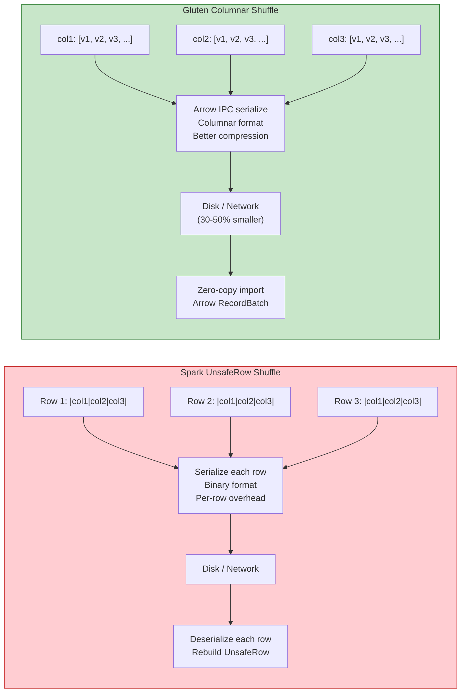

# Apache Gluten Architecture

## Overview

Apache Gluten (incubating) accelerates Spark SQL by replacing JVM-based physical operators with native C++ execution engines. It intercepts Spark's physical plan via the `SparkPlugin` interface, converts operators to [Substrait](https://substrait.io/) intermediate representation, and dispatches execution to either **Velox** (Meta) or **ClickHouse** (native backend).

| Property | Value |
|----------|-------|
| Gluten | 1.7.0-SNAPSHOT (nightly) |
| Spark | 4.0.0 |
| Backends | Velox, ClickHouse |
| IR format | Substrait |
| Data format | Apache Arrow columnar |

## Plan Interception Flow



### How GlutenPlugin Hooks In

Spark's `SparkPlugin` interface provides two entry points:

```
SparkPlugin
├── driverPlugin()    → Injects ColumnarRules into SparkSession
│                       Replaces physical operators at plan time
└── executorPlugin()  → Initializes native runtime (Velox/ClickHouse)
                        Allocates off-heap memory pools
                        Loads shared libraries (.so)
```

The driver-side plugin injects `ColumnarRule` instances that walk the physical plan tree. Each rule pattern-matches Spark operators and replaces them with Gluten's native equivalents. The executor-side plugin initializes the native backend (loads `libvelox.so` or `libch.so`) and sets up memory pools.

## Operator Replacement Map

### Replaced Operators (Native Execution)

| Spark Operator | Gluten Replacement | What It Does | Backend |
|---|---|---|---|
| `FileSourceScanExec` (Parquet) | `NativeScanExec` | Reads Parquet files from disk/S3. Native reader uses SIMD decompression, predicate pushdown into row groups, late materialization (only reads columns referenced by the query). Velox uses DWio (Facebook's Dwarf reader), CH uses its built-in Parquet reader. | Velox + CH |
| `FileSourceScanExec` (ORC) | `NativeScanExec` | Reads ORC columnar files. ClickHouse has full ORC support inherited from its DBMS. Velox has partial support — some ORC type combinations fall back. | CH (Velox partial) |
| `FilterExec` | `NativeFilterExec` | Evaluates WHERE/HAVING predicates. Processes entire Arrow batches at once using vectorized boolean evaluation. Can short-circuit an entire batch of 4096 rows if the first few rows all fail the predicate. SIMD-accelerated for numeric comparisons. | Velox + CH |
| `ProjectExec` | `NativeProjectExec` | Evaluates SELECT expressions (column references, arithmetic, function calls, CASE/WHEN). Operates on Arrow columnar batches — applying a function to an entire column array is faster than row-at-a-time. No JVM object allocation per row. | Velox + CH |
| `HashAggregateExec` | `NativeHashAggregateExec` | Executes GROUP BY with hash-based aggregation (SUM, COUNT, AVG, MIN, MAX, etc.). Uses off-heap native hash maps — no JVM object headers (saves 16 bytes per entry). Vectorized accumulators update multiple rows per function call. The single largest speedup source for aggregation queries. | Velox + CH |
| `SortAggregateExec` | `NativeSortAggregateExec` | Aggregation on pre-sorted input. Spark uses this when data is already sorted by group keys or when hash aggregation would require too much memory. Native sort-based merge avoids JVM object creation. | Velox + CH |
| `ShuffledHashJoinExec` | `NativeHashJoinExec` | Hash join where both sides are shuffle-partitioned by join key. Builds a hash table from the smaller side in off-heap memory (open addressing, cache-line friendly). Probes with SIMD hash functions processing 4-8 keys per instruction. No UnsafeRow deserialization. | Velox + CH |
| `SortMergeJoinExec` | `NativeSortMergeJoinExec` | Join where both sides are sorted by join key, then merged linearly. Native columnar sort uses SIMD key comparisons. Merge phase does sequential memory access (hardware prefetcher works well). Can spill to disk without Java serialization overhead. | Velox + CH |
| `BroadcastHashJoinExec` | `NativeBroadcastHashJoinExec` | Small table broadcast to all executors, then hash-joined locally. Gluten broadcasts as Arrow IPC buffers — zero-copy deserialization on receive (vs Java deserializing into objects). Combined with native hash table for probe. Best for star schema dimension joins. | Velox + CH |
| `SortExec` | `NativeSortExec` | ORDER BY / sort for merge joins. Columnar quicksort: sorting column arrays is SIMD-friendly and uses sequential memory access. No UnsafeRow comparison overhead — native byte-level key comparison. | Velox + CH |
| `ExpandExec` | `NativeExpandExec` | Implements ROLLUP, CUBE, GROUPING SETS. Duplicates input rows with different grouping column projections (nulled out per grouping set). Native version avoids JVM row copying and operates on columnar batches. | Velox + CH |
| `ShuffleExchangeExec` | `ColumnarShuffleExchangeExec` | Repartitions data across executors by hash/range. Replaces UnsafeRow serialization with Arrow IPC columnar serialization — 30-50% smaller on disk, vectorized (de)serialization, zero-copy import on receive. One of Gluten's highest-impact optimizations. | Velox + CH |
| `WindowExec` | `NativeWindowExec` | Window functions (ROW_NUMBER, RANK, DENSE_RANK, LAG, LEAD, SUM OVER, etc.). Native frame computation avoids JVM object allocation per row. ROWS frame type is fully supported. RANGE frame type has restrictions, especially with non-integer ORDER BY columns. | Velox + CH (partial) |

### Fallback to JVM

When an operator or expression cannot run natively, Gluten keeps the original Spark JVM operator in the plan. At each native↔JVM boundary, a `ColumnarToRow` or `RowToColumnar` transition copies data between off-heap Arrow buffers and JVM heap. Each transition has a cost — plans with frequent transitions may be slower than pure JVM.

#### Global Fallbacks (Entire Query)

These Spark configurations cause **all** operators to fall back — the entire query runs on JVM:

| Configuration | Impact |
|---|---|
| `spark.sql.ansi.enabled=true` | Velox does not support ANSI mode. Every query falls back. |
| `spark.sql.caseSensitive=true` | Not supported. Produces **incorrect results** (silent, not a clean fallback). |

#### Operator-Level Fallbacks

| Operator / Category | Reason |
|---|---|
| `ObjectHashAggregateExec` | Used by `collect_list`, `collect_set`, typed UDAFs. Operates on JVM objects, not columnar data. |
| `AggregateInPandasExec` | Pandas grouped aggregate UDF. Python execution, no native path. |
| `ArrowEvalPythonExec` | Python scalar UDF via Arrow. Crosses JVM→Python→JVM boundary. |
| `FlatMapGroupsInPandasExec` | Pandas grouped map UDF (`applyInPandas`). Full Python execution. |
| `MapInPandasExec` | Pandas map UDF (`mapInPandas`). Full Python execution. |
| `WindowInPandasExec` | Pandas window UDF. Full Python execution. |
| `BroadcastNestedLoopJoinExec` (partial) | Supported for inner/left/right joins. Falls back for full outer joins and certain broadcast-side combinations. |
| `GenerateExec` (partial) | `explode`/`posexplode`/`inline` have partial native support. Complex generators (`json_tuple`, `stack`) fall back. |

#### UDF Fallbacks

| UDF Type | Status | Alternative |
|---|---|---|
| **Python UDFs** (PySpark scalar) | Always falls back. GIL prevents parallelism. | Rewrite as SQL expressions |
| **Pandas UDFs** (vectorized) | Falls back (all 5 Pandas exec operators). | Rewrite as SQL or use Arrow UDFs |
| **Hive UDFs** | Falls back. Java implementation cannot be called from C++. | Rewrite as Spark SQL functions |
| **Java/Scala Spark UDFs** | Falls back. JVM code not translatable to Substrait. | Rewrite as SQL expressions |
| **Hive UDTFs** | Falls back. JVM-specific table-generating interface. | Use SQL `LATERAL VIEW` with supported generators |
| **Velox C++ UDFs** | Runs natively. Only UDF type that doesn't fall back. | Write C++, compile as `.so` |

#### Data Source Fallbacks

| Source | Status |
|---|---|
| **Parquet** | Full native support (both backends). Nested complex types (array of struct of array, etc.) may fall back. |
| **ORC** | Full on ClickHouse. Partial on Velox — some type combinations fall back. |
| **CSV** | Effectively falls back for most real-world reads. User-defined options and schema mismatches cause fallback. |
| **JSON** | Partial support via Arrow reader. Most reads fall back. |
| **AVRO** | Always falls back. No native reader. |
| **JDBC, Kafka, custom sources** | Always fall back. No columnar scan path. |
| **Hudi MOR tables** | Falls back. Only COW (Copy-On-Write) supported. |
| **Iceberg MOR tables** | Falls back. Only COW supported. |
| **Delta Lake** | Read supported (COW path). Writes fall back. |

#### Data Type Fallbacks

Complex types are the single largest source of fallbacks in real workloads. When a column has an unsupported type, **every operator** touching that column falls back.

| Data Type | Impact |
|---|---|
| **MAP** (nested: Map of Map, Map with struct key, Map with array value) | Falls back across all operators on Velox. CH has better support. |
| **ARRAY** (nested: Array of Struct, Array of Array) | Falls back in most operators. Simple `Array<primitive>` works. |
| **STRUCT** | Falls back when used in join keys or complex expressions. Simple field access works. |
| **CalendarIntervalType** | Not supported. Falls back. |
| **DayTimeIntervalType** | Semantic mismatch: Velox uses milliseconds, Spark uses microseconds. **Silent incorrect results.** |
| **User Defined Types (UDT)** | Not supported. Falls back. |
| **NullType** | Functions returning NullType (`assert_true`, `raise_error`) fall back. |
| **ByteType in Parquet** | Falls back. |

#### Expression / Function Fallbacks

| Category | Unsupported Functions |
|---|---|
| **Aggregate** | `collect_list`, `collect_set`, `approx_percentile` (semantic differences), `count_min_sketch`, `grouping`, `grouping_id`, `bool_and`/`bool_or`/`every`, `mode`, regression functions (`regr_count`, `regr_slope`, etc.) |
| **String** | `base64`, `unbase64`, `decode`, `encode`, `format_number`, `format_string`, `printf`, `initcap`, `sentences`, `translate`, `xpath` variants |
| **Date/Time** | `date_part`, `date_trunc`, `extract`, `make_timestamp`, `make_interval`, `months_between`, `to_utc_timestamp`, `trunc` |
| **JSON** | `from_json`, `to_json`, `json_tuple`, `schema_of_json` (partial support added in later versions) |
| **Regex** | Patterns using lookahead `(?=)`, lookbehind `(?<=)`, negative lookahead `(?!)` — RE2 engine doesn't support these. Affects `rlike`, `regexp_extract`, `regexp_replace`. |
| **Window** | RANGE frame type with non-integer ORDER BY columns. `nth_value` (partial). |
| **BloomFilter** | `bloom_filter_agg`/`might_contain` — Velox's bloom filter binary format is incompatible with Spark's. If `might_contain` falls back, `bloom_filter_agg` is forced to fall back too. |

#### Silent Behavioral Differences (Not Fallbacks — Incorrect Results)

These produce **different results** from Spark without falling back. Critical to be aware of:

| Behavior | Impact |
|---|---|
| **NaN handling** | Velox does not support NaN in comparisons. NaN values produce incorrect sort/filter results. |
| **DayTimeIntervalType precision** | Velox uses milliseconds, Spark uses microseconds. Results silently lose precision. |
| **`spark.sql.caseSensitive=true`** | Produces incorrect results instead of falling back. |
| **Parquet `ignoreCorruptFiles=true`** | Behaves as `false` — corrupt files throw errors instead of being skipped. |
| **Datetime rebase mode** | `datetimeRebaseModeInRead`/`Write` is ignored — legacy vs Proleptic Gregorian calendar differences produce different results. |

### Mixed Execution Plan

When some operators run native and others fall back to JVM, Gluten inserts transition operators:



**Green** = native execution (off-heap). **Red** = JVM fallback. **Yellow** = transition (copy cost).

Each ColumnarToRow/RowToColumnar transition involves a memory copy. Plans with frequent transitions may perform worse than pure JVM execution. The goal is to keep long chains of operators native.

## Join Strategies

Joins are where Gluten delivers the largest speedups. All three Spark join strategies have native replacements.

### Hash Join

Build-side table loaded into off-heap native memory. Probe-side scanned with SIMD-accelerated hash lookups.



**Why Gluten is faster:**
- Hash table uses off-heap memory — no JVM object headers (16 bytes per object saved)
- SIMD hash functions process 4-8 keys per CPU instruction
- Open-addressing layout is cache-line friendly (vs JVM's pointer-chasing HashMap)
- Vectorized probing processes batches of 4096 rows (vs row-at-a-time in Spark)
- No UnsafeRow serialization/deserialization

**When to use:** Build side fits in memory. Best for dimension table joins (small × large).

### Sort-Merge Join

Both sides sorted natively with cache-efficient merge.



**Why Gluten is faster:**
- Columnar sort: sorting column values (not rows) is SIMD-friendly and cache-efficient
- No `UnsafeRow` comparison overhead — native byte-level comparison
- Can spill to disk without Java serialization
- Merge phase uses sequential memory access (hardware prefetch works well)

**When to use:** Both sides large, neither fits in memory. Sorted input (pre-sorted data gets almost free merge).

### Broadcast Hash Join

Small table broadcast to all executors as Arrow IPC buffer. Zero-copy deserialization.



**Why Gluten is faster:**
- Arrow IPC broadcast: zero-copy deserialization (vs Java deserialization which allocates objects)
- No shuffle needed — small table goes to every executor directly
- Combined with native hash table benefits from Hash Join above

**When to use:** One side is small (< 10 MB default threshold). Best for star schema fact-dimension joins.

## Data Types and Operations

### Operations That Benefit Most

| Operation | Why Gluten Helps | Expected Speedup |
|---|---|---|
| **Parquet scan** | Native reader (Velox: DWio, CH: built-in), SIMD decompression, late materialization — only reads columns actually needed | 2-5x |
| **Filter + Project** | Vectorized predicate evaluation on Arrow batches, batch short-circuit (skip entire batch if no match) | 2-4x |
| **Hash Aggregate** | Native hash maps (no JVM object overhead), vectorized accumulators, off-heap memory | 2-5x |
| **Hash Join** | SIMD hashing, off-heap hash table, vectorized probe (see above) | 2-4x |
| **Sort-Merge Join** | Columnar sort with SIMD, no UnsafeRow, cache-efficient merge | 1.5-3x |
| **Shuffle** | Arrow IPC columnar serialization vs UnsafeRow, better compression ratio | 1.5-3x |
| **String operations** | SIMD string comparison, native regex engine (RE2/Hyperscan) | 2-5x |
| **Sort** | Cache-friendly columnar quicksort, SIMD key comparison | 1.5-3x |

### Operations That Don't Benefit

| Operation | Why |
|---|---|
| **Python UDFs** | Must cross JVM→Python→JVM boundary. GIL prevents parallelism. Gluten can't help. |
| **JDBC / CSV sources** | No native reader. Data arrives as JVM rows, must convert to columnar. |
| **Very small datasets** (< 100K rows) | JNI call overhead > vectorization benefit. JVM JIT may be faster. |
| **GPU workloads** | Use RAPIDS Accelerator instead. Gluten is CPU-only. |
| **Heavy Python processing** | If most time is in Python (pandas UDFs, ML), Gluten only helps the SQL portion. |

### Data Type Compatibility

| Type | Velox | ClickHouse | Notes |
|---|---|---|---|
| Boolean, Int8-64, Float, Double | Full | Full | Core types, always native |
| Decimal(p,s) | Full | Full | |
| String, Binary | Full | Full | SIMD string operations |
| Date | Full | Full | |
| Timestamp | Partial | Full | Velox: only INT96 + dictionary encoding in Parquet |
| Array (simple) | Full | Full | `Array<Int>`, `Array<String>` |
| Array (nested) | Falls back | Partial | `Array<Struct>`, `Array<Array>` — Velox falls back |
| Map (simple) | Partial | Full | Simple key types work on Velox |
| Map (nested) | Falls back | Partial | `Map<Struct, *>`, `Map<*, Map>` — Velox falls back |
| Struct | Partial | Full | Falls back when used in join keys or complex expressions |
| ByteType (Parquet) | Falls back | Falls back | Not supported in scan |
| CalendarInterval | Falls back | Falls back | No native representation |
| DayTimeInterval | **Incorrect** | Falls back | Velox: millisecond precision (Spark: microsecond) |
| User Defined Type | Falls back | Falls back | No native support |

## Velox vs ClickHouse Backend

| Aspect | Velox | ClickHouse |
|---|---|---|
| **Origin** | Meta (Facebook) | Yandex / ClickHouse Inc. |
| **Nature** | Embeddable C++ execution library | Full DBMS engine adapted as library |
| **Memory model** | Adaptive memory pools, Arrow-native | Arena allocator, ClickHouse internal format |
| **Arrow integration** | Native — zero-copy in/out | Conversion layer (CH columns ↔ Arrow) |
| **Parquet reader** | DWio (Facebook's Dwarf reader), excellent | Built-in, good |
| **ORC reader** | Partial | Full (inherited from CH) |
| **Aggregation** | Vectorized hash agg | Very strong — CH's core strength |
| **Wide-table scan** | Good | Excellent — designed for 100+ column analytics |
| **String functions** | SIMD (RE2-based) | SIMD (Hyperscan, optimized for LIKE) |
| **Shuffle** | Arrow IPC columnar | CH-native columnar |
| **Community** | Meta + Apache Gluten core team | Kyligence + ClickHouse community |
| **Binary size** | ~200 MB (libvelox.so) | ~500 MB (libch.so) |
| **Best for** | Parquet-heavy, join-intensive, Arrow ecosystem | Wide-table analytics, aggregation-heavy, ORC |

### When to Choose Which



## Memory Model



### Sizing Guidelines

```
spark.memory.offHeap.enabled = true
spark.memory.offHeap.size = <native memory per executor>
```

| Workload | Recommended Off-Heap | Reasoning |
|---|---|---|
| Scan + filter | 1-2 GB | Small buffer for Arrow batches |
| Hash joins | 2-4 GB | Hash table + probe buffers |
| Large aggregations | 2-4 GB | Hash map for group keys + accumulators |
| Sort-merge joins | 2-4 GB | Sort buffers + merge buffers |
| Heavy shuffle | 2-4 GB | Columnar shuffle buffers |

Rule of thumb: **off-heap ≈ 50% of total executor memory**. If executor has 8 Gi total, set 4 Gi for JVM heap and 4 Gi for off-heap.

## Columnar Shuffle

One of Gluten's most impactful optimizations. Replaces Spark's row-based UnsafeRow shuffle with columnar Arrow IPC.



**Why columnar shuffle is faster:**
- **Better compression**: same-type values compress 2-5x better than mixed-type rows (run-length, dictionary encoding)
- **No per-row overhead**: UnsafeRow has per-row header (null bitmap, length). Arrow batches amortize metadata over thousands of rows
- **Vectorized serialization**: process entire column at once (SIMD memcpy) vs row-at-a-time
- **Zero-copy import**: Arrow IPC uses shared memory buffers, no object allocation on receive

## Gluten vs Comet vs Photon vs RAPIDS

| Aspect | Gluten | Comet | Photon | RAPIDS |
|---|---|---|---|---|
| **Engine** | Velox (C++) or ClickHouse | DataFusion (Rust) | C++ (Databricks) | CUDA (GPU) |
| **Sponsor** | Apache Incubator (Intel, Meta, Kyligence) | Apache (Databricks, Apple) | Databricks | NVIDIA |
| **Open source** | Yes (Apache 2.0) | Yes (Apache 2.0) | No (Databricks only) | Yes (Apache 2.0) |
| **Spark versions** | 3.2-3.5 (stable), 4.0 (nightly) | 3.4-4.0 | Databricks Runtime only | 3.x (4.0 WIP) |
| **Hardware** | CPU | CPU | CPU | NVIDIA GPU |
| **IR** | Substrait | DataFusion logical plan | Internal | cuDF |
| **Data format** | Arrow | Arrow | Photon internal | cuDF (GPU columnar) |
| **Join speedup** | 2-4x | 1.5-3x | 2-5x | 3-10x |
| **Scan speedup** | 2-5x | 2-4x | 2-5x | 2-5x |
| **Shuffle** | Columnar (Arrow IPC) | Columnar (Arrow) | Columnar | GPU shuffle |
| **Fallback** | Graceful to JVM | Graceful to JVM | Graceful to JVM | Graceful to CPU |
| **Unique strength** | Two backend choices, strong aggregation | Rust safety, DataFusion ecosystem | Deeply integrated with DBR | GPU parallelism |
| **Weakness** | Large binary, nightly-only for Spark 4 | Newer, smaller operator coverage | Proprietary | Requires GPU hardware |
