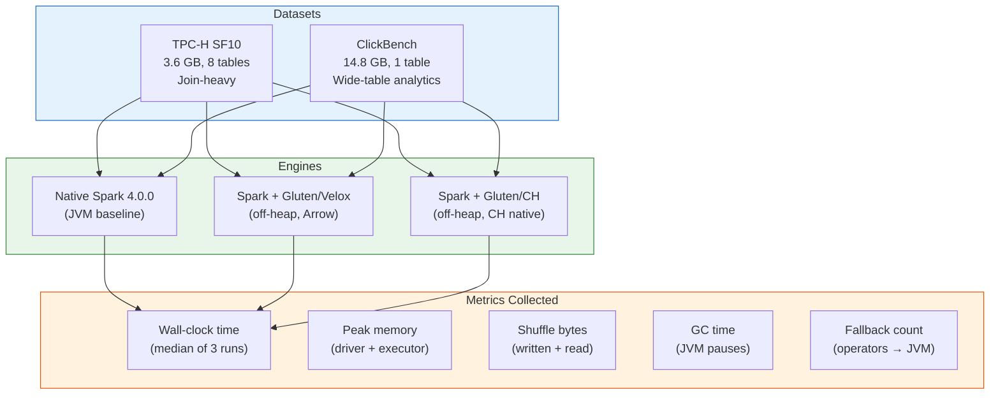

# Benchmark Plan

## Objective

Compare three execution configurations on identical queries and hardware:

| Config | Image | Backend | Off-Heap |
|--------|-------|---------|----------|
| Baseline | `apache/spark:4.0.0` | JVM (native Spark) | N/A |
| Gluten/Velox | `spark-gluten-velox:4.0.0` | Velox | 2 Gi |
| Gluten/ClickHouse | `spark-gluten-ch:4.0.0` | ClickHouse | 2 Gi |

## Datasets

### TPC-H SF10 (~3.6 GB Parquet)

Industry-standard OLAP benchmark. 8 tables modeling a parts supplier business.

| Table | Rows (SF10) | Key Columns |
|-------|------------|-------------|
| lineitem | ~60M | orderkey, partkey, suppkey, quantity, extendedprice, discount, shipdate |
| orders | ~15M | orderkey, custkey, orderdate, totalprice, orderpriority |
| customer | ~1.5M | custkey, nationkey, acctbal, mktsegment |
| part | ~2M | partkey, type, size, brand, container |
| partsupp | ~8M | partkey, suppkey, availqty, supplycost |
| supplier | ~100K | suppkey, nationkey, acctbal |
| nation | 25 | nationkey, regionkey, name |
| region | 5 | regionkey, name |

**Tests**: multi-table joins, aggregations, filter pushdown, sort.

**Generation**: `tpch-dbgen` (C tool) or `spark-tpc` (Spark-native generator).

### ClickBench (~14.8 GB Parquet)

Single wide table with 105 columns — web analytics hit log from Yandex Metrica.

| Property | Value |
|----------|-------|
| Table | hits |
| Rows | ~100M |
| Columns | 105 (mix of Int, String, Date, Array) |
| Size | 14.8 GB (Parquet, compressed) |

**Tests**: wide-table scans, aggregations over many columns, string operations (URL parsing, LIKE), GROUP BY with high cardinality.

**Download**: `https://datasets.clickhouse.com/hits_compatible/hits.parquet`

This dataset is particularly relevant for comparing Velox vs ClickHouse — ClickHouse backend was designed for exactly this workload pattern (wide tables, analytics aggregations).

### TPC-DS SF10 (~10 GB Parquet) — Optional Extension

24 tables modeling a retail business (stores, catalog, web). More complex than TPC-H.

| Property | Value |
|----------|-------|
| Tables | 24 (7 fact, 17 dimension) |
| Largest fact | store_sales (~29M rows at SF10) |
| Query templates | 99 |
| Tests | Star schema joins, subqueries, window functions, CTEs |

**Generation**: `dsdgen` tool from TPC. More complex setup than TPC-H.

Reserved as optional extension — TPC-H + ClickBench provide sufficient coverage for initial comparison.

## Benchmark Queries

### TPC-H Queries

| Query | Pattern | Tests |
|-------|---------|-------|
| Q1 | Scan + aggregate | lineitem scan, SUM/AVG/COUNT grouped by returnflag/linestatus. Pure aggregation. |
| Q3 | 3-way join + aggregate | customer × orders × lineitem. Tests hash join + aggregation. |
| Q5 | 6-way join + aggregate | customer × orders × lineitem × supplier × nation × region. Deep join tree. |
| Q6 | Scan + filter | lineitem scan with date/discount/quantity filters. Tests predicate pushdown. |
| Q9 | Complex join + aggregate | 6-table join with string LIKE filter. Tests join + string operations. |
| Q13 | Left outer join + aggregate | customer LEFT JOIN orders. Tests outer join handling. |
| Q18 | Subquery + top-N | Top 100 customers by quantity. Tests sort + limit. |

### ClickBench Queries

| Query | Pattern | Tests |
|-------|---------|-------|
| Q1 | `COUNT(*)` | Full table scan throughput |
| Q2 | `COUNT(*)` with filter | Predicate pushdown on wide table |
| Q5 | `SUM` + `GROUP BY` (2 cols) | Aggregation with moderate cardinality |
| Q10 | `COUNT DISTINCT` | Hash-based distinct on string column |
| Q15 | `LIKE '%pattern%'` | String scanning with substring match |
| Q20 | `GROUP BY` (5 cols) + `ORDER BY` + `LIMIT` | High-cardinality group by + sort |
| Q30 | Complex filter + multiple aggregations | Multiple SUM/AVG over filtered wide table |
| Q35 | `GROUP BY URL` + `HAVING COUNT > N` | String group key, filter on aggregate |

## Test Matrix



## Execution Environment

| Resource | Value |
|----------|-------|
| Driver | 2 cores, 4 Gi memory |
| Executor | 2 cores, 4 Gi memory (2 Gi heap + 2 Gi off-heap for Gluten) |
| Executors | 1 (single-node minikube) |
| Storage | Ceph S3 (`s3a://gluten-benchmark/`) |
| Runs per query | 3 (report median) |
| Warm-up | 1 run discarded before measurement |

## Expected Results

Based on published Gluten benchmarks and workload characteristics:

| Query Pattern | Native Spark | Gluten/Velox | Gluten/CH |
|---|---|---|---|
| Scan + filter (Q6) | baseline | 2-4x faster | 2-4x faster |
| Aggregation (Q1) | baseline | 2-5x faster | 3-5x faster (CH strength) |
| Multi-join (Q3, Q5) | baseline | 2-4x faster (Velox strength) | 2-3x faster |
| String ops (Q15, Q9) | baseline | 2-3x faster | 2-4x faster |
| Wide-table scan (CB) | baseline | 1.5-3x faster | 2-5x faster (CH strength) |
| Sort + limit (Q18) | baseline | 1.5-2x faster | 1.5-2x faster |

**Hypothesis**: Velox excels at join-heavy TPC-H queries. ClickHouse excels at wide-table ClickBench queries. Both significantly outperform JVM baseline on all patterns.

## Data Location

All data stored in Ceph S3:

```
s3a://gluten-benchmark/
├── tpch/sf10/
│   ├── lineitem/    (Parquet, snappy)
│   ├── orders/
│   ├── customer/
│   ├── part/
│   ├── partsupp/
│   ├── supplier/
│   ├── nation/
│   └── region/
└── clickbench/
    └── hits.parquet
```
