# MongoDB Setup (Percona Server for MongoDB)

Dremio uses MongoDB as its catalog metadata store. The Dremio Helm chart bundles the **Percona MongoDB Operator** (`v1.21.1`) as a subchart and deploys a `PerconaServerMongoDB` custom resource to manage the MongoDB cluster lifecycle.

No separate MongoDB or Percona installation is needed — everything is self-contained in the Dremio chart.

## Current Configuration

From `values-overrides.yaml`:

- **Replicas:** 1 (single node, `devMode: true` + `unsafeFlags.replsetSize: true`)
- **Storage:** 10Gi PVC per replica (`mongod-data-*`)
- **Backup:** Enabled by default (daily full + PITR to `s3://dremio/catalog-backups/`)
- **TLS:** preferTLS (default)
- **Database:** `dremio` (user: `dremio`, password from `.env`)

## Architecture

The **Percona Operator** (green) watches `PerconaServerMongoDB` CRs and creates the runtime objects (yellow) — StatefulSet, headless Service, and a backup CronJob. **Dremio components** (grey) connect to MongoDB through the headless Service `dremio-mongodb-rs0` on port 27017. **Pre-created secrets** (light blue) are created by `build.sh` from `.env` before Helm install — the app user password and all 4 system user passwords. Each MongoDB pod runs three containers: `mongod` (database), `pbm-agent` (backup), and `mongodb_exporter` (metrics). The **pre-delete hook** (purple) ensures clean teardown on `helm uninstall` by deleting CRs before the operator is removed.

```mermaid
graph TB
    %% =========================================
    %% MONGODB OBJECTS (Percona Operator + Dremio)
    %% =========================================

    subgraph Operator["MongoDB Operator (subchart)"]
        direction TB
        OpDeploy["Deployment<br/>dremio-mongodb-operator"]
        OpSA["ServiceAccount<br/>dremio-mongodb-operator"]
        OpRole["Role<br/>dremio-mongodb-operator"]
        OpRB["RoleBinding<br/>dremio-mongodb-operator"]
    end

    subgraph CRDs["Custom Resource Definitions"]
        direction LR
        CRD1["PerconaServerMongoDB"]
        CRD2["PerconaServerMongoDBBackup"]
        CRD3["PerconaServerMongoDBRestore"]
    end

    subgraph Cluster["MongoDB Cluster (from templates)"]
        direction TB
        PSMDB["PerconaServerMongoDB<br/>dremio-mongodb<br/>(rs0, 1 replica)"]
        MongSA["ServiceAccount<br/>dremio-mongodb"]
        BackupSecret["Secret<br/>dremio-mongodb-backup<br/>(S3 access keys)"]
    end

    subgraph Runtime["Created by Operator at Runtime"]
        direction TB
        STS["StatefulSet<br/>dremio-mongodb-rs0"]
        SVC["Service (headless)<br/>dremio-mongodb-rs0"]
        CronJob["CronJob<br/>dremio-catalog-backups<br/>(daily 00:00)"]
    end

    subgraph PreCreated["Pre-created by build.sh"]
        direction TB
        AppSecret2["Secret<br/>dremio-mongodb-app-users<br/>(dremio user, from .env)"]
        SysSecret["Secret<br/>dremio-mongodb-system-users<br/>(4 system users, from .env)"]
    end

    subgraph Clients["Dremio Components (MongoDB clients)"]
        direction LR
        Coord["coordinator"]
        CatSrv["catalog-server"]
        CatSvc["catalog-services"]
        EngOp["engine-operator"]
    end

    subgraph Pods["MongoDB Pod"]
        direction LR
        Mongod["mongod<br/>:27017"]
        PBM["pbm-agent<br/>(backup)"]
        Metrics["mongodb_exporter<br/>:9216"]
    end

    subgraph Storage["Persistent Storage"]
        direction LR
        PVC["PVC<br/>mongod-data-*<br/>10Gi (ceph-block)"]
        S3["S3 bucket: dremio<br/>/catalog-backups/<br/>(full + PITR oplog)"]
    end

    subgraph Hook["Pre-Delete Hook"]
        direction TB
        HookSA["ServiceAccount<br/>dremio-mongodb-pre-delete"]
        HookRole["Role<br/>dremio-mongodb-pre-delete-role"]
        HookRB["RoleBinding<br/>dremio-mongodb-pre-delete-rolebinding"]
        HookJob["Job<br/>delete-mongodbcluster"]
    end

    %% Operator manages cluster
    OpDeploy -->|"watches & reconciles"| PSMDB
    OpRB --> OpRole
    OpRB --> OpSA
    OpDeploy --> OpSA

    %% Operator creates runtime objects
    PSMDB -.->|"operator creates"| STS
    PSMDB -.->|"operator creates"| SVC
    PSMDB -.->|"operator creates"| CronJob

    %% Cluster references
    PSMDB --> MongSA
    PSMDB --> AppSecret2
    PSMDB --> SysSecret
    PSMDB --> BackupSecret

    %% StatefulSet runs pods
    STS --> Pods

    %% Service routes to pods
    SVC -->|":27017"| Mongod

    %% Dremio components connect via headless Service
    Coord -->|"mongodb://"| SVC
    CatSrv -->|"mongodb://"| SVC
    CatSvc -->|"mongodb://"| SVC
    EngOp -->|"mongodb://"| SVC

    %% Pod storage
    Mongod --> PVC
    PBM -->|"S3 API"| S3
    CronJob -->|"triggers"| PBM

    %% Metrics
    Metrics -->|"reads"| SysSecret

    %% Hook cleanup
    HookRB --> HookRole
    HookRB --> HookSA
    HookJob --> HookSA
    HookJob -.->|"deletes on<br/>helm uninstall"| PSMDB

    %% Styling
    classDef operator fill:#69db7c,stroke:#2b8a3e,stroke-width:2px,color:#000
    classDef crd fill:#e8e8e8,stroke:#868e96,stroke-width:2px,color:#000
    classDef cluster fill:#4dabf7,stroke:#1971c2,stroke-width:2px,color:#fff
    classDef runtime fill:#ffd43b,stroke:#f59f00,stroke-width:2px,color:#000
    classDef pod fill:#ff922b,stroke:#e8590c,stroke-width:2px,color:#fff
    classDef storage fill:#ff6b6b,stroke:#c92a2a,stroke-width:2px,color:#fff
    classDef hook fill:#d0bfff,stroke:#7950f2,stroke-width:2px,color:#000
    classDef precreated fill:#74c0fc,stroke:#1864ab,stroke-width:2px,color:#000
    classDef client fill:#e9ecef,stroke:#495057,stroke-width:2px,color:#000

    class Coord,CatSrv,CatSvc,EngOp client
    class OpDeploy,OpSA,OpRole,OpRB operator
    class CRD1,CRD2,CRD3 crd
    class PSMDB,MongSA,BackupSecret cluster
    class STS,SVC,CronJob runtime
    class AppSecret2,SysSecret precreated
    class Mongod,PBM,Metrics pod
    class PVC,S3 storage
    class HookSA,HookRole,HookRB,HookJob hook
```



## Kubernetes Objects

### Operator (from subchart)

| Kind | Name | Purpose |
|------|------|---------|
| Deployment | `dremio-mongodb-operator` | Percona operator — watches `PerconaServerMongoDB` CRs and reconciles MongoDB StatefulSets |
| ServiceAccount | `dremio-mongodb-operator` | Identity for operator pod |
| Role | `dremio-mongodb-operator` | RBAC: manage PSMDB CRDs, pods, services, PVCs, secrets, StatefulSets, CronJobs, PDBs, leases, events |
| RoleBinding | `dremio-mongodb-operator` | Binds role to operator service account |

### CRDs (installed by operator subchart)

| CRD | Kind | Purpose |
|-----|------|---------|
| `perconaservermongodbs.psmdb.dremio.com` | PerconaServerMongoDB | MongoDB cluster definition |
| `perconaservermongodbbackups.psmdb.dremio.com` | PerconaServerMongoDBBackup | On-demand backup trigger |
| `perconaservermongodbrestores.psmdb.dremio.com` | PerconaServerMongoDBRestore | Restore operation trigger |

### MongoDB Cluster

| Kind | Name | Purpose |
|------|------|---------|
| PerconaServerMongoDB | `dremio-mongodb` | Main CR — defines replica set `rs0`, storage, backup, users, security |
| ServiceAccount | `dremio-mongodb` | Identity for MongoDB pods |
| Secret | `dremio-mongodb-app-users` | App user password (`dremio` user, from `.env` via build.sh, `helm.sh/resource-policy: keep`) |
| Secret | `dremio-mongodb-system-users` | System users (clusterAdmin, clusterMonitor, backup, userAdmin — from `.env` via build.sh) |

### Backup (enabled by default)

| Kind | Name | Condition | Purpose |
|------|------|-----------|---------|
| Secret | `dremio-mongodb-backup` | `backup.enabled` + distStorage credentials present | S3 access keys for Percona Backup for MongoDB (PBM) |

### Pre-Delete Hook (cleanup on `helm uninstall`)

| Kind | Name | Purpose |
|------|------|---------|
| ServiceAccount | `dremio-mongodb-pre-delete` | Identity for cleanup job |
| Role | `dremio-mongodb-pre-delete-role` | RBAC: get/delete/patch PSMDB CRDs |
| RoleBinding | `dremio-mongodb-pre-delete-rolebinding` | Binds role to hook SA |
| Job | `delete-mongodbcluster` | Deletes CRs before operator is removed, with finalizer removal fallback |

### Created by Operator at Runtime

Not in Helm templates — created by the operator when it reconciles the `PerconaServerMongoDB` CR:

| Kind | Name | Purpose |
|------|------|---------|
| StatefulSet | `dremio-mongodb-rs0` | MongoDB replica set pods |
| Service | `dremio-mongodb-rs0` | Headless service for replica set DNS |
| PVC | `mongod-data-dremio-mongodb-rs0-*` | 10Gi per replica, WiredTiger data |
| CronJob | `dremio-catalog-backups` | Scheduled backup execution (if backup enabled) |

### Sidecar Containers (per MongoDB pod)

| Container | Image | Port | Purpose |
|-----------|-------|------|---------|
| `dremio-mongodb-metrics-exporter` | `percona/mongodb_exporter:0.47.1` | 9216 | Prometheus-format metrics (connections, opcounters, replication lag, WiredTiger cache, etc.) |

## Networking

| Port | Protocol | Purpose |
|------|----------|---------|
| 27017 | TCP | MongoDB wire protocol (replica set + client connections) |
| 9216 | TCP | Prometheus metrics exporter |

## Metrics & Monitoring

The MongoDB exporter sidecar exposes Prometheus-format metrics at `:9216/metrics`. Pods are annotated with `metrics.dremio.com/scrape: "true"` — a Dremio-specific annotation (not standard `prometheus.io/scrape`).

All Dremio components use this same annotation pattern:

| Component | Port | Path |
|-----------|------|------|
| MongoDB | 9216 | /metrics |
| Master/Coordinator | 9010 | /metrics |
| Executor | 9010 | /metrics |
| Catalog server | varies | /metrics |
| Catalog services | varies | /q/metrics |
| Engine operator | 8080 | /q/metrics |
| ZooKeeper | 7000 | /metrics |

**Consumer:** The built-in **telemetry collector** (OpenTelemetry-based) scrapes these annotations and forwards metrics. Currently **disabled** (`telemetry.enabled: false` in values-overrides.yaml).

**To use with external Prometheus:** Either:
- Enable the telemetry collector (`telemetry.enabled: true`) as an OTel intermediary
- Or deploy Prometheus with a custom scrape config matching `metrics.dremio.com/scrape: "true"` pod annotations
- Or use a `PodMonitor` / `ServiceMonitor` CRD (requires Prometheus Operator)

**Service DNS:** `dremio-mongodb-rs0.<namespace>.svc.cluster.local`

## Security

- All containers run as non-root (UID 1001)
- seccomp profile: `RuntimeDefault`
- Capabilities: all dropped
- TLS: `preferTLS` by default (can be disabled with `mongodb.disableTls: true`)
- All passwords (app + system users) pre-created by build.sh from `.env` — see [STORAGE.md](STORAGE.md#mongodb-users) for details
- App user secret annotated with `helm.sh/resource-policy: keep` (survives Helm reinstall)

## Backup & Restore

Ref: [Percona Backup Types](https://docs.percona.com/percona-operator-for-mongodb/backups.html#backup-types) | [PITR](https://docs.percona.com/percona-operator-for-mongodb/backups-pitr.html) | [Compression](https://docs.percona.com/percona-backup-mongodb/usage/compression.html)

Backup runs via Percona Backup for MongoDB (PBM) as a sidecar container in each MongoDB pod. PBM writes to the `dremio` distStorage bucket under `/catalog-backups/`.

### Backup Types

| Type | Status | Description |
|------|--------|-------------|
| **Physical** (current) | GA since v1.16.0 | Copies raw `dbPath` files. Fast for large datasets. Supports PITR since v1.15.0 |
| Logical | GA | Uses `mongodump`. Slower but supports selective restore (specific namespaces/collections, v1.18.0+) |
| Incremental | Tech Preview (v1.20.0) | Only copies data changed since last backup. Requires a base backup; base and increments must come from same node |

### Compression

| Algorithm | Levels | Notes |
|-----------|--------|-------|
| **gzip** (current) | -1 to 9 | Level 1 = fast, low CPU. Higher = better ratio, more CPU |
| zstd | 1-4 | Default in PBM. Good balance of speed and ratio |
| snappy | none | No levels, fixed ratio |
| lz4 | 1-16 | Fastest decompression |

### Scheduled Backups (automatic)

Enabled by default. Daily physical backup at 00:00 UTC, 3 retained, gzip level 1.

```yaml
# values.yaml defaults (no override needed)
backup:
  enabled: true
  type: physical
  schedule: "0 0 * * *"
  keep: 3
  compressionType: gzip
  compressionLevel: 1
```

### PITR (Point-in-Time Recovery)

Enabled by default. PBM continuously captures oplog and uploads chunks every 10 minutes to S3.

**Requirements:**
- At least one full backup must exist before oplog capture starts
- After cluster restore, a new full backup is needed to resume PITR
- Only one storage can be defined for PITR (multiple storages prevent oplog consistency)

```yaml
# values.yaml defaults (no override needed)
backup:
  pitr:
    enabled: true
    oplogSpanMin: 10    # upload interval in minutes
```

### List Backups

```bash
# Via CRD
kubectl get perconaservermongodbbackups -n dremio

# Via PBM CLI
kubectl exec -n dremio dremio-mongodb-rs0-0 -c backup-agent -- pbm list
kubectl exec -n dremio dremio-mongodb-rs0-0 -c backup-agent -- pbm status
```

### On-Demand Backup

```yaml
apiVersion: psmdb.dremio.com/v1
kind: PerconaServerMongoDBBackup
metadata:
  name: manual-backup-20260210
  namespace: dremio
spec:
  clusterName: dremio-mongodb
  storageName: dremio-catalog-backups
  type: physical
```

```bash
kubectl apply -f backup.yaml
kubectl get psmdb-backup -n dremio -w   # watch progress
```

### Restore from Backup

```yaml
apiVersion: psmdb.dremio.com/v1
kind: PerconaServerMongoDBRestore
metadata:
  name: restore-20260210
  namespace: dremio
spec:
  clusterName: dremio-mongodb
  backupName: manual-backup-20260210
  storageName: dremio-catalog-backups
```

### Point-in-Time Restore

Restore to a specific timestamp (replays oplog on top of the nearest base backup):

```yaml
apiVersion: psmdb.dremio.com/v1
kind: PerconaServerMongoDBRestore
metadata:
  name: pitr-restore-20260210
  namespace: dremio
spec:
  clusterName: dremio-mongodb
  backupName: manual-backup-20260210
  storageName: dremio-catalog-backups
  pitr:
    type: date
    date: "2026-02-10 14:30:00"
```

Or restore to the latest available point:

```yaml
  pitr:
    type: latest
```

### Monitor / Troubleshoot

```bash
# Backup agent logs
kubectl logs -n dremio dremio-mongodb-rs0-0 -c backup-agent -f

# PBM agent status
kubectl exec -n dremio dremio-mongodb-rs0-0 -c backup-agent -- pbm agents

# Detailed backup info
kubectl exec -n dremio dremio-mongodb-rs0-0 -c backup-agent -- pbm describe <backup-name>

# Cancel running backup
kubectl exec -n dremio dremio-mongodb-rs0-0 -c backup-agent -- pbm cancel-backup
```

### S3 Storage Path

```
s3://dremio/catalog-backups/
  <timestamp>/           ← full physical backup
  pbmPitr/               ← continuous PITR oplog chunks
```
