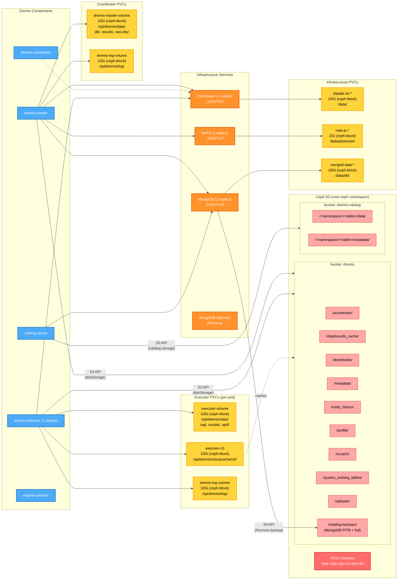

# Dremio Storage Architecture

Dremio uses a combination of Ceph S3 buckets (via RGW) for distributed object storage and Ceph Block PVCs for local persistent volumes.

## S3 Buckets

### `dremio` (distStorage)

Central object store for all Dremio distributed data. Configured via `distStorage.aws` in values-overrides.yaml. Coordinator and executors access this bucket directly via S3 API.

| Folder | Purpose |
|--------|---------|
| `/accelerator/` | Reflection acceleration data (materialized query results) |
| `/data/results_cache/` | Cached query results for repeated queries |
| `/downloads/` | User-initiated data exports and downloads |
| `/metadata/` | Internal metadata (table stats, partition info) |
| `/node_history/` | Node activity and lifecycle tracking |
| `/profile/` | Query execution profiles and plans |
| `/scratch/` | Temporary workspace for intermediate query data |
| `/system_iceberg_tables/` | Internal system tables in Iceberg format |
| `/uploads/` | User-uploaded files (CSV, JSON, etc.) |
| `/catalog-backups/` | MongoDB backups via Percona PBM (full + PITR oplogs). Hardcoded in chart template `_helpers_mongodb.tpl` to reuse distStorage bucket with `/catalog-backups` prefix |

### `dremio-catalog` (catalog.storage)

Dedicated bucket for the Open Catalog server (Polaris). Stores Iceberg table data managed through the catalog API. Configured via `catalog.storage.s3` in values-overrides.yaml.

The bucket is organized by catalog namespace. Each namespace contains its own set of tables:

```
s3://dremio-catalog/
  <namespace>/
    <table>/
      data/        ← Iceberg data files (Parquet)
      metadata/    ← Iceberg metadata (manifests, snapshots, schema)
```

Multiple namespaces can coexist (e.g. `production`, `staging`, `analytics`). Namespaces are created via the Polaris catalog API or Dremio UI.

## Users & Credentials

### S3 Users (Ceph RGW)

Each S3 user is a `CephObjectStoreUser` CR in the `rook-ceph` namespace. Rook auto-generates a secret per user containing `AccessKey` and `SecretKey`.

| S3 User | Purpose | Target Bucket | Rook Secret | Injected Into |
|---------|---------|---------------|-------------|---------------|
| `admin` | Bucket creation, CLI debugging | all | `rook-ceph-object-user-s3-store-admin` | build.sh only (not Dremio) |
| `dremio-dist` | distStorage + MongoDB backup | `dremio` | `rook-ceph-object-user-s3-store-dremio-dist` | Helm `--set distStorage.aws.credentials.*` |
| `dremio-catalog` | Polaris catalog server | `dremio-catalog` | `rook-ceph-object-user-s3-store-dremio-catalog` | Secret `catalog-server-s3-storage-creds` |

- `admin` defined in: `components/ceph/helm/templates/custom/s3-users/`
- `dremio-dist`, `dremio-catalog` defined in: `components/dremio/helm/templates/custom/s3-users/`

### MongoDB Users

| User | Role | Database | Description | Secret | .env Variable |
|------|------|----------|-------------|--------|---------------|
| `dremio` | `readWrite` | `dremio` | App user for all Dremio components (coordinator, catalog-server, catalog-services, engine-operator) | `dremio-mongodb-app-users` | `DREMIO_MONGODB_PASSWORD` |
| `clusterAdmin` | system | admin | Full cluster administration — replica set config, failover, schema changes | `dremio-mongodb-system-users` | `DREMIO_MONGODB_ADMIN_PASSWORD` |
| `clusterMonitor` | system | admin | Read-only monitoring — used by `mongodb_exporter` sidecar for Prometheus metrics | `dremio-mongodb-system-users` | `DREMIO_MONGODB_MONITOR_PASSWORD` |
| `backup` | system | admin | Percona Backup for MongoDB (PBM) agent — runs full/incremental backups and PITR oplog capture | `dremio-mongodb-system-users` | `DREMIO_MONGODB_BACKUP_PASSWORD` |
| `userAdmin` | system | admin | User and role management — creates/modifies MongoDB users and grants roles | `dremio-mongodb-system-users` | `DREMIO_MONGODB_USERADMIN_PASSWORD` |

All passwords are pre-created by build.sh from `.env` before Helm install. The Percona operator and Helm chart detect existing secrets and skip auto-generation.

### All Secrets

| Secret | Namespace | Keys | Source | Pre-created? |
|--------|-----------|------|--------|--------------|
| `rook-ceph-object-user-s3-store-admin` | rook-ceph | `AccessKey`, `SecretKey` | Rook operator | Auto |
| `rook-ceph-object-user-s3-store-dremio-dist` | rook-ceph | `AccessKey`, `SecretKey` | Rook operator | Auto |
| `rook-ceph-object-user-s3-store-dremio-catalog` | rook-ceph | `AccessKey`, `SecretKey` | Rook operator | Auto |
| `catalog-server-s3-storage-creds` | dremio | `awsAccessKeyId`, `awsSecretAccessKey` | build.sh (from dremio-catalog user) | Yes |
| `dremio-mongodb-app-users` | dremio | `dremio` (username=key, password=value) | build.sh (from `.env`) | Yes |
| `dremio-mongodb-system-users` | dremio | `MONGODB_CLUSTER_ADMIN_USER/PASSWORD`, `MONGODB_CLUSTER_MONITOR_USER/PASSWORD`, `MONGODB_BACKUP_USER/PASSWORD`, `MONGODB_USER_ADMIN_USER/PASSWORD` | build.sh (from `.env`) | Yes |
| `dremio-quay-secret` | dremio | Docker registry credentials | build.sh (from `.env`) | Yes |

## PVCs (ceph-block StorageClass)

### Coordinator

| PVC | Size | Mount | Purpose |
|-----|------|-------|---------|
| dremio-master-volume | 10Gi | /opt/dremio/data/ | RocksDB metadata store, query results, security keys |
| dremio-log-volume* | 10Gi | /opt/dremio/log/ | Server and query logs |

### Executor (per pod, created by engine operator)

| PVC | Size | Mount | Purpose |
|-----|------|-------|---------|
| executor-volume | 10Gi | /opt/dremio/data/ | Spill space for large queries, local logs and results |
| executor-c3 | 10Gi | /opt/dremio/cloudcache/c0/ | Columnar Cloud Cache - local SSD cache of S3 data |
| dremio-log-volume* | 10Gi | /opt/dremio/log/ | Executor logs |

> *\* Log volumes are not created when `writeLogsToFile: false` — logs go to stdout instead (see [Console Logging](#console-logging-stdout)).*

### Infrastructure

| PVC | Size | Mount | Purpose |
|-----|------|-------|---------|
| datadir-zk-* | 10Gi | /data/ | ZooKeeper transaction logs and snapshots |
| nats-js-* | 2Gi | /data/jetstream/ | NATS JetStream message persistence |
| mongod-data-* | 10Gi | /data/db/ | MongoDB catalog database (WiredTiger) |

## Console Logging (stdout)

By default Dremio writes logs to PVC-backed files (`DREMIO_LOG_TO_CONSOLE=0`). The chart supports redirecting all logs to stdout so they are collected by the Kubernetes logging infrastructure (Fluentd, Filebeat, etc.) and forwarded to ELK/Elasticsearch.

To enable console logging, add to `values-overrides.yaml`:

```yaml
# Disable file-based logging, send everything to stdout
writeLogsToFile: false
```

This sets `DREMIO_LOG_TO_CONSOLE=1` for all components (coordinator, master, executors) and **skips creation of `dremio-log-volume` PVCs entirely**, saving 10Gi per pod.

The setting can also be applied per-component:

```yaml
coordinator:
  writeLogsToFile: false    # coordinator + master only
executor:
  writeLogsToFile: false    # all executors
```

ZooKeeper already logs to stdout by default (logback ConsoleAppender). NATS and MongoDB also write to stdout natively.

## Architecture Diagram


