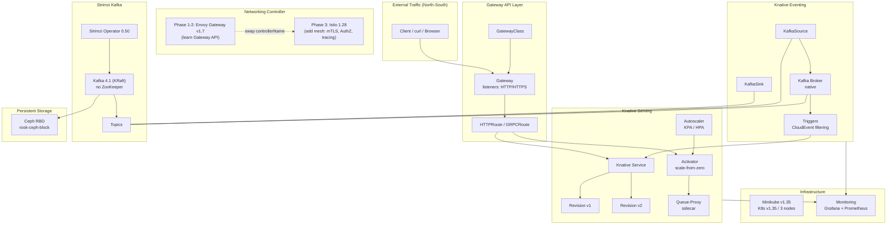
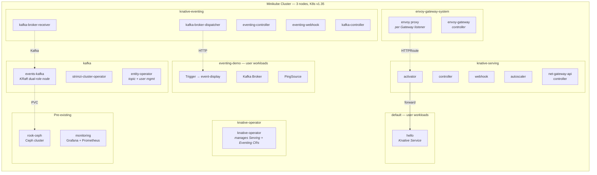
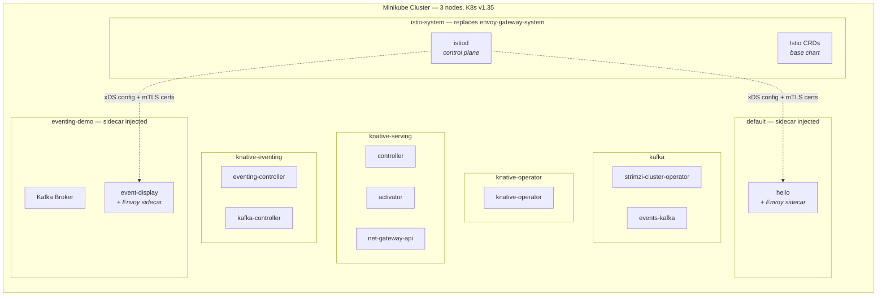
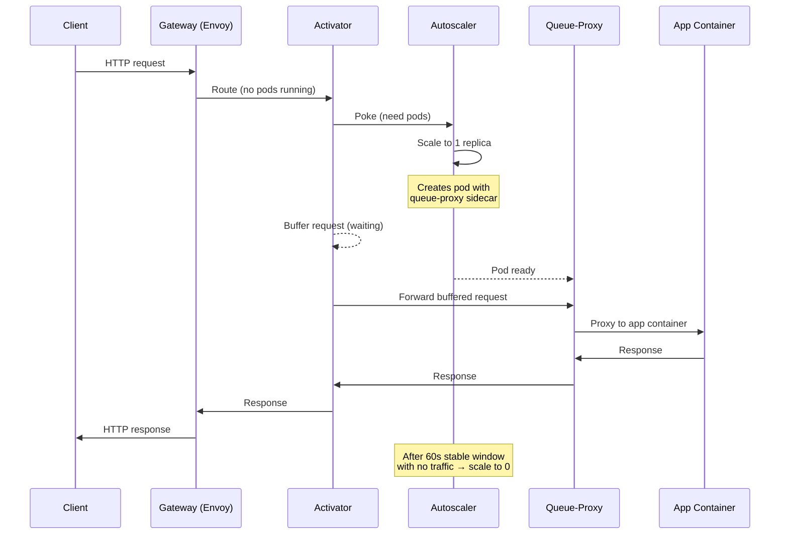
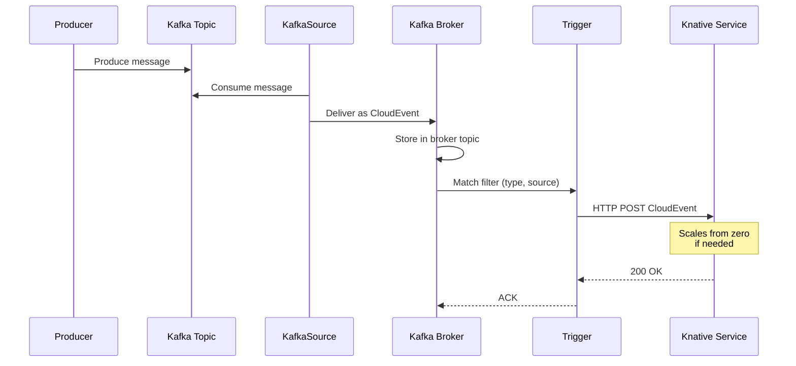
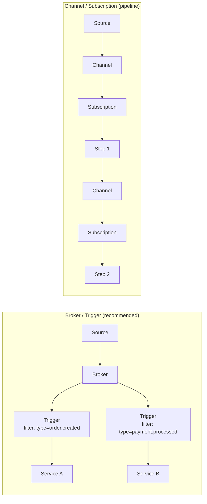
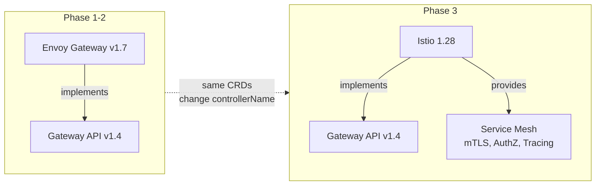
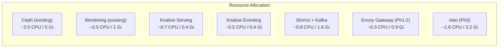

# Event-Driven Platform (Knative + Strimzi Kafka + Istio)

Serverless compute, event-driven architecture, and service mesh for the data playground.

## Table of Contents

- [Architecture Overview](#architecture-overview)
- [Kubernetes Namespace Layout](#kubernetes-namespace-layout)
- [Component Stack](#component-stack)
- [Knative Serving](#knative-serving)
- [Knative Eventing](#knative-eventing)
- [Knative Functions](#knative-functions)
- [Strimzi Kafka](#strimzi-kafka)
- [Networking Layer](#networking-layer)
- [Resource Budget](#resource-budget)
- [Decision Log](#decision-log)
- [Related Documentation](#related-documentation)

---

## Architecture Overview



---

## Kubernetes Namespace Layout

All components are deployed into dedicated namespaces. The diagram below shows what runs where.

### Phase 1-2 (Envoy Gateway)



### Phase 3 (Istio replaces Envoy Gateway)



### Namespace Summary Table

| Namespace | Component | Helm Release | Phase |
|-----------|-----------|-------------|-------|
| `envoy-gateway-system` | Envoy Gateway controller + proxy | `envoy-gateway` | 1-2 |
| `kafka` | Strimzi operator + Kafka broker | `strimzi` | 1-2-3 |
| `knative-operator` | Knative Operator | `knative-operator` | 1-2-3 |
| `knative-serving` | Knative Serving (via KnativeServing CR) | managed by operator | 1-2-3 |
| `knative-eventing` | Knative Eventing (via KnativeEventing CR) | managed by operator | 1-2-3 |
| `istio-system` | istiod + Istio CRDs (base) | `istio` | 3 |
| `default` | User workloads (hello world) | — | demo |
| `eventing-demo` | Eventing demo (broker, trigger, pingsource) | — | demo |
| `rook-ceph` | Ceph cluster (pre-existing) | — | — |
| `monitoring` | Grafana + Prometheus (pre-existing) | — | — |

### Install Methods

All components use Helm with the same pattern: `Chart.yaml` dependency → `helm dependency update` → `helm upgrade --install`.

| Component | Chart Source | Chart Dependency |
|-----------|-------------|-----------------|
| Envoy Gateway | `oci://docker.io/envoyproxy` | `gateway-helm` v1.7.0 |
| Strimzi | `https://strimzi.io/charts/` | `strimzi-kafka-operator` 0.50.0 |
| Knative | `https://knative.github.io/operator` | `knative-operator` v1.21.0 |
| Istio | `https://istio-release.storage.googleapis.com/charts` | `base` + `istiod` 1.28.3 |

---

### Request Flow — Scale-from-Zero



### Event Flow — Kafka Broker to Knative Service



---

## Component Stack

| Component | Version | Role | Install Method | Required? |
|-----------|---------|------|---------------|-----------|
| **Knative Operator** | v1.21 | Manages Serving + Eventing via CRs | Helm (`knative-operator`) | Yes |
| **Knative Serving** | v1.21 | Serverless HTTP workloads, autoscaling, revisions, traffic splitting | KnativeServing CR | Yes |
| **Knative Eventing** | v1.21 | Event-driven architecture, brokers, triggers, sources (CloudEvents) | KnativeEventing CR | Yes |
| **Knative Functions** | v1.21 (kn func) | Client-side CLI — scaffold & deploy functions (Go, Python, Node, Rust) | Local install | Optional |
| **Strimzi** | 0.50 | Kafka operator — manages Kafka clusters on K8s | Helm (`strimzi-kafka-operator`) | Yes |
| **Apache Kafka** | 4.1.1 | Event streaming platform (KRaft mode, no ZooKeeper) | Kafka CR | Yes |
| **Envoy Gateway** | v1.7 | Gateway API controller (Phase 1-2, learning) | Helm (`gateway-helm`) | Phase 1-2 |
| **Istio** | 1.28 | Service mesh + Gateway API controller (Phase 3, target) | Helm (`base` + `istiod`) | Phase 3 |

### Version Compatibility Matrix

| Knative v1.21 | Requires |
|---------------|----------|
| Kubernetes | >= 1.33 (running v1.35) |
| Gateway API CRDs | v1.2+ |
| Strimzi 0.50 | K8s 1.27+ |
| Envoy Gateway v1.7 | K8s 1.32-1.35 |
| Istio 1.28 | K8s 1.29+ |

---

## Knative Serving

Deploys stateless HTTP workloads with automatic scaling, including scale-to-zero.

### Control Plane Components

| Pod | Namespace | Role | CPU Req | Mem Req |
|-----|-----------|------|---------|---------|
| **controller** | knative-serving | Reconciles Knative CRDs, manages Deployments/Services | 100m | 100 Mi |
| **webhook** | knative-serving | Admission webhook — validates and defaults resources | 100m | 100 Mi |
| **autoscaler** | knative-serving | Aggregates metrics, computes desired pod count | 100m | 100 Mi |
| **activator** | knative-serving | Buffers requests during scale-from-zero | 300m | 60 Mi |
| **net-gateway-api controller** | knative-serving | Translates KIngress → Gateway API HTTPRoute | ~50m | ~64 Mi |

### Key Features

**Autoscaling (KPA vs HPA):**

| | KPA (default) | HPA |
|---|---|---|
| Metrics | Concurrency or RPS | CPU / Memory |
| Scale-to-zero | Yes | No (min 1 pod) |
| Panic mode | Yes (rapid scale-up) | No |
| Best for | HTTP workloads | CPU-bound workloads |

Configuration per service:
```yaml
autoscaling.knative.dev/class: "kpa.autoscaling.knative.dev"
autoscaling.knative.dev/metric: "concurrency"    # or "rps"
autoscaling.knative.dev/target: "100"
autoscaling.knative.dev/min-scale: "0"
autoscaling.knative.dev/max-scale: "10"
```

**Revisions & Traffic Splitting:**

Every update creates an immutable revision. Traffic can be split:
```yaml
traffic:
  - revisionName: myapp-00001
    percent: 90    # stable
  - revisionName: myapp-00002
    percent: 10    # canary
```

Use cases: canary releases, blue-green, A/B testing, instant rollback.

---

## Knative Eventing

Event-driven architecture layer. All events conform to the [CloudEvents](https://cloudevents.io/) specification.

### Patterns



**Broker/Trigger** (pub/sub — recommended):
- Broker collects events into a pool (backed by Kafka topics)
- Triggers filter by CloudEvent attributes (`type`, `source`, extensions)
- Decouples producers from consumers

**Channel/Subscription** (pipeline):
- Linear event flow through processing steps
- Each step transforms and re-emits events

### Kafka Broker Types

| Broker Class | Data Plane | Isolation | Use Case |
|-------------|-----------|-----------|----------|
| `Kafka` | Shared receiver/dispatcher pods | All brokers share pods | Development, small clusters |
| `KafkaNamespaced` | Per-namespace receiver/dispatcher | Isolated per namespace | Multi-tenant, production |

### Event Sources

| Source | What it does |
|--------|-------------|
| **KafkaSource** | Consumes Kafka topics → CloudEvents |
| **KafkaSink** | CloudEvents → Kafka topics |
| **PingSource** | Cron-scheduled event generation |
| **ApiServerSource** | Watches K8s API events |
| **SinkBinding** | Injects sink URL into any workload |
| **ContainerSource** | Custom containerized event producer |

---

## Knative Functions

Client-side tool (`kn func` CLI) — not installed in the cluster.

Scaffolds, builds, and deploys functions as standard OCI containers that run as Knative Services.

**Supported languages:** Go, Python, Node.js, TypeScript, Rust, Quarkus, Spring Boot

**Workflow:**
```bash
# Scaffold a new function
kn func create -l python my-function

# Build (uses Buildpacks or S2I)
kn func build

# Deploy as Knative Service
kn func deploy

# Invoke
kn func invoke
```

No special runtime or framework lock-in — the output is a standard container image.

---

## Strimzi Kafka

See [docs/KAFKA.md](docs/KAFKA.md) for detailed Strimzi + Knative Eventing integration analysis.

### Quick Summary

- **Strimzi 0.50** manages Kafka 4.1.1 via CRDs (`Kafka`, `KafkaNodePool`, `KafkaTopic`, `KafkaUser`)
- **KRaft mode only** — ZooKeeper completely eliminated
- **Storage:** PVCs on Ceph RBD (`rook-ceph-block` StorageClass)
- **Minimal footprint:** ~800m CPU, ~1.6 Gi memory (1 dual-role node)
- **Connects to Knative** via native Kafka Broker, KafkaSource, KafkaSink

---

## Networking Layer

See [docs/NETWORKING.md](docs/NETWORKING.md) for full Gateway API, Envoy Gateway, and Istio analysis.

### Quick Summary



| | Phase 1-2: Envoy Gateway | Phase 3: Istio |
|---|---|---|
| **Purpose** | Learn Gateway API | Full mesh + Gateway API |
| **You write** | GatewayClass, Gateway, HTTPRoute | Same + PeerAuthentication, AuthorizationPolicy |
| **mTLS** | No | Automatic everywhere |
| **Tracing** | No | Automatic span generation |
| **AuthZ policies** | No | Per-workload fine-grained |
| **Footprint** | ~250m CPU / 900 Mi | ~2.6 CPU / 3.2 Gi |
| **Migration** | — | Gateway/HTTPRoute resources carry over |

---

## Resource Budget

### Cluster Capacity

3 nodes × 7 CPU × ~12 Gi RAM = **21 CPU / 36 Gi total**

### Per-Phase Resource Estimates



| Component | CPU Request | Memory Request | Phase |
|-----------|------------|----------------|-------|
| Ceph (existing) | ~2.5 | ~5 Gi | — |
| Monitoring (existing) | ~0.5 | ~1 Gi | — |
| Envoy Gateway | 0.25 | 0.9 Gi | 1-2 |
| Knative Operator | ~0.1 | ~0.1 Gi | 1 |
| Knative Serving | 0.7 | 0.4 Gi | 1 |
| Knative Eventing + Kafka components | 0.5 | 0.4 Gi | 2 |
| Strimzi + Kafka (1 broker) | 0.8 | 1.6 Gi | 2 |
| **Total (Phase 2)** | **~5.4** | **~9.4 Gi** | |
| Istio (replaces Envoy Gateway) | 2.6 | 3.2 Gi | 3 |
| **Total (Phase 3)** | **~7.7** | **~11.7 Gi** | |
| **Available headroom (Phase 3)** | **~13.3** | **~24.3 Gi** | |

Plenty of capacity across all phases.

---

## Decision Log

| Decision | Choice | Rationale |
|----------|--------|-----------|
| Install method | Helm for all components | Consistent pattern (Chart.yaml with dependencies), `helm dependency update` + `helm upgrade --install` |
| Knative install | Knative Operator Helm chart | Lifecycle management via CRs (KnativeServing, KnativeEventing), Helm dependency |
| Istio install | Helm (base + istiod) | Official Helm approach, no istioctl dependency, consistent with other components |
| Networking Phase 1-2 | Envoy Gateway v1.7 | Learn Gateway API with real resources (not hidden by Kourier). Lightweight |
| Networking Phase 3 | Istio 1.28 (sidecar) | Full mesh (mTLS, AuthZ, tracing). Gateway API CRDs carry over from Envoy Gateway |
| Istio mode | Sidecar (not ambient) | Ambient mesh is GA but NOT validated with Knative yet ([net-istio#1360](https://github.com/knative-extensions/net-istio/issues/1360)) |
| Knative networking | net-gateway-api | Portable — works with both Envoy Gateway and Istio. Forward-looking |
| Kafka operator | Strimzi 0.50 | KRaft-only (no ZooKeeper), mature, works with Ceph RBD PVCs |
| Kafka broker count | 1 dual-role (dev) | Minimal resources for playground. Scale to 3 for production testing |
| Eventing broker | Native Kafka Broker (`Kafka` class) | Direct Kafka read/write, fewer hops than channel-based broker |
| Kafka storage | Ceph RBD (`rook-ceph-block`) | Already available, RWO compatible, no new storage setup |
| Why not Kourier | Doesn't teach Gateway API | Hides routing behind Knative abstractions — no transferable Gateway API knowledge |

---

## Quick Start

```bash
# Phase 1-2: Deploy all components
./components/events/envoy-gateway/scripts/build.sh
./components/events/strimzi/scripts/build.sh
./components/events/knative/scripts/build.sh

# Run tests
./components/events/envoy-gateway/scripts/test/test-gateway.sh
./components/events/strimzi/scripts/test/test-kafka.sh
./components/events/knative/scripts/test/test-serving.sh
./components/events/knative/scripts/test/test-eventing.sh

# Phase 3: Swap to Istio (edit config.yaml first)
./components/events/istio/scripts/build.sh
./components/events/envoy-gateway/scripts/destroy.sh
```

## Teardown (reverse order)

```bash
./components/events/knative/scripts/destroy.sh
./components/events/strimzi/scripts/destroy.sh
./components/events/envoy-gateway/scripts/destroy.sh
```

---

## Related Documentation

**Analysis docs:**
- [docs/NETWORKING.md](docs/NETWORKING.md) — Gateway API, Envoy Gateway, Istio deep dive
- [docs/KAFKA.md](docs/KAFKA.md) — Strimzi + Knative Eventing integration
- [docs/IMPLEMENTATION-PLAN.md](docs/IMPLEMENTATION-PLAN.md) — Phased deployment plan

**Component READMEs:**
- [envoy-gateway/README.md](envoy-gateway/README.md)
- [strimzi/README.md](strimzi/README.md)
- [knative/README.md](knative/README.md)
- [istio/README.md](istio/README.md)

**External docs:**
- [Knative Docs](https://knative.dev/docs/)
- [Knative Operator Install](https://knative.dev/docs/install/operator/knative-with-operators/)
- [Strimzi Docs](https://strimzi.io/docs/operators/latest/overview)
- [Envoy Gateway Docs](https://gateway.envoyproxy.io/)
- [Istio Helm Install](https://istio.io/latest/docs/setup/install/helm/)
- [Gateway API Spec](https://gateway-api.sigs.k8s.io/)
