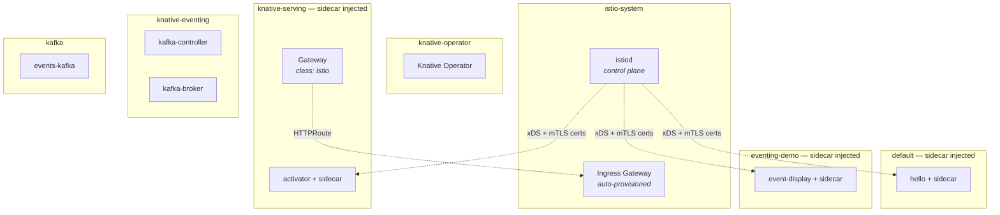
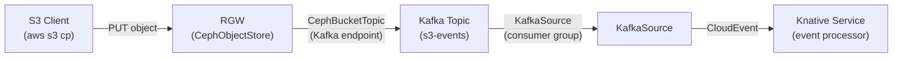
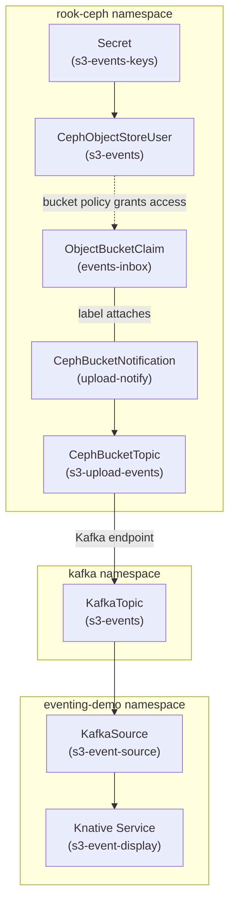

# Implementation Plan

Phased deployment of Knative + Strimzi Kafka + Istio on the playground cluster.

## Table of Contents

- [Overview](#overview)
- [Prerequisites](#prerequisites)
- [Namespace Layout](#namespace-layout)
- [Phase 1 — Gateway API + Knative Serving](#phase-1--gateway-api--knative-serving)
- [Phase 2 — Eventing + Strimzi Kafka](#phase-2--eventing--strimzi-kafka)
- [Phase 3 — Istio Service Mesh](#phase-3--istio-service-mesh)
- [Config.yaml Changes](#configyaml-changes)
- [File Structure](#file-structure)
- [Deploy / Teardown](#deploy--teardown)

---

## Overview

```mermaid
gantt
    title Deployment Phases
    dateFormat X
    axisFormat %s

    section Phase 1
    Envoy Gateway v1.7           :p1a, 0, 1
    Gateway API CRDs             :p1b, 0, 1
    Knative Serving v1.21        :p1c, 1, 2
    net-gateway-api plugin       :p1d, 1, 2
    Hello-world service          :p1e, 2, 3
    Test scale-to-zero           :p1f, 3, 4
    Test traffic splitting       :p1g, 3, 4
    kn CLI + kn func             :p1h, 4, 5

    section Phase 2
    Strimzi Operator 0.50        :p2a, 5, 6
    Kafka Cluster (KRaft)        :p2b, 6, 7
    Knative Eventing core        :p2c, 7, 8
    Kafka Broker + KafkaSource   :p2d, 8, 9
    Test event flows             :p2e, 9, 10
    Ceph bucket notifications    :p2f, 10, 11
    S3→Kafka→Knative pipeline    :p2g, 11, 12
    Camel K Operator 2.9         :p2h, 12, 13
    File dispatcher integration  :p2i, 13, 14
    ingest-core shared library   :p2j, 14, 15
    csv-to-iceberg function      :p2k, 15, 16
    Test full pipeline           :p2l, 16, 17

    section Phase 3
    Istio 1.28.3 (Helm)         :p3a, 17, 18
    Swap GatewayClass            :p3b, 18, 19
    Remove Envoy Gateway         :p3c, 18, 19
    Enable mTLS                  :p3d, 19, 20
    Test AuthZ + tracing         :p3e, 20, 21
```



### Install Methods

All components are installed via **Helm chart dependencies** (the "dremio pattern"):

| Component | Chart Source | Chart / Dependency | Version |
|-----------|-------------|-------------------|---------|
| Envoy Gateway | `oci://docker.io/envoyproxy/gateway-helm` | OCI chart (direct) | v1.7.0 |
| Strimzi | `https://strimzi.io/charts/` | `strimzi-kafka-operator` | 0.50.0 |
| Knative | `https://knative.github.io/operator` | `knative-operator` | v1.21.0 |
| Camel K | `https://apache.github.io/camel-k/charts/` | `camel-k` | 2.9.1 |
| Istio | `https://istio-release.storage.googleapis.com/charts` | `base` + `istiod` | 1.28.3 |

Each component's `helm/Chart.yaml` declares dependencies → `helm dependency update` → `helm upgrade --install`.

---

## Prerequisites

| Requirement | Status |
|-------------|--------|
| Minikube running (3 nodes) | Existing |
| Kubernetes v1.35.0 | Existing |
| Ceph/Rook deployed | Existing |
| `ceph-block` StorageClass | Existing |
| Monitoring (Grafana + Prometheus) | Existing |
| `kubectl` >= v1.32 | Verify |
| `helm` v3 | Verify |

### Verify Prerequisites

```bash
# Cluster status
kubectl get nodes

# StorageClass available
kubectl get sc ceph-block

# Helm version
helm version
```

---

## Namespace Layout

### Phase 1-2 (Envoy Gateway + Knative + Strimzi)

```mermaid
graph TB
    subgraph ns_egw["envoy-gateway-system"]
        eg_ctrl["Envoy Gateway<br/><i>controller</i>"]
        eg_proxy["Gateway proxy<br/><i>data plane</i>"]
    end

    subgraph ns_knop["knative-operator"]
        kn_op["Knative Operator<br/><i>Helm release</i>"]
    end

    subgraph ns_serving["knative-serving"]
        activator["activator"]
        autoscaler["autoscaler"]
        controller["controller"]
        webhook["webhook"]
        net_gw["net-gateway-api"]
        gw["Gateway<br/><i>knative-gateway</i>"]
    end

    subgraph ns_eventing["knative-eventing"]
        ev_ctrl["eventing-controller"]
        kafka_ctrl["kafka-controller"]
        kafka_broker["kafka-broker-receiver"]
        kafka_disp["kafka-broker-dispatcher"]
    end

    subgraph ns_kafka["kafka"]
        strimzi_op["Strimzi Operator<br/><i>Helm release</i>"]
        kafka_pod["events-kafka<br/><i>KRaft broker</i>"]
        entity_op["Entity Operator"]
    end

    subgraph ns_default["default"]
        hello["hello<br/><i>Knative Service</i>"]
    end

    subgraph ns_camelk["camel-k"]
        camel_op["Camel K Operator<br/><i>Helm release</i>"]
    end

    subgraph ns_demo["eventing-demo"]
        broker["Kafka Broker"]
        display["event-display"]
        ping["PingSource"]
        dispatcher["file-dispatcher<br/><i>Camel K Integration</i>"]
        csv_fn["csv-to-iceberg<br/><i>Knative Service</i>"]
    end

    kn_op -.->|"manages"| ns_serving
    kn_op -.->|"manages"| ns_eventing
    strimzi_op -.->|"manages"| kafka_pod
    camel_op -.->|"manages"| dispatcher
    kafka_broker -->|"produce/consume"| kafka_pod
    ping -->|"events"| broker
    broker -->|"trigger"| display
    dispatcher -->|"light-ingest"| csv_fn
    dispatcher -->|"heavy-ingest"| kafka_pod
    eg_ctrl -.->|"programs"| eg_proxy
    gw -.->|"HTTPRoute"| eg_proxy
```



### Phase 3 (Istio replaces Envoy Gateway)



### Namespace Summary

| Namespace | Components | Helm Release | Phase |
|-----------|-----------|--------------|-------|
| `envoy-gateway-system` | Envoy Gateway controller + proxies | `eg` | 1-2 |
| `knative-operator` | Knative Operator | `knative-operator` | 1+ |
| `knative-serving` | Activator, autoscaler, controller, webhook, net-gateway-api | Managed by operator | 1+ |
| `knative-eventing` | Eventing controller, Kafka controller, broker receiver/dispatcher | Managed by operator | 2+ |
| `kafka` | Strimzi operator, Kafka broker, Entity operator | `strimzi` | 2+ |
| `istio-system` | istiod, Istio CRDs, ingress gateway | `istio` | 3 |
| `default` | Demo: hello world Knative Service | — | 1+ |
| `camel-k` | Camel K operator | `camel-k` | 2+ |
| `eventing-demo` | Demo: Kafka Broker, event-display, PingSource, file-dispatcher, csv-to-iceberg | — | 2+ |

---

## Phase 1 — Gateway API + Knative Serving

**Goal:** Deploy Envoy Gateway + Knative Serving, learn Gateway API primitives, test serverless features.

### Step 1.1 — Install Envoy Gateway

The `build.sh` script handles Helm install + Gateway resource creation:

```bash
./components/events/envoy-gateway/scripts/build.sh
```

**What it does internally:**
1. Creates `envoy-gateway-system` namespace
2. `helm dependency update` + `helm upgrade --install eg` (OCI chart `envoyproxy/gateway-helm` v1.7.0)
3. Waits for controller deployment to be available
4. Applies `templates/custom/gateway.yaml` — creates GatewayClass `eg` + Gateway `knative-gateway`

### Step 1.2 — Install Strimzi Kafka

Kafka must be ready before Knative (Knative Eventing needs a Kafka bootstrap server):

```bash
./components/events/strimzi/scripts/build.sh
```

**What it does internally:**
1. Creates `kafka` namespace
2. `helm dependency update` + `helm upgrade --install strimzi` (strimzi-kafka-operator 0.50.0)
3. Waits for Strimzi operator deployment
4. Applies `manifests/kafka-cluster.yaml` — KafkaNodePool + Kafka CRs (KRaft mode, single broker, Ceph PVC)
5. Waits for Kafka cluster `Ready` condition

### Step 1.3 — Install Knative Serving + Eventing

The Knative build script installs the operator via Helm, then creates KnativeServing and KnativeEventing CRs:

```bash
./components/events/knative/scripts/build.sh
```

**What it does internally:**
1. Pre-flight: verifies GatewayClass `eg` exists + Kafka cluster is running
2. Creates namespaces: `knative-operator`, `knative-serving`, `knative-eventing`
3. `helm dependency update` + `helm upgrade --install knative-operator` (knative-operator v1.21.0)
4. Applies `manifests/knative-serving.yaml` — KnativeServing CR with:
   - Gateway API ingress (net-gateway-api)
   - GatewayClass `eg` (Envoy Gateway)
   - sslip.io magic DNS
5. Waits for KnativeServing `Ready` (1-2 minutes)
6. Applies `manifests/knative-eventing.yaml` + `kafka-broker-config.yaml` — KnativeEventing CR with:
   - Kafka source enabled
   - Kafka as default broker class
7. Waits for KnativeEventing `Ready` (1-2 minutes)

### Step 1.4 — Test Serving

```bash
# Automated: deploys hello world, verifies ksvc ready, cleans up
./components/events/knative/scripts/test/test-serving.sh

# Or manually:
kubectl apply -f components/events/knative/scripts/test/demo-hello.yaml
kubectl wait --timeout=60s -n default ksvc hello --for=condition=Ready
kubectl get ksvc hello -o jsonpath='{.status.url}'
```

### Step 1.5 — Test Features

```bash
# Test scale-to-zero
# Wait 60s with no traffic, then verify pods scaled down
kubectl get pods -n default -l serving.knative.dev/service=hello
# Should show: No resources found

# Send request (triggers scale-from-zero)
# Port-forward the gateway first
export ENVOY_SERVICE=$(kubectl get svc -n envoy-gateway-system \
  --selector=gateway.envoyproxy.io/owning-gateway-namespace=knative-serving \
  -o jsonpath='{.items[0].metadata.name}')
kubectl -n envoy-gateway-system port-forward service/${ENVOY_SERVICE} 8080:80 &

curl -H "Host: hello.default.sslip.io" http://localhost:8080

# Test traffic splitting
# Deploy v2
kubectl apply -f - <<EOF
apiVersion: serving.knative.dev/v1
kind: Service
metadata:
  name: hello
  namespace: default
spec:
  template:
    metadata:
      name: hello-v2
    spec:
      containers:
        - image: ghcr.io/knative/helloworld-go:latest
          ports:
            - containerPort: 8080
          env:
            - name: TARGET
              value: "Knative v2"
  traffic:
    - revisionName: hello-00001
      percent: 80
    - revisionName: hello-v2
      percent: 20
EOF

# Test multiple times to see traffic distribution
for i in $(seq 1 10); do
  curl -s -H "Host: hello.default.sslip.io" http://localhost:8080
done
```

### Step 1.6 — Install kn CLI and Functions (Optional)

```bash
# Install kn CLI
# Check https://knative.dev/docs/client/ for latest binary

# Install func plugin
# Check https://knative.dev/docs/functions/ for latest binary

# Scaffold a function
kn func create -l python my-function
cd my-function

# Build and deploy
kn func build
kn func deploy --namespace default

# Invoke
kn func invoke
```

### Phase 1 Verification Checklist

- [ ] Envoy Gateway controller running in `envoy-gateway-system`
- [ ] GatewayClass `eg` exists
- [ ] Gateway `knative-gateway` has `Programmed` condition
- [ ] Knative Operator running in `knative-operator`
- [ ] Knative Serving pods all running in `knative-serving`
- [ ] Knative Eventing pods all running in `knative-eventing`
- [ ] Kafka Broker + KafkaSource controllers running
- [ ] HTTPRoutes created automatically for Knative services
- [ ] Hello world service responds
- [ ] Scale-to-zero works (pods removed after 60s idle)
- [ ] Scale-from-zero works (cold start on next request)
- [ ] Traffic splitting between revisions works

---

## Phase 2 — Eventing Demos

**Goal:** Test event-driven architecture with Kafka Broker, PingSource, and KafkaSource.

> Note: Strimzi, Knative Eventing, and Kafka Broker were already deployed in Phase 1.
> Phase 2 focuses on deploying and testing the eventing demos.

### Step 2.1 — Test Eventing

```bash
# Automated: deploys Broker + PingSource, verifies event flow, cleans up
./components/events/knative/scripts/test/test-eventing.sh

# Or manually:
kubectl apply -f components/events/knative/scripts/test/demo-eventing.yaml
```

This creates in the `eventing-demo` namespace:
- Kafka Broker (`default`) backed by `kafka-broker-config`
- `event-display` Knative Service (consumer)
- Trigger routing all events to `event-display`
- PingSource generating test events every minute

```bash
# Watch for events being received
kubectl logs -n eventing-demo -l serving.knative.dev/service=event-display -c user-container -f
```

### Step 2.2 — Test KafkaSource

```yaml
# kafka-source-demo.yaml

# Create a topic
apiVersion: kafka.strimzi.io/v1beta2
kind: KafkaTopic
metadata:
  name: demo-topic
  namespace: kafka
  labels:
    strimzi.io/cluster: events-kafka
spec:
  partitions: 3
  replicas: 1
---
# KafkaSource consuming from the topic
apiVersion: sources.knative.dev/v1
kind: KafkaSource
metadata:
  name: demo-source
  namespace: eventing-demo
spec:
  consumerGroup: demo-group
  bootstrapServers:
    - events-kafka-kafka-bootstrap.kafka.svc.cluster.local:9092
  topics:
    - demo-topic
  sink:
    ref:
      apiVersion: serving.knative.dev/v1
      kind: Service
      name: event-display
```

```bash
kubectl apply -f kafka-source-demo.yaml

# Produce a test message to Kafka
kubectl -n kafka run kafka-producer -ti --rm \
  --image=quay.io/strimzi/kafka:0.50.0-kafka-4.1.1 \
  --restart=Never -- bin/kafka-console-producer.sh \
  --bootstrap-server events-kafka-kafka-bootstrap:9092 \
  --topic demo-topic

# Type messages and watch them appear in event-display logs
```

### Step 2.3 — Ceph S3 Bucket Notifications → Kafka → Knative

An alternative event trigger: instead of applications producing Kafka messages directly, Ceph RGW emits S3 event notifications to a Kafka topic whenever objects are uploaded. Knative consumes those events via KafkaSource.



**How it works:**

1. **CephBucketTopic** — configures RGW to publish S3 event notifications to a Kafka broker
2. **CephBucketNotification** — binds the topic to a specific bucket, with event type and prefix/suffix filters
3. **KafkaSource** — Knative consumes the Kafka topic and delivers CloudEvents to a Knative Service

This creates a fully declarative, zero-code event pipeline: upload a file → Ceph notifies Kafka → Knative triggers a serverless function.

#### 2.3.1 — Create a dedicated bucket and S3 user

A separate bucket and user for the eventing demo — isolated from the iceberg data pipeline.
Uses the pre-set credentials pattern from the [Ceph README](../../ceph/README.md#creating-a-bucket-with-a-custom-user) (4-step process: Secret → CephObjectStoreUser → OBC → bucket policy).

**Step 1 — Credentials secret** with known keys (not auto-generated):

```yaml
# manifests/s3-events-user.yaml
apiVersion: v1
kind: Secret
metadata:
  name: s3-events-keys
  namespace: rook-ceph
type: Opaque
stringData:
  access-key: s3events
  secret-key: s3events123
```

**Step 2 — CephObjectStoreUser** referencing the pre-set keys:

```yaml
# manifests/s3-events-user.yaml (continued)
---
apiVersion: ceph.rook.io/v1
kind: CephObjectStoreUser
metadata:
  name: s3-events
  namespace: rook-ceph
spec:
  store: s3-store
  displayName: "S3 Events Demo User"
  capabilities:
    bucket: "*"
  keys:
    - accessKeyRef:
        name: s3-events-keys
        key: access-key
      secretKeyRef:
        name: s3-events-keys
        key: secret-key
```

> Note: the operator-generated secret (`rook-ceph-object-user-s3-store-s3-events`) will have **empty** `AccessKey`/`SecretKey` — this is expected when using `spec.keys`. The actual credentials are in `s3-events-keys`.

**Step 3 — OBC** to create the bucket (the notification label is set here, used in step 2.3.4):

```yaml
# manifests/s3-events-bucket.yaml
apiVersion: objectbucket.io/v1alpha1
kind: ObjectBucketClaim
metadata:
  name: events-inbox
  namespace: rook-ceph
  labels:
    bucket-notification-upload-notify: upload-notify
spec:
  bucketName: events-inbox
  storageClassName: ceph-bucket
```

**Step 4 — Bucket policy** granting the `s3-events` user access to the OBC-owned bucket:

```bash
# Port-forward RGW first
kubectl -n rook-ceph port-forward svc/rook-ceph-rgw-s3-store 7480:80 &

# Read OBC owner credentials
OBC_AK=$(kubectl -n rook-ceph get secret events-inbox \
  -o jsonpath='{.data.AWS_ACCESS_KEY_ID}' | base64 -d)
OBC_SK=$(kubectl -n rook-ceph get secret events-inbox \
  -o jsonpath='{.data.AWS_SECRET_ACCESS_KEY}' | base64 -d)

# Grant the s3-events user access using OBC owner credentials
AWS_ACCESS_KEY_ID="$OBC_AK" AWS_SECRET_ACCESS_KEY="$OBC_SK" \
  aws s3api put-bucket-policy \
    --bucket events-inbox \
    --endpoint-url http://localhost:7480 \
    --policy '{
      "Version": "2012-10-17",
      "Statement": [{
        "Effect": "Allow",
        "Principal": {"AWS": ["arn:aws:iam:::user/s3events"]},
        "Action": "s3:*",
        "Resource": [
          "arn:aws:s3:::events-inbox",
          "arn:aws:s3:::events-inbox/*"
        ]
      }]
    }'
```

#### 2.3.2 — Create the Kafka topic for S3 events

```yaml
# manifests/s3-events-topic.yaml
apiVersion: kafka.strimzi.io/v1
kind: KafkaTopic
metadata:
  name: s3-events
  namespace: kafka
  labels:
    strimzi.io/cluster: events-kafka
spec:
  partitions: 3
  replicas: 1
  config:
    retention.ms: "86400000"    # 24h retention
```

#### 2.3.3 — Create CephBucketTopic (Kafka endpoint)

Tells RGW where to send notifications. The Kafka endpoint points to the Strimzi bootstrap service.

```yaml
# manifests/ceph-bucket-topic.yaml
apiVersion: ceph.rook.io/v1
kind: CephBucketTopic
metadata:
  name: s3-upload-events
  namespace: rook-ceph
spec:
  objectStoreName: s3-store
  objectStoreNamespace: rook-ceph
  opaqueData: ""
  persistent: true                          # persist across RGW restarts
  endpoint:
    kafka:
      uri: events-kafka-kafka-bootstrap.kafka.svc.cluster.local:9092
      ackLevel: broker                      # wait for Kafka broker ACK
      useSSL: false
```

#### 2.3.4 — Create CephBucketNotification (bind to bucket + filter)

Attach the topic to the `events-inbox` bucket. Filter to only fire on object creation in a specific prefix.

```yaml
# manifests/ceph-bucket-notification.yaml
apiVersion: ceph.rook.io/v1
kind: CephBucketNotification
metadata:
  name: upload-notify
  namespace: rook-ceph
spec:
  topic: s3-upload-events
  events:
    - s3:ObjectCreated:*
  filter:
    keyFilters:
      - name: prefix
        value: incoming/
      - name: suffix
        value: .parquet
```

The OBC label `bucket-notification-upload-notify: upload-notify` (set in step 2.3.1) binds this notification to the `events-inbox` bucket.

#### 2.3.5 — Create KafkaSource → Knative Service

The KafkaSource consumes S3 event notifications from the Kafka topic and delivers them as CloudEvents to a Knative Service.

```yaml
# manifests/s3-event-source.yaml
apiVersion: sources.knative.dev/v1
kind: KafkaSource
metadata:
  name: s3-event-source
  namespace: eventing-demo
spec:
  consumerGroup: s3-event-processor
  bootstrapServers:
    - events-kafka-kafka-bootstrap.kafka.svc.cluster.local:9092
  topics:
    - s3-events
  sink:
    ref:
      apiVersion: serving.knative.dev/v1
      kind: Service
      name: s3-event-display
---
apiVersion: serving.knative.dev/v1
kind: Service
metadata:
  name: s3-event-display
  namespace: eventing-demo
spec:
  template:
    spec:
      containers:
        - image: gcr.io/knative-releases/knative.dev/eventing/cmd/event_display
```

#### 2.3.6 — Test the pipeline

```bash
# Upload a file matching the filter (incoming/*.parquet)
AWS_ACCESS_KEY_ID=s3events AWS_SECRET_ACCESS_KEY=s3events123 \
  aws s3 cp test.parquet s3://events-inbox/incoming/test.parquet \
    --endpoint-url http://localhost:7480

# Watch the Knative service logs for the CloudEvent
kubectl logs -n eventing-demo \
  -l serving.knative.dev/service=s3-event-display \
  -c user-container -f
```

Expected CloudEvent payload from RGW (S3 notification format):

```json
{
  "Records": [{
    "eventName": "s3:ObjectCreated:Put",
    "s3": {
      "bucket": { "name": "events-inbox" },
      "object": {
        "key": "incoming/test.parquet",
        "size": 1024
      }
    }
  }]
}
```

#### CRDs involved (cross-component)



#### Why this matters

| Trigger method | How | When to use |
|---------------|-----|-------------|
| **PingSource** | Cron-scheduled CloudEvents | Periodic jobs (polling, health checks) |
| **KafkaSource** (app-produced) | Application writes to Kafka topic | Application controls when events fire |
| **S3 → Kafka → KafkaSource** | File upload triggers event automatically | Data pipelines — upload triggers processing without application code changes |

The S3 notification path is particularly useful for data engineering: upload a Parquet file to Ceph → automatic Kafka event → Knative function processes/transforms/loads it — no producer code needed.

### Step 2.4 — Unified Ingest Architecture (Camel K + Shared Library)

S3 events from Step 2.3 feed into a unified ingest pipeline. Instead of duplicating ingest logic across multiple code paths, a single **shared library** (`ingest_core`) handles all file processing, with **Camel K** routing events to the right executor based on file size.

#### The Problem

A naive approach creates 4 code paths (single small file, batch of small files, overflow batch, single big file) — each needing file reading, schema handling, Iceberg writes, error handling, retries, and monitoring. That's 4× maintenance.

#### The Solution: One Ingest Contract, Multiple Executors

The message on Kafka is the **same format** regardless of path. The only thing that differs is **who processes it**.

```
                    Camel K router
                         │
            all paths produce the same message:
            {
              "files": ["s3://bucket/key1", ...],
              "total_bytes": 45000000,
              "file_count": 23,
              "timestamp": "..."
            }
                         │
              ┌──────────┴──────────┐
              │                     │
        kafka:light-ingest    kafka:heavy-ingest
              │                     │
              ▼                     ▼
        PyIceberg worker      SparkApplication
              │                     │
              └──────────┬──────────┘
                         │
                  Same ingest logic
                  (shared library)
```

#### 2.4.1 — Deploy Camel K Operator

```bash
./components/events/camel-k/scripts/build.sh
```

Pre-flight checks: Knative Serving CRDs + Kafka cluster must be present.

Test:
```bash
./components/events/camel-k/scripts/test/test-camel-k.sh
```

#### 2.4.2 — Shared Ingest Library (`ingest_core`)

Write the core logic once in Python. Both PyIceberg and Spark use it.

```
ingest-core/              # pip-installable package
├── ingest_core/
│   ├── models.py         # IngestRequest dataclass
│   ├── iceberg.py        # IcebergIngestor class
│   ├── validation.py     # schema checks
│   └── monitoring.py     # metrics, logging
├── pyproject.toml
└── tests/
```

**IngestRequest** — the single message contract:

```python
# ingest_core/models.py
from dataclasses import dataclass

@dataclass
class IngestRequest:
    files: list[str]
    table_name: str

    @classmethod
    def from_event(cls, event: dict):
        return cls(
            files=event["files"],
            table_name=event.get("table", "db.my_table")
        )
```

**IcebergIngestor** — shared ingest logic:

```python
# ingest_core/iceberg.py
from .models import IngestRequest

class IcebergIngestor:
    def __init__(self, catalog_name: str = "my_catalog"):
        from pyiceberg.catalog import load_catalog
        self.catalog = load_catalog(catalog_name)

    def ingest(self, request: IngestRequest):
        import pyarrow.parquet as pq
        import pyarrow as pa

        tables = [pq.read_table(f) for f in request.files]
        combined = pa.concat_tables(tables)

        table = self.catalog.load_table(request.table_name)
        table.append(combined)

        return {
            "rows": combined.num_rows,
            "files_processed": len(request.files)
        }
```

#### 2.4.3 — PyIceberg Worker (light path)

Thin wrapper — consumes from `light-ingest` topic, delegates to `ingest_core`:

```python
# pyiceberg_worker.py
from ingest_core import IngestRequest, IcebergIngestor

ingestor = IcebergIngestor()

def handle(event):
    request = IngestRequest.from_event(event)
    result = ingestor.ingest(request)
    print(f"Ingested {result['rows']} rows from {result['files_processed']} files")
```

Deployed as a **Knative Service** — scales to zero when idle, scales up on messages.

#### 2.4.4 — Spark Job (heavy path)

Thin wrapper — consumes from `heavy-ingest` topic, uses same `IngestRequest` contract:

```python
# spark_ingest.py
import sys, json
from pyspark.sql import SparkSession
from ingest_core import IngestRequest

def main():
    event = json.loads(sys.argv[1])
    request = IngestRequest.from_event(event)

    spark = SparkSession.builder \
        .config("spark.sql.catalog.my_catalog", "org.apache.iceberg.spark.SparkCatalog") \
        .getOrCreate()

    df = spark.read.parquet(*request.files)
    df.writeTo(request.table_name).using("iceberg").append()

main()
```

Deployed as a **Knative → SparkApplication launcher** — ephemeral Spark job on K8s.

#### 2.4.5 — Camel K Aggregator + Router

Camel K receives S3 events, **batches small files** using the `aggregate` step, then routes to the right topic based on total size:

```yaml
apiVersion: camel.apache.org/v1
kind: Integration
metadata:
  name: file-dispatcher
  namespace: eventing-demo
spec:
  flows:
    - from:
        uri: "kafka:s3-events"
        steps:
          - aggregate:
              aggregationStrategy: "listStrategy"
              completionSize: 50
              completionTimeout: 30000
              correlationExpression:
                constant: "small-files"
          - process:
              ref: "computeTotalSize"
          - choice:
              when:
                # light path: PyIceberg can handle it
                - simple: "${header.totalBytes} < 500000000 and ${header.fileCount} <= 200"
                  steps:
                    - to: "kafka:light-ingest"
              otherwise:
                # heavy path: send to Spark
                steps:
                  - to: "kafka:heavy-ingest"
```

Two topics, two consumers, one message format:
- **`light-ingest`** — PyIceberg worker (small/medium batches)
- **`heavy-ingest`** — SparkApplication (large batches or single big files)

#### 2.4.6 — Kafka Topics

```yaml
apiVersion: kafka.strimzi.io/v1
kind: KafkaTopic
metadata:
  name: light-ingest
  namespace: kafka
  labels:
    strimzi.io/cluster: events-kafka
spec:
  partitions: 3
  replicas: 1
  config:
    retention.ms: "86400000"
---
apiVersion: kafka.strimzi.io/v1
kind: KafkaTopic
metadata:
  name: heavy-ingest
  namespace: kafka
  labels:
    strimzi.io/cluster: events-kafka
spec:
  partitions: 3
  replicas: 1
  config:
    retention.ms: "86400000"
```

#### The Final Clean Architecture

```
S3 events
   │
   ▼
Camel K (aggregator + router)
   │
   │  one message format:
   │  {"files": [...], "total_bytes": N}
   │
   ├── light-ingest topic
   │       │
   │       ▼
   │   Knative Function
   │   uses: ingest_core.IcebergIngestor
   │   (PyIceberg, scales to zero)
   │
   └── heavy-ingest topic
           │
           ▼
       Knative → SparkApplication launcher
       uses: ingest_core.IngestRequest
       (Spark on K8s, ephemeral)

Both write to same Iceberg table
using the same IngestRequest contract

Shared: ingest-core (pip package)
├── ingest_core/
│   ├── models.py        # IngestRequest
│   ├── iceberg.py       # IcebergIngestor
│   ├── validation.py    # schema checks
│   └── monitoring.py    # metrics, logging
```

#### What You Maintain

| Piece | Count | Changes when... |
|---|---|---|
| Message contract (`IngestRequest`) | 1 | new fields needed |
| Shared library (`ingest_core`) | 1 | ingest logic changes |
| PyIceberg worker | 1 thin wrapper | never, unless infra changes |
| Spark job | 1 thin wrapper | never, unless infra changes |
| Camel K route | 1 | routing thresholds change |

Instead of 4 branches: one shared library and two thin wrappers. Schema validation, error handling, monitoring, retry logic — all in `ingest_core`, written once.

#### Alternative: Apache NiFi / MiNiFi as Dispatcher

The dispatcher role (aggregate S3 events → route to light/heavy topic) can be fulfilled by **Apache NiFi + MiNiFi** instead of Camel K. Both approaches share the same `ingest_core` library, Kafka topics, and worker functions — only the dispatcher implementation changes.

**NiFi approach:**

```
S3 events (Kafka topic)
   │
   ▼
MiNiFi agent (ConsumeKafka)
   │
   ├── MergeContent (batch by count/size)
   ├── EvaluateJsonPath (extract total_bytes)
   ├── RouteOnAttribute (totalBytes < 500MB?)
   │
   ├── yes → PublishKafka → light-ingest
   └── no  → PublishKafka → heavy-ingest
```

**Comparison:**

| Criteria | Camel K (current) | NiFi / MiNiFi |
|----------|-------------------|---------------|
| **Runtime** | JVM pod (~256-512MB) | MiNiFi Java agent (~128MB) or C++ agent (~5MB) |
| **Scale to zero** | Yes (Knative trait) | No — long-running agent |
| **Flow design** | YAML DSL or Kaoto visual editor | NiFi UI (drag-and-drop canvas) |
| **Data provenance** | None — add logging yourself | Built-in — tracks every byte, full audit trail |
| **Backpressure** | Manual (Kafka consumer lag) | Built-in — core NiFi feature |
| **K8s native** | CRD model (`kubectl apply` a route) | No CRDs — deploy as StatefulSet/DaemonSet |
| **Aggregation** | `aggregate` EIP (size/timeout/predicate) | MergeContent processor (count/size/bin-packing) |
| **Routing rules** | Camel Simple language expressions | NiFi Expression Language + RouteOnAttribute |
| **Management** | Operator manages lifecycle | NiFi central server (C2 protocol) or static YAML |
| **Connector count** | 300+ Camel components | 300+ NiFi processors |
| **Best for** | EIP patterns, Knative integration | Data provenance, visual flow design, edge collection |

**When to choose NiFi instead:**

- Data provenance / audit trail is a requirement (regulatory, compliance)
- You want a visual UI to design, monitor, and debug flows in real-time
- You plan to add NiFi for other data engineering tasks (the dispatcher becomes one flow among many)
- The MiNiFi C++ agent's 5MB footprint matters (edge, resource-constrained)

**When to stay with Camel K:**

- You want scale-to-zero (no traffic = no pods = no cost)
- K8s-native CRD model fits your GitOps workflow
- Complex EIP patterns beyond simple routing (saga, circuit breaker, idempotent consumer)
- You don't want to run a NiFi server for flow management

**Switching cost is low** — the dispatcher is a thin layer. The `ingest_core` library, Kafka topics (`light-ingest`, `heavy-ingest`), message contract (`IngestRequest`), and both workers (PyIceberg, Spark) remain unchanged regardless of which dispatcher is used.

### Phase 2 Verification Checklist

- [ ] Strimzi operator running in `kafka`
- [ ] Kafka broker pod running with PVC bound to `ceph-block`
- [ ] Knative Eventing pods all running in `knative-eventing`
- [ ] Kafka Broker created in `eventing-demo`
- [ ] PingSource generating events every minute
- [ ] Events visible in event-display logs
- [ ] KafkaSource consuming from `demo-topic`
- [ ] Manual Kafka messages delivered to event-display
- [ ] `events-inbox` bucket created with dedicated `s3-events` user (pre-set credentials)
- [ ] Bucket policy applied granting `s3-events` user access
- [ ] CephBucketTopic created pointing to Kafka bootstrap
- [ ] CephBucketNotification attached to OBC with `incoming/*.parquet` filter
- [ ] S3 PUT to `incoming/*.parquet` produces event in `s3-events` Kafka topic
- [ ] KafkaSource delivers CloudEvent to `s3-event-display` Knative Service
- [ ] Scale-to-zero works — service scales down when no uploads, scales up on next S3 PUT
- [ ] Camel K operator running in `camel-k`
- [ ] IntegrationPlatform phase is `Ready`
- [ ] All 7 Camel K CRDs registered (integrations, integrationplatforms, integrationkits, kamelets, pipes, builds, camelcatalogs)
- [ ] Test integration (timer → log) builds and reaches `Running` phase
- [ ] `light-ingest` and `heavy-ingest` Kafka topics created
- [ ] `ingest_core` shared library packaged and available
- [ ] File dispatcher Camel K Integration routes small batches to `light-ingest`
- [ ] File dispatcher routes large batches / big files to `heavy-ingest`
- [ ] PyIceberg worker consumes from `light-ingest` and writes to Iceberg table
- [ ] Spark job consumes from `heavy-ingest` and writes to same Iceberg table

---

## Phase 3 — Istio Service Mesh

**Goal:** Replace Envoy Gateway with Istio, add mTLS, AuthorizationPolicy, and distributed tracing.

### Step 3.1 — Install Istio + Swap Gateway

Update `config.yaml`:
```yaml
components:
  istio:
    enabled: true
  envoy_gateway:
    enabled: false
```

Then run:

```bash
./components/events/istio/scripts/build.sh
```

**What it does internally:**
1. Creates `istio-system` namespace
2. `helm dependency update` + `helm upgrade --install istio` (base 1.28.3 + istiod 1.28.3)
3. Waits for istiod deployment to be available
4. Swaps Knative gateway config: patches `config-gateway` configmap in `knative-serving` to use GatewayClass `istio`
5. Labels namespaces for sidecar injection (`default`, `eventing-demo`)
6. Restarts deployments to pick up Envoy sidecars
7. Applies mesh policies from `manifests/`:
   - `peer-authentication.yaml` — mTLS STRICT mesh-wide
   - `authz-knative.yaml` — allows Knative system + Istio ingress pods

### Step 3.2 — Remove Envoy Gateway

```bash
./components/events/envoy-gateway/scripts/destroy.sh
```

### Step 3.3 — Test Istio Features

```bash
# Verify sidecar injection
kubectl get pods -n default -o jsonpath='{.items[*].spec.containers[*].name}' | tr ' ' '\n' | sort -u
# Should include: istio-proxy

# Verify mTLS
kubectl get peerauthentication -A
# Should show: STRICT in istio-system

# Test Knative still works through Istio
kubectl get ksvc hello -o jsonpath='{.status.url}'
curl -H "Host: hello.default.sslip.io" http://localhost:8080
```

### Step 3.4 — Observability (Optional)

```bash
# Install Kiali dashboard
kubectl apply -f https://raw.githubusercontent.com/istio/istio/release-1.28/samples/addons/kiali.yaml

# Install Jaeger for distributed tracing
kubectl apply -f https://raw.githubusercontent.com/istio/istio/release-1.28/samples/addons/jaeger.yaml

# Access dashboards (port-forward)
kubectl -n istio-system port-forward svc/kiali 20001:20001 &
kubectl -n istio-system port-forward svc/tracing 16686:16686 &
```

### Step 3.5 — Test Fault Injection

```bash
kubectl apply -f - <<EOF
apiVersion: networking.istio.io/v1
kind: VirtualService
metadata:
  name: hello-fault
  namespace: default
spec:
  hosts:
    - hello.default.svc.cluster.local
  http:
    - fault:
        delay:
          percentage:
            value: 50
          fixedDelay: 3s
      route:
        - destination:
            host: hello.default.svc.cluster.local
EOF

# Observe latency increase in Kiali/Jaeger
```

### Phase 3 Verification Checklist

- [ ] istiod running in `istio-system`
- [ ] GatewayClass swapped to `istio`
- [ ] Envoy Gateway fully removed
- [ ] Sidecar proxies injected in application pods
- [ ] mTLS active mesh-wide (STRICT mode)
- [ ] Knative scale-from-zero still works with AuthorizationPolicy
- [ ] Kiali shows service mesh topology
- [ ] Jaeger shows distributed traces
- [ ] Fault injection working

---

## Config.yaml Changes

Current `config.yaml` component sections:

```yaml
components:
  strimzi:
    enabled: true
    namespace: "kafka"
    chart_repo: "https://strimzi.io/charts/"
    chart_name: "strimzi-kafka-operator"
    chart_version: "0.50.0"
    kafka_version: "4.1.1"
    kafka_cluster_name: "events-kafka"

  knative:
    enabled: true
    namespace: "knative-operator"
    serving_namespace: "knative-serving"
    eventing_namespace: "knative-eventing"
    chart_repo: "https://knative.github.io/operator"
    chart_name: "knative-operator"
    chart_version: "v1.21.0"
    version: "v1.21.0"

  envoy_gateway:
    enabled: true              # Phase 1-2 (disable when switching to Istio)
    namespace: "envoy-gateway-system"
    chart_version: "v1.7.0"

  camel_k:
    enabled: true
    namespace: "camel-k"
    chart_repo: "https://apache.github.io/camel-k/charts/"
    chart_name: "camel-k"
    chart_version: "2.9.1"

  istio:
    enabled: false             # Phase 3 (enable when ready, disable envoy_gateway)
    namespace: "istio-system"
    chart_repo: "https://istio-release.storage.googleapis.com/charts"
    chart_version: "1.28.3"
```

---

## File Structure

Each sub-component follows the dremio pattern (`helm/`, `scripts/`, `docs/`, `deployment/`):

```
components/events/
├── README.md                          # Main analysis + architecture diagrams
├── docs/
│   ├── IMPLEMENTATION-PLAN.md         # This file
│   ├── NETWORKING.md                  # Gateway API, Envoy Gateway, Istio analysis
│   └── KAFKA.md                       # Strimzi + Knative Eventing analysis
│
├── envoy-gateway/                     # Phase 1-2: Gateway API controller
│   ├── README.md
│   ├── deployment/
│   ├── docs/
│   ├── helm/
│   │   ├── Chart.yaml                 # OCI chart dependency (envoyproxy/gateway-helm)
│   │   ├── values.yaml
│   │   ├── values-overrides.yaml
│   │   └── templates/custom/
│   │       └── gateway.yaml           # Gateway resource for Knative
│   └── scripts/
│       ├── build.sh                   # Deploy controller + Gateway
│       ├── destroy.sh
│       ├── regenerate-rendered.sh
│       └── test/
│           └── test-gateway.sh        # Test: GatewayClass, Gateway, CRDs
│
├── strimzi/                           # Kafka operator + cluster
│   ├── README.md
│   ├── deployment/
│   ├── docs/
│   ├── helm/
│   │   ├── Chart.yaml                 # Wrapper (depends on strimzi-kafka-operator)
│   │   ├── values.yaml
│   │   └── values-overrides.yaml
│   ├── manifests/
│   │   └── kafka-cluster.yaml         # Kafka + KafkaNodePool CRs (applied after operator)
│   └── scripts/
│       ├── build.sh                   # Deploy operator + cluster
│       ├── destroy.sh
│       ├── regenerate-rendered.sh
│       └── test/
│           └── test-kafka.sh          # Test: CRDs, cluster status, produce/consume
│
├── knative/                           # Serving + Eventing
│   ├── README.md
│   ├── deployment/
│   ├── docs/
│   ├── helm/
│   │   ├── Chart.yaml                 # Wrapper (depends on knative-operator)
│   │   ├── values.yaml                # Operator chart values
│   │   └── values-overrides.yaml
│   ├── manifests/
│   │   ├── knative-serving.yaml       # KnativeServing CR (applied after operator)
│   │   ├── knative-eventing.yaml      # KnativeEventing CR
│   │   └── kafka-broker-config.yaml   # Kafka Broker defaults
│   └── scripts/
│       ├── build.sh                   # Install operator + apply Serving/Eventing CRs
│       ├── destroy.sh
│       ├── regenerate-rendered.sh
│       └── test/
│           ├── test-serving.sh        # Test: deploy hello world, verify, clean up
│           ├── test-eventing.sh       # Test: Kafka Broker + PingSource event flow
│           ├── demo-hello.yaml        # Test manifest: hello world ksvc
│           └── demo-eventing.yaml     # Test manifest: Broker + Trigger + PingSource
│
├── camel-k/                           # Phase 2: Integration router
│   ├── helm/
│   │   ├── Chart.yaml                 # Wrapper (depends on camel-k 2.9.1)
│   │   ├── values.yaml
│   │   └── values-overrides.yaml
│   └── scripts/
│       ├── build.sh                   # Deploy operator, wait for IntegrationPlatform
│       ├── destroy.sh
│       └── test/
│           └── test-camel-k.sh        # Test: CRDs, IntegrationPlatform, deploy test integration
│
├── ingest-core/                       # Shared Python ingest library
│   ├── ingest_core/
│   │   ├── models.py                  # IngestRequest dataclass
│   │   ├── iceberg.py                 # IcebergIngestor class
│   │   ├── validation.py              # Schema checks
│   │   └── monitoring.py              # Metrics, logging
│   ├── pyproject.toml
│   └── tests/
│
└── istio/                             # Phase 3: Service mesh
    ├── README.md
    ├── deployment/
    ├── docs/
    ├── helm/
    │   ├── Chart.yaml                 # Wrapper (depends on base + istiod)
    │   ├── values.yaml                # base + istiod chart values
    │   └── values-overrides.yaml
    ├── manifests/
    │   ├── peer-authentication.yaml   # mTLS STRICT (applied after istiod)
    │   └── authz-knative.yaml         # Allow Knative system pods
    └── scripts/
        ├── build.sh                   # Install Istio (Helm) + swap gateway + apply policies
        ├── destroy.sh
        ├── regenerate-rendered.sh
        └── test/
            └── test-mesh.sh           # Test: CRDs, mTLS, sidecar injection, policies
```

---

## Deploy / Teardown

### Deploy

Each component has its own `build.sh` — run in order:

```bash
# Phase 1-2: Gateway API + Kafka + Knative + Camel K
./components/events/envoy-gateway/scripts/build.sh
./components/events/strimzi/scripts/build.sh
./components/events/knative/scripts/build.sh
./components/events/camel-k/scripts/build.sh

# Run tests
./components/events/envoy-gateway/scripts/test/test-gateway.sh
./components/events/strimzi/scripts/test/test-kafka.sh
./components/events/knative/scripts/test/test-serving.sh
./components/events/knative/scripts/test/test-eventing.sh
./components/events/camel-k/scripts/test/test-camel-k.sh

# Phase 3: Swap to Istio (edit config.yaml: istio.enabled=true, envoy_gateway.enabled=false)
./components/events/istio/scripts/build.sh
./components/events/envoy-gateway/scripts/destroy.sh
```

### Teardown

Reverse order — each component has its own `destroy.sh`:

```bash
# Phase 3 (if deployed)
./components/events/istio/scripts/destroy.sh

# Phase 1-2
./components/events/camel-k/scripts/destroy.sh
./components/events/knative/scripts/destroy.sh
./components/events/strimzi/scripts/destroy.sh
./components/events/envoy-gateway/scripts/destroy.sh
```
