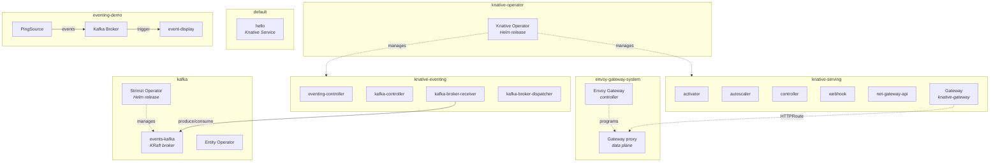
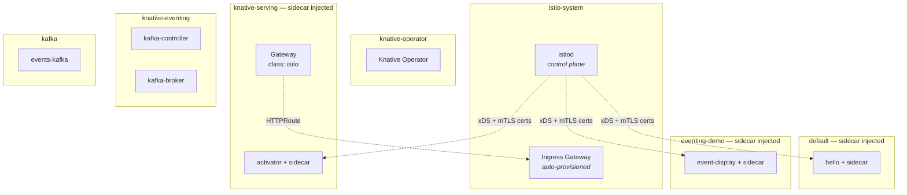

# Implementation Plan

Phased deployment of Knative + Strimzi Kafka + Istio on the playground cluster.

## Table of Contents

- [Overview](#overview)
- [Prerequisites](#prerequisites)
- [Namespace Layout](#namespace-layout)
- [Phase 1 — Gateway API + Knative Serving](#phase-1--gateway-api--knative-serving)
- [Phase 2 — Eventing + Strimzi Kafka](#phase-2--eventing--strimzi-kafka)
- [Phase 3 — Istio Service Mesh](#phase-3--istio-service-mesh)
- [Config.yaml Changes](#configyaml-changes)
- [File Structure](#file-structure)
- [Deploy / Teardown](#deploy--teardown)

---

## Overview

```mermaid
gantt
    title Deployment Phases
    dateFormat X
    axisFormat %s

    section Phase 1
    Envoy Gateway v1.7           :p1a, 0, 1
    Gateway API CRDs             :p1b, 0, 1
    Knative Serving v1.21        :p1c, 1, 2
    net-gateway-api plugin       :p1d, 1, 2
    Hello-world service          :p1e, 2, 3
    Test scale-to-zero           :p1f, 3, 4
    Test traffic splitting       :p1g, 3, 4
    kn CLI + kn func             :p1h, 4, 5

    section Phase 2
    Strimzi Operator 0.50        :p2a, 5, 6
    Kafka Cluster (KRaft)        :p2b, 6, 7
    Knative Eventing core        :p2c, 7, 8
    Kafka Broker + KafkaSource   :p2d, 8, 9
    Test event flows             :p2e, 9, 10

    section Phase 3
    Istio 1.28.3 (Helm)         :p3a, 10, 11
    Swap GatewayClass            :p3b, 11, 12
    Remove Envoy Gateway         :p3c, 11, 12
    Enable mTLS                  :p3d, 12, 13
    Test AuthZ + tracing         :p3e, 13, 14
```



### Install Methods

All components are installed via **Helm chart dependencies** (the "dremio pattern"):

| Component | Chart Source | Chart / Dependency | Version |
|-----------|-------------|-------------------|---------|
| Envoy Gateway | `oci://docker.io/envoyproxy/gateway-helm` | OCI chart (direct) | v1.7.0 |
| Strimzi | `https://strimzi.io/charts/` | `strimzi-kafka-operator` | 0.50.0 |
| Knative | `https://knative.github.io/operator` | `knative-operator` | v1.21.0 |
| Istio | `https://istio-release.storage.googleapis.com/charts` | `base` + `istiod` | 1.28.3 |

Each component's `helm/Chart.yaml` declares dependencies → `helm dependency update` → `helm upgrade --install`.

---

## Prerequisites

| Requirement | Status |
|-------------|--------|
| Minikube running (3 nodes) | Existing |
| Kubernetes v1.35.0 | Existing |
| Ceph/Rook deployed | Existing |
| `rook-ceph-block` StorageClass | Existing |
| Monitoring (Grafana + Prometheus) | Existing |
| `kubectl` >= v1.32 | Verify |
| `helm` v3 | Verify |

### Verify Prerequisites

```bash
# Cluster status
kubectl get nodes

# StorageClass available
kubectl get sc rook-ceph-block

# Helm version
helm version
```

---

## Namespace Layout

### Phase 1-2 (Envoy Gateway + Knative + Strimzi)



### Phase 3 (Istio replaces Envoy Gateway)



### Namespace Summary

| Namespace | Components | Helm Release | Phase |
|-----------|-----------|--------------|-------|
| `envoy-gateway-system` | Envoy Gateway controller + proxies | `eg` | 1-2 |
| `knative-operator` | Knative Operator | `knative-operator` | 1+ |
| `knative-serving` | Activator, autoscaler, controller, webhook, net-gateway-api | Managed by operator | 1+ |
| `knative-eventing` | Eventing controller, Kafka controller, broker receiver/dispatcher | Managed by operator | 2+ |
| `kafka` | Strimzi operator, Kafka broker, Entity operator | `strimzi` | 2+ |
| `istio-system` | istiod, Istio CRDs, ingress gateway | `istio` | 3 |
| `default` | Demo: hello world Knative Service | — | 1+ |
| `eventing-demo` | Demo: Kafka Broker, event-display, PingSource | — | 2+ |

---

## Phase 1 — Gateway API + Knative Serving

**Goal:** Deploy Envoy Gateway + Knative Serving, learn Gateway API primitives, test serverless features.

### Step 1.1 — Install Envoy Gateway

The `build.sh` script handles Helm install + Gateway resource creation:

```bash
./components/events/envoy-gateway/scripts/build.sh
```

**What it does internally:**
1. Creates `envoy-gateway-system` namespace
2. `helm dependency update` + `helm upgrade --install eg` (OCI chart `envoyproxy/gateway-helm` v1.7.0)
3. Waits for controller deployment to be available
4. Applies `templates/custom/gateway.yaml` — creates GatewayClass `eg` + Gateway `knative-gateway`

### Step 1.2 — Install Strimzi Kafka

Kafka must be ready before Knative (Knative Eventing needs a Kafka bootstrap server):

```bash
./components/events/strimzi/scripts/build.sh
```

**What it does internally:**
1. Creates `kafka` namespace
2. `helm dependency update` + `helm upgrade --install strimzi` (strimzi-kafka-operator 0.50.0)
3. Waits for Strimzi operator deployment
4. Applies `manifests/kafka-cluster.yaml` — KafkaNodePool + Kafka CRs (KRaft mode, single broker, Ceph PVC)
5. Waits for Kafka cluster `Ready` condition

### Step 1.3 — Install Knative Serving + Eventing

The Knative build script installs the operator via Helm, then creates KnativeServing and KnativeEventing CRs:

```bash
./components/events/knative/scripts/build.sh
```

**What it does internally:**
1. Pre-flight: verifies GatewayClass `eg` exists + Kafka cluster is running
2. Creates namespaces: `knative-operator`, `knative-serving`, `knative-eventing`
3. `helm dependency update` + `helm upgrade --install knative-operator` (knative-operator v1.21.0)
4. Applies `manifests/knative-serving.yaml` — KnativeServing CR with:
   - Gateway API ingress (net-gateway-api)
   - GatewayClass `eg` (Envoy Gateway)
   - sslip.io magic DNS
5. Waits for KnativeServing `Ready` (1-2 minutes)
6. Applies `manifests/knative-eventing.yaml` + `kafka-broker-config.yaml` — KnativeEventing CR with:
   - Kafka source enabled
   - Kafka as default broker class
7. Waits for KnativeEventing `Ready` (1-2 minutes)

### Step 1.4 — Test Serving

```bash
# Automated: deploys hello world, verifies ksvc ready, cleans up
./components/events/knative/scripts/test/test-serving.sh

# Or manually:
kubectl apply -f components/events/knative/scripts/test/demo-hello.yaml
kubectl wait --timeout=60s -n default ksvc hello --for=condition=Ready
kubectl get ksvc hello -o jsonpath='{.status.url}'
```

### Step 1.5 — Test Features

```bash
# Test scale-to-zero
# Wait 60s with no traffic, then verify pods scaled down
kubectl get pods -n default -l serving.knative.dev/service=hello
# Should show: No resources found

# Send request (triggers scale-from-zero)
# Port-forward the gateway first
export ENVOY_SERVICE=$(kubectl get svc -n envoy-gateway-system \
  --selector=gateway.envoyproxy.io/owning-gateway-namespace=knative-serving \
  -o jsonpath='{.items[0].metadata.name}')
kubectl -n envoy-gateway-system port-forward service/${ENVOY_SERVICE} 8080:80 &

curl -H "Host: hello.default.sslip.io" http://localhost:8080

# Test traffic splitting
# Deploy v2
kubectl apply -f - <<EOF
apiVersion: serving.knative.dev/v1
kind: Service
metadata:
  name: hello
  namespace: default
spec:
  template:
    metadata:
      name: hello-v2
    spec:
      containers:
        - image: ghcr.io/knative/helloworld-go:latest
          ports:
            - containerPort: 8080
          env:
            - name: TARGET
              value: "Knative v2"
  traffic:
    - revisionName: hello-00001
      percent: 80
    - revisionName: hello-v2
      percent: 20
EOF

# Test multiple times to see traffic distribution
for i in $(seq 1 10); do
  curl -s -H "Host: hello.default.sslip.io" http://localhost:8080
done
```

### Step 1.6 — Install kn CLI and Functions (Optional)

```bash
# Install kn CLI
# Check https://knative.dev/docs/client/ for latest binary

# Install func plugin
# Check https://knative.dev/docs/functions/ for latest binary

# Scaffold a function
kn func create -l python my-function
cd my-function

# Build and deploy
kn func build
kn func deploy --namespace default

# Invoke
kn func invoke
```

### Phase 1 Verification Checklist

- [ ] Envoy Gateway controller running in `envoy-gateway-system`
- [ ] GatewayClass `eg` exists
- [ ] Gateway `knative-gateway` has `Programmed` condition
- [ ] Knative Operator running in `knative-operator`
- [ ] Knative Serving pods all running in `knative-serving`
- [ ] Knative Eventing pods all running in `knative-eventing`
- [ ] Kafka Broker + KafkaSource controllers running
- [ ] HTTPRoutes created automatically for Knative services
- [ ] Hello world service responds
- [ ] Scale-to-zero works (pods removed after 60s idle)
- [ ] Scale-from-zero works (cold start on next request)
- [ ] Traffic splitting between revisions works

---

## Phase 2 — Eventing Demos

**Goal:** Test event-driven architecture with Kafka Broker, PingSource, and KafkaSource.

> Note: Strimzi, Knative Eventing, and Kafka Broker were already deployed in Phase 1.
> Phase 2 focuses on deploying and testing the eventing demos.

### Step 2.1 — Test Eventing

```bash
# Automated: deploys Broker + PingSource, verifies event flow, cleans up
./components/events/knative/scripts/test/test-eventing.sh

# Or manually:
kubectl apply -f components/events/knative/scripts/test/demo-eventing.yaml
```

This creates in the `eventing-demo` namespace:
- Kafka Broker (`default`) backed by `kafka-broker-config`
- `event-display` Knative Service (consumer)
- Trigger routing all events to `event-display`
- PingSource generating test events every minute

```bash
# Watch for events being received
kubectl logs -n eventing-demo -l serving.knative.dev/service=event-display -c user-container -f
```

### Step 2.2 — Test KafkaSource

```yaml
# kafka-source-demo.yaml

# Create a topic
apiVersion: kafka.strimzi.io/v1beta2
kind: KafkaTopic
metadata:
  name: demo-topic
  namespace: kafka
  labels:
    strimzi.io/cluster: events-kafka
spec:
  partitions: 3
  replicas: 1
---
# KafkaSource consuming from the topic
apiVersion: sources.knative.dev/v1
kind: KafkaSource
metadata:
  name: demo-source
  namespace: eventing-demo
spec:
  consumerGroup: demo-group
  bootstrapServers:
    - events-kafka-kafka-bootstrap.kafka.svc.cluster.local:9092
  topics:
    - demo-topic
  sink:
    ref:
      apiVersion: serving.knative.dev/v1
      kind: Service
      name: event-display
```

```bash
kubectl apply -f kafka-source-demo.yaml

# Produce a test message to Kafka
kubectl -n kafka run kafka-producer -ti --rm \
  --image=quay.io/strimzi/kafka:0.50.0-kafka-4.1.1 \
  --restart=Never -- bin/kafka-console-producer.sh \
  --bootstrap-server events-kafka-kafka-bootstrap:9092 \
  --topic demo-topic

# Type messages and watch them appear in event-display logs
```

### Phase 2 Verification Checklist

- [ ] Strimzi operator running in `kafka`
- [ ] Kafka broker pod running with PVC bound to `rook-ceph-block`
- [ ] Knative Eventing pods all running in `knative-eventing`
- [ ] Kafka Broker created in `eventing-demo`
- [ ] PingSource generating events every minute
- [ ] Events visible in event-display logs
- [ ] KafkaSource consuming from `demo-topic`
- [ ] Manual Kafka messages delivered to event-display

---

## Phase 3 — Istio Service Mesh

**Goal:** Replace Envoy Gateway with Istio, add mTLS, AuthorizationPolicy, and distributed tracing.

### Step 3.1 — Install Istio + Swap Gateway

Update `config.yaml`:
```yaml
components:
  istio:
    enabled: true
  envoy_gateway:
    enabled: false
```

Then run:

```bash
./components/events/istio/scripts/build.sh
```

**What it does internally:**
1. Creates `istio-system` namespace
2. `helm dependency update` + `helm upgrade --install istio` (base 1.28.3 + istiod 1.28.3)
3. Waits for istiod deployment to be available
4. Swaps Knative gateway config: patches `config-gateway` configmap in `knative-serving` to use GatewayClass `istio`
5. Labels namespaces for sidecar injection (`default`, `eventing-demo`)
6. Restarts deployments to pick up Envoy sidecars
7. Applies mesh policies from `manifests/`:
   - `peer-authentication.yaml` — mTLS STRICT mesh-wide
   - `authz-knative.yaml` — allows Knative system + Istio ingress pods

### Step 3.2 — Remove Envoy Gateway

```bash
./components/events/envoy-gateway/scripts/destroy.sh
```

### Step 3.3 — Test Istio Features

```bash
# Verify sidecar injection
kubectl get pods -n default -o jsonpath='{.items[*].spec.containers[*].name}' | tr ' ' '\n' | sort -u
# Should include: istio-proxy

# Verify mTLS
kubectl get peerauthentication -A
# Should show: STRICT in istio-system

# Test Knative still works through Istio
kubectl get ksvc hello -o jsonpath='{.status.url}'
curl -H "Host: hello.default.sslip.io" http://localhost:8080
```

### Step 3.4 — Observability (Optional)

```bash
# Install Kiali dashboard
kubectl apply -f https://raw.githubusercontent.com/istio/istio/release-1.28/samples/addons/kiali.yaml

# Install Jaeger for distributed tracing
kubectl apply -f https://raw.githubusercontent.com/istio/istio/release-1.28/samples/addons/jaeger.yaml

# Access dashboards (port-forward)
kubectl -n istio-system port-forward svc/kiali 20001:20001 &
kubectl -n istio-system port-forward svc/tracing 16686:16686 &
```

### Step 3.5 — Test Fault Injection

```bash
kubectl apply -f - <<EOF
apiVersion: networking.istio.io/v1
kind: VirtualService
metadata:
  name: hello-fault
  namespace: default
spec:
  hosts:
    - hello.default.svc.cluster.local
  http:
    - fault:
        delay:
          percentage:
            value: 50
          fixedDelay: 3s
      route:
        - destination:
            host: hello.default.svc.cluster.local
EOF

# Observe latency increase in Kiali/Jaeger
```

### Phase 3 Verification Checklist

- [ ] istiod running in `istio-system`
- [ ] GatewayClass swapped to `istio`
- [ ] Envoy Gateway fully removed
- [ ] Sidecar proxies injected in application pods
- [ ] mTLS active mesh-wide (STRICT mode)
- [ ] Knative scale-from-zero still works with AuthorizationPolicy
- [ ] Kiali shows service mesh topology
- [ ] Jaeger shows distributed traces
- [ ] Fault injection working

---

## Config.yaml Changes

Current `config.yaml` component sections:

```yaml
components:
  strimzi:
    enabled: true
    namespace: "kafka"
    chart_repo: "https://strimzi.io/charts/"
    chart_name: "strimzi-kafka-operator"
    chart_version: "0.50.0"
    kafka_version: "4.1.1"
    kafka_cluster_name: "events-kafka"

  knative:
    enabled: true
    namespace: "knative-operator"
    serving_namespace: "knative-serving"
    eventing_namespace: "knative-eventing"
    chart_repo: "https://knative.github.io/operator"
    chart_name: "knative-operator"
    chart_version: "v1.21.0"
    version: "v1.21.0"

  envoy_gateway:
    enabled: true              # Phase 1-2 (disable when switching to Istio)
    namespace: "envoy-gateway-system"
    chart_version: "v1.7.0"

  istio:
    enabled: false             # Phase 3 (enable when ready, disable envoy_gateway)
    namespace: "istio-system"
    chart_repo: "https://istio-release.storage.googleapis.com/charts"
    chart_version: "1.28.3"
```

---

## File Structure

Each sub-component follows the dremio pattern (`helm/`, `scripts/`, `docs/`, `deployment/`):

```
components/events/
├── README.md                          # Main analysis + architecture diagrams
├── docs/
│   ├── IMPLEMENTATION-PLAN.md         # This file
│   ├── NETWORKING.md                  # Gateway API, Envoy Gateway, Istio analysis
│   └── KAFKA.md                       # Strimzi + Knative Eventing analysis
│
├── envoy-gateway/                     # Phase 1-2: Gateway API controller
│   ├── README.md
│   ├── deployment/
│   ├── docs/
│   ├── helm/
│   │   ├── Chart.yaml                 # OCI chart dependency (envoyproxy/gateway-helm)
│   │   ├── values.yaml
│   │   ├── values-overrides.yaml
│   │   └── templates/custom/
│   │       └── gateway.yaml           # Gateway resource for Knative
│   └── scripts/
│       ├── build.sh                   # Deploy controller + Gateway
│       ├── destroy.sh
│       ├── regenerate-rendered.sh
│       └── test/
│           └── test-gateway.sh        # Test: GatewayClass, Gateway, CRDs
│
├── strimzi/                           # Kafka operator + cluster
│   ├── README.md
│   ├── deployment/
│   ├── docs/
│   ├── helm/
│   │   ├── Chart.yaml                 # Wrapper (depends on strimzi-kafka-operator)
│   │   ├── values.yaml
│   │   └── values-overrides.yaml
│   ├── manifests/
│   │   └── kafka-cluster.yaml         # Kafka + KafkaNodePool CRs (applied after operator)
│   └── scripts/
│       ├── build.sh                   # Deploy operator + cluster
│       ├── destroy.sh
│       ├── regenerate-rendered.sh
│       └── test/
│           └── test-kafka.sh          # Test: CRDs, cluster status, produce/consume
│
├── knative/                           # Serving + Eventing
│   ├── README.md
│   ├── deployment/
│   ├── docs/
│   ├── helm/
│   │   ├── Chart.yaml                 # Wrapper (depends on knative-operator)
│   │   ├── values.yaml                # Operator chart values
│   │   └── values-overrides.yaml
│   ├── manifests/
│   │   ├── knative-serving.yaml       # KnativeServing CR (applied after operator)
│   │   ├── knative-eventing.yaml      # KnativeEventing CR
│   │   └── kafka-broker-config.yaml   # Kafka Broker defaults
│   └── scripts/
│       ├── build.sh                   # Install operator + apply Serving/Eventing CRs
│       ├── destroy.sh
│       ├── regenerate-rendered.sh
│       └── test/
│           ├── test-serving.sh        # Test: deploy hello world, verify, clean up
│           ├── test-eventing.sh       # Test: Kafka Broker + PingSource event flow
│           ├── demo-hello.yaml        # Test manifest: hello world ksvc
│           └── demo-eventing.yaml     # Test manifest: Broker + Trigger + PingSource
│
└── istio/                             # Phase 3: Service mesh
    ├── README.md
    ├── deployment/
    ├── docs/
    ├── helm/
    │   ├── Chart.yaml                 # Wrapper (depends on base + istiod)
    │   ├── values.yaml                # base + istiod chart values
    │   └── values-overrides.yaml
    ├── manifests/
    │   ├── peer-authentication.yaml   # mTLS STRICT (applied after istiod)
    │   └── authz-knative.yaml         # Allow Knative system pods
    └── scripts/
        ├── build.sh                   # Install Istio (Helm) + swap gateway + apply policies
        ├── destroy.sh
        ├── regenerate-rendered.sh
        └── test/
            └── test-mesh.sh           # Test: CRDs, mTLS, sidecar injection, policies
```

---

## Deploy / Teardown

### Deploy

Each component has its own `build.sh` — run in order:

```bash
# Phase 1-2: Gateway API + Kafka + Knative
./components/events/envoy-gateway/scripts/build.sh
./components/events/strimzi/scripts/build.sh
./components/events/knative/scripts/build.sh

# Run tests
./components/events/envoy-gateway/scripts/test/test-gateway.sh
./components/events/strimzi/scripts/test/test-kafka.sh
./components/events/knative/scripts/test/test-serving.sh
./components/events/knative/scripts/test/test-eventing.sh

# Phase 3: Swap to Istio (edit config.yaml: istio.enabled=true, envoy_gateway.enabled=false)
./components/events/istio/scripts/build.sh
./components/events/envoy-gateway/scripts/destroy.sh
```

### Teardown

Reverse order — each component has its own `destroy.sh`:

```bash
# Phase 3 (if deployed)
./components/events/istio/scripts/destroy.sh

# Phase 1-2
./components/events/knative/scripts/destroy.sh
./components/events/strimzi/scripts/destroy.sh
./components/events/envoy-gateway/scripts/destroy.sh
```
