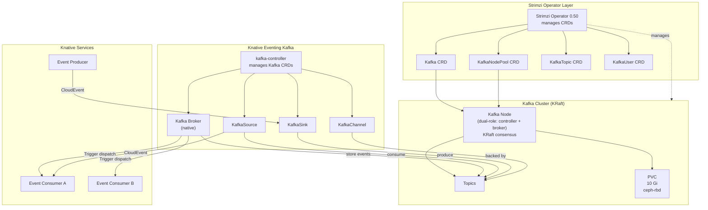
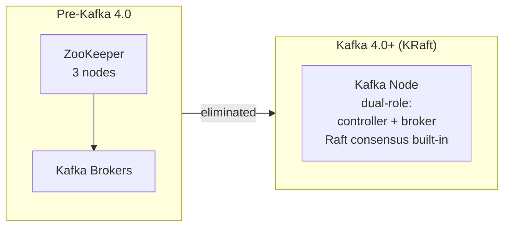
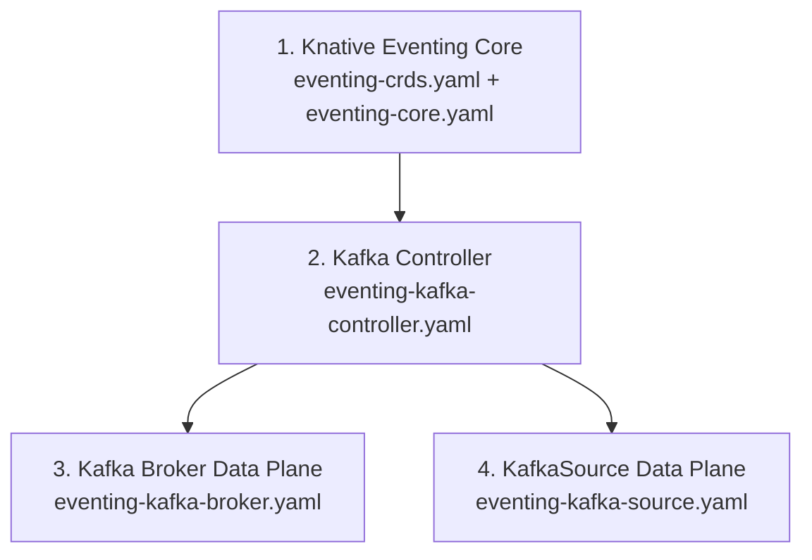
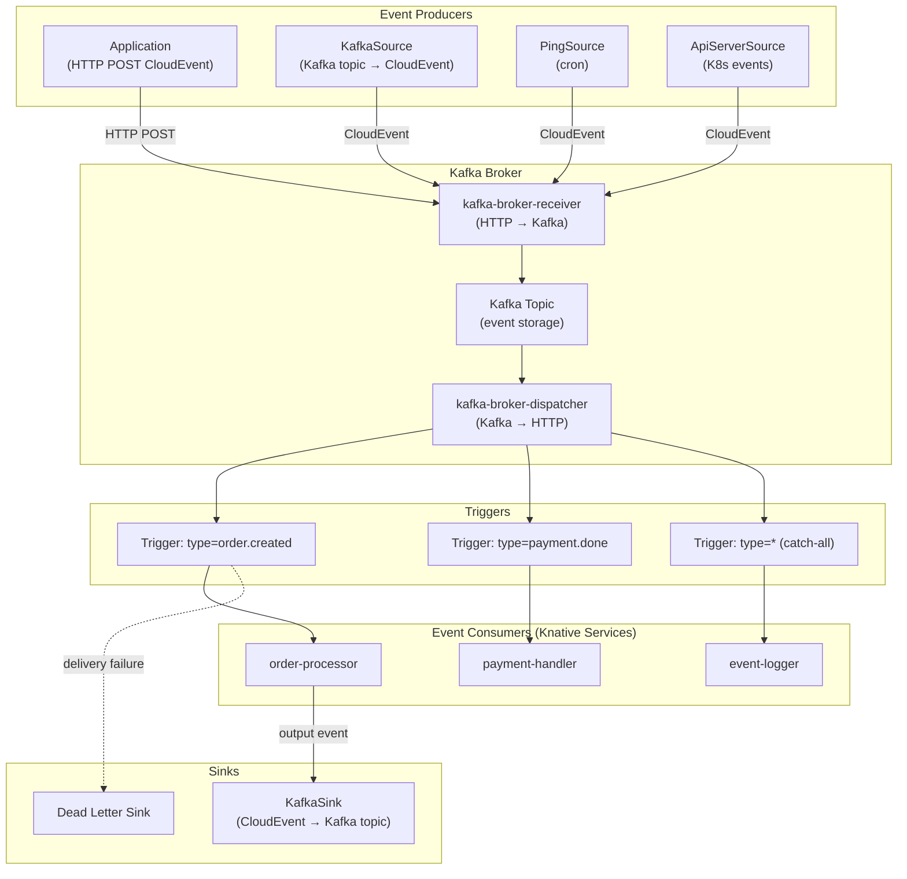

# Strimzi Kafka + Knative Eventing Integration

Detailed analysis of Strimzi-managed Kafka as the event backbone for Knative Eventing.

## Table of Contents

- [Overview](#overview)
- [Strimzi Operator](#strimzi-operator)
- [Kafka Cluster Configuration](#kafka-cluster-configuration)
- [Knative Eventing Kafka Components](#knative-eventing-kafka-components)
- [Storage — Ceph RBD Integration](#storage--ceph-rbd-integration)
- [Resource Requirements](#resource-requirements)
- [Security](#security)
- [Observability](#observability)

---

## Overview



### Why Strimzi + Native Kafka Broker

| Alternative | How it works | Why not |
|------------|-------------|---------|
| InMemoryChannel Broker | Events stored in memory, lost on restart | Dev only, no persistence |
| MTChannelBasedBroker + KafkaChannel | Broker → Channel → Kafka (extra hop) | Unnecessary indirection |
| **Native Kafka Broker** | Broker writes/reads directly to/from Kafka topics | Fewest hops, native Kafka features |

---

## Strimzi Operator

### Version

| Component | Version |
|-----------|---------|
| Strimzi Operator | **0.50.0** |
| Apache Kafka | **4.1.1** (default) |
| KRaft mode | Only (ZooKeeper removed in Strimzi 0.46) |
| Kafka Bridge | 0.33.1 |
| K8s requirement | 1.27+ |

### CRDs Provided

| CRD | Purpose |
|-----|---------|
| `Kafka` | Defines the Kafka cluster (listeners, config, entity operator) |
| `KafkaNodePool` | Defines node groups (roles, replicas, storage, resources) |
| `KafkaTopic` | Declarative topic management (partitions, replicas, config) |
| `KafkaUser` | User management with ACLs, quotas, SCRAM/TLS auth |
| `KafkaConnect` | Kafka Connect cluster management |
| `KafkaMirrorMaker2` | Cross-cluster replication |
| `KafkaBridge` | HTTP bridge for Kafka |

### Install via Helm

```bash
helm repo add strimzi https://strimzi.io/charts/
helm install strimzi-kafka-operator strimzi/strimzi-kafka-operator \
  --namespace kafka --create-namespace \
  --version 0.50.0
```

---

## Kafka Cluster Configuration

### Minimal Development Cluster (1 Dual-Role Node)

```yaml
apiVersion: kafka.strimzi.io/v1beta2
kind: KafkaNodePool
metadata:
  name: dual-role
  namespace: kafka
  labels:
    strimzi.io/cluster: events-kafka
spec:
  replicas: 1
  roles:
    - controller
    - broker
  storage:
    type: jbod
    volumes:
      - id: 0
        type: persistent-claim
        size: 10Gi
        class: rook-ceph-block    # Ceph RBD StorageClass
        deleteClaim: false
  resources:
    requests:
      memory: 1Gi
      cpu: 500m
    limits:
      memory: 2Gi
      cpu: 1000m
---
apiVersion: kafka.strimzi.io/v1beta2
kind: Kafka
metadata:
  name: events-kafka
  namespace: kafka
  annotations:
    strimzi.io/node-pools: enabled
    strimzi.io/kraft: enabled
spec:
  kafka:
    version: 4.1.1
    metadataVersion: "4.1-IV1"
    listeners:
      - name: plain
        port: 9092
        type: internal
        tls: false
      - name: tls
        port: 9093
        type: internal
        tls: true
    config:
      # Single-node overrides (no replication)
      offsets.topic.replication.factor: 1
      transaction.state.log.replication.factor: 1
      transaction.state.log.min.isr: 1
      default.replication.factor: 1
      min.insync.replicas: 1
      # Performance
      num.partitions: 3
      log.retention.hours: 168         # 7 days
      log.segment.bytes: 1073741824    # 1 Gi
  entityOperator:
    topicOperator: {}
    userOperator: {}
```

### Bootstrap Address

Once deployed, Knative components connect via:
```
events-kafka-kafka-bootstrap.kafka.svc.cluster.local:9092
```

### KRaft Mode — No ZooKeeper



KRaft removes the ZooKeeper dependency entirely — fewer pods, simpler operations, faster startup.

---

## Knative Eventing Kafka Components

### Installation Order



### Install Commands

```bash
# 1. Eventing core
kubectl apply -f https://github.com/knative/eventing/releases/download/knative-v1.21.0/eventing-crds.yaml
kubectl apply -f https://github.com/knative/eventing/releases/download/knative-v1.21.0/eventing-core.yaml

# 2. Kafka controller (shared by all Kafka components)
kubectl apply -f https://github.com/knative-extensions/eventing-kafka-broker/releases/download/knative-v1.21.0/eventing-kafka-controller.yaml

# 3. Kafka Broker data plane
kubectl apply -f https://github.com/knative-extensions/eventing-kafka-broker/releases/download/knative-v1.21.0/eventing-kafka-broker.yaml

# 4. KafkaSource data plane
kubectl apply -f https://github.com/knative-extensions/eventing-kafka-broker/releases/download/knative-v1.21.0/eventing-kafka-source.yaml
```

### Pods Created (in `knative-eventing` namespace)

| Pod | Role |
|-----|------|
| kafka-controller | Reconciles Kafka Broker, KafkaSource, KafkaSink, KafkaChannel CRDs |
| kafka-broker-receiver | Ingests CloudEvents via HTTP, writes to Kafka topics |
| kafka-broker-dispatcher | Reads from Kafka topics, delivers to Trigger subscribers |
| kafka-source-dispatcher | Runs KafkaSource consumer groups |

---

### Kafka Broker

The **native** Kafka Broker stores events directly in Kafka topics (not via channels).

```yaml
apiVersion: eventing.knative.dev/v1
kind: Broker
metadata:
  name: default
  namespace: demo
  annotations:
    eventing.knative.dev/broker.class: Kafka
spec:
  config:
    apiVersion: v1
    kind: ConfigMap
    name: kafka-broker-config
    namespace: knative-eventing
```

ConfigMap for broker defaults:

```yaml
apiVersion: v1
kind: ConfigMap
metadata:
  name: kafka-broker-config
  namespace: knative-eventing
data:
  default.topic.partitions: "3"
  default.topic.replication.factor: "1"
  bootstrap.servers: "events-kafka-kafka-bootstrap.kafka.svc.cluster.local:9092"
```

### Triggers

Filter CloudEvents by attributes and dispatch to sinks:

```yaml
apiVersion: eventing.knative.dev/v1
kind: Trigger
metadata:
  name: order-processor
  namespace: demo
spec:
  broker: default
  filter:
    attributes:
      type: com.example.order.created
      source: /orders/api
  subscriber:
    ref:
      apiVersion: serving.knative.dev/v1
      kind: Service
      name: order-processor
```

### KafkaSource

Consume messages from existing Kafka topics, deliver as CloudEvents:

```yaml
apiVersion: sources.knative.dev/v1
kind: KafkaSource
metadata:
  name: kafka-source
  namespace: demo
spec:
  consumerGroup: knative-demo
  bootstrapServers:
    - events-kafka-kafka-bootstrap.kafka.svc.cluster.local:9092
  topics:
    - my-topic
  sink:
    ref:
      apiVersion: serving.knative.dev/v1
      kind: Service
      name: event-display
```

Key features:
- **Ordering guarantee** — waits for successful sink response before next message (per partition)
- **Scaling** — `consumers` field controls replicas (match to partition count)
- **Dead letter** — configurable dead-letter sink for failed deliveries

### KafkaSink

Produce CloudEvents to Kafka topics:

```yaml
apiVersion: eventing.knative.dev/v1alpha1
kind: KafkaSink
metadata:
  name: my-sink
  namespace: demo
spec:
  topic: output-topic
  bootstrapServers:
    - events-kafka-kafka-bootstrap.kafka.svc.cluster.local:9092
```

Content modes: Binary (default — data in body, metadata in headers) or Structured (entire CloudEvent in body).

> **Note:** KafkaSink is `v1alpha1` — API may change in future releases.

### KafkaChannel

Use Kafka as the backing store for Knative Channels (pipeline pattern):

```yaml
apiVersion: v1
kind: ConfigMap
metadata:
  name: kafka-channel
  namespace: knative-eventing
data:
  channel-template-spec: |
    apiVersion: messaging.knative.dev/v1beta1
    kind: KafkaChannel
    spec:
      numPartitions: 3
      replicationFactor: 1
```

### Component Relationship Map



---

## Storage — Ceph RBD Integration

### Kafka Storage Requirements

| Storage Type | Survives Pod Restart? | Use Case |
|-------------|----------------------|----------|
| `persistent-claim` (PVC) | Yes | Required for any serious use |
| `ephemeral` (emptyDir) | No | Throwaway testing only |

Kafka needs persistent storage for:
- Partition data (log segments)
- KRaft metadata (replaces ZooKeeper state)
- Consumer offsets

### Ceph RBD Compatibility

Strimzi uses standard Kubernetes PVCs — works with any StorageClass providing **ReadWriteOnce (RWO)** volumes.

Ceph RBD provides RWO block devices natively. Each Kafka broker gets its own PVC — no shared storage needed.

```yaml
# In KafkaNodePool spec
storage:
  type: jbod
  volumes:
    - id: 0
      type: persistent-claim
      size: 10Gi
      class: rook-ceph-block    # Your existing Rook-Ceph StorageClass
      deleteClaim: false        # Keep PVC on Kafka deletion
```

### Existing StorageClass

Your Rook-Ceph deployment already provides the `rook-ceph-block` StorageClass:

```yaml
apiVersion: storage.k8s.io/v1
kind: StorageClass
metadata:
  name: rook-ceph-block
provisioner: rook-ceph.rbd.csi.ceph.io
parameters:
  clusterID: rook-ceph
  pool: replicapool
  imageFormat: "2"
  imageFeatures: layering
  csi.storage.k8s.io/provisioner-secret-name: rook-csi-rbd-provisioner
  csi.storage.k8s.io/provisioner-secret-namespace: rook-ceph
  csi.storage.k8s.io/node-stage-secret-name: rook-csi-rbd-node
  csi.storage.k8s.io/node-stage-secret-namespace: rook-ceph
reclaimPolicy: Delete
allowVolumeExpansion: true
```

**Sizing for dev:** 10 Gi per broker is sufficient. Production typically uses 100 Gi+.

---

## Resource Requirements

### Strimzi Components

| Component | CPU Request | Memory Request | Memory Limit | Count |
|-----------|------------|----------------|-------------|-------|
| Strimzi Operator | 200m | 384 Mi | 384 Mi | 1 |
| Kafka (dual-role node) | 500m | 1 Gi | 2 Gi | 1 (dev) |
| Entity Operator | 100m | 256 Mi | 512 Mi | 1 |
| **Strimzi Total** | **800m** | **1.6 Gi** | **2.9 Gi** | |

### Knative Eventing Kafka Components

| Component | CPU Request | Memory Request | Count |
|-----------|------------|----------------|-------|
| kafka-controller | ~100m | ~128 Mi | 1 |
| kafka-broker-receiver | ~100m | ~128 Mi | 1 |
| kafka-broker-dispatcher | ~100m | ~128 Mi | 1 |
| kafka-source-dispatcher | ~100m | ~128 Mi | 1 |
| **Eventing Kafka Total** | **~400m** | **~512 Mi** | |

### Combined Total

| | CPU Request | Memory Request |
|---|------------|----------------|
| Strimzi + Kafka | 800m | 1.6 Gi |
| Knative Eventing Kafka | 400m | 512 Mi |
| **Combined** | **1.2 CPU** | **~2.1 Gi** |

---

## Security

### Kafka Authentication Options

Strimzi supports multiple auth mechanisms per listener:

| Mechanism | How it works | Complexity |
|-----------|-------------|------------|
| None (plain) | No auth, internal only | Simplest (dev) |
| TLS client certs | Mutual TLS with per-user certificates | Medium |
| SCRAM-SHA-512 | Username/password over SASL | Medium |
| OAuth 2.0 | Token-based via external IdP | High |

For dev playground, start with **plain listener (no auth)** on port 9092. Add TLS listener on 9093 when testing security.

### Knative ↔ Kafka Auth

KafkaSource, KafkaSink, and Kafka Broker support TLS and SASL credentials via Kubernetes secrets:

```yaml
# In KafkaSource spec
auth:
  secret:
    ref:
      name: kafka-credentials
---
apiVersion: v1
kind: Secret
metadata:
  name: kafka-credentials
type: Opaque
stringData:
  protocol: SASL_SSL
  sasl.mechanism: SCRAM-SHA-512
  user: knative-user
  password: <password>
  ca.crt: <CA certificate>
```

---

## Observability

### Kafka Metrics

Strimzi exposes JMX metrics via Prometheus:

```yaml
# In Kafka spec
kafka:
  metricsConfig:
    type: jmxPrometheusExporter
    valueFrom:
      configMapKeyRef:
        name: kafka-metrics
        key: kafka-metrics-config.yml
```

Key metrics:
- `kafka_server_brokertopicmetrics_messagesin_total` — message throughput
- `kafka_server_replicamanager_underreplicatedpartitions` — replication health
- `kafka_controller_kafkacontroller_activecontrollercount` — controller election
- `kafka_consumer_fetch_manager_records_consumed_rate` — consumer lag

### Knative Eventing Metrics

Knative Eventing exports metrics to Prometheus:
- Event dispatch latency
- Event delivery success/failure rates
- Trigger processing time
- Broker queue depth

Both integrate with the existing monitoring stack (Grafana + Prometheus).
