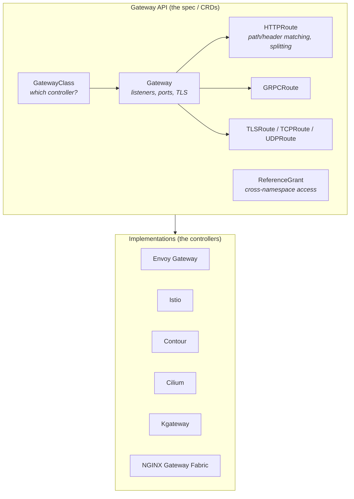
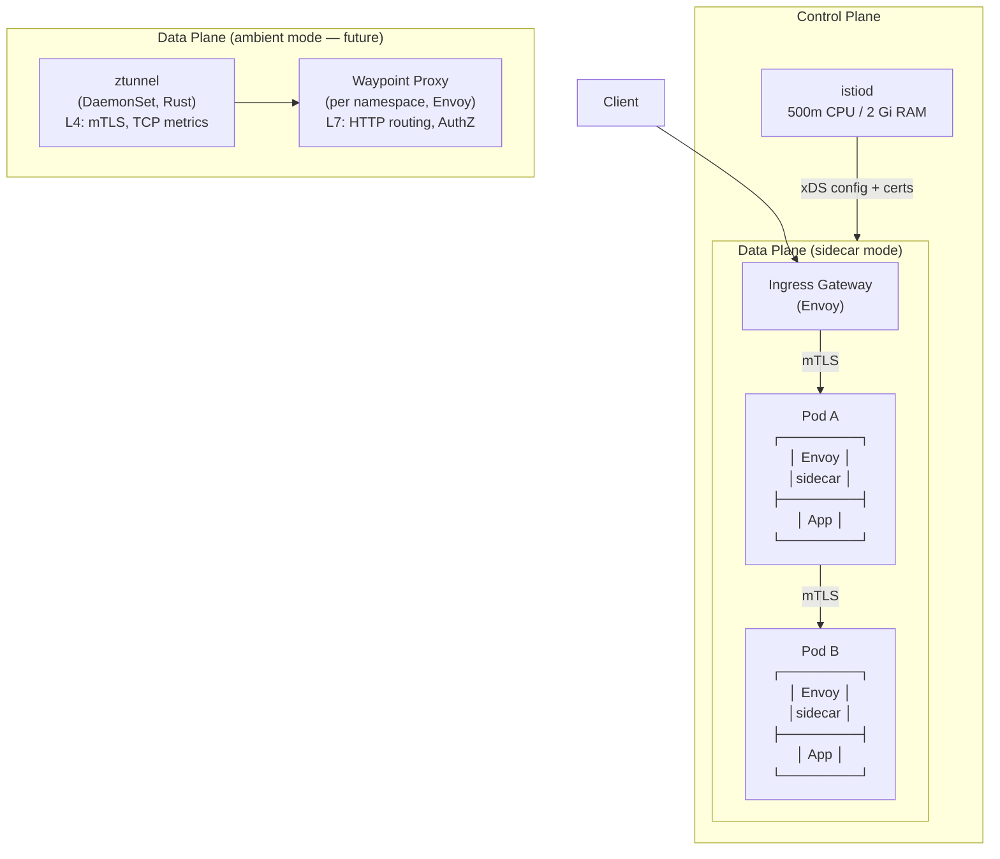
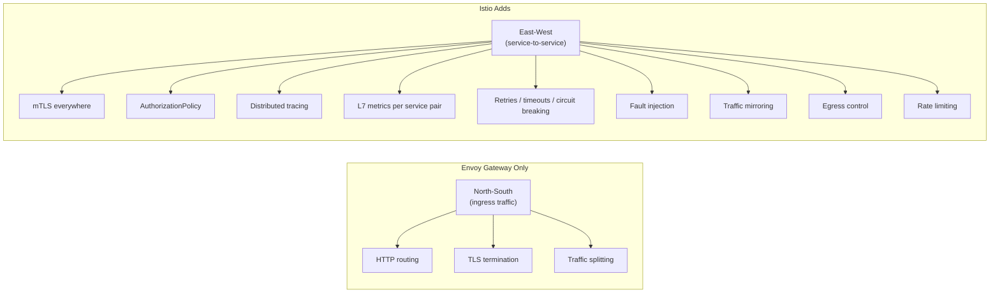
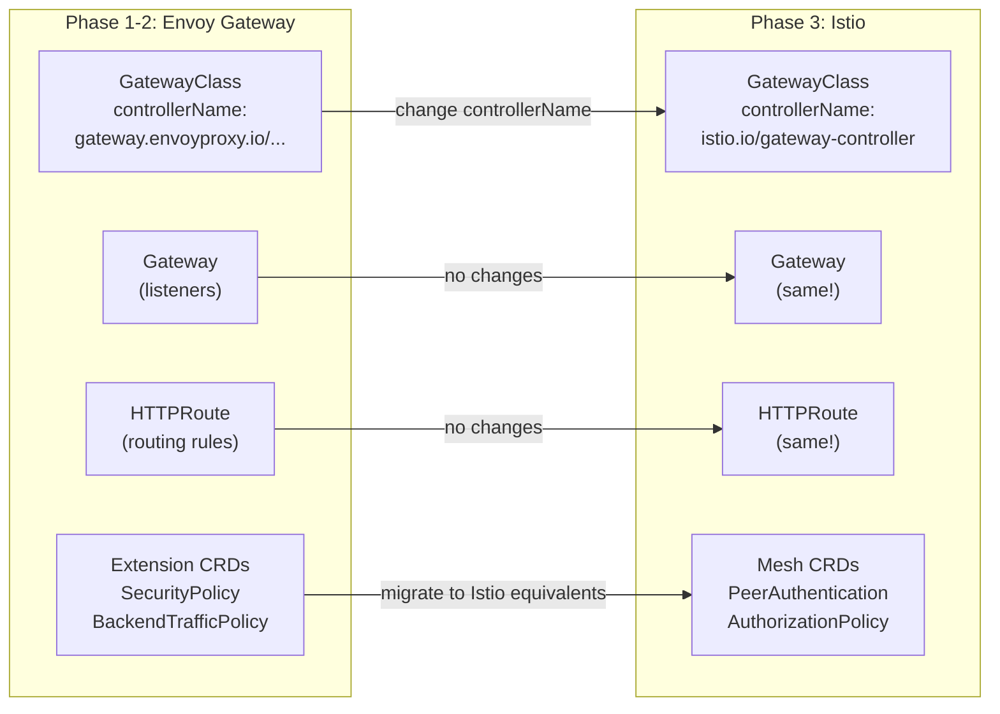

# Networking Layer Analysis

Gateway API, Envoy Gateway, and Istio — options, trade-offs, and migration path.

## Table of Contents

- [Gateway API Overview](#gateway-api-overview)
- [Gateway API Implementations](#gateway-api-implementations)
- [Envoy Gateway (Phase 1-2)](#envoy-gateway-phase-1-2)
- [Istio (Phase 3 Target)](#istio-phase-3-target)
- [Kourier — Why Not](#kourier--why-not)
- [Migration Path](#migration-path)
- [Coexistence](#coexistence)

---

## Gateway API Overview

Gateway API is the **Kubernetes standard** for traffic routing (successor to Ingress). It defines CRDs — you pick a **controller** (the data plane) that implements them.

**Status:** GA since v1.0 (Oct 2023), currently at **v1.4** (Nov 2025).



### Core Resources

| Resource | What you define | Example |
|----------|----------------|---------|
| **GatewayClass** | Which controller handles this class | `controllerName: gateway.envoyproxy.io/gatewayclass-controller` |
| **Gateway** | Entry point — listeners, ports, protocols, TLS | Port 80/HTTP, port 443/HTTPS with cert |
| **HTTPRoute** | Routing rules — path, header, query matching | `/api/*` → service-a, `/web/*` → service-b |
| **GRPCRoute** | gRPC routing by service/method name | `mypackage.MyService/MyMethod` → backend |
| **TLSRoute** | TLS passthrough by SNI | `api.example.com` → tls-backend |
| **TCPRoute** | Raw TCP routing | Port 5432 → postgres-service |
| **ReferenceGrant** | Allow cross-namespace references | HTTPRoute in ns-a can reference Service in ns-b |

---

## Gateway API Implementations

Realistic options for a minikube playground:

| Controller | Data Plane | Footprint | Mesh? | Knative Tested? | Notes |
|-----------|------------|-----------|-------|-----------------|-------|
| **Envoy Gateway v1.7** | Envoy | Light (~250m / 900 Mi) | No | Yes | CNCF, purpose-built for Gateway API |
| **Istio 1.28** | Envoy | Heavy (~2.6 CPU / 3.2 Gi) | Full mTLS | Yes | Full service mesh + Gateway API |
| **Contour** | Envoy | Medium | No | Yes | Mature, but adds another project |
| **Cilium** | eBPF + Envoy | Medium-Heavy | Optional | Not officially | Replaces kube-proxy, big commitment |
| **Kgateway** (Solo) | Envoy | Light | No | Limited | GA v2.0, less Knative testing |
| **NGINX Gateway Fabric** | NGINX | Light | No | No | No Knative testing |

**Selected path:** Envoy Gateway → Istio (both use Envoy, Gateway API CRDs carry over).

---

## Envoy Gateway (Phase 1-2)

Purpose-built Gateway API implementation. Lightest path to learn Gateway API concepts.

### Version & Compatibility

| EG Version | Envoy Proxy | Gateway API | K8s Range |
|------------|-------------|-------------|-----------|
| **v1.7** (Feb 2026) | v1.37.0 | v1.4.1 | 1.32 - 1.35 |

### Install (3 commands)

```bash
# 1. Install via Helm
helm install eg oci://docker.io/envoyproxy/gateway-helm \
  --version v1.7.0 \
  -n envoy-gateway-system --create-namespace

# 2. Wait for controller
kubectl wait --timeout=5m -n envoy-gateway-system \
  deployment/envoy-gateway --for=condition=Available

# 3. Deploy quickstart (GatewayClass + Gateway + HTTPRoute + sample app)
kubectl apply -f https://github.com/envoyproxy/gateway/releases/download/v1.7.0/quickstart.yaml
```

### What You Deploy (and Learn)

```yaml
# 1. GatewayClass — tells K8s which controller handles this
apiVersion: gateway.networking.k8s.io/v1
kind: GatewayClass
metadata:
  name: eg
spec:
  controllerName: gateway.envoyproxy.io/gatewayclass-controller

---
# 2. Gateway — defines entry point (listeners)
apiVersion: gateway.networking.k8s.io/v1
kind: Gateway
metadata:
  name: eg
spec:
  gatewayClassName: eg
  listeners:
    - name: http
      protocol: HTTP
      port: 80

---
# 3. HTTPRoute — routing rules
apiVersion: gateway.networking.k8s.io/v1
kind: HTTPRoute
metadata:
  name: backend
spec:
  parentRefs:
    - name: eg
  hostnames:
    - "www.example.com"
  rules:
    - backendRefs:
        - name: backend
          port: 3000
```

Every concept here transfers directly to any Gateway API implementation.

### Supported Route Types

| Resource | Status | Description |
|----------|--------|-------------|
| HTTPRoute | Stable | Full HTTP routing, traffic splitting, redirects, rewrites |
| GRPCRoute | Stable | gRPC by service/method name |
| TLSRoute | Stable | TLS passthrough by SNI |
| TCPRoute | Stable | Raw TCP routing |
| UDPRoute | Stable | Raw UDP routing |

### Extension CRDs (Envoy Gateway-specific)

These do NOT carry over to Istio — they are Envoy Gateway extensions:

| CRD | What it does |
|-----|-------------|
| EnvoyProxy | Customize data plane (resources, bootstrap config) |
| ClientTrafficPolicy | Client-side settings (timeouts, keep-alive) |
| BackendTrafficPolicy | Backend settings (load balancing, circuit breaking, retries) |
| SecurityPolicy | JWT, OIDC, OAuth2, basic auth, API keys, CORS |
| EnvoyExtensionPolicy | Wasm, Lua filters |

### Resource Footprint

| Component | CPU Request | Memory Request |
|-----------|------------|----------------|
| envoy-gateway (controller) | 100m | 256 Mi |
| envoy proxy (per Gateway) | 150m | 640 Mi |
| **Total** | **250m** | **~900 Mi** |

Proxy resources can be tuned down for dev via EnvoyProxy CRD.

### Minikube Access (NodePort)

Since minikube has no LoadBalancer, use port-forward or configure NodePort:

```bash
# Port-forward approach
export ENVOY_SERVICE=$(kubectl get svc -n envoy-gateway-system \
  --selector=gateway.envoyproxy.io/owning-gateway-namespace=default,gateway.envoyproxy.io/owning-gateway-name=eg \
  -o jsonpath='{.items[0].metadata.name}')

kubectl -n envoy-gateway-system port-forward service/${ENVOY_SERVICE} 8888:80
curl --header "Host: www.example.com" http://localhost:8888/get
```

---

## Istio (Phase 3 Target)

Full service mesh + Gateway API implementation. CNCF Graduated.

### Architecture



### What Istio Adds Over Envoy Gateway



### Feature Comparison

| Capability | Envoy Gateway | Istio |
|-----------|---------------|-------|
| North-south routing (Gateway API) | Yes | Yes |
| **mTLS between services** | No | Automatic (SPIFFE certs, auto-rotated) |
| **AuthorizationPolicy** | No | Per-workload, namespace, or mesh-wide |
| **Distributed tracing** | Edge only | Auto span generation for all hops |
| **L7 metrics** (rate, latency, errors) | Edge only | Per service pair |
| **Retries / timeouts** | Edge only | Between all services |
| **Circuit breaking** | Edge only | DestinationRule with outlier detection |
| **Fault injection** (chaos testing) | No | VirtualService delay/abort injection |
| **Traffic mirroring** | No | Copy live traffic to test service |
| **Egress control** | No | Control which external services are reachable |
| **Rate limiting** | Edge only | Local (per-pod) + global (external service) |

### Istio as Gateway API Controller

Istio auto-registers `GatewayClass` with `controllerName: istio.io/gateway-controller`:

```yaml
apiVersion: gateway.networking.k8s.io/v1
kind: GatewayClass
metadata:
  name: istio
spec:
  controllerName: istio.io/gateway-controller
```

Creating a `Gateway` resource automatically provisions Envoy-based gateway pods — no manual deployment needed.

### Two Integration Paths with Knative

| Path | Knative Plugin | How it works | Portability |
|------|---------------|-------------|-------------|
| **A: net-istio** | Knative-specific | KIngress → Istio VirtualService | Istio-locked |
| **B: net-gateway-api** | Standard | KIngress → Gateway API HTTPRoute | Portable (our choice) |

**We use Path B** — the same `net-gateway-api` plugin works with both Envoy Gateway and Istio.

### Sidecar vs Ambient Mode

| | Sidecar (Phase 3) | Ambient (future) |
|---|---|---|
| Architecture | Envoy injected into every pod | ztunnel DaemonSet + optional waypoint proxies |
| Per-pod overhead | ~50-100 Mi RAM, ~100m CPU | Zero (ztunnel is per-node) |
| Pod restarts | Required (injection) | Not required |
| CPU vs sidecar | Baseline | ~1% (ztunnel), ~15% (with waypoints) |
| Knative compatible? | Yes (proven) | In progress ([net-istio#1360](https://github.com/knative-extensions/net-istio/issues/1360)) |

**Decision:** Sidecar mode for Phase 3. Ambient is GA in Istio but not validated with Knative yet.

### Istio + Knative Specific Features

1. **AuthorizationPolicy on Knative Services** — fine-grained access control. Must allow Knative system pods (activator, autoscaler) or scale-from-zero breaks
2. **mTLS for Knative Service-to-Service** — automatic encryption between Knative services
3. **Per-revision metrics** — traffic splitting with full per-revision observability
4. **Egress control** — limit which external APIs Knative services can reach

### Operational Complexity

**What can go wrong:**
- Sidecar injection requires `istio-injection=enabled` label on namespace
- `holdApplicationUntilProxyStarts: true` needed for apps requiring network at startup
- AuthorizationPolicy DENY rules can break Knative activator/autoscaler if not scoped correctly
- Every Istio upgrade requires restarting all injected pods
- Misconfigured VirtualService can silently black-hole traffic

### Resource Footprint

| Component | CPU Request | Memory Request |
|-----------|------------|----------------|
| istiod | 500m | 2 Gi |
| Ingress Gateway | 100m | 128 Mi |
| Per sidecar (~20 pods) | ~2 CPU | ~1 Gi |
| **Total** | **~2.6 CPU** | **~3.2 Gi** |

---

## Kourier — Why Not

Kourier is the simplest Knative networking option, but it doesn't serve our learning goals:

| Aspect | Kourier | Envoy Gateway |
|--------|---------|---------------|
| You write | Nothing — Knative hides routing | GatewayClass → Gateway → HTTPRoute |
| You learn | Knative abstractions only | Gateway API spec (portable) |
| Migration to Istio | Different abstraction, re-learn | Same CRDs, change `controllerName` |
| Gateway API? | No — uses KIngress internally | Yes — full Gateway API |
| Knative plugin | net-kourier (Knative-specific) | net-gateway-api (standard) |

**Bottom line:** Kourier is automatic transmission — the system routes for you. Envoy Gateway is manual — you understand every gear (GatewayClass, Gateway, HTTPRoute) and can drive any car (any Gateway API implementation).

---

## Migration Path



### What carries over (no changes)

- GatewayClass (change `controllerName` only)
- Gateway (listeners, ports, TLS)
- HTTPRoute (all routing rules)
- GRPCRoute, TLSRoute, TCPRoute
- ReferenceGrant

### What needs migration (implementation-specific)

| Envoy Gateway CRD | Istio Equivalent |
|-------------------|-----------------|
| SecurityPolicy (JWT/OIDC) | RequestAuthentication + AuthorizationPolicy |
| BackendTrafficPolicy (retries) | DestinationRule |
| ClientTrafficPolicy | EnvoyFilter (if needed) |
| EnvoyExtensionPolicy (Wasm) | WasmPlugin |

---

## Coexistence

Envoy Gateway and Istio **can run simultaneously** in the same cluster:

```yaml
# Envoy Gateway handles its GatewayClass
apiVersion: gateway.networking.k8s.io/v1
kind: GatewayClass
metadata:
  name: envoy-gateway
spec:
  controllerName: gateway.envoyproxy.io/gatewayclass-controller

---
# Istio handles its own GatewayClass
apiVersion: gateway.networking.k8s.io/v1
kind: GatewayClass
metadata:
  name: istio
spec:
  controllerName: istio.io/gateway-controller
```

Each Gateway resource references a specific GatewayClass — no conflicts. This allows gradual migration rather than a hard swap.

**Future possibility:** Envoy Gateway as Istio's ingress gateway + waypoint proxy in ambient mode ([CNCF blog](https://www.cncf.io/blog/2025/08/26/use-envoy-gateway-as-the-unified-ingress-gateway-and-waypoint-proxy-for-ambient-mesh/)).
