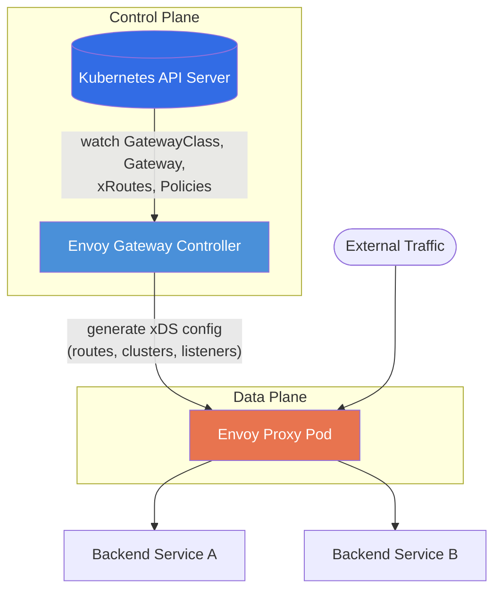
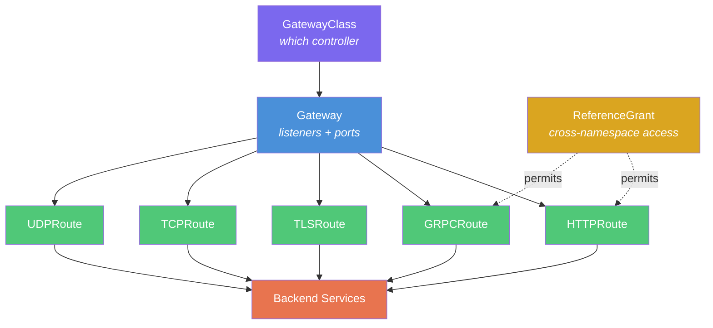
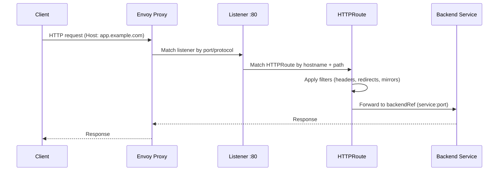
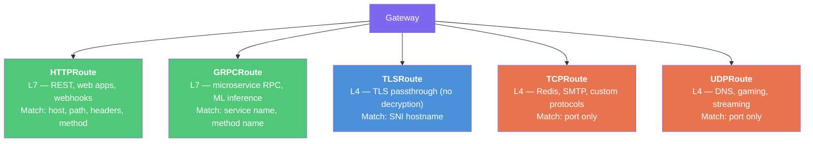
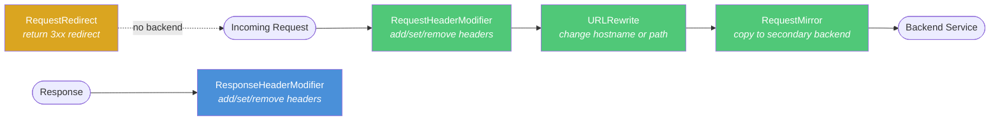
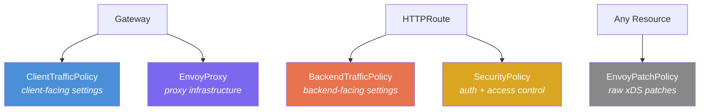
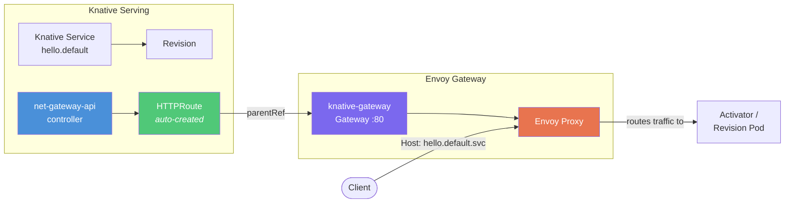

# Envoy Gateway Architecture

## Overview

Envoy Gateway is a Gateway API controller that manages Envoy Proxy as the data plane. It translates Kubernetes Gateway API resources into Envoy xDS configuration, providing L4/L7 traffic routing.

| Component | Version |
|-----------|---------|
| Envoy Gateway | v1.7.0 |
| Gateway API | v1.4.1 |
| Envoy Proxy | v1.37.0 |

## Control Plane vs Data Plane



**Control Plane** — The Envoy Gateway controller watches Gateway API CRDs in the Kubernetes API server. When resources change, it translates them into Envoy xDS configuration and pushes it to the data plane.

**Data Plane** — Envoy Proxy pods receive xDS configuration and route incoming traffic to backend services based on the rules defined in HTTPRoute, GRPCRoute, and other route resources.

## Gateway API Object Model



## Request Flow



## Gateway API Objects

### GatewayClass

Cluster-scoped resource that identifies which controller handles Gateways. Envoy Gateway creates GatewayClass `eg` automatically on install.

```yaml
apiVersion: gateway.networking.k8s.io/v1
kind: GatewayClass
metadata:
  name: eg
spec:
  controllerName: gateway.envoyproxy.io/gatewayclass-controller
```

One controller can serve multiple GatewayClasses. Each GatewayClass can have different parameters (e.g., different EnvoyProxy configurations for internal vs external traffic).

### Gateway

Namespace-scoped resource that defines listeners (port + protocol + TLS). When a Gateway is created, the controller provisions an Envoy Proxy deployment and a LoadBalancer Service.

```yaml
apiVersion: gateway.networking.k8s.io/v1
kind: Gateway
metadata:
  name: knative-gateway
  namespace: knative-serving
spec:
  gatewayClassName: eg
  listeners:
    - name: http
      protocol: HTTP
      port: 80
      allowedRoutes:
        namespaces:
          from: All    # routes from any namespace can attach
```

Each Gateway = one Envoy Proxy deployment. Multiple Gateways = multiple independent proxy instances.

### HTTPRoute

Namespace-scoped resource that defines L7 routing rules. Attaches to a Gateway via `parentRefs` and routes traffic to backend services.

```yaml
apiVersion: gateway.networking.k8s.io/v1
kind: HTTPRoute
metadata:
  name: my-route
spec:
  parentRefs:
    - name: knative-gateway
      namespace: knative-serving
  hostnames:
    - "app.example.com"
  rules:
    - matches:
        - path:
            type: PathPrefix
            value: /api
      backendRefs:
        - name: api-service
          port: 8080
```

### HTTPRoute

**Traffic**: HTTP/1.1 and HTTP/2 (plaintext or TLS-terminated at the Gateway).

The most common route type. Matches requests by hostname, path, headers, query parameters, and HTTP method — then forwards to backend services. Supports filters to modify requests/responses in-flight (add headers, rewrite paths, redirect).

**Use cases**: REST APIs, web applications, webhooks, any request/response workload. This is what Knative uses — every Knative Service gets an HTTPRoute automatically.

```
Client --HTTP--> Gateway :80 --> HTTPRoute (match: Host + /path) --> Service:8080
```

### GRPCRoute

**Traffic**: gRPC over HTTP/2.

gRPC is a binary RPC protocol built on HTTP/2 (used heavily in microservices). Unlike REST where you route by URL path, gRPC routes by **service name** and **method name** from the `.proto` definition. A single HTTP/2 connection carries many parallel RPC calls (streams).

**Use cases**: Service-to-service communication in microservice architectures. Examples — Envoy's own xDS protocol is gRPC, Kubernetes API aggregation, ML model inference (TensorFlow Serving, Triton).

```
Client --gRPC/H2--> Gateway :443 --> GRPCRoute (match: service=myapp.v1.Users, method=GetUser) --> Pod:50051
```

### TLSRoute

**Traffic**: Encrypted TLS connections passed through **without decryption** (TLS passthrough).

The Gateway looks at the **SNI** (Server Name Indication) — a hostname sent in cleartext during the TLS handshake — to decide where to route. The Gateway never sees the payload; end-to-end encryption is preserved between client and backend.

**Use cases**: When the backend must terminate TLS itself (regulatory requirement, mTLS, or the backend holds its own certificate). Database connections over TLS (PostgreSQL, MySQL), Kafka TLS listeners.

```
Client --TLS handshake (SNI: db.example.com)--> Gateway :443 --> TLSRoute (match SNI) --> PostgreSQL:5432
                                                  ↑ does NOT decrypt, just forwards the encrypted stream
```

### TCPRoute

**Traffic**: Raw TCP byte streams (no protocol inspection).

The Gateway acts as a simple L4 load balancer — it accepts a TCP connection on a port and forwards all bytes to the backend. No hostname or path matching — routing is purely by **port number**.

**Use cases**: Non-HTTP protocols where you just need port-based forwarding. Examples — Redis (port 6379), custom TCP protocols, SMTP (port 25), game servers.

```
Client --TCP:6379--> Gateway :6379 --> TCPRoute --> Redis Pod:6379
                       ↑ no inspection, just byte forwarding
```

### UDPRoute

**Traffic**: Raw UDP datagrams (connectionless, no handshake).

Same as TCPRoute but for UDP. Routes by port number only. UDP is fire-and-forget — no connection state, no guaranteed delivery.

**Use cases**: DNS (port 53), game servers (real-time position updates where dropped packets are acceptable), video/audio streaming (RTP), VPN tunnels (WireGuard), IoT telemetry.

```
Client --UDP:53--> Gateway :53 --> UDPRoute --> CoreDNS Pod:53
                     ↑ stateless, individual datagrams
```

### Route Type Summary



**L7 routes** (HTTP, gRPC) inspect the application protocol — they can match on hostnames, paths, headers, and modify requests with filters. Multiple routes can share the same port.

**L4 routes** (TLS, TCP, UDP) operate on raw connections/datagrams — they cannot see inside the payload. TLS is slightly smarter because it can read the SNI hostname from the handshake. TCP/UDP route purely by port number.

### ReferenceGrant

Allows cross-namespace references. Without it, an HTTPRoute in namespace `A` cannot reference a backend Service in namespace `B`.

```yaml
apiVersion: gateway.networking.k8s.io/v1beta1
kind: ReferenceGrant
metadata:
  name: allow-from-serving
  namespace: backend-ns
spec:
  from:
    - group: gateway.networking.k8s.io
      kind: HTTPRoute
      namespace: knative-serving
  to:
    - group: ""
      kind: Service
```

## HTTPRoute Filters

Filters modify requests/responses inline within routing rules.



| Filter | Direction | Description |
|--------|-----------|-------------|
| RequestHeaderModifier | Request | Add, set, or remove request headers |
| ResponseHeaderModifier | Response | Add, set, or remove response headers |
| URLRewrite | Request | Rewrite hostname or path before forwarding |
| RequestRedirect | Request | Return redirect response (no backend call) |
| RequestMirror | Request | Copy request to a secondary backend |
| ExtensionRef | Both | Reference an Envoy Gateway extension filter |

## Envoy Gateway Extension CRDs

These are Envoy Gateway-specific CRDs that extend Gateway API with policies not covered by the standard.



### BackendTrafficPolicy

Attaches to Gateway or HTTPRoute. Controls how the proxy connects to backends.

| Setting | Description |
|---------|-------------|
| Load balancing | Round-robin, least-request, random, consistent-hash |
| Circuit breaker | Max connections, pending requests, retries |
| Retry policy | Retry count, backoff, retriable status codes |
| Rate limiting | Global and local rate limits |
| Timeouts | Connection timeout, request timeout |
| Health checking | Active health checks for backend pods |

### ClientTrafficPolicy

Attaches to Gateway. Controls client-facing connection behavior.

| Setting | Description |
|---------|-------------|
| TLS settings | Min/max TLS version, cipher suites, ALPN |
| HTTP timeouts | Idle timeout, request headers timeout |
| HTTP/2 | Max concurrent streams |
| Client IP detection | XFF headers, proxy protocol |
| Connection limits | Max connections per listener |

### SecurityPolicy

Attaches to Gateway or HTTPRoute. Provides authentication and access control.

| Setting | Description |
|---------|-------------|
| JWT auth | Validate JWT tokens (issuer, audiences, JWKS) |
| OIDC | OpenID Connect authentication flow |
| Basic auth | Username/password validation |
| CORS | Cross-origin resource sharing rules |
| ExtAuth | External authorization service (gRPC/HTTP) |

### EnvoyProxy

Attaches to GatewayClass (via parametersRef). Configures the proxy infrastructure itself.

| Setting | Description |
|---------|-------------|
| Provider | Kubernetes deployment settings (replicas, resources) |
| Bootstrap | Custom Envoy bootstrap configuration |
| Telemetry | Access logging, metrics, tracing backends |
| Concurrency | Worker thread count |

### EnvoyPatchPolicy

Escape hatch for raw xDS configuration patches. Allows modifying any xDS resource (listener, route, cluster) when the higher-level APIs are insufficient. Use sparingly.

## Connection to Knative



Knative Serving uses `net-gateway-api` as its networking layer. When you create a Knative Service:

1. Knative creates a Revision (immutable snapshot of your container)
2. `net-gateway-api` controller creates an HTTPRoute pointing to the Activator or directly to Revision pods
3. The HTTPRoute attaches to `knative-gateway` (our Gateway resource)
4. Envoy Gateway translates the HTTPRoute into xDS config
5. Envoy Proxy routes incoming requests to the correct Knative revision

This is why Envoy Gateway must be deployed **before** Knative Serving — the Gateway and GatewayClass must exist for `net-gateway-api` to create routes.

## Ingress vs Egress — What Envoy Gateway Does Not Cover

Envoy Gateway is **ingress-only** — it handles external traffic entering the cluster. It does **not** control traffic leaving the cluster (egress).

### The Egress Problem

By default, any pod can call any external IP. In dynamic clusters where nodes are added/removed, each node has a different IP. External services (APIs, databases, partners) see unpredictable source IPs:

```mermaid
graph LR
    subgraph Cluster — no egress control
        PA[Pod A<br>Node 10.0.1.5] -->|src: 10.0.1.5| EXT[External API]
        PB[Pod B<br>Node 10.0.1.9] -->|src: 10.0.1.9| EXT
        PC[Pod A migrated<br>Node 10.0.1.12] -->|src: 10.0.1.12| EXT
    end

    style EXT fill:#4a90d9,color:#fff
```

The firewall team must whitelist the entire subnet — or constantly update rules as nodes change.

### Egress Gateway — Fixed Exit Point

An egress gateway forces outbound traffic through dedicated nodes with stable IPs:

```mermaid
graph LR
    subgraph Cluster — with egress gateway
        PA[Pod A<br>any node] --> EGW[Egress Gateway<br>fixed IP 10.0.1.100]
        PB[Pod B<br>any node] --> EGW
        PC[Pod C<br>any node] --> EGW
    end

    EGW -->|"src: 10.0.1.100<br>(always the same)"| EXT[External API]

    style EGW fill:#e8744f,color:#fff
    style EXT fill:#4a90d9,color:#fff
```

The firewall whitelists **one IP** regardless of cluster size.

### Who Provides Egress

| Solution | Approach |
|----------|----------|
| **Istio** (Phase 3) | `ServiceEntry` + egress `Gateway`. Routes outbound through dedicated Envoy pods on specific nodes |
| **Cilium** | eBPF egress gateway policy. Kernel-level redirect to designated egress node, SNAT to fixed IP |
| **Calico** | Egress gateway with BGP. Advertises specific IPs for egress traffic |
| **Cloud NAT** | AWS NAT Gateway / GCP Cloud NAT — fixed external IP for all cluster egress, no per-service control |
| **Envoy Gateway** | **Not supported** — ingress only |

### Enterprise Egress Patterns

| Pattern | Description |
|---------|-------------|
| Default deny egress | All outbound blocked unless explicitly allowed |
| Per-service egress IP | Payment service exits via IP A, analytics via IP B — different firewall rules per service |
| DNS-based egress | Allow `*.stripe.com`, block everything else (requires L7-aware egress) |
| Egress audit | Log all outbound connections — who, where, when, how much data |

Egress control becomes relevant in Phase 3 (Istio) or if Cilium replaces the default CNI.

## Phase 3 — Service Mesh (Istio)

Envoy Gateway controls traffic at the **edge** only. Phase 3 adds Istio, which injects a sidecar proxy into **every pod**, extending traffic control to all pod-to-pod communication inside the cluster.

```mermaid
graph TB
    subgraph "Phase 1-2: Envoy Gateway (edge only)"
        C1([Client]) --> GW1[Gateway Envoy]
        GW1 -->|plaintext| A1[Pod A]
        A1 -->|"plaintext<br>(no control)"| B1[Pod B]
        B1 -->|"plaintext<br>(no control)"| C1B[Pod C]
    end

    subgraph "Phase 3: Istio (edge + mesh)"
        C2([Client]) --> GW2[Gateway Envoy]
        GW2 -->|mTLS| A2["[sidecar] Pod A"]
        A2 -->|"mTLS<br>policy enforced"| B2["[sidecar] Pod B"]
        B2 -->|"mTLS<br>policy enforced"| C2B["[sidecar] Pod C"]
    end

    style GW1 fill:#e8744f,color:#fff
    style GW2 fill:#e8744f,color:#fff
    style A2 fill:#4a90d9,color:#fff
    style B2 fill:#4a90d9,color:#fff
    style C2B fill:#4a90d9,color:#fff
```



### What Istio Adds

| Feature | Without Istio (Phase 1-2) | With Istio (Phase 3) |
|---------|--------------------------|---------------------|
| **mTLS** | Gateway → Pod is plaintext | Every pod-to-pod call encrypted automatically |
| **Identity** | Pods have no cryptographic identity | SPIFFE certificates per pod |
| **Authorization** | Any pod can call any pod | Fine-grained policies ("only namespace X can call service Y") |
| **Observability** | Manual instrumentation | Automatic metrics, traces, access logs for every call |
| **Traffic shaping** | Edge only | Retries, timeouts, circuit breaking between any services |
| **Canary deployments** | Manual | Route N% traffic to v2 between internal services |
| **Egress control** | None | ServiceEntry + egress gateway with fixed IPs |

### Migration Path

Istio includes its own Gateway API controller. Migration is a single field change:

```yaml
# helm/templates/custom/gateway.yaml
spec:
  gatewayClassName: eg      # Phase 1-2: Envoy Gateway
  # gatewayClassName: istio  # Phase 3: Istio takes over
```

### Sidecar vs Sidecarless (Cilium Alternative)

Istio uses **sidecar proxies** (one Envoy container per pod, +50-100MB RAM each). Cilium offers a sidecarless alternative using **eBPF** in the Linux kernel:

| | Istio (sidecar) | Cilium (eBPF, sidecarless) |
|-|----------------|---------------------------|
| **Where** | Userspace proxy per pod | eBPF programs in kernel, one agent per node |
| **Overhead** | +50-100MB RAM per pod | Near zero per pod |
| **Latency** | +1-3ms per hop | ~0.1ms (kernel shortcut) |
| **L7 features** | Full (retries, circuit breaking, fault injection) | Basic L7, less mature |
| **Maturity** | Very mature | Newer as mesh (strong as CNI) |
| **Kernel requirement** | None | Linux 5.4+ with BPF support |
