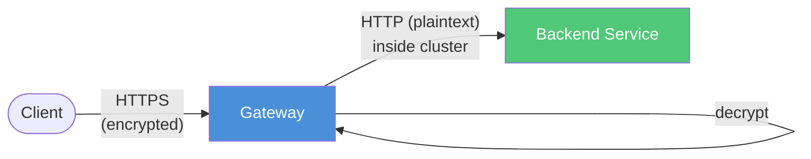
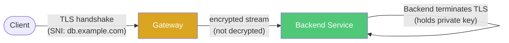
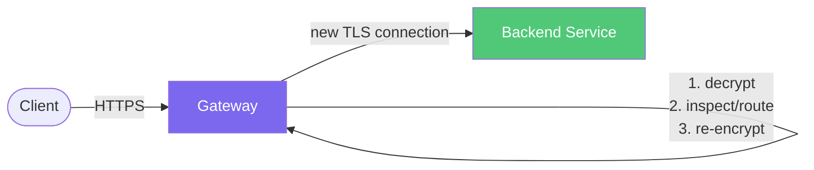
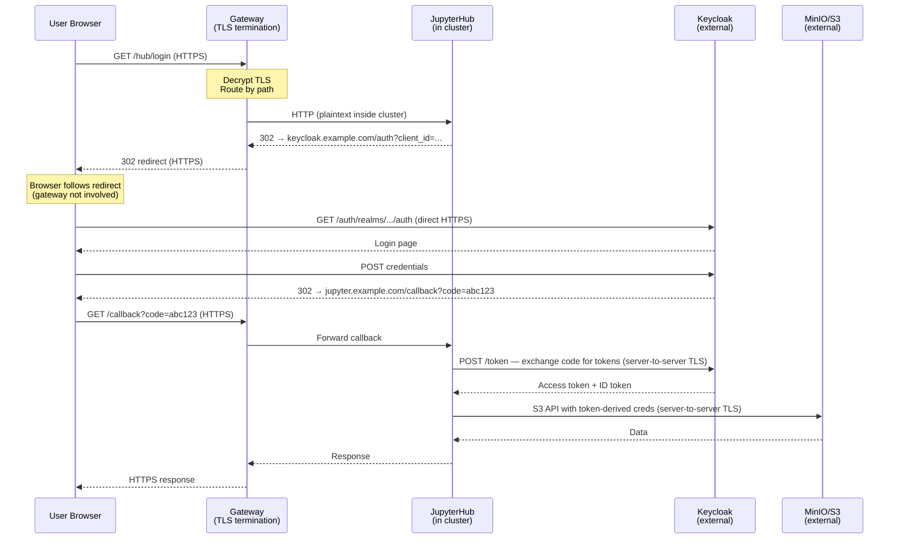
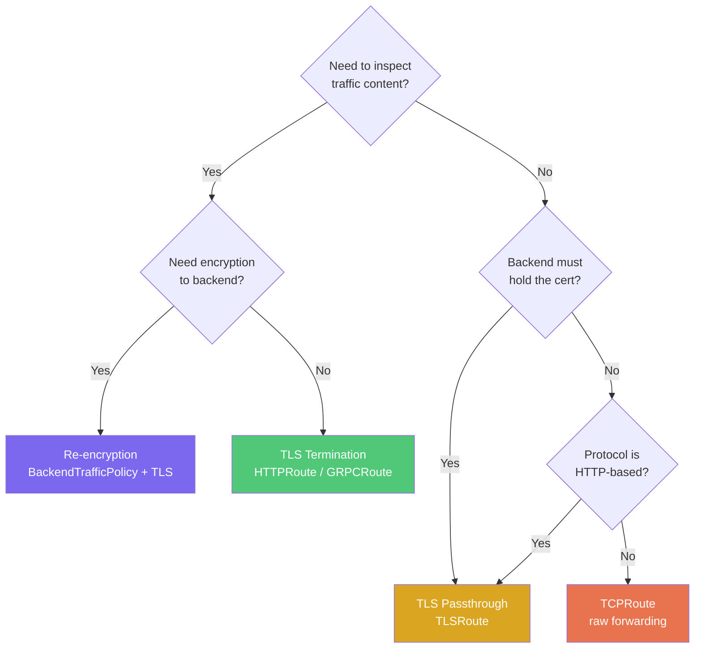

# TLS Termination Strategies

## Overview

When traffic arrives at the Gateway encrypted with TLS, there are two choices: **terminate** (decrypt at the gateway) or **passthrough** (forward encrypted bytes to the backend). The right choice depends on what the gateway needs to do with the traffic.

## Terminate at Gateway

The Gateway decrypts TLS, inspects the plaintext, and forwards to the backend (plaintext or re-encrypted).

**When to terminate:**

| Scenario | Why Gateway must decrypt |
|----------|------------------------|
| L7 routing (path, headers) | Encrypted = opaque bytes, can't route `/api` vs `/web` |
| WAF / rate limiting | Security policies need to inspect request body and headers |
| Header injection | Adding `X-Request-ID`, `X-Forwarded-For`, auth headers |
| Certificate management | One wildcard cert at gateway instead of N certs on N backends |
| Response caching / compression | Gateway can only cache or gzip if it can read the response |
| Content-based load balancing | Routing by cookie, header, or path requires decryption |

This is the **common case** — most HTTPRoute and GRPCRoute setups terminate TLS at the Gateway.

## TLS Passthrough

The Gateway reads only the SNI hostname from the TLS handshake and forwards the entire encrypted stream untouched to the backend.

**When to passthrough:**

| Scenario | Why Gateway must NOT decrypt |
|----------|------------------------------|
| Regulatory / compliance | PCI-DSS, HIPAA — no intermediate decryption point allowed |
| mTLS (client cert auth) | Client authenticates directly to backend, gateway can't impersonate |
| Backend owns the certificate | Backend identity tied to its cert (database TLS, Kafka TLS) |
| Zero-trust architecture | Gateway is not trusted to see plaintext |
| Performance | Skip decrypt + re-encrypt CPU cost |
| Non-HTTP protocols over TLS | PostgreSQL TLS, Kafka TLS — gateway can't parse even if decrypted |

## Re-encryption (Middle Ground)

Gateway terminates client TLS (to inspect/route), then opens a **new** TLS connection to the backend. Best of both worlds at the cost of double encryption.

Configured via Envoy Gateway's `BackendTrafficPolicy` with backend TLS settings. The tradeoff: double encryption CPU cost and the gateway sees plaintext momentarily in memory.

## Real-World Example: JupyterHub + Keycloak + S3

A common pattern — authenticate users via external Keycloak, then access external S3 storage. TLS termination at the gateway works because the gateway only sits between the browser and the in-cluster service.

**Why termination at the gateway is fine here:**

- **Gateway only handles browser ↔ JupyterHub** — decrypts incoming HTTPS, routes by path, forwards plaintext inside the cluster
- **Keycloak connection is separate** — JupyterHub opens its own outbound TLS connection to Keycloak for token exchange. Gateway is not involved
- **S3 connection is separate** — JupyterHub calls S3 API directly over its own TLS connection. Gateway is not involved
- **No mTLS needed** — authentication is OIDC (application-layer tokens), not TLS client certificates

## Decision Flowchart

**Rule of thumb**: If you need to look inside the traffic (route by path, add headers, apply security policies) → terminate at the gateway. If the backend must be the only thing that sees the plaintext → passthrough.
