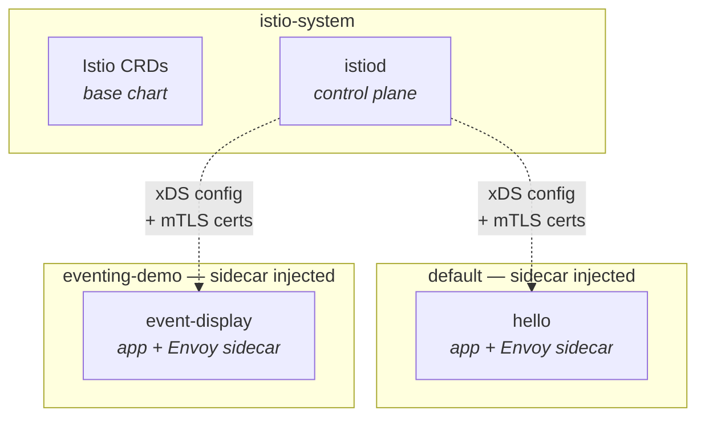

# Istio Service Mesh (Phase 3)

Full service mesh for the event-driven playground — replaces Envoy Gateway.

## Versions

| Component | Version |
|-----------|---------|
| Istio base (CRDs) | 1.28.3 |
| istiod (control plane) | 1.28.3 |
| Mode | Sidecar (ambient not yet Knative-compatible) |

## Install Method

Istio is installed via **Helm charts** from `https://istio-release.storage.googleapis.com/charts`. Two chart dependencies in a single umbrella chart:

```
Chart.yaml dependencies:
  - base    1.28.3  (CRDs + cluster-wide resources)
  - istiod  1.28.3  (control plane — discovery, config, certs)
Helm release name:  istio
Namespace:          istio-system
```

See: https://istio.io/latest/docs/setup/install/helm/

## Namespace Layout



## API Reference

- [Istio Configuration Reference](https://istio.io/latest/docs/reference/config/) — VirtualService, DestinationRule, PeerAuthentication, AuthorizationPolicy, Gateway

## Components

| Service | Namespace | Role |
|---------|-----------|------|
| istiod | istio-system | Control plane (service discovery, CA, config distribution) |
| Istio CRDs (base) | istio-system | PeerAuthentication, AuthorizationPolicy, VirtualService, etc. |
| Ingress Gateway | istio-system | Envoy proxy at mesh edge (auto-provisioned by Gateway API) |
| Sidecar proxy | per pod | Envoy injected into workload pods |

## What It Adds Over Envoy Gateway

| Feature | Details |
|---------|---------|
| mTLS | Automatic between all services (SPIFFE certs, auto-rotated) |
| AuthorizationPolicy | Per-workload fine-grained access control |
| Distributed tracing | Auto span generation for all hops |
| L7 metrics | Per service pair (rate, latency, errors) |
| Circuit breaking | DestinationRule with outlier detection |
| Fault injection | VirtualService delay/abort injection |
| Rate limiting | Local (per-pod) + global |

## Prerequisites

- Kubernetes cluster accessible via kubectl
- Knative already deployed (this script swaps the Gateway API controller)
- `components.istio.enabled: true` in config.yaml
- `components.envoy_gateway.enabled: false` in config.yaml (after migration)

## Usage

```bash
# Deploy (swaps Gateway API controller from Envoy Gateway → Istio)
./scripts/build.sh

# Then remove Envoy Gateway
../envoy-gateway/scripts/destroy.sh

# Destroy Istio
./scripts/destroy.sh
```

## File Structure

```
istio/
├── README.md
├── deployment/              # Rendered output (.gitignore)
├── docs/
├── helm/
│   ├── Chart.yaml           # Wrapper chart (depends on base + istiod)
│   ├── values.yaml          # base + istiod configuration
│   └── values-overrides.yaml
├── manifests/
│   ├── peer-authentication.yaml  # mTLS STRICT (applied by build.sh after istiod)
│   └── authz-knative.yaml        # Allow Knative system pods
└── scripts/
    ├── build.sh             # Install Istio + swap gateway + apply policies
    ├── destroy.sh           # Full teardown
    ├── regenerate-rendered.sh
    └── test/
        └── test-mesh.sh     # Test: CRDs, mTLS, sidecar injection, policies
```
