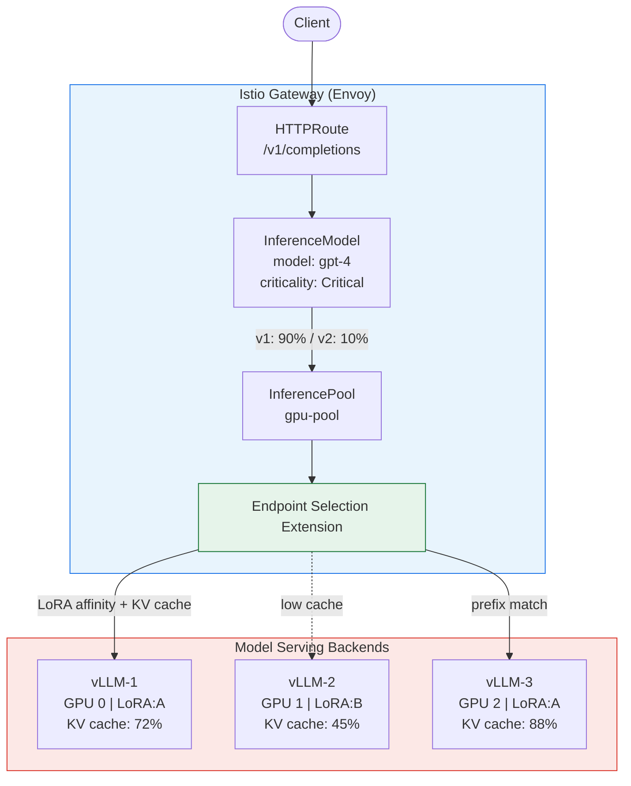
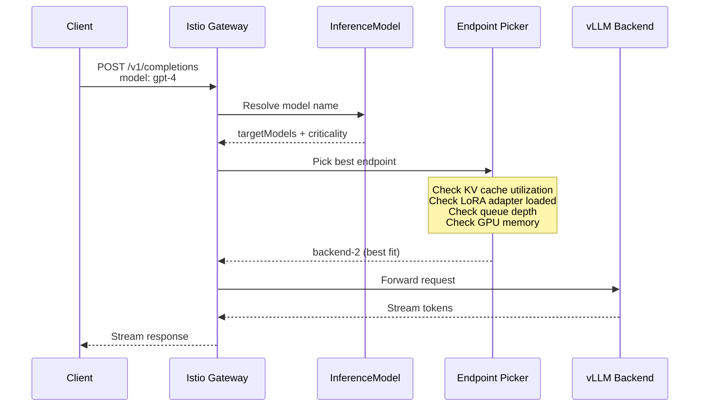
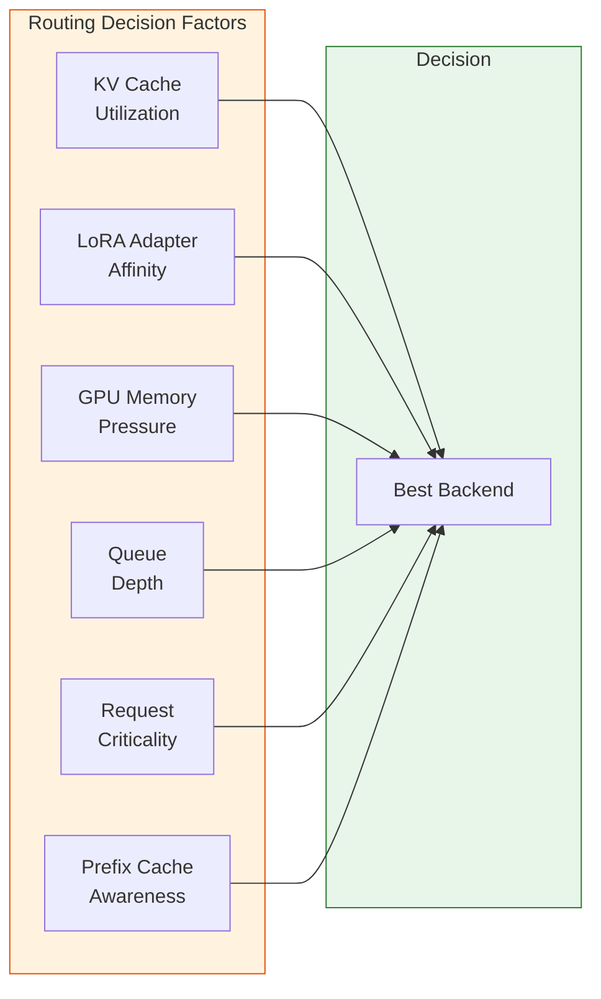
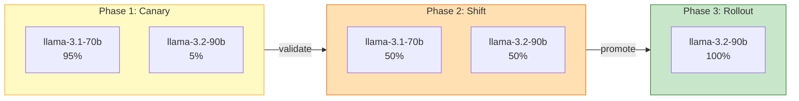
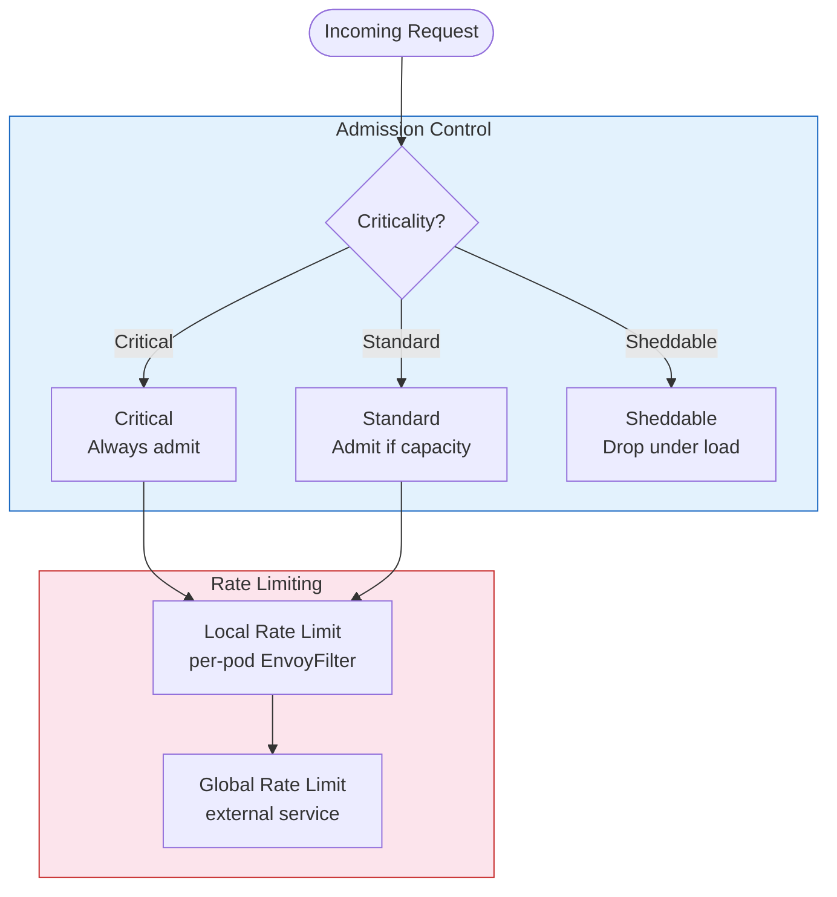
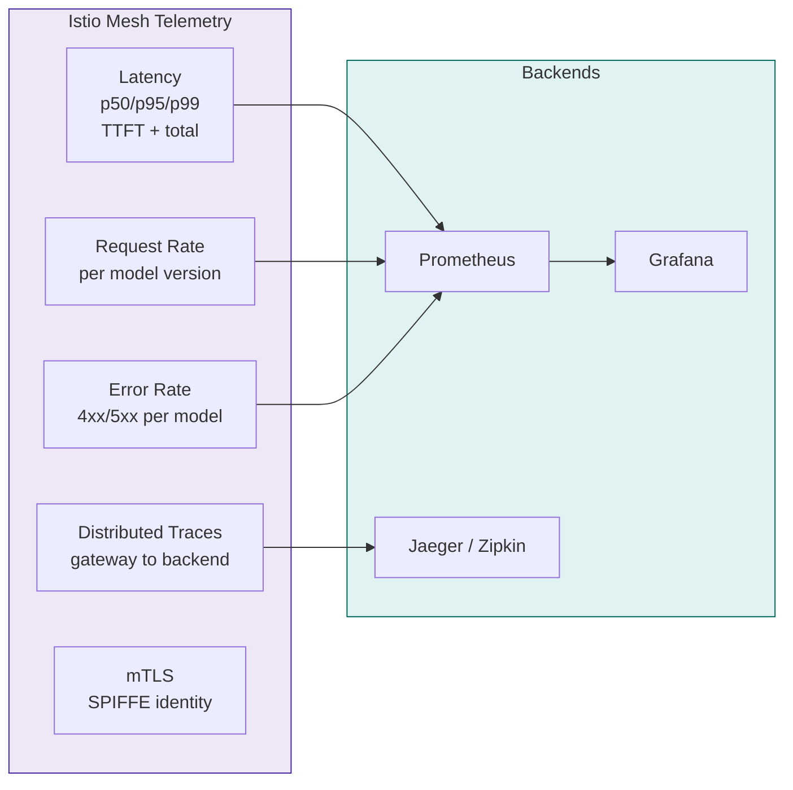

# AI Serving with Istio

## Overview

Istio 1.29 promotes the **Gateway API Inference Extension** to Beta. This turns Istio's Gateway API implementation into an AI-aware inference gateway that understands LLM workloads, GPU utilization, and model routing.

Traditional load balancing (round-robin, least-connections) fails for LLM inference because:
- Requests take **seconds to minutes** (not milliseconds)
- A single request can **consume an entire GPU**
- **KV cache** utilization directly impacts throughput
- **LoRA adapters** must be loaded into GPU memory; routing to a backend with the adapter already loaded is dramatically faster

## Architecture



## Request Flow



## CRDs

### InferenceModel

Defined by AI engineers / model owners. Maps a logical model name to serving backends with traffic splitting and priority.

```yaml
apiVersion: inference.networking.x-k8s.io/v1alpha2
kind: InferenceModel
metadata:
  name: my-model
spec:
  modelName: gpt-4
  criticality: Critical        # Critical | Standard | Sheddable
  poolRef:
    name: gpu-pool
  targetModels:
    - name: gpt-4-v1
      weight: 90
    - name: gpt-4-v2
      weight: 10               # canary 10% to new version
```

**Criticality levels** control behavior under load:
- **Critical**: Never shed, always served
- **Standard**: Shed only under extreme pressure
- **Sheddable**: First to be dropped when capacity is exhausted

### InferencePool

Defined by platform operators. Manages a pool of model-serving pods and the endpoint selection logic.

```yaml
apiVersion: inference.networking.x-k8s.io/v1alpha2
kind: InferencePool
metadata:
  name: gpu-pool
spec:
  targetPortNumber: 8000
  selector:
    matchLabels:
      app: vllm
  extensionRef:
    name: endpoint-picker       # ESE sidecar for intelligent routing
```

## Intelligent Routing



| Factor | Why It Matters |
|--------|---------------|
| **KV cache utilization** | High KV cache = more context reuse, higher throughput |
| **LoRA adapter affinity** | Route to backend with adapter already loaded (avoids cold-load) |
| **GPU memory pressure** | Avoid backends near OOM |
| **Queue depth** | Avoid backends with long request queues |
| **Request criticality** | Shed low-priority requests before high-priority |
| **Prefix cache awareness** | Route to backend likely holding relevant KV cache entries |

## Model Canary Deployments



```yaml
# Phase 1: 95/5 canary
targetModels:
  - name: llama-3.1-70b
    weight: 95
  - name: llama-3.2-90b
    weight: 5

# Phase 2: shift traffic
targetModels:
  - name: llama-3.1-70b
    weight: 50
  - name: llama-3.2-90b
    weight: 50

# Phase 3: full rollout
targetModels:
  - name: llama-3.2-90b
    weight: 100
```

Instant rollback by adjusting weights back. No pod restarts needed.

## Rate Limiting for LLM Endpoints



1. **Criticality-based admission**: InferenceModel `criticality` provides priority-based admission control. Under load, Sheddable requests are dropped first.
2. **Local rate limiting**: Per-pod Envoy rate limits via `EnvoyFilter`
3. **Global rate limiting**: External rate limit service for cluster-wide token budgets

```yaml
# Example: limit inference requests per client
apiVersion: networking.istio.io/v1
kind: EnvoyFilter
metadata:
  name: inference-rate-limit
spec:
  workloadSelector:
    labels:
      app: vllm
  configPatches:
    - applyTo: HTTP_FILTER
      match:
        context: SIDECAR_INBOUND
      patch:
        operation: INSERT_BEFORE
        value:
          name: envoy.filters.http.local_ratelimit
          typed_config:
            "@type": type.googleapis.com/udpa.type.v1.TypedStruct
            type_url: type.googleapis.com/envoy.extensions.filters.http.local_ratelimit.v3.LocalRateLimit
            value:
              stat_prefix: inference_rate_limit
              token_bucket:
                max_tokens: 10
                tokens_per_fill: 10
                fill_interval: 60s
```

## Observability for AI Workloads



| Signal | What You Get |
|--------|-------------|
| **Latency histograms** | p50/p95/p99 per model endpoint (time-to-first-token, total latency) |
| **Request rate** | Requests per second per model version |
| **Error rate** | 4xx/5xx per model (OOM, timeout, overload) |
| **Distributed traces** | Full trace from gateway through inference pool to backend |
| **mTLS** | All model traffic encrypted, SPIFFE identity per pod |

## Enabling the Inference Extension

The Inference Extension is **off by default** in Istio 1.29. To enable:

```yaml
# values-overrides.yaml
istiod:
  pilot:
    env:
      PILOT_ENABLE_ALPHA_GATEWAY_API: "true"
```

Then install the Inference Extension CRDs:

```bash
kubectl apply -f https://github.com/kubernetes-sigs/gateway-api-inference-extension/releases/download/v0.3.0/manifests.yaml
```

## When to Use

| Scenario | Use Inference Extension? |
|----------|------------------------|
| Single model, low traffic | No -- simple HTTPRoute + Service is enough |
| Multiple model versions with canary | Yes -- weighted targetModels |
| GPU-backed inference with LoRA | Yes -- adapter affinity routing |
| Multi-tenant LLM with priorities | Yes -- criticality-based admission |
| Batch embedding jobs | No -- standard Kubernetes Job/Deployment |
