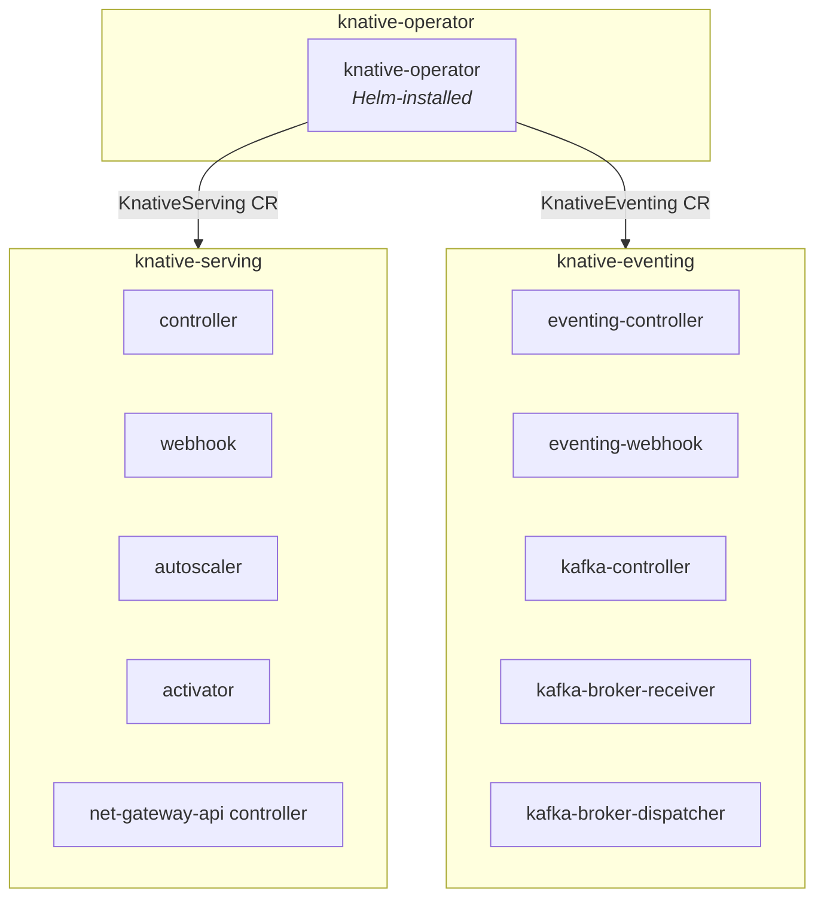

# Knative Serving + Eventing

Serverless compute and event-driven architecture for the playground.

## Versions

| Component | Version |
|-----------|---------|
| Knative Operator | v1.21.0 |
| Knative Serving | v1.21.0 |
| Knative Eventing | v1.21.0 |
| eventing-kafka-broker | v1.21.0 |
| net-gateway-api | v1.21.0 |

## Install Method

Knative is installed via the **Knative Operator Helm chart** from `https://knative.github.io/operator`. The operator then manages Serving and Eventing through custom resources (CRs).

```
Chart.yaml dependency:  knative-operator v1.21.0
Helm release name:      knative-operator
Operator namespace:     knative-operator
```

The operator reconciles:
- **KnativeServing CR** → deploys all Serving components into `knative-serving`
- **KnativeEventing CR** → deploys all Eventing components into `knative-eventing`

## Namespace Layout



## API Reference

- [Knative Serving API](https://knative.dev/docs/serving/reference/serving-api/) — Service, Configuration, Revision, Route, DomainMapping
- [Knative Eventing API](https://knative.dev/docs/eventing/reference/eventing-api/) — Broker, Trigger, Sequence, Parallel, sources

## Components

| Service | Namespace | Role |
|---------|-----------|------|
| knative-operator | knative-operator | Manages KnativeServing + KnativeEventing CRs |
| controller | knative-serving | Reconciles Knative CRDs |
| webhook | knative-serving | Admission validation/mutation |
| autoscaler | knative-serving | Computes desired pod count (KPA) |
| activator | knative-serving | Buffers requests during scale-from-zero |
| net-gateway-api controller | knative-serving | Translates KIngress → HTTPRoute |
| eventing-controller | knative-eventing | Reconciles Eventing CRDs |
| eventing-webhook | knative-eventing | Admission validation/mutation |
| kafka-controller | knative-eventing | Manages Kafka Broker/Source/Sink/Channel |
| kafka-broker-receiver | knative-eventing | HTTP → Kafka |
| kafka-broker-dispatcher | knative-eventing | Kafka → HTTP (Trigger delivery) |

## Prerequisites

- Kubernetes cluster accessible via kubectl
- Envoy Gateway or Istio deployed (Gateway API controller)
- Strimzi Kafka deployed (for Eventing Kafka Broker)
- `components.knative.enabled: true` in config.yaml

## Configuration

- `helm/Chart.yaml` — Helm dependency on `knative-operator`
- `helm/values.yaml` — Operator chart values (under `knative-operator:` key)
- `manifests/knative-serving.yaml` — KnativeServing CR (networking, gateway, DNS)
- `manifests/knative-eventing.yaml` — KnativeEventing CR (Kafka source, broker defaults)
- `manifests/kafka-broker-config.yaml` — Kafka Broker bootstrap config
## Usage

```bash
# Deploy
./scripts/build.sh

# Destroy
./scripts/destroy.sh

# Test serving (deploys hello world, verifies, cleans up)
./scripts/test/test-serving.sh

# Test eventing (deploys Kafka Broker + PingSource, verifies events, cleans up)
./scripts/test/test-eventing.sh
```

## Deployment Order

```
1. Envoy Gateway (or Istio)  →  provides Gateway API controller
2. Strimzi Kafka             →  provides Kafka cluster
3. Knative (this component)  →  operator → Serving CR → Eventing CR
```

## File Structure

```
knative/
├── README.md
├── deployment/              # Rendered output (.gitignore)
├── docs/
├── helm/
│   ├── Chart.yaml           # Wrapper chart (depends on knative-operator)
│   ├── values.yaml          # Operator configuration
│   └── values-overrides.yaml
├── manifests/
│   ├── knative-serving.yaml     # KnativeServing CR (applied by build.sh after operator)
│   ├── knative-eventing.yaml    # KnativeEventing CR
│   └── kafka-broker-config.yaml # Kafka Broker defaults
└── scripts/
    ├── build.sh             # Install operator + apply CRs + configure
    ├── destroy.sh           # Full teardown
    ├── regenerate-rendered.sh
    └── test/
        ├── test-serving.sh      # Test: deploy hello world, verify, clean up
        ├── test-eventing.sh     # Test: Kafka Broker + PingSource event flow
        ├── demo-hello.yaml      # Test manifest: hello world Knative Service
        └── demo-eventing.yaml   # Test manifest: Broker + Trigger + PingSource
```
