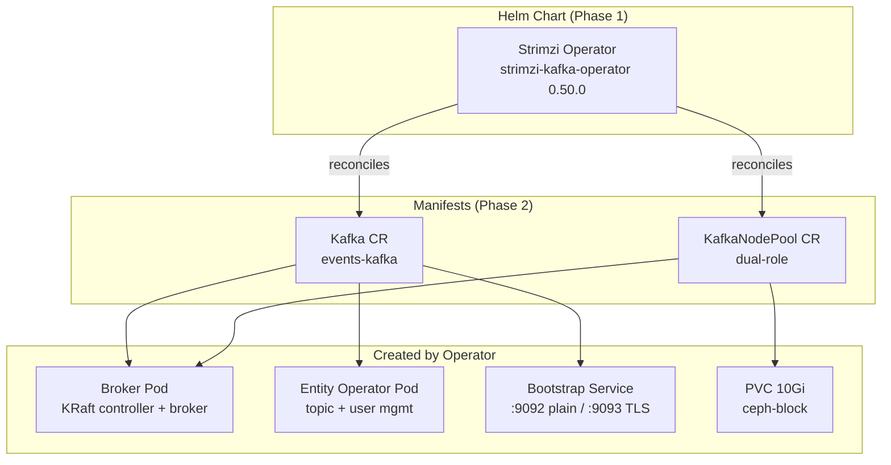
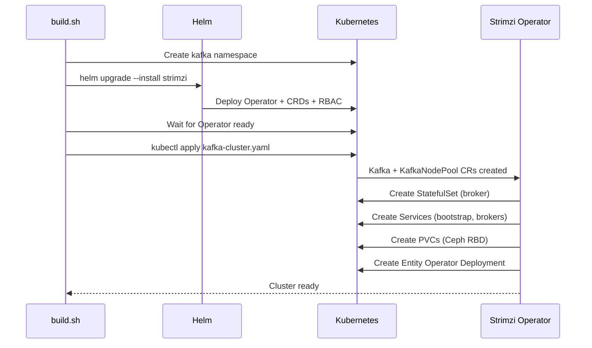
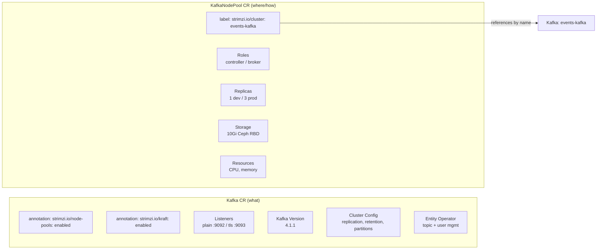
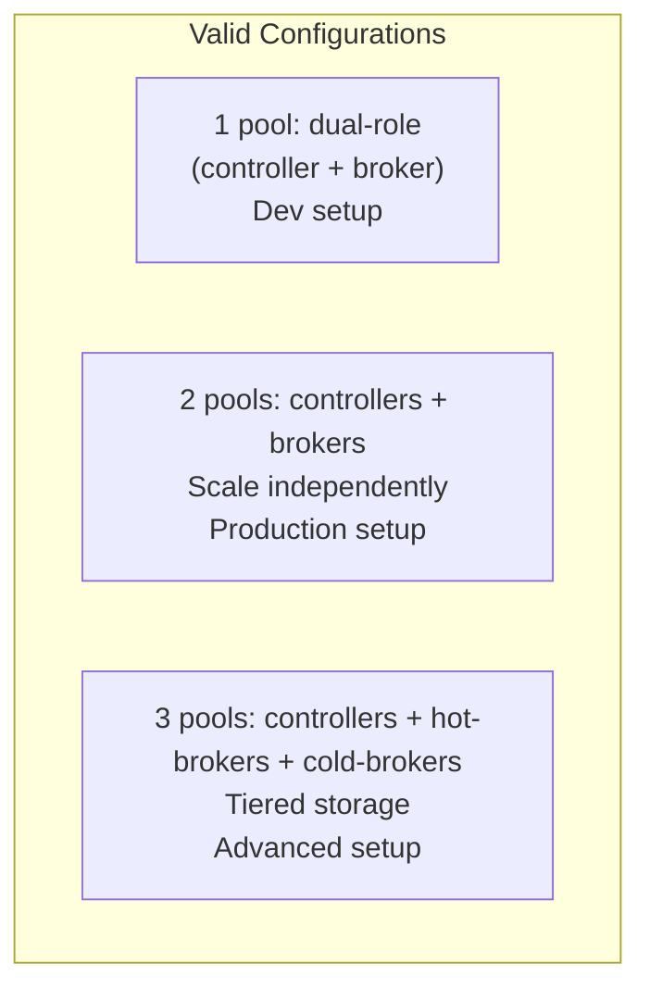
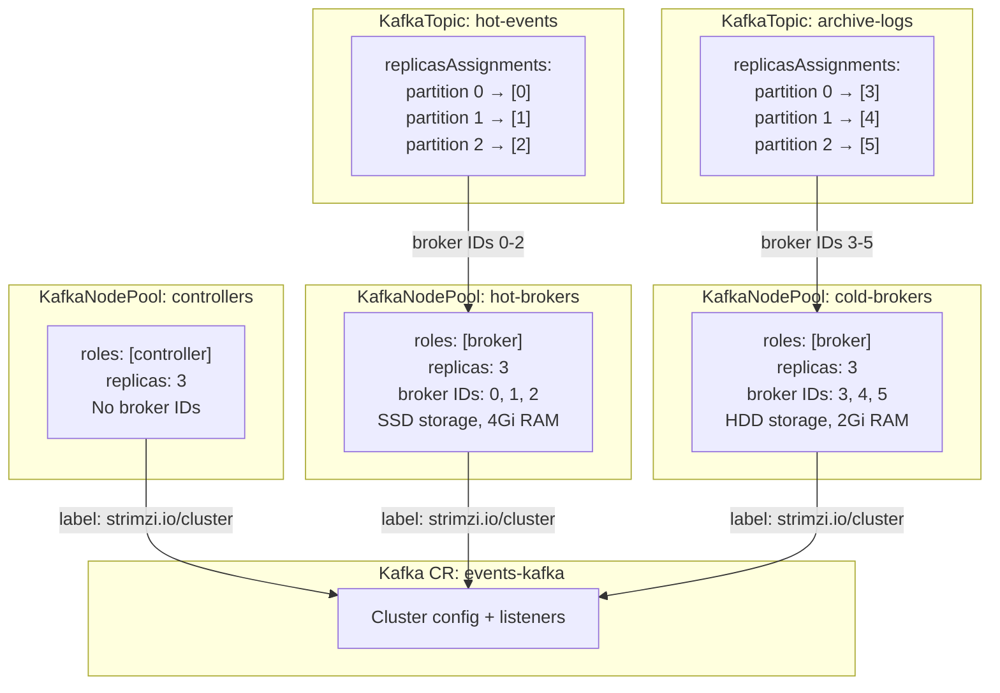
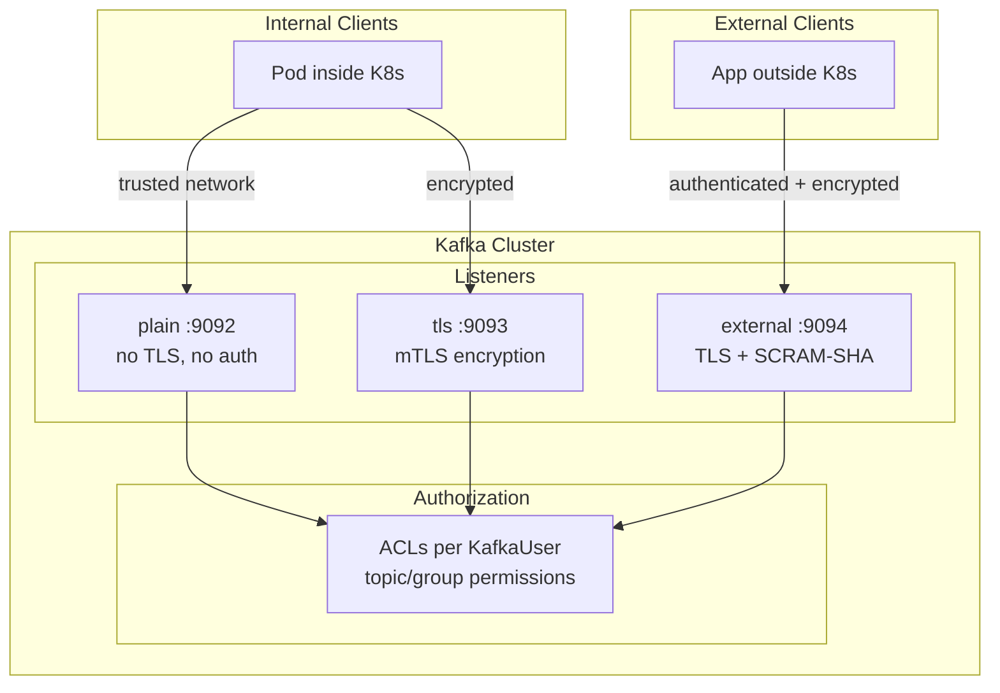
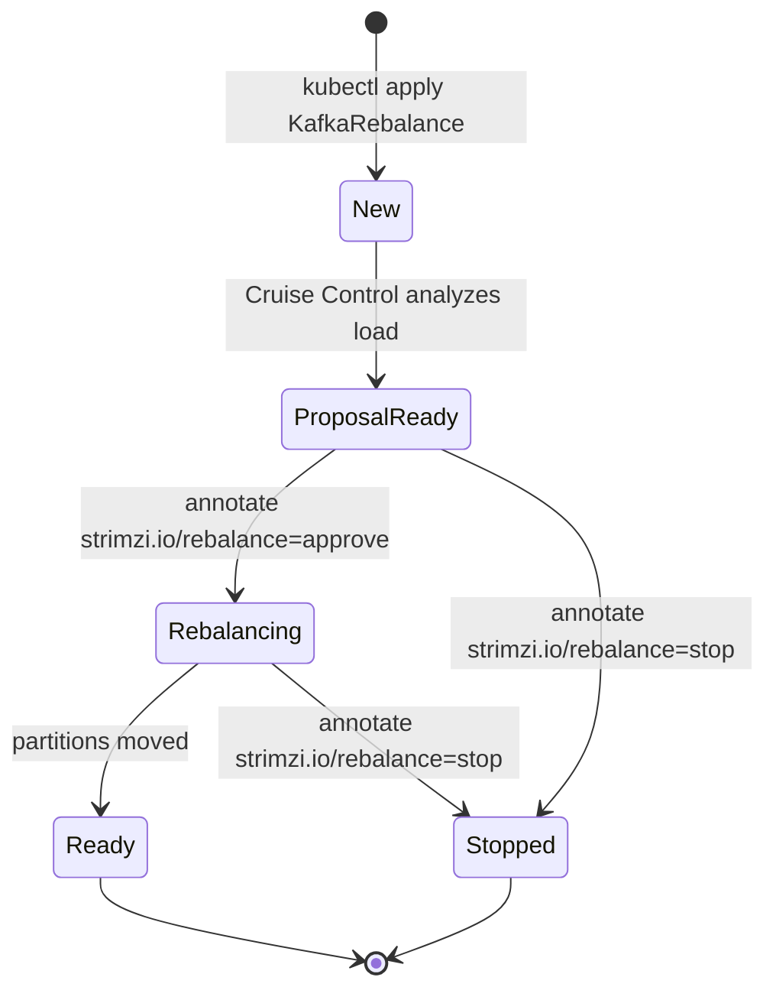

# Strimzi Kafka — Architecture & CRD Reference

## Deployment Architecture



## Deployment Flow



## Kafka CR vs KafkaNodePool CR

CR = Custom Resource (an instance of a CRD applied to the cluster).



The binding between the two CRs works like this:

1. **Kafka CR** enables node pool support via annotation `strimzi.io/node-pools: enabled` — it does NOT reference any KafkaNodePool by name
2. **KafkaNodePool CR** has the label `strimzi.io/cluster: events-kafka` — this is the **reverse link** pointing to the Kafka CR
3. The operator finds all KafkaNodePools with a matching cluster label and attaches them to the Kafka CR

This means the Kafka CR doesn't know (or care) how many node pools exist. You can add/remove node pools independently without modifying the Kafka CR.

**Kafka CR** defines the cluster's logical configuration — how clients connect (listeners), what version runs, broker config (replication, retention), and which sub-operators are enabled (entity operator for topics/users).

**KafkaNodePool CR** defines the physical infrastructure — how many nodes, what roles they play (controller vs broker), how much storage/CPU/memory each gets. Multiple node pools can link to the same Kafka CR:

**Option A — Dev (single dual-role pool):**

```yaml
KafkaNodePool: dual-role
  labels:
    strimzi.io/cluster: events-kafka
  spec:
    replicas: 1
    roles: [controller, broker]
```

**Option B — Production (separate pools, pick this OR option A, not both):**

```yaml
KafkaNodePool: controllers
  labels:
    strimzi.io/cluster: events-kafka
  spec:
    replicas: 3
    roles: [controller]

KafkaNodePool: brokers
  labels:
    strimzi.io/cluster: events-kafka
  spec:
    replicas: 3
    roles: [broker]
```

These are **mutually exclusive** — use one layout or the other. Mixing dual-role nodes with separate controller/broker pools creates role conflicts.

### Kafka CR Fields Explained

**Listeners** — network endpoints that clients use to connect to brokers. Each listener creates a K8s Service. You can have multiple with different security profiles:

| Listener | Port | TLS | Auth | Use case |
|----------|------|-----|------|----------|
| `plain` | 9092 | No | None | Dev / in-cluster trusted traffic |
| `tls` | 9093 | Yes | mTLS | In-cluster encrypted traffic |
| `external` | 9094 | Yes | SCRAM-SHA | External clients outside K8s |

A listener can combine TLS encryption with authentication:

```yaml
listeners:
  - name: authenticated
    port: 9094
    type: internal
    tls: true
    authentication:
      type: scram-sha-512    # or: tls, oauth
```

**Version** — the Kafka broker version (`4.1.1`). Controls which Kafka binary the operator deploys. `metadataVersion` (`4.1-IV1`) is the KRaft metadata format — allows rolling upgrades by keeping metadata compatible while updating binaries.

**Config** — maps directly to Kafka's `server.properties`. Key settings:

| Config | What it controls |
|--------|-----------------|
| `default.replication.factor` | How many copies of each topic partition across brokers |
| `min.insync.replicas` | Minimum replicas that must acknowledge a write (durability guarantee) |
| `num.partitions` | Default partitions per topic (parallelism) |
| `log.retention.hours` | How long messages are kept before deletion |
| `offsets.topic.replication.factor` | Replication for `__consumer_offsets` (consumer group state) |
| `transaction.state.log.*` | Replication for transaction coordinator |

### KafkaNodePool CR Fields Explained

**Roles** — in KRaft mode there are exactly two roles: `controller` and `broker`. Every Kafka cluster **must have at least one controller** — it manages cluster metadata (leader election, partition assignment, topic config). Without a controller, the cluster cannot start.

| Role | Function | Scaling rules |
|------|----------|--------------|
| `controller` | KRaft quorum — cluster metadata consensus | Must be odd (1, 3, 5) for quorum majority |
| `broker` | Stores data, serves client read/write | Scale based on throughput/storage needs |

A node pool assigns one or both roles to its nodes:



| Configuration | Pools | When to use |
|--------------|-------|-------------|
| Single dual-role pool | `roles: [controller, broker]` x1 | Dev / playground |
| Separate controller + broker | `roles: [controller]` + `roles: [broker]` | Production — scale brokers without touching quorum |
| Multiple broker pools | `roles: [controller]` + `roles: [broker]` x N | Different hardware tiers (SSD vs HDD, high-mem vs standard) |

You **cannot** have a cluster with only brokers — KRaft requires controllers. You **can** have controllers without brokers (but it won't serve any traffic).

**Multiple broker pools — tiered topic placement:**

Each pool gets its own range of broker IDs. Topics land on specific pools via `replicasAssignments` targeting those IDs. There is **no direct label/reference from KafkaTopic to KafkaNodePool** — the link is indirect through numeric broker IDs.



Key points:
- **Controllers** don't get broker IDs — they only manage metadata
- **Broker IDs** are assigned sequentially by Strimzi across pools (pool creation order matters)
- **KafkaTopic** references broker IDs in `replicasAssignments`, NOT pool names
- If you **omit** `replicasAssignments`, Kafka distributes partitions across **all** brokers (hot + cold mixed)
- This is a **Kafka limitation** — Kafka only knows broker IDs, not Strimzi pool names

**How broker IDs are assigned:**

Use `spec.nodeIds` on each KafkaNodePool to **explicitly** set broker IDs:

```yaml
# hot-brokers — explicitly IDs 0, 1, 2
spec:
  replicas: 3
  nodeIds: [0, 1, 2]
  roles: [broker]

# cold-brokers — explicitly IDs 3, 4, 5
spec:
  replicas: 3
  nodeIds: [3, 4, 5]
  roles: [broker]
```

Without `nodeIds`, Strimzi assigns IDs implicitly based on pool creation order — which is fragile and shifts if you reorder or recreate pools. **Always use `nodeIds` when topics reference specific broker IDs via `replicasAssignments`.**

**Relationship: Kafka CR ↔ KafkaNodePool is 1:N (one-to-many)**

```
Kafka: events-kafka (1)
  ├── KafkaNodePool: dual-role       (N)
  ├── KafkaNodePool: controllers     (N)
  └── KafkaNodePool: brokers         (N)
```

- One Kafka CR can have **many** KafkaNodePools (linked by label)
- One KafkaNodePool belongs to **exactly one** Kafka CR (single label value)
- NOT many-to-many — a node pool cannot be shared between clusters

**Replicas** — number of pods in this node pool. For controllers, must be odd (quorum majority). For brokers, scale based on load.

**Storage** — how broker data is persisted:

| Type | Description |
|------|-------------|
| `persistent-claim` | PVC — survives pod restarts. Use in production. |
| `jbod` | "Just a bunch of disks" — multiple volumes per broker for throughput |
| `ephemeral` | tmpfs — data lost on restart. Only for testing. |

**Resources** — standard K8s CPU/memory requests and limits. Kafka is memory-hungry (page cache). Rule of thumb: give brokers at least 1Gi memory request per 10Gi of active data.

### Security



**Authentication methods** (per listener):

| Method | How it works | Managed by |
|--------|-------------|------------|
| None | Open access — anyone can produce/consume | — |
| `tls` (mTLS) | Client presents TLS certificate. Operator auto-generates certs. | KafkaUser with `authentication.type: tls` |
| `scram-sha-512` | Username + password. Operator creates credentials as K8s Secrets. | KafkaUser with `authentication.type: scram-sha-512` |
| `oauth` | Token-based via OAuth 2.0 / OIDC provider | External identity provider |

**Authorization** (cluster-wide, enabled in Kafka CR):

```yaml
spec:
  kafka:
    authorization:
      type: simple              # Kafka ACLs
      # or: keycloak, opa, custom
```

Then each KafkaUser gets ACLs:

```yaml
spec:
  authorization:
    type: simple
    acls:
      - resource:
          type: topic
          name: "orders.*"
          patternType: prefix     # wildcard matching
        operations: [Read, Write, Describe, Create]
      - resource:
          type: group
          name: "my-app-group"
          patternType: literal
        operations: [Read]
```

**Current setup (dev):** No authentication, no authorization. `plain` listener on 9092 is open to any pod in the cluster. The `tls` listener on 9093 encrypts traffic but doesn't authenticate clients.

**Production recommendation:** Enable `scram-sha-512` on all listeners, add `authorization.type: simple` to Kafka CR, create a KafkaUser per application with least-privilege ACLs.

## Strimzi CRDs

| CRD | API Version | Purpose |
|-----|-------------|---------|
| **Kafka** | `kafka.strimzi.io/v1beta2` | Cluster definition — listeners, version, config, entity operator |
| **KafkaNodePool** | `kafka.strimzi.io/v1beta2` | Node groups — roles, replicas, storage, resources |
| **KafkaTopic** | `kafka.strimzi.io/v1beta2` | Declarative topic management |
| **KafkaUser** | `kafka.strimzi.io/v1beta2` | Authentication (SCRAM-SHA / TLS) and ACLs |
| **KafkaConnect** | `kafka.strimzi.io/v1beta2` | Kafka Connect worker cluster |
| **KafkaConnector** | `kafka.strimzi.io/v1beta2` | Individual connector instance (requires KafkaConnect) |
| **KafkaMirrorMaker2** | `kafka.strimzi.io/v1beta2` | Cross-cluster topic replication |
| **KafkaBridge** | `kafka.strimzi.io/v1beta2` | HTTP REST API for produce/consume without Kafka client |
| **KafkaRebalance** | `kafka.strimzi.io/v1beta2` | Cruise Control partition rebalancing |

## Current Cluster Objects

### KafkaNodePool — `dual-role`

Defines the broker nodes. Links to the Kafka CR via `strimzi.io/cluster` label.

```yaml
apiVersion: kafka.strimzi.io/v1beta2
kind: KafkaNodePool
metadata:
  name: dual-role
  labels:
    strimzi.io/cluster: events-kafka    # must match Kafka CR name
spec:
  replicas: 1                           # 1 = dev, 3 = production
  roles:
    - controller                        # KRaft quorum voter
    - broker                            # serves client traffic
  storage:
    type: jbod
    volumes:
      - id: 0
        type: persistent-claim
        size: 10Gi
        class: ceph-block          # Ceph RBD
        deleteClaim: false              # keep data on CR delete
  resources:
    requests: {memory: 1Gi, cpu: 500m}
    limits:   {memory: 2Gi, cpu: 1000m}
```

**Production scaling:** split into separate node pools:

```yaml
# 3 controllers for KRaft quorum
- name: controllers
  roles: [controller]
  replicas: 3

# Brokers scale independently
- name: brokers
  roles: [broker]
  replicas: 3
```

### Kafka — `events-kafka`

Cluster definition. The `strimzi.io/kraft: enabled` annotation enables KRaft mode (no ZooKeeper).

```yaml
apiVersion: kafka.strimzi.io/v1beta2
kind: Kafka
metadata:
  name: events-kafka
  annotations:
    strimzi.io/node-pools: enabled
    strimzi.io/kraft: enabled
spec:
  kafka:
    version: 4.1.1
    metadataVersion: "4.1-IV1"
    listeners:
      - name: plain
        port: 9092
        type: internal              # ClusterIP
        tls: false
      - name: tls
        port: 9093
        type: internal
        tls: true
    config:
      offsets.topic.replication.factor: 1
      transaction.state.log.replication.factor: 1
      transaction.state.log.min.isr: 1
      default.replication.factor: 1
      min.insync.replicas: 1
      num.partitions: 3
      log.retention.hours: 168      # 7 days
  entityOperator:
    topicOperator: {}               # enables KafkaTopic CRD
    userOperator: {}                # enables KafkaUser CRD
```

## Access

| From | Address | Port |
|------|---------|------|
| Inside cluster | `events-kafka-kafka-bootstrap.kafka.svc.cluster.local` | 9092 (plain) / 9093 (TLS) |
| Host (port-forward) | `kubectl port-forward svc/events-kafka-kafka-bootstrap -n kafka 9092:9092` | localhost:9092 |

## Listener Types

| Type | K8s Service | Use case |
|------|-------------|----------|
| `internal` | ClusterIP | In-cluster clients (current setup) |
| `cluster-ip` | ClusterIP | Same but with `advertisedHost` control |
| `nodeport` | NodePort | External via node IP + port |
| `loadbalancer` | LoadBalancer | External via `minikube tunnel` |
| `ingress` | Ingress | External via Ingress controller |

## Replication Settings

| Setting | Dev (current) | Production |
|---------|--------------|------------|
| `replicas` (KafkaNodePool) | 1 | 3+ |
| `default.replication.factor` | 1 | 3 |
| `min.insync.replicas` | 1 | 2 |
| `offsets.topic.replication.factor` | 1 | 3 |
| `transaction.state.log.replication.factor` | 1 | 3 |
| `transaction.state.log.min.isr` | 1 | 2 |

## Example CRDs

### KafkaTopic

```yaml
apiVersion: kafka.strimzi.io/v1beta2
kind: KafkaTopic
metadata:
  name: my-events
  labels:
    strimzi.io/cluster: events-kafka
spec:
  partitions: 3
  replicas: 1
  config:
    retention.ms: "604800000"       # 7 days
    cleanup.policy: delete
```

### KafkaUser (SCRAM-SHA)

```yaml
apiVersion: kafka.strimzi.io/v1beta2
kind: KafkaUser
metadata:
  name: my-app
  labels:
    strimzi.io/cluster: events-kafka
spec:
  authentication:
    type: scram-sha-512
  authorization:
    type: simple
    acls:
      - resource:
          type: topic
          name: my-events
          patternType: literal
        operations: [Read, Write, Describe]
```

### KafkaConnect (with connectors)

```yaml
apiVersion: kafka.strimzi.io/v1beta2
kind: KafkaConnect
metadata:
  name: my-connect
  annotations:
    strimzi.io/use-connector-resources: "true"  # enable KafkaConnector CRDs
spec:
  version: 4.1.1
  replicas: 1
  bootstrapServers: events-kafka-kafka-bootstrap:9092
  config:
    group.id: connect-cluster
    offset.storage.topic: connect-offsets
    config.storage.topic: connect-configs
    status.storage.topic: connect-status
    offset.storage.replication.factor: 1
    config.storage.replication.factor: 1
    status.storage.replication.factor: 1
```

### KafkaRebalance (Cruise Control)

Kafka does **not** automatically redistribute partitions when brokers are added, removed, or unevenly loaded. KafkaRebalance integrates with [Cruise Control](https://github.com/linkedin/cruise-control) to solve this.

**Important:** Rebalancing moves **whole partitions** between brokers for even load distribution. It does **not** age data or move old messages to cheaper storage — that's [Tiered Storage](tiered-storage.md).

**Prerequisites:** Enable Cruise Control in the Kafka CR:

```yaml
spec:
  cruiseControl: {}    # deploys a Cruise Control pod that monitors broker load
```

**Flow:**



1. **New** — CR created, Cruise Control starts analyzing current partition distribution
2. **ProposalReady** — plan generated. Review it in `.status.optimizationResult` (shows partition moves, data to transfer, estimated time)
3. **Approve** — `kubectl annotate kafkarebalance my-rebalance strimzi.io/rebalance=approve` triggers execution
4. **Rebalancing** — partitions are being moved between brokers (can be stopped mid-way)
5. **Ready** — done

**Example:**

```yaml
apiVersion: kafka.strimzi.io/v1beta2
kind: KafkaRebalance
metadata:
  name: my-rebalance
  labels:
    strimzi.io/cluster: events-kafka
spec:
  # Optimization goals (ordered by priority)
  goals:
    - RackAwareGoal              # spread replicas across racks/zones
    - ReplicaCapacityGoal        # don't exceed broker replica limit
    - DiskCapacityGoal           # don't exceed broker disk capacity
    - NetworkInboundCapacityGoal # balance inbound traffic
    - NetworkOutboundCapacityGoal
    - CpuCapacityGoal            # balance CPU usage
    - ReplicaDistributionGoal    # even partition count across brokers
    - DiskUsageDistributionGoal  # even disk usage across brokers
  # Optional: only rebalance specific brokers (e.g. after adding broker 6, 7)
  # brokers: [0, 1, 2, 3, 4, 5, 6, 7]
```

**When to use:**
- After scaling up/down broker pools (new brokers start empty)
- After disk imbalance (some brokers at 80%, others at 20%)
- After adding a new broker pool (e.g. adding `warm-brokers` pool)
- Periodic maintenance (run monthly to prevent drift)

**Conflict with `replicasAssignments`:** Pinned topics and rebalancing are fundamentally opposed — Cruise Control doesn't know about your placement intent and will move pinned partitions to "balance" load. Two safe approaches:

```yaml
# Option 1: Scope rebalance to a single pool
spec:
  brokers: [0, 1, 2]          # only rebalance within hot-brokers

# Option 2: Exclude pinned topics from rebalancing
spec:
  excludedTopics: "orders|audit-logs"   # regex — these topics stay pinned
```

If you don't use either safeguard, a rebalance **will** move your pinned partitions to other pools.

## Tiered Storage (KIP-405)

Kafka 4.x supports tiered storage — automatic offloading of old log segments from broker local disk to remote object storage (S3/Ceph RGW). This is the correct mechanism for hot → cold data aging.

```
Writes → broker disk (SSD)
         │
         │ segment rolls (time/size threshold)
         ▼
Old segments → uploaded to S3 → deleted from local disk
         │
Reads of recent data → served from local disk (~1ms)
Reads of old data    → fetched from S3 transparently (~50-200ms)
```

**Consumers don't know which tier they're reading from** — same API, same offsets, same consumer group. The broker transparently fetches from remote storage when needed.

Per-topic configuration:

```yaml
config:
  remote.storage.enable: "true"
  retention.ms: "7776000000"         # 90 days total (local + remote)
  local.retention.ms: "604800000"    # 7 days on local SSD, then → S3
```

**Full details:** See [tiered-storage.md](tiered-storage.md) — covers read path, write path, plugin setup, Ceph RGW integration, and limitations.

**Tiered Storage vs Multiple Broker Pools:**

| Concern | Tiered Storage | Multiple Broker Pools |
|---------|---------------|----------------------|
| **Use case** | Data aging (hot → cold over time) | Different compute profiles per topic |
| **Data lifecycle** | Automatic — Kafka manages segment movement | None — data stays on assigned brokers |
| **Topic placement** | Not needed — all topics use same brokers | Manual via `replicasAssignments` + `nodeIds` |
| **Rebalance conflict** | None — rebalance moves partitions, tiered storage moves segments | Must exclude pinned topics from rebalance |
| **Extra infrastructure** | Remote storage (S3) + plugin JAR | More brokers with different hardware |

## Real-Time Consumption

Kafka serves recent data from the OS page cache (RAM) — consumers reading the latest messages get ~1ms latency without any separate cache layer. For browser-based visualization, a thin Node.js service bridges Kafka's binary protocol to WebSocket:

```
Producer → Kafka → Node.js (consumer + WebSocket server) → React (browser)
```

This replaces Redis pub/sub for real-time dashboards — Kafka tail reads are already in-memory, so the extra hop through Redis is unnecessary.

**Full details:** See [realtime-consumption.md](realtime-consumption.md) — covers Node.js consumer code, React WebSocket hook, in-memory aggregation, K8s deployment, and latency tuning (~50-200ms end-to-end).

## Schema Registry

Strimzi does not include a schema registry. Options for schema management:

| Option | Description | Helm Chart |
|--------|-------------|------------|
| **Apicurio Registry** | Red Hat / CNCF, Kafka-native, supports Avro/Protobuf/JSON Schema | [apicurio-registry](https://www.apicur.io/registry/) |
| **Karapace** | Aiven's open-source drop-in replacement for Confluent Schema Registry | [karapace](https://github.com/Aiven-Open/karapace) |
| **Confluent Schema Registry** | Industry standard, requires Confluent license for production | [cp-helm-charts](https://github.com/confluentinc/cp-helm-charts) |

**Recommended for this playground: Apicurio Registry**
- Open source (Apache 2.0)
- Runs on K8s with Kafka or PostgreSQL storage backend
- Compatible with Confluent Schema Registry API (clients work unchanged)
- Supports Avro, Protobuf, JSON Schema, OpenAPI, AsyncAPI
- You already have both Kafka and PostgreSQL in the cluster as storage backends

Deployment would be a separate component under `components/events/schema-registry/`.

## Resource Summary

| Component | CPU (req/limit) | Memory (req/limit) | Storage |
|-----------|----------------|---------------------|---------|
| Strimzi Operator | 200m / 1000m | 384Mi / 384Mi | — |
| Kafka Broker | 500m / 1000m | 1Gi / 2Gi | 10Gi PVC |
| Entity Operator | auto | auto | — |
| **Total** | **~700m** | **~1.4Gi** | **10Gi** |
