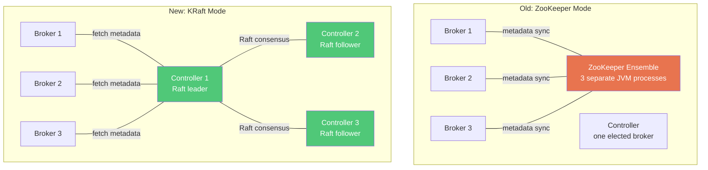
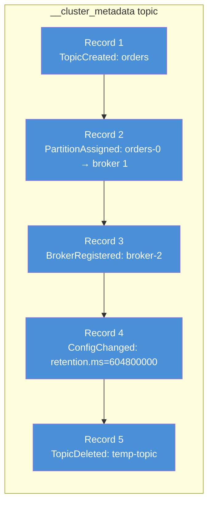
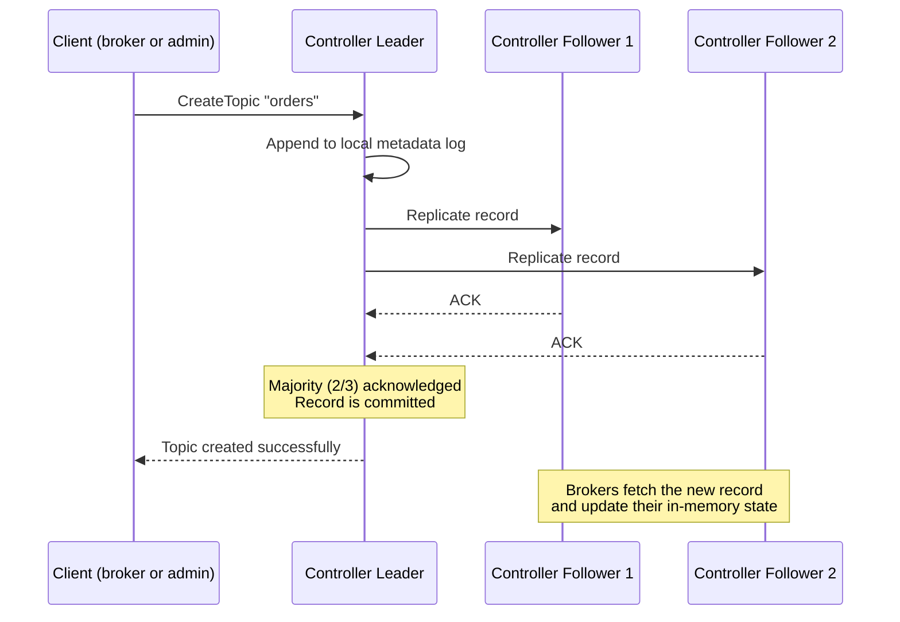
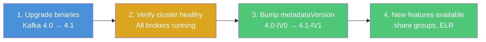
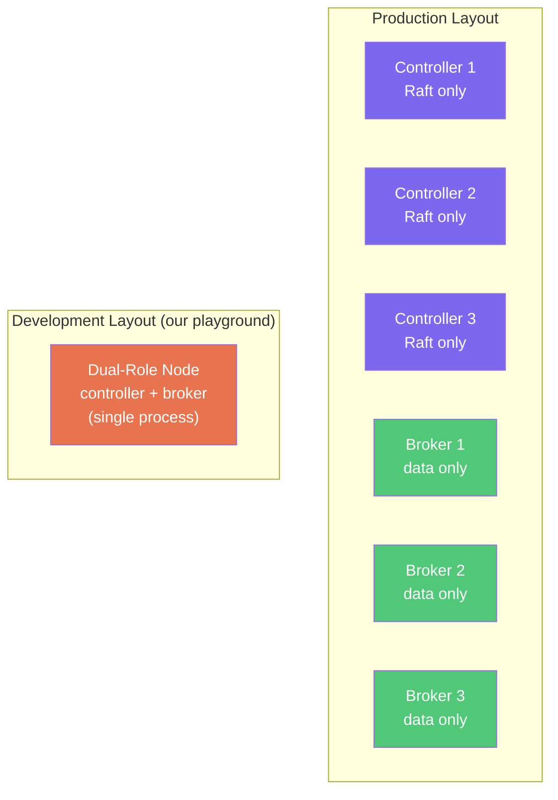
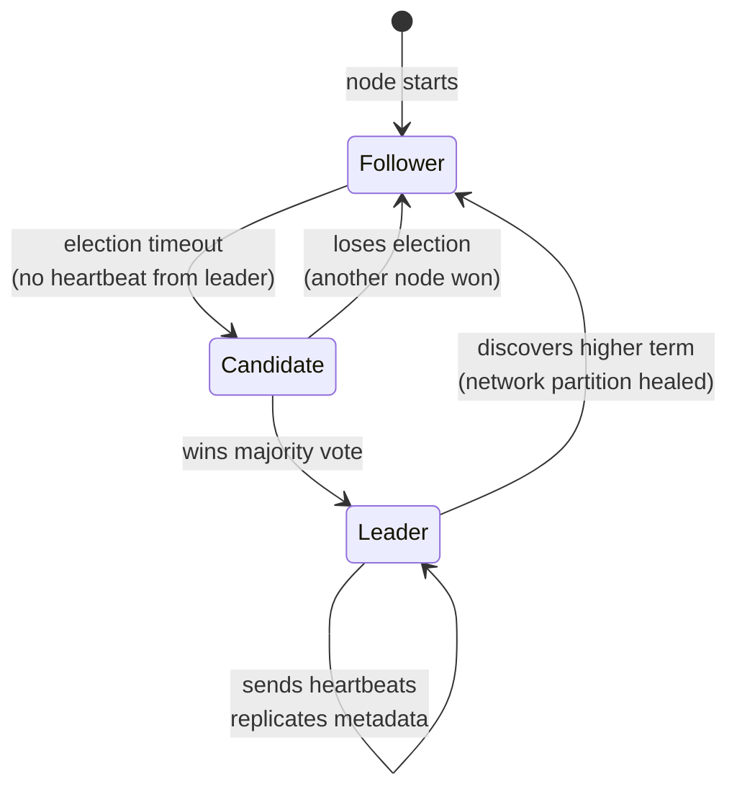

# KRaft — Kafka Without ZooKeeper

## Overview

KRaft (Kafka Raft) replaces ZooKeeper with a built-in Raft consensus protocol for cluster metadata management. ZooKeeper was removed in Kafka 4.0 — KRaft is the only mode.

| Property | Value |
|----------|-------|
| Available since | Kafka 3.3 (preview), 3.6 (production-ready) |
| ZooKeeper removed | Kafka 4.0 |
| Protocol | Raft consensus (adapted for Kafka metadata) |
| Metadata storage | Internal `__cluster_metadata` topic |

## ZooKeeper vs KRaft



### What Changed

| Aspect | ZooKeeper | KRaft |
|--------|-----------|-------|
| **Metadata store** | ZooKeeper znodes (separate process, separate protocol) | Internal `__cluster_metadata` topic (same protocol as data) |
| **Consensus** | ZAB (ZooKeeper Atomic Broadcast) | Raft (built into Kafka binary) |
| **Controller election** | ZooKeeper elects one broker as controller | Raft elects a leader among dedicated controller nodes |
| **Metadata propagation** | Controller pushes updates to brokers via RPC | Brokers fetch metadata from the `__cluster_metadata` topic (same as consuming any topic) |
| **Deployment** | Kafka cluster + ZooKeeper cluster (2 separate systems) | Just Kafka (single system) |
| **Startup time** | Minutes (load all metadata from ZK) | Seconds (read local metadata log) |
| **Metadata limit** | ~200K partitions (ZK becomes bottleneck) | Millions of partitions (log-based, no tree traversal) |

## How KRaft Works

### The Metadata Log

All cluster metadata is stored as an append-only log in the `__cluster_metadata` topic — same storage engine as regular Kafka data:



Every metadata change (topic created, partition reassigned, broker joined, config updated) is appended as a record. Controllers replicate this log via Raft. Brokers consume from it to stay up to date.

### Raft Consensus

The controller quorum uses Raft to agree on the order of metadata records:



**Quorum**: With 3 controllers, 2 must agree (majority). This tolerates 1 controller failure. With 5 controllers, 3 must agree (tolerates 2 failures).

### Metadata Version

The metadata version controls which **record types** are allowed in the `__cluster_metadata` log:

```
Kafka 3.6  → metadataVersion: 3.6-IV2  → supports: basic topics, partitions, ACLs
Kafka 3.8  → metadataVersion: 3.8-IV0  → adds: delegation tokens, SCRAM
Kafka 4.0  → metadataVersion: 4.0-IV0  → adds: ZK migration records
Kafka 4.1  → metadataVersion: 4.1-IV1  → adds: share groups, ELR
```

**Why it matters for upgrades:**



- You can run Kafka 4.1 binaries with `metadataVersion: 4.0-IV0` — it just won't use 4.1 features
- Once you bump the metadata version, **you cannot downgrade** — the log may contain records that older versions can't parse
- This is set in the Kafka CR: `spec.kafka.metadataVersion: "4.1-IV1"`

## Node Roles

In KRaft mode, each Kafka node has one or more roles:



| Role | What it does | Memory profile |
|------|-------------|----------------|
| **Controller** | Participates in Raft quorum, manages cluster metadata | Low (metadata only, no data) |
| **Broker** | Stores topic partitions, serves produce/consume requests | High (data + page cache) |
| **Dual-role** | Does both in a single process | Combined |

### When to use each

| Layout | When |
|--------|------|
| **Dual-role (1 node)** | Development, testing, single-node playground |
| **Dual-role (3 nodes)** | Small clusters where separate controllers waste resources |
| **Separate roles** | Production — isolate controller from data traffic. A broker OOM or disk full won't kill the controller quorum |

In Strimzi, roles are set via KafkaNodePool:

```yaml
# Our playground — 1 dual-role node
apiVersion: kafka.strimzi.io/v1beta2
kind: KafkaNodePool
metadata:
  name: dual-role
spec:
  replicas: 1
  roles:
    - controller
    - broker
```

```yaml
# Production — separate pools
---
kind: KafkaNodePool
metadata:
  name: controllers
spec:
  replicas: 3
  roles:
    - controller     # only Raft, no data
---
kind: KafkaNodePool
metadata:
  name: brokers
spec:
  replicas: 6
  roles:
    - broker         # only data, no Raft
```

## Controller Quorum — How Leader Election Works



1. All controllers start as **followers**
2. If a follower doesn't hear from the leader within the election timeout, it becomes a **candidate** and requests votes
3. A candidate that receives majority votes becomes the **leader**
4. The leader appends records to the metadata log and replicates to followers
5. If the leader crashes, followers detect the missing heartbeat and start a new election

**Split-brain protection**: Raft guarantees only one leader per term. A leader with a stale term (from a network partition) will step down when it sees a higher term.

## Metadata Snapshots

The metadata log grows forever. To prevent unbounded disk usage, controllers periodically create **snapshots**:

```
Log:      [record 1] [record 2] ... [record 10000] [snapshot @ 10000] [record 10001] ...
                                                         ↑
                                              compact state of all records 1-10000
                                              (old log segments can be deleted)
```

A new broker joining the cluster fetches the latest snapshot + records after it, instead of replaying the entire log from the beginning. This is why KRaft startup is fast — seconds vs minutes with ZooKeeper.

## Strimzi Configuration

In our cluster, KRaft is enabled via annotations on the Kafka CR:

```yaml
apiVersion: kafka.strimzi.io/v1beta2
kind: Kafka
metadata:
  name: events-kafka
  annotations:
    strimzi.io/node-pools: enabled    # use KafkaNodePool for node config
    strimzi.io/kraft: enabled         # KRaft mode (no ZooKeeper)
spec:
  kafka:
    version: 4.1.1
    metadataVersion: "4.1-IV1"        # KRaft metadata protocol version
    listeners:
      - name: plain
        port: 9092
        type: internal
        tls: false
    config:
      # Single-node overrides (no replication possible)
      offsets.topic.replication.factor: 1
      transaction.state.log.replication.factor: 1
      default.replication.factor: 1
      min.insync.replicas: 1
```

Strimzi handles all KRaft internals automatically — `__cluster_metadata` topic creation, controller quorum bootstrap, voter configuration. You just set the annotation and define node pools with roles.
