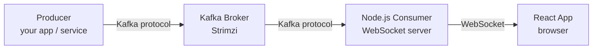
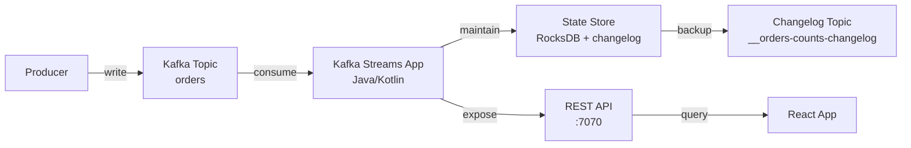
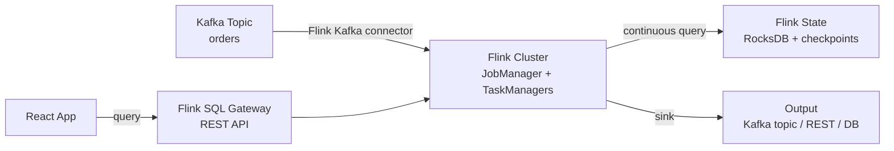

# Real-Time Kafka Consumption for Frontend Visualization

## Architecture



Kafka speaks its own binary protocol — browsers can't connect directly. A thin **Node.js service** sits between Kafka and React: it consumes messages from Kafka and pushes them to connected browsers via WebSocket.

## Why This Works Without Redis

The common pattern for real-time dashboards is: Producer → Kafka → Redis (pub/sub) → WebSocket → Browser. The Node.js consumer **eliminates Redis** by consuming directly from Kafka and pushing to WebSocket clients.

```
Traditional:     Producer → Kafka → Redis pub/sub → WS server → Browser
                                     ^^^^^^^^^^^
                                     unnecessary hop

Without Redis:   Producer → Kafka → Node.js (consumer + WS) → Browser
```

For tail reads (latest messages), Kafka serves from the OS **page cache** (RAM) — latency is ~1ms, comparable to Redis. You're not reading old data from disk; you're reading what just arrived.

## How Kafka Tail Reads Work

When a consumer reads the **latest** messages (which is what real-time visualization does), the data path is:

```
Producer writes message
    ↓
Broker appends to log file
    ↓
OS keeps the write in page cache (RAM)
    ↓
Consumer requests latest offset
    ↓
Broker reads from page cache (NOT disk)
    ↓
Data served in ~1ms
```

The OS page cache acts as an implicit in-memory cache. As long as:
- The consumer keeps up with the producer (reads "the tail")
- The broker has enough RAM for the working set

...reads never hit disk. This is why Kafka can serve millions of messages/sec — it's effectively reading from RAM for active consumers.

**When does it hit disk?** Only when a consumer falls behind (reads data older than what fits in page cache) or when the broker is memory-constrained.

## Component Details

### 1. Kafka Broker (Strimzi)

Already deployed. The plain listener on port 9092 is used by the Node.js consumer:

```
events-kafka-kafka-bootstrap.kafka.svc.cluster.local:9092
```

No special configuration needed — the existing cluster serves real-time consumers the same way it serves batch consumers.

### 2. Node.js Consumer + WebSocket Server

A lightweight service that:
1. Connects to Kafka as a consumer group
2. Subscribes to one or more topics
3. Pushes each message to all connected WebSocket clients

```javascript
// server.js
import { Kafka } from 'kafkajs';
import { WebSocketServer } from 'ws';

// --- Kafka consumer setup ---
const kafka = new Kafka({
  clientId: 'realtime-bridge',
  brokers: ['events-kafka-kafka-bootstrap.kafka.svc.cluster.local:9092'],
});

const consumer = kafka.consumer({
  groupId: 'realtime-dashboard',
  // Start from latest — we only care about new messages
  // (no need to replay history on connect)
});

// --- WebSocket server ---
const wss = new WebSocketServer({ port: 8080 });
const clients = new Set();

wss.on('connection', (ws) => {
  clients.add(ws);
  ws.on('close', () => clients.delete(ws));
});

function broadcast(data) {
  const payload = JSON.stringify(data);
  for (const client of clients) {
    if (client.readyState === 1) {  // OPEN
      client.send(payload);
    }
  }
}

// --- Connect and consume ---
await consumer.connect();
await consumer.subscribe({ topics: ['orders'], fromBeginning: false });

await consumer.run({
  eachMessage: async ({ topic, partition, message }) => {
    broadcast({
      topic,
      partition,
      offset: message.offset,
      key: message.key?.toString(),
      value: JSON.parse(message.value.toString()),
      timestamp: message.timestamp,
    });
  },
});
```

**Key settings:**
- `fromBeginning: false` — only receive new messages, don't replay history
- `groupId` — Kafka tracks consumer position; if the service restarts, it resumes from where it left off
- No batching/buffering — each message is pushed immediately for lowest latency

### 3. React Frontend

Connect to the WebSocket server and render messages as they arrive:

```jsx
// useKafkaStream.js — custom React hook
import { useState, useEffect, useRef } from 'react';

export function useKafkaStream(wsUrl, maxMessages = 100) {
  const [messages, setMessages] = useState([]);
  const wsRef = useRef(null);

  useEffect(() => {
    const ws = new WebSocket(wsUrl);
    wsRef.current = ws;

    ws.onmessage = (event) => {
      const msg = JSON.parse(event.data);
      setMessages((prev) => {
        const next = [msg, ...prev];
        // Keep only the last N messages (sliding window)
        return next.length > maxMessages ? next.slice(0, maxMessages) : next;
      });
    };

    ws.onclose = () => {
      // Reconnect after 2 seconds
      setTimeout(() => {
        wsRef.current = new WebSocket(wsUrl);
      }, 2000);
    };

    return () => ws.close();
  }, [wsUrl, maxMessages]);

  return messages;
}
```

```jsx
// Dashboard.jsx
import { useKafkaStream } from './useKafkaStream';

export function Dashboard() {
  const messages = useKafkaStream('ws://localhost:8080', 50);

  return (
    <div>
      <h2>Live Orders</h2>
      <table>
        <thead>
          <tr><th>Time</th><th>Key</th><th>Value</th></tr>
        </thead>
        <tbody>
          {messages.map((msg, i) => (
            <tr key={msg.offset}>
              <td>{new Date(Number(msg.timestamp)).toLocaleTimeString()}</td>
              <td>{msg.key}</td>
              <td>{JSON.stringify(msg.value)}</td>
            </tr>
          ))}
        </tbody>
      </table>
    </div>
  );
}
```

## Multi-Topic Support

The Node.js service can subscribe to multiple topics. Clients can filter by topic:

```javascript
// Server: subscribe to multiple topics
await consumer.subscribe({ topics: ['orders', 'payments', 'alerts'] });

// Broadcast includes topic name
broadcast({ topic, partition, ...message });
```

```javascript
// Client: filter by topic
ws.onmessage = (event) => {
  const msg = JSON.parse(event.data);
  if (msg.topic === 'orders') {
    // update orders chart
  } else if (msg.topic === 'alerts') {
    // show notification
  }
};
```

Or use separate WebSocket endpoints per topic — the Node.js service can route based on URL path:

```
ws://bridge:8080/topics/orders     → only orders messages
ws://bridge:8080/topics/alerts     → only alerts messages
ws://bridge:8080/topics/*          → all messages
```

## Aggregation (Replacing Redis Counters/Gauges)

If you need aggregated metrics (orders per minute, running totals, averages) rather than raw messages, the Node.js service can compute them in-memory:

```javascript
// In-memory sliding window aggregation
const windows = new Map();  // topic → { count, sum, windowStart }

function updateAggregation(topic, value) {
  const now = Date.now();
  const windowMs = 60_000;  // 1-minute window

  if (!windows.has(topic)) {
    windows.set(topic, { count: 0, sum: 0, windowStart: now });
  }

  const w = windows.get(topic);

  // Reset window if expired
  if (now - w.windowStart > windowMs) {
    w.count = 0;
    w.sum = 0;
    w.windowStart = now;
  }

  w.count++;
  w.sum += value;
}

// Broadcast aggregates every second
setInterval(() => {
  const aggregates = {};
  for (const [topic, w] of windows) {
    aggregates[topic] = {
      count: w.count,
      sum: w.sum,
      avg: w.count > 0 ? w.sum / w.count : 0,
      windowStart: w.windowStart,
    };
  }
  broadcast({ type: 'aggregates', data: aggregates });
}, 1000);
```

For complex aggregations (joins, windowed counts across partitions, exactly-once), use **Kafka Streams** (Java) instead of hand-rolling in Node.js.

## Deployment on Kubernetes

The Node.js service runs as a regular K8s Deployment:

```yaml
apiVersion: apps/v1
kind: Deployment
metadata:
  name: kafka-ws-bridge
  namespace: kafka
spec:
  replicas: 1
  selector:
    matchLabels:
      app: kafka-ws-bridge
  template:
    metadata:
      labels:
        app: kafka-ws-bridge
    spec:
      containers:
        - name: bridge
          image: node:22-alpine
          command: ["node", "server.js"]
          ports:
            - containerPort: 8080
          env:
            - name: KAFKA_BROKERS
              value: "events-kafka-kafka-bootstrap.kafka.svc.cluster.local:9092"
---
apiVersion: v1
kind: Service
metadata:
  name: kafka-ws-bridge
  namespace: kafka
spec:
  selector:
    app: kafka-ws-bridge
  ports:
    - port: 8080
      targetPort: 8080
```

## Latency Expectations

```
Producer → Broker:           ~1-5ms  (Kafka protocol, in-cluster network)
Broker page cache read:      ~1ms    (RAM, no disk)
Consumer poll interval:      ~100ms  (kafkajs default, configurable)
WebSocket push:              ~1ms    (in-cluster to browser)
─────────────────────────────────────
End-to-end:                  ~100-200ms (dominated by consumer poll interval)
```

To reduce latency further:
- Set `maxWaitTimeInMs: 10` in kafkajs consumer config (default 5000ms — waits for batch)
- Set `minBytes: 1` (return immediately when any data available)

```javascript
await consumer.run({
  eachBatchAutoResolve: true,
  eachBatch: async ({ batch, resolveOffset, heartbeat }) => {
    for (const message of batch.messages) {
      broadcast(/* ... */);
      resolveOffset(message.offset);
    }
    await heartbeat();
  },
});

// In consumer config:
const consumer = kafka.consumer({
  groupId: 'realtime-dashboard',
  maxWaitTimeInMs: 50,     // poll more aggressively
  minBytes: 1,             // don't wait for batch to fill
});
```

With tuned settings, end-to-end latency drops to **~50-100ms**.

## Kafka Streams + REST API (Redis Replacement)

Kafka Streams is a **Java client library** (not a server) that processes Kafka topics and maintains **state stores** — local key-value databases (RocksDB) backed by Kafka changelog topics. Combined with interactive queries, it becomes a queryable cache that replaces Redis.

### How It Works



1. **Kafka Streams** consumes from input topics continuously
2. **Processes** messages — aggregates, joins, windows, transforms
3. **Writes results** to a local state store (RocksDB on disk, cached in memory)
4. **Backs up** state to a Kafka changelog topic (survives crashes — state is rebuilt on restart)
5. **REST API** serves point lookups and range scans from the state store

### What State Stores Replace

| Redis pattern | Kafka Streams equivalent |
|--------------|-------------------------|
| `SET order:123 {...}` | KTable — latest value per key |
| `INCR orders:count` | Aggregation — `count()` / `reduce()` |
| `ZADD leaderboard score user` | Windowed aggregation with custom serde |
| `GET order:123` | Interactive query on KTable state store |
| `HGETALL orders:hourly` | Windowed store — `fetch(key, timeFrom, timeTo)` |
| Key expiry (TTL) | Windowed stores auto-expire, or use punctuators |

### Code Example — Orders Per Minute + Lookup by Key

```java
// OrdersStreamApp.java
public class OrdersStreamApp {

    public static void main(String[] args) {
        var props = new Properties();
        props.put(StreamsConfig.APPLICATION_ID_CONFIG, "orders-aggregator");
        props.put(StreamsConfig.BOOTSTRAP_SERVERS_CONFIG,
            "events-kafka-kafka-bootstrap.kafka.svc.cluster.local:9092");
        props.put(StreamsConfig.STATE_DIR_CONFIG, "/tmp/kafka-streams");

        var builder = new StreamsBuilder();

        // --- KTable: latest order per key (replaces Redis SET/GET) ---
        KTable<String, String> ordersTable = builder.table(
            "orders",
            Materialized.<String, String, KeyValueStore<Bytes, byte[]>>as("orders-store")
        );

        // --- Windowed count: orders per minute (replaces Redis INCR) ---
        KStream<String, String> ordersStream = builder.stream("orders");

        ordersStream
            .groupByKey()
            .windowedBy(TimeWindows.ofSizeWithNoGrace(Duration.ofMinutes(1)))
            .count(Materialized.<String, Long, WindowStore<Bytes, byte[]>>as("orders-per-minute"))
            ;

        var streams = new KafkaStreams(builder.build(), props);
        streams.start();

        // --- REST API for interactive queries ---
        startRestApi(streams, 7070);
    }

    static void startRestApi(KafkaStreams streams, int port) {
        // Using Javalin (lightweight HTTP framework)
        var app = Javalin.create().start(port);

        // GET /orders/:key — point lookup (like Redis GET)
        app.get("/orders/{key}", ctx -> {
            ReadOnlyKeyValueStore<String, String> store =
                streams.store(StoreQueryParameters.fromNameAndType(
                    "orders-store", QueryableStoreTypes.keyValueStore()));

            String value = store.get(ctx.pathParam("key"));
            if (value == null) {
                ctx.status(404);
            } else {
                ctx.json(value);
            }
        });

        // GET /orders/stats/per-minute — windowed aggregation
        app.get("/orders/stats/per-minute", ctx -> {
            ReadOnlyWindowStore<String, Long> store =
                streams.store(StoreQueryParameters.fromNameAndType(
                    "orders-per-minute", QueryableStoreTypes.windowStore()));

            var now = Instant.now();
            var results = new HashMap<String, Long>();

            try (var iter = store.fetchAll(now.minus(Duration.ofMinutes(5)), now)) {
                while (iter.hasNext()) {
                    var entry = iter.next();
                    results.put(entry.key.key() + "@" + entry.key.window().startTime(),
                                entry.value);
                }
            }
            ctx.json(results);
        });
    }
}
```

### React Consuming from Kafka Streams REST

```jsx
// useOrderStats.js — poll REST API
import { useState, useEffect } from 'react';

export function useOrderStats(baseUrl, intervalMs = 1000) {
  const [stats, setStats] = useState({});

  useEffect(() => {
    const id = setInterval(async () => {
      const res = await fetch(`${baseUrl}/orders/stats/per-minute`);
      setStats(await res.json());
    }, intervalMs);
    return () => clearInterval(id);
  }, [baseUrl, intervalMs]);

  return stats;
}

// Point lookup — like Redis GET
async function getOrder(baseUrl, key) {
  const res = await fetch(`${baseUrl}/orders/${key}`);
  if (res.status === 404) return null;
  return res.json();
}
```

### State Store Durability

Unlike Redis (data in memory, lost on crash unless AOF/RDB enabled), Kafka Streams state is **durable by default**:

```
Write to state store
    ↓
RocksDB persists to local disk
    ↓
Changelog entry sent to Kafka topic (__orders-store-changelog)
    ↓
If pod crashes → new pod replays changelog → state rebuilt
```

- **No data loss** — changelog topic is the source of truth
- **No separate backup** — Kafka IS the backup
- **Fast recovery** — standby replicas can pre-load state for instant failover

### Deployment on Kubernetes

```yaml
apiVersion: apps/v1
kind: Deployment
metadata:
  name: orders-stream-app
  namespace: kafka
spec:
  replicas: 3    # matches topic partitions for parallel processing
  selector:
    matchLabels:
      app: orders-stream-app
  template:
    metadata:
      labels:
        app: orders-stream-app
    spec:
      containers:
        - name: app
          image: my-registry/orders-stream-app:latest
          ports:
            - containerPort: 7070
          env:
            - name: KAFKA_BROKERS
              value: "events-kafka-kafka-bootstrap.kafka.svc.cluster.local:9092"
          volumeMounts:
            - name: state
              mountPath: /tmp/kafka-streams
      volumes:
        - name: state
          emptyDir: {}    # local state, rebuilt from changelog on restart
---
apiVersion: v1
kind: Service
metadata:
  name: orders-stream-app
  namespace: kafka
spec:
  selector:
    app: orders-stream-app
  ports:
    - port: 7070
      targetPort: 7070
```

**Scaling:** Kafka Streams partitions work across replicas automatically. With 3 topic partitions and 3 replicas, each replica processes 1 partition. Interactive queries route to the correct replica transparently.

### When Kafka Streams Makes Sense (vs Node.js)

| Need | Node.js + WS | Kafka Streams + REST |
|------|-------------|---------------------|
| Raw event stream to browser | Best choice | Overkill |
| Simple counts/sums | Fine (in-memory Map) | Better (durable, survives restart) |
| Windowed aggregation (last 5 min avg) | Manual, single-node only | Built-in, distributed |
| Joins (orders + payments) | Very hard | Built-in (KStream-KTable join) |
| Key-value lookup by ID | Not designed for this | Interactive queries (like Redis GET) |
| Exactly-once processing | Not possible | Built-in (`processing.guarantee: exactly_once_v2`) |
| Horizontal scaling | Single consumer | Automatic partition assignment |
| State after restart | Lost | Rebuilt from changelog |

## Redis vs Kafka Streams — Direct Comparison

### Architecture

```
Redis approach:
  Producer → Kafka → Redis Sink Connector → Redis ← React (GET/SUB)
                                              ↑
                                    separate stateful service
                                    separate backup (RDB/AOF)
                                    separate monitoring

Kafka Streams approach:
  Producer → Kafka → Kafka Streams App (state store + REST) ← React (GET)
                         ↑
                    state backed by Kafka itself
                    no separate database
                    no separate backup
```

### Feature-by-Feature

| Feature | Redis | Kafka Streams |
|---------|-------|---------------|
| **Read latency** | ~0.1-1ms (memory only) | ~1-5ms (RocksDB, hot data in block cache) |
| **Write path** | Producer → Kafka → Connector → Redis | Producer → Kafka → Streams app (automatic) |
| **Data model** | Key-value, sets, sorted sets, streams, hashes | KTable (key-value), windowed stores, session stores |
| **Query** | Rich — `GET`, `HGETALL`, `ZRANGE`, `XREAD`, Lua scripts | Point lookup + range scan only (no ad-hoc queries) |
| **Durability** | Optional — RDB snapshots / AOF log (can lose ~1s of data) | Always durable — changelog topic in Kafka (zero data loss) |
| **Recovery** | Load RDB/AOF from disk (slow for large datasets) | Replay changelog from Kafka (parallelized, fast) |
| **Scaling** | Redis Cluster (hash slots, manual resharding) | Automatic (Kafka partition assignment, rebalance on scale) |
| **Extra infrastructure** | Redis server + Kafka Connect + Sink Connector | None — Kafka IS the infrastructure |
| **Memory** | ALL data in RAM (expensive at scale) | Hot data in RocksDB block cache, rest on disk |
| **TTL / expiry** | Built-in per key (`EXPIRE`) | Windowed stores auto-expire; KTable needs manual tombstones |
| **Pub/sub** | Built-in (`SUBSCRIBE`) | Not built-in (use Node.js WS bridge for push) |
| **Language** | Any (Redis clients for every language) | JVM only (Java, Kotlin, Scala) |
| **Ops complexity** | High — separate cluster, backup, monitoring, memory management | Low — runs as K8s Deployment, Kafka handles state |

### Cost at Scale

```
Redis (100 GB working set):
  └── 100 GB RAM required (all data in memory)
  └── Redis Cluster with N shards
  └── Kafka Connect cluster (separate) to sync data
  └── Total: 100+ GB RAM + connector overhead

Kafka Streams (100 GB working set):
  └── ~10-20 GB RAM (RocksDB block cache for hot data)
  └── 100 GB local SSD (RocksDB SST files)
  └── State backed by Kafka (already running)
  └── Total: 20 GB RAM + 100 GB SSD (much cheaper)
```

### Where Redis Wins

- **Sub-millisecond reads** — if you need <1ms P99 latency on every read, Redis in-memory is unbeatable
- **Rich data structures** — sorted sets, HyperLogLog, bitmaps, geo indexes — Kafka Streams only has key-value and windowed stores
- **Ad-hoc queries** — Redis supports complex queries (`ZRANGEBYSCORE`, `SCAN`, Lua scripts); Kafka Streams only supports `get(key)` and `range(from, to)`
- **Pub/sub built-in** — `SUBSCRIBE` pushes updates to clients; Kafka Streams needs a separate WebSocket layer
- **Multi-language** — Redis clients exist for every language; Kafka Streams is JVM-only

### Where Kafka Streams Wins

- **No extra infrastructure** — state lives in Kafka (already deployed), no separate database to manage
- **Guaranteed durability** — changelog topics are replicated and persistent; Redis can lose data between snapshots
- **Cheaper at scale** — hot data in memory, cold data on disk (RocksDB); Redis keeps everything in RAM
- **Exactly-once processing** — built-in transactional semantics; Redis + Kafka Connect is at-least-once
- **Automatic scaling** — add replicas, Kafka rebalances partitions and state automatically; Redis Cluster needs manual resharding
- **Stream processing built-in** — joins, windowed aggregations, filters, transforms in the same app; with Redis you need a separate processing layer

### Decision

```
Do you need sub-millisecond reads?
  └── YES → Redis
  └── NO ↓

Do you need rich data structures (sorted sets, geo, HyperLogLog)?
  └── YES → Redis
  └── NO ↓

Do you need durable state without extra infrastructure?
  └── YES → Kafka Streams
  └── NO ↓

Do you need stream processing (joins, windows, aggregations)?
  └── YES → Kafka Streams
  └── NO ↓

Do you need multi-language client access?
  └── YES → Redis
  └── NO → Kafka Streams (simpler ops)
```

**For this playground:** Kafka Streams is the better fit — you already have Kafka, adding Redis is another stateful service to manage. The ~1-5ms read latency is fine for dashboards. If you later need sub-millisecond reads or sorted sets, add Redis as a targeted cache for that specific use case.

## Flink SQL — Stream Processing with SQL

Apache Flink is a **distributed stream processing engine**. Unlike Kafka Streams (a library embedded in your app), Flink is a standalone cluster that runs stream processing jobs. Flink SQL lets you write streaming queries in standard SQL.

### How It Works



1. **Flink Kafka connector** consumes from Kafka topics as unbounded streams
2. **SQL queries** run continuously — every new message triggers incremental computation
3. **State** is maintained in RocksDB, checkpointed to S3/HDFS for durability
4. **Results** can be written to another Kafka topic, a database, or queried via Flink SQL Gateway

### Example — Orders Per Minute in SQL

```sql
-- Define Kafka source table
CREATE TABLE orders (
    order_id STRING,
    customer_id STRING,
    amount DECIMAL(10, 2),
    order_time TIMESTAMP(3),
    WATERMARK FOR order_time AS order_time - INTERVAL '5' SECOND
) WITH (
    'connector' = 'kafka',
    'topic' = 'orders',
    'properties.bootstrap.servers' = 'events-kafka-kafka-bootstrap.kafka.svc.cluster.local:9092',
    'format' = 'json',
    'scan.startup.mode' = 'latest-offset'
);

-- Continuous query: orders per minute per customer
SELECT
    customer_id,
    TUMBLE_START(order_time, INTERVAL '1' MINUTE) AS window_start,
    COUNT(*) AS order_count,
    SUM(amount) AS total_amount
FROM orders
GROUP BY
    customer_id,
    TUMBLE(order_time, INTERVAL '1' MINUTE);

-- Write results to a Kafka sink topic (for downstream consumers)
CREATE TABLE order_stats (
    customer_id STRING,
    window_start TIMESTAMP(3),
    order_count BIGINT,
    total_amount DECIMAL(10, 2)
) WITH (
    'connector' = 'kafka',
    'topic' = 'order-stats',
    'properties.bootstrap.servers' = 'events-kafka-kafka-bootstrap.kafka.svc.cluster.local:9092',
    'format' = 'json'
);

INSERT INTO order_stats
SELECT customer_id, TUMBLE_START(order_time, INTERVAL '1' MINUTE), COUNT(*), SUM(amount)
FROM orders
GROUP BY customer_id, TUMBLE(order_time, INTERVAL '1' MINUTE);
```

This is **much more readable** than the equivalent Kafka Streams Java code — and supports operations that would be painful in Kafka Streams (multi-way joins, pattern matching, complex windows).

### What Flink SQL Can Do That Others Can't

| Capability | Kafka Streams | Flink SQL |
|-----------|---------------|-----------|
| Windowed aggregation | Yes (Java API) | Yes (SQL `TUMBLE`, `HOP`, `SESSION`) |
| Multi-way joins | 2-way only (KStream-KTable) | N-way joins in SQL |
| Pattern matching (CEP) | No | Yes (`MATCH_RECOGNIZE` — SQL standard) |
| Temporal joins | Limited | Full support (join with versioned table) |
| Late data handling | Manual | Built-in watermarks + allowed lateness |
| Ad-hoc queries | No (must compile Java app) | Yes (submit SQL at runtime via SQL Gateway) |
| Batch + stream | Stream only | Unified — same SQL for batch and stream |

### Complex Event Processing (CEP) Example

Find orders where the same customer places 3+ orders within 10 minutes (fraud detection):

```sql
SELECT *
FROM orders
MATCH_RECOGNIZE (
    PARTITION BY customer_id
    ORDER BY order_time
    MEASURES
        FIRST(A.order_time) AS first_order,
        LAST(A.order_time) AS last_order,
        COUNT(A.order_id) AS order_count
    ONE ROW PER MATCH
    AFTER MATCH SKIP PAST LAST ROW
    PATTERN (A{3,})
    DEFINE
        A AS A.order_time - FIRST(A.order_time) < INTERVAL '10' MINUTE
);
```

This is impossible to express cleanly in Kafka Streams — you'd need custom processor topology with manual state management.

### Deployment on Kubernetes

Flink has a native Kubernetes operator:

```yaml
# Flink Kubernetes Operator (deploy via Helm)
helm install flink-operator flink-operator \
  --repo https://downloads.apache.org/flink/flink-kubernetes-operator-1.10.0/ \
  -n flink --create-namespace

# Then submit a FlinkDeployment CR:
apiVersion: flink.apache.org/v1beta1
kind: FlinkDeployment
metadata:
  name: orders-analytics
  namespace: flink
spec:
  image: flink:1.20
  flinkVersion: v1_20
  flinkConfiguration:
    state.backend: rocksdb
    state.checkpoints.dir: s3://flink-checkpoints/orders-analytics
  jobManager:
    resource:
      memory: "1Gi"
      cpu: 0.5
  taskManager:
    resource:
      memory: "2Gi"
      cpu: 1
    replicas: 2
  job:
    jarURI: local:///opt/flink/usrlib/orders-analytics.jar
    parallelism: 3
```

### Flink SQL Gateway — REST API for React

Flink SQL Gateway exposes a REST API for submitting queries and fetching results:

```bash
# Submit a query
curl -X POST http://flink-sql-gateway:8083/v1/sessions/{session}/statements \
  -d '{"statement": "SELECT customer_id, COUNT(*) FROM orders GROUP BY customer_id"}'

# Fetch results
curl http://flink-sql-gateway:8083/v1/sessions/{session}/statements/{statement}/result/0
```

React can poll this endpoint or you can pipe results to a Kafka topic → Node.js WebSocket bridge.

### Scale and Data Size

Flink handles massive scale — it's used in production at Alibaba (trillions of events/day), Netflix, Uber, and Spotify.

**Throughput:**

| Component | Capacity |
|-----------|----------|
| Single TaskManager | ~100K-1M events/sec (depends on query complexity) |
| Cluster (10 TaskManagers) | ~1-10M events/sec |
| Max tested (Alibaba) | 4+ billion events/sec across cluster |

**State size:**

Flink state is backed by RocksDB — data lives on local SSD with a memory cache. Unlike Spark which accumulates state per micro-batch in memory, Flink can hold **terabytes** of state per job:

```
State backend       Max state size    How it works
────────────────    ──────────────    ─────────────────────────────
HashMapStateBackend ~1-10 GB          All state in JVM heap (fast, limited)
RocksDBStateBackend ~TBs              State on local SSD, hot data cached in memory
                                      Checkpointed incrementally to S3
```

**Checkpointing** (state durability):

```
Flink job running → periodic checkpoint (every 30s-5min)
    ↓
RocksDB state → incremental snapshot → upload to S3/HDFS
    ↓
If TaskManager crashes → restart from last checkpoint
    ↓
State restored from S3 → resume processing from Kafka offset at checkpoint
```

- Checkpoint size can be TBs — incremental checkpoints only upload the **delta** (changed SST files), not the full state
- Checkpoint interval is configurable — shorter = less data loss on crash, more I/O overhead
- S3/Ceph RGW works as checkpoint storage (same as Kafka tiered storage)

**Scaling comparison:**

| Dimension | Flink | Spark Structured Streaming | Kafka Streams |
|-----------|-------|--------------------------|---------------|
| **Max throughput** | Millions/sec (per cluster) | Millions/sec (per cluster) | Hundreds of thousands/sec (per app instance) |
| **Max state** | TBs (RocksDB + S3 checkpoints) | GBs (in-memory per batch, checkpointed) | TBs (RocksDB + Kafka changelog) |
| **Scaling unit** | TaskManager slots (parallelism) | Executors (Spark partitions) | Kafka partitions (consumer group) |
| **Scale out** | Increase parallelism + TaskManagers | Increase executors | Increase app replicas (up to partition count) |
| **Bottleneck** | S3 checkpoint bandwidth at very large state | Driver OOM at high state; micro-batch scheduling overhead | Single-topic partition count limits parallelism |

**For this playground:** Scale is not a concern — any of these tools handle playground-level data easily. At production scale (>100K events/sec, >100GB state), Flink and Spark are both viable. Kafka Streams starts to struggle past ~500K events/sec per instance because it's a single-process library, not a distributed cluster.

## Why Flink and Not Spark Structured Streaming?

You already have Spark in the cluster — so why add Flink? Both can process Kafka streams, but they have fundamentally different execution models:

### Execution Model

Spark Structured Streaming supports **two** processing modes:

```
Spark — Micro-Batch Mode (default):
  Kafka → collect batch (every 100ms-10s) → process batch → write output
  ~~~~~~~~  ██████████  ~~~~~~~~~~~~  ██████████  ~~~~~~~~~~~~
            batch 1                   batch 2
            (collect → process)       (collect → process)

Spark — Continuous Processing Mode (experimental, since Spark 2.3):
  Kafka → process each event immediately → write output
  ═══════════════════════════════════════════════════════
  continuous pipeline, ~1ms latency

Flink:
  Kafka → process each event immediately → write output
  ═══════════════════════════════════════════════════════
  continuous pipeline, event-by-event
```

**Micro-Batch** (default) collects events for a time interval, then processes them as a batch. This is the mature, production-proven mode.

**Continuous Processing** (experimental) processes events one-by-one with ~1ms latency — similar to Flink. However, it has significant limitations:
- Only supports **map-like operations** (select, filter, map, flatMap)
- **No aggregations, joins, or windowing** — these still require micro-batch mode
- **No exactly-once** — only at-least-once semantics
- **Still experimental** as of Spark 4.x — API may change, limited production adoption
- Trigger syntax: `.trigger(continuous="1 second")` (the interval is the checkpoint interval, not batch size)

Flink processes **event-by-event** with full operator support (aggregations, joins, windows, CEP) — no limitations on which operations run in continuous mode.

### Head-to-Head

| Feature | Spark Structured Streaming | Flink |
|---------|--------------------------|-------|
| **Latency (micro-batch)** | ~100ms-10s (configurable trigger interval) | — |
| **Latency (continuous)** | ~1ms (experimental, map-only ops) | ~10-50ms (all operators) |
| **Processing model** | Micro-batch (default) or Continuous (experimental) | Event-by-event (always) |
| **Continuous mode limits** | No aggregations, joins, windows; at-least-once only | None — all operators supported, exactly-once |
| **SQL support** | Spark SQL (rich, batch-oriented) | Flink SQL (streaming-native, watermarks, CEP) |
| **Windowing** | Tumbling, sliding (via groupBy + window) | Tumbling, sliding, session, custom (first-class) |
| **Event time** | Supported but watermarks are limited | First-class watermarks, late data handling |
| **CEP / pattern matching** | No native support | `MATCH_RECOGNIZE` (SQL standard) |
| **State management** | Per-batch, checkpointed | Continuous, incremental checkpointing |
| **Exactly-once** | Yes (micro-batch); at-least-once (continuous) | Yes (with checkpointing) |
| **Batch + stream** | Yes (unified Spark SQL) | Yes (unified Flink SQL) |
| **Ecosystem** | MLlib, GraphX, Spark SQL analytics | Focused on streaming |
| **You already have it** | Yes (spark-apache operator) | No (new cluster needed) |
| **K8s operator** | spark-kubernetes-operator | flink-kubernetes-operator |

### When Spark Is Better

- **You already have it** — no new infrastructure. This is the biggest advantage.
- **Batch + stream on the same engine** — your Iceberg ingestion, ETL jobs, and ML pipelines already run on Spark. Adding streaming keeps one engine for everything.
- **100ms-1s latency is acceptable** — for dashboards refreshing every second, micro-batch is fine.
- **~1ms latency for simple transforms** — Continuous Processing mode handles select/filter/map with sub-millisecond latency (but no aggregations/joins).
- **Rich analytics** — Spark SQL is more mature for complex analytical queries, UDFs, ML integration.

### When Flink Is Better

- **Sub-100ms latency with aggregations/joins/windows** — Spark's Continuous Processing can't do these; Flink can.
- **Complex event processing (CEP)** — `MATCH_RECOGNIZE` for pattern detection (fraud, anomaly detection). Spark has no equivalent.
- **Session windows** — Flink handles session windows natively; Spark's support is limited.
- **Exactly-once at low latency** — Spark's Continuous Processing only supports at-least-once; Flink gives exactly-once with continuous processing.
- **High-throughput, low-latency** — Flink's continuous operator model handles backpressure better than Spark's batch scheduling overhead.
- **Late data handling** — Flink's watermark model is more flexible (allowed lateness, side outputs for late events).

### Practical Recommendation

```
Do you need sub-100ms latency WITH aggregations/joins/windows?
  └── YES → Flink (Spark's continuous mode can't do aggregations)
  └── NO ↓

Do you need sub-100ms latency for simple transforms only (filter/map)?
  └── YES → Spark Continuous Processing mode (experimental, at-least-once)
  └── NO ↓

Do you need CEP / pattern matching?
  └── YES → Flink
  └── NO ↓

Do you already have Spark in the cluster?
  └── YES → Spark Structured Streaming micro-batch (one less system to manage)
  └── NO → Flink (better streaming primitives)
```

**For this playground:** Start with **Spark Structured Streaming in micro-batch mode** — you already have the operator deployed, and 100ms-1s latency is fine for dashboards. If you need lower latency for simple transforms (filter/map/select), switch the trigger to `continuous="1 second"` for ~1ms latency. For aggregations at low latency, Flink is still needed. The code runs in the same Spark cluster as your batch jobs:

```python
# Spark Structured Streaming — consume from Kafka
from pyspark.sql import SparkSession
from pyspark.sql.functions import window, count, sum as _sum, from_json, col
from pyspark.sql.types import StructType, StringType, DecimalType, TimestampType

spark = SparkSession.builder.appName("orders-stream").getOrCreate()

schema = StructType() \
    .add("order_id", StringType()) \
    .add("customer_id", StringType()) \
    .add("amount", DecimalType(10, 2)) \
    .add("order_time", TimestampType())

# Read from Kafka
orders = spark.readStream \
    .format("kafka") \
    .option("kafka.bootstrap.servers",
            "events-kafka-kafka-bootstrap.kafka.svc.cluster.local:9092") \
    .option("subscribe", "orders") \
    .option("startingOffsets", "latest") \
    .load() \
    .select(from_json(col("value").cast("string"), schema).alias("data")) \
    .select("data.*")

# Windowed aggregation — orders per minute
stats = orders \
    .withWatermark("order_time", "10 seconds") \
    .groupBy(
        col("customer_id"),
        window("order_time", "1 minute")
    ) \
    .agg(count("*").alias("order_count"), _sum("amount").alias("total"))

# Write to console (dev) or Kafka sink topic (prod)
query = stats.writeStream \
    .outputMode("update") \
    .format("console") \
    .option("truncate", False) \
    .trigger(processingTime="1 second") \
    .start()

query.awaitTermination()
```

Only add Flink if you hit a wall with Spark — need sub-100ms latency, CEP, or session windows.

## Alternatives Comparison

| Approach | Latency | Complexity | Aggregation | State | Already deployed? |
|----------|---------|-----------|-------------|-------|-------------------|
| **Node.js consumer + WS** | ~50-200ms | Low | Simple (in-memory, lost on restart) | None | No — custom Deployment |
| **KafkaBridge (HTTP polling)** | ~1-5s | Lowest | None | None | No — Strimzi CRD |
| **Kafka Streams + REST** | ~1-5ms (query) | High | Complex (windowed, joins, exactly-once) | Durable (RocksDB + changelog) | No — custom Java app |
| **Redis** | ~0.1-1ms (query) | High | None built-in (need separate processing) | In-memory (volatile without AOF) | No — separate cluster |
| **Spark Structured Streaming** | ~100ms-1s (micro-batch) / ~1ms (continuous, map-only) | Medium | SQL + DataFrame API, ML integration | Durable (checkpoints) | Yes — spark-apache operator |
| **Flink SQL** | ~10-50ms | Highest | Full SQL, CEP, session windows | Durable (checkpoints) | No — separate Flink cluster |

**Decision guide:**
- **Just show live events** → Node.js + WebSocket
- **Show live events + simple counters** → Node.js + WebSocket with in-memory aggregation
- **Replace Redis for key-value lookups + durable aggregations** → Kafka Streams + REST
- **Sub-millisecond reads + rich data structures** → Redis (but consider if you really need it)
- **Stream analytics with SQL (you already have Spark)** → Spark Structured Streaming
- **Sub-100ms latency + CEP + session windows** → Flink SQL

## Spark 4.0 Streaming Improvements

Spark 4.0 is a major release for streaming — the state management system was rebuilt from scratch.

### transformWithState (replaces mapGroupsWithState)

The old `mapGroupsWithState` / `flatMapGroupsWithState` API is replaced by `transformWithState` — a new arbitrary stateful operator with:

- **Multiple state variables per group** — `ValueState`, `ListState`, `MapState` instead of a single opaque state object
- **Native TTL** — time-to-live per state variable, automatic eviction of expired state (no manual cleanup)
- **Timers** — register processing-time or event-time timers, get called back when they fire
- **Schema evolution** — state schema can evolve across job restarts (Avro encoding)
- **State initialization** — initialize state from an existing dataset when starting a new query

```python
# Spark 4.0 — transformWithState example (PySpark)
from pyspark.sql.streaming import StatefulProcessor, StatefulProcessorHandle

class OrderTracker(StatefulProcessor):
    def init(self, handle: StatefulProcessorHandle):
        # Multiple typed state variables per key
        self.count = handle.getValueState("count", IntegerType())
        self.recent_orders = handle.getListState("recent", order_schema)

    def handleInputRows(self, key, rows):
        current = self.count.get() or 0
        for row in rows:
            current += 1
            self.recent_orders.appendValue(row)
        self.count.update(current)
        yield Row(customer_id=key, total_orders=current)

    def handleExpiredTimer(self, key, timer_values):
        # Called when a registered timer fires
        self.recent_orders.clear()

# Apply to streaming DataFrame
orders.groupBy("customer_id").transformWithState(
    OrderTracker(),
    outputStructType=output_schema,
    outputMode="Update",
    timeMode="ProcessingTime"
)
```

### State Data Source (query state as a table)

Streaming state is now readable as a DataFrame — you can inspect state stores without stopping the query:

```python
# Read state from a checkpoint — debugging / auditing
state_df = spark.read \
    .format("statestore") \
    .option("path", "/checkpoint/orders-stream/state") \
    .load()

state_df.show()
# +-------------+-------+
# | customer_id | count |
# +-------------+-------+
# | cust_001    |    42 |
# | cust_002    |   137 |
# +-------------+-------+
```

### Size-Based Kafka Partitioning (SPARK-49259)

Spark 4.0 adds `maxBytesPerTrigger` — controls how much data to read per micro-batch by bytes, not just `maxOffsetsPerTrigger` (row count). This prevents large messages from creating uneven micro-batches.

### State Store Performance

- **RocksDB compression** — configurable compression for state store SST files (reduces disk I/O)
- **SST reuse** — checkpoint format revamped for faster snapshots and smaller metadata
- **Cloud cost reduction** — fewer list API calls for state store maintenance

## Partitioning and Join Efficiency

How partitioning affects join performance differs significantly between streaming and batch contexts, and between Spark and Flink.

### The Core Problem

Joins require matching rows from two sides. If data isn't co-located (same key on same partition), the engine must **shuffle** — move data across the network to group matching keys together. For big tables, shuffle is the dominant cost.

```
Without co-partitioning (shuffle required):
┌──────────┐        shuffle        ┌──────────┐
│ Table A  │ ───── network ─────→  │  Join    │
│ part 0   │                       │  Worker  │
└──────────┘                       └──────────┘
┌──────────┐        shuffle        ┌──────────┐
│ Table B  │ ───── network ─────→  │  Join    │
│ part 0   │                       │  Worker  │
└──────────┘                       └──────────┘

With co-partitioning (local join):
┌──────────┐                       ┌──────────┐
│ Table A  │ ──── same node ────→  │  Join    │
│ part 0   │                       │  Worker  │
│ Table B  │ ──── same node ────→  │  (local) │
│ part 0   │                       │          │
└──────────┘                       └──────────┘
```

### Kafka Partition ↔ Processing Parallelism

Kafka partitions directly control parallelism in all three engines:

```
Kafka topic: orders (6 partitions)
  partition 0 ──→ Spark task 0 / Flink subtask 0 / KStreams thread 0
  partition 1 ──→ Spark task 1 / Flink subtask 1 / KStreams thread 1
  partition 2 ──→ Spark task 2 / Flink subtask 2 / KStreams thread 2
  partition 3 ──→ Spark task 3 / Flink subtask 3 / KStreams thread 3
  partition 4 ──→ Spark task 4 / Flink subtask 4 / KStreams thread 4
  partition 5 ──→ Spark task 5 / Flink subtask 5 / KStreams thread 5
```

**Critical for joins:** If you join two Kafka topics, they should have the **same partition count** and use the **same partition key** — this is called **co-partitioning**. Without it, every join requires a full shuffle.

```
Co-partitioned topics (efficient join):
  orders     (key: customer_id, 6 partitions)
  customers  (key: customer_id, 6 partitions)
  → customer_id "cust_001" lands on partition 3 in BOTH topics
  → join is local — no shuffle

Not co-partitioned (shuffle required):
  orders     (key: customer_id, 6 partitions)
  customers  (key: customer_id, 4 partitions)
  → different partition counts = different hash distribution
  → engine must reshuffle one or both sides
```

### Stream-Stream Joins

Both sides are unbounded — the engine must buffer state to match future events.

**Spark:**

```python
# Stream-stream left join — requires watermarks on BOTH sides
orders = spark.readStream.format("kafka") \
    .option("subscribe", "orders").load() \
    .withWatermark("order_time", "10 minutes")

payments = spark.readStream.format("kafka") \
    .option("subscribe", "payments").load() \
    .withWatermark("payment_time", "30 minutes")

# Left join: all orders, with payment if it arrives within 1 hour
result = orders.join(
    payments,
    expr("""
        order_id = payment_order_id AND
        payment_time >= order_time AND
        payment_time <= order_time + interval 1 hour
    """),
    "leftOuter"
)
```

**Left join requirements in Spark:**
- Watermark on the **right side** is mandatory (so the engine knows when to emit NULL)
- Time constraint is mandatory (bounds how long to wait for a match)
- NULL results are **delayed** — emitted only after `watermark_delay + time_range` has passed
- Only **Append output mode** supported for stream-stream joins
- If the right stream has no data for a while, NULL output is delayed further (watermark doesn't advance)

**Flink:**

```sql
-- Stream-stream left join with interval bounds
SELECT o.*, p.payment_id, p.amount_paid
FROM orders o
LEFT JOIN payments p
  ON o.order_id = p.order_id
  AND p.payment_time BETWEEN o.order_time AND o.order_time + INTERVAL '1' HOUR
```

**Left join requirements in Flink:**
- **Regular left join** (no time bounds) — keeps ALL state forever, grows indefinitely
- **Interval left join** — bounded state, old rows evicted automatically (preferred)
- **Temporal left join** — join against a versioned table, only latest version in state
- State TTL can be set per operator: `'table.exec.state.ttl' = '1 hour'` — but may drop state that's still needed (affects correctness)

### Stream-Static Joins (the "big table" case)

This is the most common pattern: enrich a stream with a large reference table (customer data, product catalog, etc.).

```
Stream (Kafka)              Static table (big)
  ┌──────────┐              ┌──────────────────┐
  │ orders   │  LEFT JOIN   │ customers        │
  │ stream   │ ──────────→  │ (10M rows, 5 GB) │
  └──────────┘              └──────────────────┘
```

**Three strategies, depending on table size:**

| Strategy | Table size | How it works | Cost |
|----------|-----------|-------------|------|
| **Broadcast join** | < 1 GB | Small table sent to every worker | Memory × workers |
| **Shuffle join** | 1-100 GB | Both sides shuffled by join key | Network I/O |
| **Bucketed join** | 100+ GB | Pre-partitioned on disk by join key | Zero shuffle if both bucketed |

#### 1. Broadcast Join (small dimension table)

```python
from pyspark.sql.functions import broadcast

# Static table small enough to fit in memory on every executor
customers = spark.read.parquet("s3a://warehouse/customers/")  # 500 MB

orders.join(
    broadcast(customers),   # force broadcast — no shuffle
    orders.customer_id == customers.customer_id,
    "left"
)
```

- Spark auto-broadcasts tables < `spark.sql.autoBroadcastJoinThreshold` (default 10 MB)
- Increase to 1 GB if your executors have enough memory: `spark.sql.autoBroadcastJoinThreshold = 1073741824`
- **In streaming:** the static side is re-read each micro-batch by default — use `.option("latestFirst", "true")` or cache the static DataFrame

#### 2. Shuffle Join (medium-large table)

```python
# Both sides shuffled by join key — default when table is too large to broadcast
# Control shuffle partitions:
spark.conf.set("spark.sql.shuffle.partitions", 200)  # default = 200

# AQE (Adaptive Query Execution) auto-tunes this in Spark 3.x+
spark.conf.set("spark.sql.adaptive.enabled", True)          # default True since 3.2
spark.conf.set("spark.sql.adaptive.coalescePartitions.enabled", True)
```

**Key tuning: `spark.sql.shuffle.partitions`**

| Setting | Kafka partitions | Result |
|---------|-----------------|--------|
| shuffle.partitions = 6 | 6 | Matches Kafka — minimal overhead |
| shuffle.partitions = 200 | 6 | 200 tasks for join, many empty — wasteful |
| shuffle.partitions = 2 | 6 | Too few — OOM risk on large state |

Rule of thumb: set shuffle partitions to match or be a multiple of your Kafka partition count. AQE handles this automatically in most cases.

#### 3. Bucketed Join (large-to-large, zero shuffle)

```python
# Pre-bucket both tables by join key (batch job, one-time setup)
customers.write \
    .bucketBy(64, "customer_id") \
    .sortBy("customer_id") \
    .saveAsTable("customers_bucketed")

orders_historical.write \
    .bucketBy(64, "customer_id") \
    .sortBy("customer_id") \
    .saveAsTable("orders_bucketed")

# Join — no shuffle, merge join on sorted buckets
spark.table("customers_bucketed").join(
    spark.table("orders_bucketed"),
    "customer_id",
    "left"
)
# Zero shuffle — each bucket pair is joined locally
```

- Both tables must have the **same number of buckets** (or one is a multiple of the other)
- Both bucketed by the **same column**
- Only works with Hive-style tables (saveAsTable), not raw Parquet files
- **Iceberg** supports bucket partitioning natively — same benefit with less boilerplate

### Flink Join Strategies

Flink doesn't have broadcast join syntax in SQL, but has equivalent patterns:

```sql
-- Temporal join (Flink's version of stream-static join)
-- Dimension table backed by Kafka compacted topic or JDBC connector
SELECT o.*, c.customer_name, c.segment
FROM orders o
LEFT JOIN customers_dim FOR SYSTEM_TIME AS OF o.proc_time AS c
  ON o.customer_id = c.customer_id
```

- **Temporal join** — Flink keeps only the latest version of each key in state
- **Lookup join** — fetches from external system (JDBC, Redis) per event, no state
- **Regular join** — keeps all state forever (dangerous with big tables)

**Flink multi-way join optimization (FLIP-516):**

Flink is adding a `MultiJoinOperator` that joins 3+ tables in a single operator instead of chaining binary joins. This reduces intermediate state storage:

```
Binary join chain (current):          Multi-way join (new):
  A ⋈ B → intermediate → ⋈ C         A ⋈ B ⋈ C (single operator)
  State: A + B + intermediate + C     State: A + B + C (no intermediate)
```

### Left Join Efficiency Summary

| Scenario | Spark | Flink |
|----------|-------|-------|
| **Stream ⋈ small static** | `broadcast()` — fast, no shuffle | Lookup join (JDBC) or temporal join |
| **Stream ⋈ large static** | Shuffle join + AQE; bucket if repeated | Temporal join (compacted topic) |
| **Stream ⋈ stream** | Watermark + time bound required for left; NULLs delayed | Interval join preferred; regular join = unbounded state |
| **Large ⋈ large (batch)** | Bucketed join = zero shuffle; or Sort-Merge join | N/A (Flink is streaming-first) |

### State Growth: The Silent Killer

For stream-stream left joins, **state grows with every unmatched row** that hasn't been evicted yet:

```
State size = (left rows waiting for match) + (right rows buffered for future matches)

Without time bounds:
  Day 1:   100 MB state
  Day 7:   5 GB state
  Day 30:  50 GB state  ← OOM, checkpoint takes minutes
  Day 90:  ∞            ← job crashes

With time bounds (e.g., match within 1 hour):
  Steady state: ~1 hour of data from both sides
  Day 1:   100 MB
  Day 30:  100 MB  ← stable, old rows evicted
  Day 90:  100 MB  ← same
```

**Always define time bounds on stream-stream joins.** This is the single most important optimization.

### Practical Checklist

```
□ Co-partition Kafka topics that will be joined (same key, same partition count)
□ Set watermarks on both sides of stream-stream joins
□ Add time bounds to left joins (interval join, not regular join)
□ Use broadcast() for static tables < 1 GB
□ Match spark.sql.shuffle.partitions to Kafka partition count (or let AQE handle it)
□ Monitor state size — Spark 4.0: state data source; Flink: metrics/checkpoints
□ Set state TTL as safety net (Spark: transformWithState TTL; Flink: table.exec.state.ttl)
□ For Iceberg/Parquet big tables: bucket by join key for zero-shuffle joins
```
