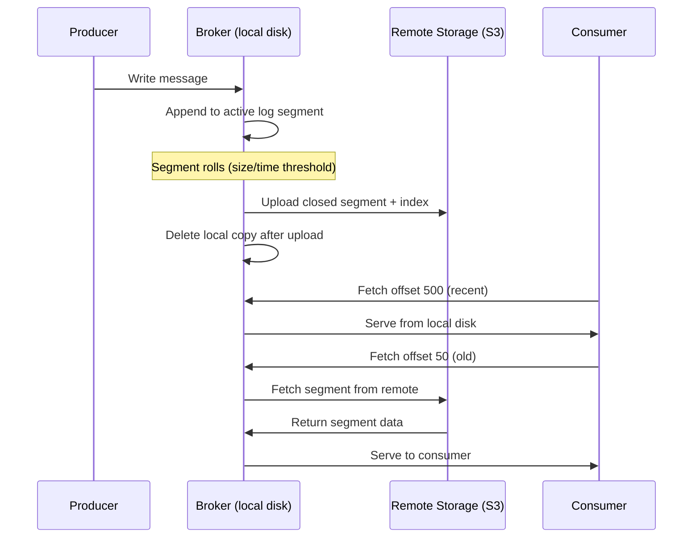

# Kafka Tiered Storage (KIP-405)

## What It Solves

Without tiered storage, every message lives on broker local disk until retention expires and it's deleted. This forces a trade-off: keep data longer (expensive disk) or delete sooner (lose history).

Tiered storage decouples these by introducing two tiers:

```
┌─────────────────────────────────────────────────┐
│  Local Tier (broker disk — SSD/PVC)             │
│  Recent data — fast reads, fast writes          │
│  Retention: local.retention.ms (e.g. 7 days)    │
└──────────────────┬──────────────────────────────┘
                   │ old log segments moved automatically
                   ▼
┌─────────────────────────────────────────────────┐
│  Remote Tier (object storage — S3/Ceph RGW)     │
│  Historical data — cheap, unlimited capacity    │
│  Retention: retention.ms (e.g. 90 days total)   │
└─────────────────────────────────────────────────┘
```

- **Writes** always go to local tier (broker disk)
- **Old log segments** are automatically copied to remote tier, then deleted from local disk
- **Reads** of recent data hit local disk; reads of old data transparently fetch from remote storage
- **Consumers don't know** which tier they're reading from — same API, same offsets

## How Data Flows



Key points:
- Segments are the unit of movement (not individual messages)
- A segment is uploaded to remote storage **after it's closed** (rolled) — the active segment always stays local
- The broker caches remote segment metadata locally for fast offset lookups
- Remote reads add latency (network round-trip to object store) but are transparent to consumers

## How Consumers Read Old Data

When a consumer requests an offset that's been moved to remote storage:

1. **Broker checks local index** — determines the offset is in a remote segment
2. **Broker fetches segment from remote storage** — downloads the relevant portion from S3
3. **Broker serves data to consumer** — from the fetched segment, as if it were local
4. **Broker may cache** the fetched segment locally (configurable) to speed up repeated reads

From the consumer's perspective, **nothing changes**:
- Same `bootstrap.servers`, same `consumer.group`, same `poll()` loop
- Same offsets — offset numbering is continuous across tiers
- Only difference is higher latency for old data (network to S3 vs local disk)

```
Consumer reads offset 1000 (2 days old)  → served from local disk   (~1ms)
Consumer reads offset 100  (30 days old) → fetched from S3          (~50-200ms)
Consumer reads offset 50   (60 days old) → fetched from S3          (~50-200ms)
Consumer reads offset 10   (89 days old) → fetched from S3          (~50-200ms)
Consumer reads offset 5    (91 days old) → GONE (past retention.ms) → OffsetOutOfRange
```

## Configuration

### Broker-Level (Kafka CR)

Enable tiered storage and configure the remote storage plugin:

```yaml
apiVersion: kafka.strimzi.io/v1beta2
kind: Kafka
metadata:
  name: events-kafka
spec:
  kafka:
    config:
      # Enable tiered storage
      remote.log.storage.system.enable: true

      # Remote Log Manager — manages segment lifecycle (upload, delete, fetch)
      remote.log.manager.task.interval.ms: 30000     # how often to check for segments to upload

      # Remote Storage Manager plugin — the S3/HDFS connector
      # Kafka 4.x does NOT ship a built-in plugin — you must provide one
      remote.log.storage.manager.class.name: "org.apache.kafka.server.log.remote.storage.S3RemoteStorageManager"
      remote.log.storage.manager.class.path: "/opt/kafka/plugins/tiered-storage/*"

      # Plugin-specific config (varies by implementation)
      rsm.config.s3.bucket.name: "kafka-tiered-storage"
      rsm.config.s3.endpoint: "http://rook-ceph-rgw-s3-store.rook-ceph.svc:80"
      rsm.config.s3.region: "us-east-1"

      # Remote Log Metadata Manager — tracks which segments are where
      remote.log.metadata.manager.class.name: "org.apache.kafka.server.log.remote.metadata.storage.TopicBasedRemoteLogMetadataManager"
      remote.log.metadata.manager.listener.name: "PLAIN"   # must match a listener name
```

### Topic-Level (KafkaTopic CR)

Enable per topic and set local vs total retention:

```yaml
apiVersion: kafka.strimzi.io/v1beta2
kind: KafkaTopic
metadata:
  name: orders
  labels:
    strimzi.io/cluster: events-kafka
spec:
  partitions: 3
  replicas: 3
  config:
    # Enable remote storage for this topic
    remote.storage.enable: "true"

    # Total retention — how long data exists (local + remote combined)
    retention.ms: "7776000000"             # 90 days

    # Local retention — how long data stays on broker disk before upload
    local.retention.ms: "604800000"        # 7 days on SSD

    # Segment size — smaller segments = more frequent uploads, finer granularity
    segment.ms: "86400000"                 # roll segment every 24h
    segment.bytes: "1073741824"            # or every 1 GB, whichever comes first
```

**Retention timeline for this topic:**

```
Day 0────────7────────────────────────────────90──────►
├── local ──┤                                  │
│  SSD disk │                                  │
├───────────┴── remote (S3) ──────────────────┤
│  Ceph RGW / S3                               │
└──────────────────────────────────────────────┘
                                               ▲
                                          data deleted
```

## Remote Storage Plugin

Kafka 4.x provides the **framework** for tiered storage but does **not** ship a production-ready S3 plugin. You need a third-party plugin:

| Plugin | Maintainer | Storage Backends | License |
|--------|-----------|------------------|---------|
| **Aiven Tiered Storage** | Aiven | S3, GCS, Azure Blob | Apache 2.0 |
| **Confluent Tiered Storage** | Confluent | S3, GCS, Azure Blob | Confluent License |
| **Custom implementation** | You | Any (implement `RemoteStorageManager` interface) | — |

**For this playground with Ceph RGW:** Aiven's plugin is the best fit — open source, S3-compatible, works with any S3 API endpoint including Ceph RGW.

### Aiven Plugin Setup

The plugin JAR must be available in the broker container. With Strimzi, use a custom Kafka image or init container:

```yaml
# In Kafka CR — add plugin JARs via image
spec:
  kafka:
    image: my-registry/kafka-with-tiered-storage:4.1.1   # custom image with plugin
```

Or use Strimzi's build mechanism (if available) to inject plugin JARs.

## Tiered Storage vs Other Approaches

| Approach | What it does | Data lifecycle | Complexity |
|----------|-------------|---------------|------------|
| **Tiered Storage** | Old segments → S3 automatically | Automatic (Kafka manages) | Medium — needs plugin |
| **Multiple broker pools** | Different hardware per topic | None — data stays on assigned brokers forever | High — broker ID management |
| **KafkaRebalance** | Even load across brokers | None — moves partitions, not aging | Medium — Cruise Control |
| **Kafka Connect + S3 Sink** | Copy messages to S3 as files | Manual — separate pipeline | High — extra component |
| **MirrorMaker2** | Replicate to another cluster | Manual — cross-cluster copy | High — two clusters |

**Tiered Storage is the only approach that provides automatic hot → cold data aging within a single Kafka cluster.**

## Limitations

- **Not all topics support it** — compacted topics (`cleanup.policy: compact`) cannot use tiered storage. Only `delete` policy topics are supported.
- **No built-in S3 plugin** — must provide a third-party plugin JAR (Aiven, Confluent, or custom)
- **Remote reads are slower** — consumers reading old data pay S3 latency (~50-200ms per fetch vs ~1ms local)
- **Segment granularity** — data moves in whole segments, not individual messages. A segment stays local until it's closed (rolled).
- **Recovery complexity** — if remote storage is lost, data in that tier is gone. Remote storage needs its own durability guarantees (Ceph replication handles this).
- **Strimzi integration** — Strimzi doesn't have native CRD fields for tiered storage config yet. Configuration is done through raw `config:` map in Kafka CR.

## Ceph RGW Integration

Since this playground already has Ceph with RGW (S3 API), tiered storage can use the same object store:

```
Kafka Broker → Ceph RGW (S3 API) → Ceph RADOS (replicated storage)
```

The S3 endpoint for the plugin would be:
```
http://rook-ceph-rgw-s3-store.rook-ceph.svc:80
```

Credentials come from a `CephObjectStoreUser` (same pattern as the Iceberg infra setup). The plugin needs `AWS_ACCESS_KEY_ID` and `AWS_SECRET_ACCESS_KEY` for the S3 bucket.

## When to Use Tiered Storage

**Use it when:**
- You need long retention (weeks/months) but don't want to pay for large broker disks
- You have a hot/cold access pattern — most reads are recent, occasional reads of old data
- You already have object storage (Ceph RGW, S3, GCS)

**Don't use it when:**
- All your consumers read recent data only — just set `retention.ms` and delete old data
- You need low-latency reads on all data — keep everything on local SSD
- You use compacted topics — tiered storage only works with `cleanup.policy: delete`
