<!-- Included in: levels/L4-deployment-dremio.md (deployment boundary, via extras/) -->
<!-- Source: components/dremio/helm/ (rendered Helm templates + values-overrides.yaml) -->

## Architektura

**Koordynator zapytań** (niebieski) to StatefulSet `dremio-master` (1 replika) — parsowanie SQL, planowanie zapytań, połączenia klientów, Web UI i REST API. **Executory** (niebieski) to StatefulSety tworzone dynamicznie przez **Engine Operator** (niebieski), który monitoruje CRD `Engine` i uzgadnia pule executorów (Micro/Small/Medium/Large). Silniki są tworzone przez interfejs Dremio UI, nie przez Helm. **Catalog Server** (morski) udostępnia wewnętrzne Iceberg REST API (Polaris), a **Catalog Services** (morski) to backend usług Open Catalog — zarządza operacjami na tabelach Iceberg, metadanymi katalogowymi w MongoDB i komunikuje się z catalog-server przez gRPC oraz z koordynatorem przez NATS. **ZooKeeper** (pomarańczowy) zapewnia koordynację rozproszoną (wybór mastera, rejestracja executorów), a **NATS** (pomarańczowy) obsługuje wewnętrzną wymianę komunikatów z JetStream. **Sekrety** (jasnoniebieski) są tworzone przez `build.sh` z pliku `.env` przed instalacją Helm. **Wolumeny PVC** (czerwony) zapewniają trwały magazyn danych, a **Ceph S3** (zewnętrzny) przechowuje dane rozproszone i katalog Iceberg.

```mermaid
graph TB
    subgraph Core["Rdzeń Dremio"]
        direction TB
        Master["StatefulSet<br/>dremio-master<br/>(1 replika)"]
        Executor["StatefulSet<br/>dremio-executor<br/>(0-N replik na silnik)"]
        EngOp["Deployment<br/>engine-operator<br/>(1 replika)"]
    end

    subgraph Catalog["Catalog (Polaris)"]
        direction TB
        CatSrv["Deployment<br/>catalog-server<br/>(1 replika, wewnętrzny)"]
        CatExt["Deployment<br/>catalog-server-external<br/>(0 replik, wyłączony POC)"]
        CatSvc["Deployment<br/>catalog-services<br/>(1 replika)"]
    end

    subgraph Infra["Infrastruktura"]
        direction TB
        ZK["StatefulSet<br/>zk<br/>(3 repliki)"]
        NATS["StatefulSet<br/>nats<br/>(3 repliki)"]
    end

    subgraph Services["Usługi (Services)"]
        direction TB
        SvcClient["Service (LoadBalancer)<br/>dremio-client<br/>:9047, :31010, :32010"]
        SvcCluster["Service (headless)<br/>dremio-cluster-pod<br/>:9999"]
        SvcCatHTTP["Service (ClusterIP)<br/>catalog-server<br/>:8181"]
        SvcCatGRPC["Service (headless)<br/>catalog-server-grpc<br/>:40000"]
        SvcCatSvc["Service (ClusterIP)<br/>catalog-services<br/>:grpc"]
        SvcZkHs["Service (headless)<br/>zk-hs<br/>:2181, :2888, :3888"]
        SvcZkCs["Service (ClusterIP)<br/>zk-cs<br/>:2181"]
        SvcNats["Service (ClusterIP)<br/>nats<br/>:4222"]
        SvcNatsHl["Service (headless)<br/>nats-headless<br/>:4222, :6222, :8222"]
    end

    subgraph ConfigMaps["ConfigMaps"]
        direction LR
        CMConfig["dremio-config<br/>(dremio.conf, logback.xml,<br/>core-site.xml)"]
        CMZk["zookeeper-config<br/>(logback.xml)"]
        CMEngine["engine-options<br/>(rozmiary silników)"]
        CMExecTpl["executor-statefulset-<br/>template"]
    end

    subgraph Secrets["Sekrety"]
        direction LR
        SecLicense["Secret<br/>dremio-license"]
        SecS3Cat["Secret<br/>catalog-server-<br/>s3-storage-creds"]
        SecQuay["Secret<br/>dremio-quay-secret<br/>(imagePullSecret)"]
    end

    subgraph RBAC["Engine Operator RBAC"]
        direction TB
        EngSA["ServiceAccount<br/>engine-operator"]
        EngRole["Role<br/>engine-operator-role"]
        EngRB["RoleBinding<br/>engine-operator-role-binding"]
        CoordRole["Role<br/>engine-coordinator-role"]
        CoordRB["RoleBinding<br/>engine-coordinator-role-binding"]
        ExecSA["ServiceAccount<br/>executor"]
    end

    subgraph CRDs["CRD"]
        direction LR
        EngineCRD["Engine<br/>engines.private.dremio.com"]
    end

    subgraph PVCs["Wolumeny PVC"]
        direction TB
        PVCMaster["PVC<br/>dremio-master-volume<br/>10Gi (ceph-block)"]
        PVCExec["PVC<br/>executor-volume<br/>10Gi (ceph-block)"]
        PVCC3["PVC<br/>executor-c3<br/>10Gi (ceph-block)"]
        PVCZk["PVC<br/>datadir-zk-*<br/>10Gi (ceph-block)"]
        PVCNats["PVC<br/>nats-js-*<br/>2Gi (ceph-block)"]
    end

    subgraph External["Zewnętrzne"]
        direction LR
        MongoDB["MongoDB<br/>(kontener L2)"]
        CephS3["Ceph S3 (RGW)<br/>bucket: dremio<br/>bucket: dremio-catalog"]
    end

    %% Rdzeń -> Infrastruktura
    Master -->|":2181"| ZK
    Master -->|":4222"| NATS
    Executor -->|":2181"| ZK

    %% Rdzeń -> Zewnętrzne
    Master -->|"S3 API<br/>(distStorage)"| CephS3
    Executor -->|"S3 API<br/>(distStorage)"| CephS3
    Master -->|"mongodb://"| MongoDB
    CatSrv -->|"mongodb://"| MongoDB
    CatSvc -->|"mongodb://"| MongoDB
    EngOp -->|"mongodb://"| MongoDB

    %% Catalog -> S3
    CatSrv -->|"S3 API<br/>(dremio-catalog)"| CephS3

    %% Catalog -> NATS
    CatSvc -->|":4222"| NATS

    %% Engine Operator -> CRD -> Executor
    EngOp -->|"watches"| EngineCRD
    EngineCRD -.->|"operator tworzy"| Executor

    %% RBAC
    EngRB --> EngRole
    EngRB --> EngSA
    EngOp --> EngSA
    CoordRB --> CoordRole
    Executor --> ExecSA

    %% Services
    SvcClient -->|"routing"| Master
    SvcCluster --> Master
    SvcCluster --> Executor
    SvcCatHTTP --> CatSrv
    SvcCatGRPC --> CatSrv
    SvcCatSvc --> CatSvc
    SvcZkHs --> ZK
    SvcZkCs --> ZK
    SvcNats --> NATS
    SvcNatsHl --> NATS

    %% PVCs
    Master --> PVCMaster
    Executor --> PVCExec
    Executor --> PVCC3
    ZK --> PVCZk
    NATS --> PVCNats

    %% ConfigMaps
    Master --> CMConfig
    Executor --> CMConfig
    ZK --> CMZk
    EngOp --> CMEngine
    EngOp --> CMExecTpl

    %% Secrets
    Master --> SecLicense
    CatSrv --> SecS3Cat

    classDef core fill:#4dabf7,stroke:#1971c2,stroke-width:2px,color:#fff
    classDef catalog fill:#38d9a9,stroke:#0ca678,stroke-width:2px,color:#fff
    classDef infra fill:#ff922b,stroke:#e8590c,stroke-width:2px,color:#fff
    classDef service fill:#69db7c,stroke:#2b8a3e,stroke-width:2px,color:#000
    classDef configmap fill:#ffd43b,stroke:#f59f00,stroke-width:2px,color:#000
    classDef secret fill:#74c0fc,stroke:#1864ab,stroke-width:2px,color:#000
    classDef rbac fill:#e8e8e8,stroke:#868e96,stroke-width:2px,color:#000
    classDef crd fill:#e8e8e8,stroke:#868e96,stroke-width:2px,color:#000
    classDef pvc fill:#ff6b6b,stroke:#c92a2a,stroke-width:2px,color:#fff
    classDef external fill:#e9ecef,stroke:#495057,stroke-width:2px,color:#000

    class Master,Executor,EngOp core
    class CatSrv,CatExt,CatSvc catalog
    class ZK,NATS infra
    class SvcClient,SvcCluster,SvcCatHTTP,SvcCatGRPC,SvcCatSvc,SvcZkHs,SvcZkCs,SvcNats,SvcNatsHl service
    class CMConfig,CMZk,CMEngine,CMExecTpl configmap
    class SecLicense,SecS3Cat,SecQuay secret
    class EngSA,EngRole,EngRB,CoordRole,CoordRB,ExecSA rbac
    class EngineCRD crd
    class PVCMaster,PVCExec,PVCC3,PVCZk,PVCNats pvc
    class MongoDB,CephS3 external
```

## Obiekty Kubernetes

### Główne obciążenia robocze (Core Workloads)

| Rodzaj | Nazwa | Repliki | Przeznaczenie |
|--------|-------|---------|---------------|
| StatefulSet | `dremio-master` | 1 | Koordynator zapytań — parsowanie SQL, planowanie, Web UI (:9047), ODBC/JDBC (:31010), Arrow Flight (:32010), fabric (:45678), conduit (:45679), metryki (:9010) |
| StatefulSet | `dremio-executor` | 0-N (na silnik) | Silnik wykonawczy — rozproszone fragmenty zapytań. Zarządzany przez Engine Operator (nie Helm). Porty: fabric (:45678), conduit (:45679), metryki (:9010) |
| Deployment | `engine-operator` | 1 | Monitoruje CRD `Engine` (tworzone przez Dremio UI), uzgadnia StatefulSety executorów z konfiguracją rozmiaru/CPU/magazynu |
| Deployment | `catalog-server` | 1 | Wewnętrzny Polaris (Open Catalog) — Iceberg REST API. Porty: HTTP (:8181), mgmt (:9001), gRPC (:40000) |
| Deployment | `catalog-server-external` | 0 (wyłączony POC) | Zewnętrzny endpoint Polaris dla Spark i klientów zewnętrznych. Porty: HTTPS (:8443), mgmt (:9002), gRPC (:40000) |
| Deployment | `catalog-services` | 1 | Backend usług Open Catalog (Polaris) — zarządzanie operacjami na tabelach Iceberg, metadanymi katalogowymi w MongoDB, komunikacja z catalog-server przez gRPC i koordynatorem przez NATS |

### Infrastruktura

| Rodzaj | Nazwa | Repliki | Przeznaczenie |
|--------|-------|---------|---------------|
| StatefulSet | `zk` | 3 | ZooKeeper — koordynacja rozproszona: wybór mastera, rejestracja executorów, członkostwo klastra. Porty: klient (:2181), serwer (:2888), wybór lidera (:3888), metryki (:7000) |
| StatefulSet | `nats` | 3 | NATS — wewnętrzna wymiana komunikatów z JetStream. Porty: klient (:4222), klaster (:6222), monitoring (:8222) |
| PodDisruptionBudget | `zk-pdb` | — | maxUnavailable: 1 |

### Usługi (Services)

| Rodzaj | Nazwa | Typ | Porty | Selektor |
|--------|-------|-----|-------|----------|
| Service | `dremio-client` | LoadBalancer | 31010 (klient), 9047 (web), 32010 (flight) | `external-client-access: "true"` |
| Service | `dremio-cluster-pod` | ClusterIP (headless) | 9999 | `role: dremio-cluster-pod` |
| Service | `catalog-server` | ClusterIP | 8181 (catalog-http) | `catalog-type: internal` |
| Service | `catalog-server-mgmt` | ClusterIP (headless) | 9001 (catalog-mgmt) | — |
| Service | `catalog-server-grpc` | ClusterIP (headless) | 40000 (catalog-grpc) | internal + external |
| Service | `catalog-services` | ClusterIP | grpc (catalog-grpc) | — |
| Service | `zk-hs` | ClusterIP (headless) | 2181, 2888, 3888 | `app: zk` |
| Service | `zk-cs` | ClusterIP | 2181 | `app: zk` |
| Service | `nats` | ClusterIP | 4222 | — |
| Service | `nats-headless` | ClusterIP (headless) | 4222, 6222, 8222 | — |

### ConfigMaps

| Nazwa | Przeznaczenie |
|-------|---------------|
| `dremio-config` | Główna konfiguracja: dremio.conf, logback.xml, core-site.xml |
| `zookeeper-config` | logback.xml (poziom logowania ZK) |
| `engine-options` | Definicje rozmiarów silników, pojemności CPU, offsetów zasobów |
| `executor-statefulset-template` | Szablon YAML dla StatefulSetów executorów tworzonych przez Engine Operator |
| `dremio-cluster-id` | ID klastra (uzupełniany przez Job przy pierwszym uruchomieniu) |

### Sekrety

| Nazwa | Źródło | Przeznaczenie |
|-------|--------|---------------|
| `dremio-license` | Helm values | Klucz licencji Dremio EE |
| `catalog-server-s3-storage-creds` | build.sh (z użytkownika dremio-catalog Ceph) | Klucze dostępu S3 dla bucketu Polaris `dremio-catalog` |
| `dremio-quay-secret` | build.sh (z `.env`) | Poświadczenia imagePullSecret dla quay.io/dremio |

### Engine Operator RBAC

| Rodzaj | Nazwa | Przeznaczenie |
|--------|-------|---------------|
| ServiceAccount | `engine-operator` | Tożsamość poda Engine Operator |
| Role | `engine-operator-role` | RBAC: zarządzanie CRD Engine, StatefulSetami, PVC, ConfigMapami, Podami, zdarzeniami |
| RoleBinding | `engine-operator-role-binding` | Wiąże rolę z kontem usługowym engine-operator |
| Role | `engine-coordinator-role` | RBAC: dostęp koordynatora do CRD Engine (get, list, watch, patch, update, delete, create) |
| RoleBinding | `engine-coordinator-role-binding` | Wiąże rolę z kontem usługowym koordynatora |
| ServiceAccount | executor SA | Tożsamość podów executorów |

### CRD

| CRD | Rodzaj | Przeznaczenie |
|-----|--------|---------------|
| `engines.private.dremio.com` | Engine | Definicja dynamicznej puli executorów — tworzona przez interfejs Dremio UI, uzgadniana przez Engine Operator |

### Kontenery (na pod)

**Koordynator (dremio-master):**

| Kontener | Obraz | Porty | Przeznaczenie |
|----------|-------|-------|---------------|
| `dremio-master-coordinator` | `quay.io/dremio/dremio-ee:26.1` | 9047, 31010, 32010, 45678, 45679, 9010 | Silnik Dremio — Web UI, klienty, Arrow Flight, metryki |

Init containers: `start-only-one-dremio-master` (zabezpieczenie przed równoległym uruchomieniem), `wait-for-zookeeper-and-nats` (oczekiwanie na infrastrukturę)

**Executor (dremio-executor):**

| Kontener | Obraz | Porty | Przeznaczenie |
|----------|-------|-------|---------------|
| `dremio-executor` | `quay.io/dremio/dremio-ee:26.1` | 45678, 45679, 9010 | Silnik wykonawczy — fragmenty zapytań, fabric, metryki |

Init containers: `wait-for-zookeeper` (oczekiwanie na ZK)

### Konfiguracja silników (Engine Options)

Silniki są tworzone **wyłącznie** przez interfejs Dremio UI (Settings → Engines), nie przez Helm. Engine Operator uzgadnia zasoby CRD `Engine` i tworzy odpowiednie StatefulSety executorów.

| Rozmiar | Pody | Pamięć |
|---------|------|--------|
| Micro | 1 | 4Gi |
| Small | 1 | 10Gi |
| Medium | 2 | 10Gi |
| Large | 2 | 12Gi |

| Pojemność CPU | vCPU |
|---------------|------|
| 1C (domyślna) | 1 |
| 2C | 2 |
| 4C | 4 |

| Magazyn spill | Rozmiar | Magazyn C3 | Rozmiar |
|---------------|---------|------------|---------|
| 10GB (domyślny) | 10Gi | 10GB (domyślny) | 10Gi |
| 20GB | 20Gi | 20GB | 20Gi |
| 50GB | 50Gi | 50GB | 50Gi |

## Sieć

| Port | Protokół | Komponent | Przeznaczenie |
|------|----------|-----------|---------------|
| 9047 | HTTP | Koordynator | Web UI, REST API |
| 31010 | TCP | Koordynator | ODBC/JDBC |
| 32010 | TCP (gRPC) | Koordynator | Arrow Flight SQL |
| 45678 | TCP | Koordynator, Executor | Server fabric (komunikacja wewnątrz-klastrowa) |
| 45679 | TCP (gRPC) | Koordynator, Executor | Server conduit |
| 9010 | HTTP | Koordynator, Executor | Metryki Prometheus |
| 8080 | HTTP | Engine Operator | Zdrowie (health), metryki |
| 8181 | HTTP | Catalog Server | Iceberg REST API (Polaris) |
| 9001 | HTTP | Catalog Server | Zarządzanie (management) |
| 40000 | gRPC | Catalog Server, Services | Komunikacja gRPC |
| 8443 | HTTPS | Catalog Server External | Zewnętrzne Iceberg REST API (wyłączony) |
| 2181 | TCP | ZooKeeper | Połączenia klientów |
| 2888 | TCP | ZooKeeper | Komunikacja serwer-serwer |
| 3888 | TCP | ZooKeeper | Wybór lidera |
| 7000 | HTTP | ZooKeeper | Metryki |
| 4222 | TCP | NATS | Połączenia klientów |
| 6222 | TCP | NATS | Komunikacja klasterowa |
| 8222 | HTTP | NATS | Monitoring HTTP |

**Kluczowe nazwy DNS:**

| Usługa | DNS |
|--------|-----|
| `dremio-client` | `dremio-client.<namespace>.svc.cluster.local` |
| `dremio-cluster-pod` | `dremio-cluster-pod.<namespace>.svc.cluster.local` |
| `zk-cs` | `zk-cs.<namespace>.svc.cluster.local` |
| `nats` | `nats.<namespace>.svc.cluster.local` |

## Bezpieczeństwo

- Uwierzytelnianie: `internal` (wewnętrzne, POC) — planowane przejście na Keycloak OIDC
- Koordynator i executory działają jako użytkownik inny niż root
- Metryki eksponowane z adnotacją `metrics.dremio.com/scrape: "true"` (niestandardowa, specyficzna dla Dremio)
- Sekrety tworzone wcześniej przez `build.sh` z pliku `.env` — nie są generowane przez Helm
- ImagePullSecret `dremio-quay-secret` dla obrazów z repozytorium quay.io/dremio

## Magazyn danych (Storage)

Szczegółowa dokumentacja magazynu danych: `components/dremio/docs/STORAGE.md`

### Buckety S3 (Ceph RGW)

| Bucket | Przeznaczenie | Użytkownik S3 |
|--------|---------------|---------------|
| `dremio` | distStorage — dane rozproszone: refleksje, pamięć podręczna wyników, profile, metadane, uploady, kopie zapasowe MongoDB | `dremio-dist` |
| `dremio-catalog` | Polaris (Open Catalog) — tabele Iceberg zarządzane przez Catalog Server | `dremio-catalog` |

### PVC (ceph-block StorageClass)

| PVC | Rozmiar | Mount | Komponent | Przeznaczenie |
|-----|---------|-------|-----------|---------------|
| `dremio-master-volume` | 10Gi | `/opt/dremio/data/` | Koordynator | RocksDB metadane, wyniki zapytań, klucze bezpieczeństwa |
| `executor-volume` | 10Gi | `/opt/dremio/data/` | Executor | Zrzut na dysk (spill), logi, wyniki |
| `executor-c3` | 10Gi | `/opt/dremio/cloudcache/c0/` | Executor | Columnar Cloud Cache — lokalna pamięć podręczna danych S3 |
| `datadir-zk-*` | 10Gi | `/data/` | ZooKeeper | Logi transakcji i migawki |
| `nats-js-*` | 2Gi | `/data/jetstream/` | NATS | Trwałe przechowywanie wiadomości JetStream |
