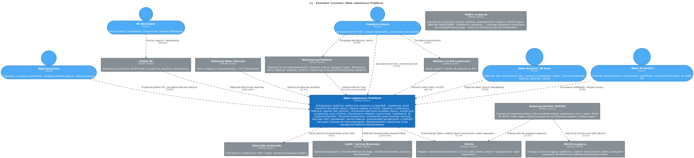

<!-- Wygenerowano automatycznie z workspace.dsl — NIE EDYTUJ RĘCZNIE -->
<!-- Regeneracja: ./scripts/generate-diagrams.sh -->

# L1 - Kontekst systemu: Data Lakehouse Platform

> Zintegrowana platforma analityczna wdrożona na OpenShift, zbudowana wokół otwartych formatów danych (Apache Iceberg na MinIO). Zapewnia zunifikowaną federację zapytań SQL (Dremio), rozproszone obliczenia wsadowe (Spark), orkiestrację przepływów pracy (Airflow), interaktywne notebooki (JupyterHub) i dashboardy BI (Superset/PowerBI). Obserwowalność zapewniona przez zewnętrzną Platformę Monitorowania. Wszystkie komponenty użytkownika uwierzytelniają się przez Keycloak OIDC (planowane); Dremio federuje użytkowników bezpośrednio z LDAP/AD (aktualnie używane do uwierzytelniania). Uwaga: Kafka (Legacy) jest OBECNIE NIEDOSTĘPNA — zewnętrzna instancja Airflow (MSPD) kopiuje (planowane) pliki z Legacy MinIO do MinIO. Ostateczny mechanizm nie został jeszcze zaprojektowany.

## Przegląd

Zintegrowana platforma analityczna wdrożona na OpenShift, zbudowana wokół otwartych formatów danych (Apache Iceberg na MinIO). Zapewnia zunifikowaną federację zapytań SQL (Dremio), rozproszone obliczenia wsadowe (Spark), orkiestrację przepływów pracy (Airflow), interaktywne notebooki (JupyterHub) i dashboardy BI (Superset/PowerBI). Wszystkie komponenty użytkownika uwierzytelniają się przez Keycloak OIDC (planowane); Dremio federuje użytkowników bezpośrednio z LDAP/AD (aktualnie używane do uwierzytelniania). Obserwowalność zapewniona przez zewnętrzną Platformę Monitorowania.

<!-- Included in: levels/L1-system-context.md (softwareSystem, via !docs in workspace.dsl) -->

# Platforma Data Lakehouse

Zintegrowana platforma analityczna wdrożona na OpenShift, zbudowana wokół otwartych formatów danych (Apache Iceberg na MinIO).

## Możliwości

- **Zunifikowany dostęp SQL** — Dremio zapewnia federacyjne zapytania do źródeł S3 i JDBC
- **Rozproszone obliczenia wsadowe** — Apache Spark do ETL, transformacji i obciążeń ML
- **Orkiestracja przepływów pracy** — Apache Airflow planuje i monitoruje potoki danych
- **Interaktywne notebooki** — JupyterHub z jądrami PySpark i Dremio SQL
- **Dashboardy BI** — Apache Superset i Power BI (zewnętrzny) do raportowania

## Kluczowe decyzje projektowe

- **Pojedyncza przestrzeń nazw** (`dlh-prd`) dla wszystkich komponentów platformy
- **MongoDB promowane do kontenera L2** — niezależny cykl życia, operator, strategia backupu
- **Monitoring jest zewnętrzny** — każda granica kontenera dokumentuje własne endpointy metryk/logów
- **Uwierzytelnianie** — Keycloak OIDC (planowane); Dremio aktualnie korzysta bezpośrednio z LDAP/AD
- **Przechowywanie danych** — tabele Apache Iceberg na MinIO (magazyn obiektowy kompatybilny z S3)

## Diagram architektury

```plantuml
@startuml
title <size:18>L1 - Kontekst systemu: Data Lakehouse Platform</size>

set separator none
top to bottom direction
skinparam ranksep 60
skinparam nodesep 30
hide stereotype

<style>
  root {
    BackgroundColor: #ffffff;
    FontColor: #444444;
  }
  // Element,Person
  .Element-RWxlbWVudCxQZXJzb24= {
    BackgroundColor: #4dabf7;
    LineColor: #3577ac;
    LineStyle: 0;
    LineThickness: 2;
    FontColor: #ffffff;
    FontSize: 16;
    HorizontalAlignment: center;
    Shadowing: 0;
    MaximumWidth: 700;
  }
  // Element,Software System
  .Element-RWxlbWVudCxTb2Z0d2FyZSBTeXN0ZW0= {
    BackgroundColor: #1971c2;
    LineColor: #114f87;
    LineStyle: 0;
    LineThickness: 2;
    FontColor: #ffffff;
    FontSize: 16;
    HorizontalAlignment: center;
    Shadowing: 0;
    MaximumWidth: 700;
  }
  // Element,Software System,External
  .Element-RWxlbWVudCxTb2Z0d2FyZSBTeXN0ZW0sRXh0ZXJuYWw= {
    BackgroundColor: #868e96;
    LineColor: #5d6369;
    LineStyle: 0;
    LineThickness: 2;
    FontColor: #ffffff;
    FontSize: 16;
    HorizontalAlignment: center;
    Shadowing: 0;
    MaximumWidth: 700;
  }
  // Relationship
  .Relationship-UmVsYXRpb25zaGlw {
    LineThickness: 2;
    LineStyle: 10-10;
    LineColor: #444444;
    FontColor: #444444;
    FontSize: 16;
  }
</style>

person "==Data Engineer\n<size:12>[Person]</size>\n\nProjektuje i uruchamia potoki ETL, zarządza zbiorami danych i jakością danych" <<Element-RWxlbWVudCxQZXJzb24=>> as DataEngineer
rectangle "==LDAP / Active Directory\n<size:12>[Software System]</size>\n\nKatalog korporacyjny; Keycloak federuje do niego, niektóre komponenty łączą się bezpośrednio" <<Element-RWxlbWVudCxTb2Z0d2FyZSBTeXN0ZW0sRXh0ZXJuYWw=>> as LDAPActiveDirectory
rectangle "==Power BI\n<size:12>[Software System]</size>\n\nKorporacyjna platforma BI Microsoft (zewnętrzna, desktopy korporacyjne)" <<Element-RWxlbWVudCxTb2Z0d2FyZSBTeXN0ZW0sRXh0ZXJuYWw=>> as PowerBI
rectangle "==External Airflow (MSPD)\n<size:12>[Software System]</size>\n\nZewnętrzna instancja Airflow, która aktualnie kopiuje (planowane) pliki z Legacy MinIO do MinIO. Kafka Legacy wykorzystywana do synchronizacji plików z Airflow Legacy." <<Element-RWxlbWVudCxTb2Z0d2FyZSBTeXN0ZW0sRXh0ZXJuYWw=>> as ExternalAirflowMSPD
rectangle "==External Data Sources\n<size:12>[Software System]</size>\n\nPliki z magazynu kompatybilnego z S3 (CSV/Parquet)" <<Element-RWxlbWVudCxTb2Z0d2FyZSBTeXN0ZW0sRXh0ZXJuYWw=>> as ExternalDataSources
rectangle "==GitOps / CI-CD (planned)\n<size:12>[Software System]</size>\n\nPotoki ArgoCD / Tekton do wdrożeń na OCP" <<Element-RWxlbWVudCxTb2Z0d2FyZSBTeXN0ZW0sRXh0ZXJuYWw=>> as GitOpsCICDplanned
rectangle "==Monitoring Platform\n<size:12>[Software System]</size>\n\nZewnętrzny stos obserwowalności: zbieranie metryk, agregacja logów, dashboardy, alerty. Odpytuje endpointy /metrics i zbiera logi ze wszystkich kontenerów platformy." <<Element-RWxlbWVudCxTb2Z0d2FyZSBTeXN0ZW0sRXh0ZXJuYWw=>> as MonitoringPlatform
rectangle "==Data Lakehouse Platform\n<size:12>[Software System]</size>\n\nZintegrowana platforma analityczna wdrożona na OpenShift, zbudowana wokół otwartych formatów danych (Apache Iceberg na MinIO). Zapewnia zunifikowaną federację zapytań SQL (Dremio), rozproszone obliczenia wsadowe (Spark), orkiestrację przepływów pracy (Airflow), interaktywne notebooki (JupyterHub) i dashboardy BI (Superset/PowerBI). Wszystkie komponenty użytkownika uwierzytelniają się przez Keycloak OIDC (planowane); Dremio federuje użytkowników bezpośrednio z LDAP/AD (aktualnie używane do uwierzytelniania). Obserwowalność zapewniona przez zewnętrzną Platformę Monitorowania." <<Element-RWxlbWVudCxTb2Z0d2FyZSBTeXN0ZW0=>> as DataLakehousePlatform
person "==Data Analyst / BI User\n<size:12>[Person]</size>\n\nOdpytuje dane przez Dremio SQL, korzysta z notebooków Jupyter, tworzy dashboardy Superset, generuje raporty" <<Element-RWxlbWVudCxQZXJzb24=>> as DataAnalystBIUser
person "==Data Scientist\n<size:12>[Person]</size>\n\nProwadzi eksperymenty w notebookach JupyterHub, wykorzystuje PySpark do zadań ML" <<Element-RWxlbWVudCxQZXJzb24=>> as DataScientist
person "==BI Developer\n<size:12>[Person]</size>\n\nTworzy raporty i dashboardy korporacyjne w Power BI/Superset" <<Element-RWxlbWVudCxQZXJzb24=>> as BIDeveloper
person "==Platform Admin\n<size:12>[Person]</size>\n\nZarządza klastrem OCP, wdraża komponenty, monitoruje stan systemu" <<Element-RWxlbWVudCxQZXJzb24=>> as PlatformAdmin
rectangle "==MinIO\n<size:12>[Software System]</size>\n\nMagazyn obiektowy kompatybilny z S3 dla tabel Iceberg, danych rozproszonych i kopii zapasowych" <<Element-RWxlbWVudCxTb2Z0d2FyZSBTeXN0ZW0sRXh0ZXJuYWw=>> as MinIO
rectangle "==MinIO (Legacy)\n<size:12>[Software System]</size>\n\nIstniejący starszy magazyn obiektowy z danymi historycznymi. Dane są aktualnie kopiowane do MinIO przez zewnętrzną instancję Airflow." <<Element-RWxlbWVudCxTb2Z0d2FyZSBTeXN0ZW0sRXh0ZXJuYWw=>> as MinIOLegacy
rectangle "==Kafka (Legacy)\n<size:12>[Software System]</size>\n\nZewnętrzny streaming zdarzeń; publikuje powiadomienia o plikach z MinIO Legacy. OBECNIE NIEDOSTĘPNY z platformy Lakehouse — wymaga wdrożenia rozwiązania sieciowego/integracyjnego. Zależy od ostatecznej decyzji projektowej." <<Element-RWxlbWVudCxTb2Z0d2FyZSBTeXN0ZW0sRXh0ZXJuYWw=>> as KafkaLegacy
rectangle "==Keycloak (planned)\n<size:12>[Software System]</size>\n\nZewnętrzny współdzielony SSO / broker tożsamości (dostawca OIDC)" <<Element-RWxlbWVudCxTb2Z0d2FyZSBTeXN0ZW0sRXh0ZXJuYWw=>> as Keycloakplanned

DataEngineer --> DataLakehousePlatform <<Relationship-UmVsYXRpb25zaGlw>> : "Projektuje potoki ETL, zarządza zbiorami danych\n<size:12>[HTTPS]</size>"
DataAnalystBIUser --> DataLakehousePlatform <<Relationship-UmVsYXRpb25zaGlw>> : "Odpytuje dane, tworzy dashboardy\n<size:12>[HTTPS]</size>"
DataScientist --> DataLakehousePlatform <<Relationship-UmVsYXRpb25zaGlw>> : "Uruchamia notebooki i eksperymenty\n<size:12>[HTTPS]</size>"
BIDeveloper --> PowerBI <<Relationship-UmVsYXRpb25zaGlw>> : "Tworzy raporty i dashboardy\n<size:12>[Desktop]</size>"
PlatformAdmin --> DataLakehousePlatform <<Relationship-UmVsYXRpb25zaGlw>> : "Zarządza klastrem, monitoruje stan\n<size:12>[HTTPS]</size>"
PlatformAdmin --> GitOpsCICDplanned <<Relationship-UmVsYXRpb25zaGlw>> : "Zarządza wdrożeniami\n<size:12>[HTTPS]</size>"
PowerBI --> DataLakehousePlatform <<Relationship-UmVsYXRpb25zaGlw>> : "Odpytuje Dremio do raportów\n<size:12>[ODBC/JDBC]</size>"
DataLakehousePlatform --> MinIO <<Relationship-UmVsYXRpb25zaGlw>> : "Przechowuje tabele Iceberg, dane rozproszone, kopie zapasowe\n<size:12>[S3 API]</size>"
DataLakehousePlatform --> Keycloakplanned <<Relationship-UmVsYXRpb25zaGlw>> : "Uwierzytelnia użytkowników przez SSO\n<size:12>[OIDC]</size>"
DataLakehousePlatform --> LDAPActiveDirectory <<Relationship-UmVsYXRpb25zaGlw>> : "Federuje użytkowników bezpośrednio\n<size:12>[LDAP/LDAPS]</size>"
ExternalAirflowMSPD --> MinIOLegacy <<Relationship-UmVsYXRpb25zaGlw>> : "Odczytuje historyczne pliki danych\n<size:12>[S3 API]</size>"
ExternalAirflowMSPD --> MinIO <<Relationship-UmVsYXRpb25zaGlw>> : "Kopiuje pliki do nowego magazynu\n<size:12>[S3 API]</size>"
ExternalDataSources --> DataLakehousePlatform <<Relationship-UmVsYXRpb25zaGlw>> : "Dostarcza dane do zasilania\n<size:12>[S3 API]</size>"
GitOpsCICDplanned --> DataLakehousePlatform <<Relationship-UmVsYXRpb25zaGlw>> : "Wdraża charty Helm na OCP\n<size:12>[K8s API]</size>"
PlatformAdmin --> MonitoringPlatform <<Relationship-UmVsYXRpb25zaGlw>> : "Przegląda dashboardy, alerty\n<size:12>[HTTPS]</size>"
MonitoringPlatform --> DataLakehousePlatform <<Relationship-UmVsYXRpb25zaGlw>> : "Zbiera metryki i logi\n<size:12>[Prometheus/Log forwarding]</size>"

@enduml
```

Źródło PlantUML

## Aktorzy

### BI Developer

Tworzy raporty i dashboardy korporacyjne w Power BI/Superset

### Data Analyst / BI User

Odpytuje dane przez Dremio SQL, korzysta z notebooków Jupyter, tworzy dashboardy Superset, generuje raporty

### Data Engineer

Projektuje i uruchamia potoki ETL, zarządza zbiorami danych i jakością danych

### Data Scientist

Prowadzi eksperymenty w notebookach JupyterHub, wykorzystuje PySpark do zadań ML

### Platform Admin

Zarządza klastrem OCP, wdraża komponenty, monitoruje stan systemu

## Systemy

### Data Lakehouse Platform

Zintegrowana platforma analityczna wdrożona na OpenShift, zbudowana wokół otwartych formatów danych (Apache Iceberg na MinIO). Zapewnia zunifikowaną federację zapytań SQL (Dremio), rozproszone obliczenia wsadowe (Spark), orkiestrację przepływów pracy (Airflow), interaktywne notebooki (JupyterHub) i dashboardy BI (Superset/PowerBI). Wszystkie komponenty użytkownika uwierzytelniają się przez Keycloak OIDC (planowane); Dremio federuje użytkowników bezpośrednio z LDAP/AD (aktualnie używane do uwierzytelniania). Obserwowalność zapewniona przez zewnętrzną Platformę Monitorowania.

### External Airflow (MSPD)

Zewnętrzna instancja Airflow, która aktualnie kopiuje (planowane) pliki z Legacy MinIO do MinIO. Kafka Legacy wykorzystywana do synchronizacji plików z Airflow Legacy.

| Właściwość | Wartość |
|------------|--------|
| Status | Final mechanism not designed yet |
| Purpose | Interim data transfer from Legacy MinIO to MinIO |
| Location | External to OCP |

### External Data Sources

Pliki z magazynu kompatybilnego z S3 (CSV/Parquet)

### GitOps / CI-CD (planned)

Potoki ArgoCD / Tekton do wdrożeń na OCP

### Kafka (Legacy)

Zewnętrzny streaming zdarzeń; publikuje powiadomienia o plikach z MinIO Legacy. OBECNIE NIEDOSTĘPNY z platformy Lakehouse — wymaga wdrożenia rozwiązania sieciowego/integracyjnego. Zależy od ostatecznej decyzji projektowej.

| Właściwość | Wartość |
|------------|--------|
| Status | NOT ACCESSIBLE — depending on final design decision |
| Purpose | File notification events from MinIO Legacy |
| Protocol | Kafka Protocol |
| Workaround | External Airflow currently copies files from Legacy MinIO to MinIO |
| Location | External to OCP |

### Keycloak (planned)

Zewnętrzny współdzielony SSO / broker tożsamości (dostawca OIDC)

| Właściwość | Wartość |
|------------|--------|
| Direct consumers | Dremio, Airflow, JupyterHub, Superset |
| Protocol | OIDC |
| Location | External / shared |

### LDAP / Active Directory

Katalog korporacyjny; Keycloak federuje do niego, niektóre komponenty łączą się bezpośrednio

| Właściwość | Wartość |
|------------|--------|
| Ports | 389 (LDAP), 636 (LDAPS) |
| Direct consumers | Dremio, Keycloak |
| Location | External / corporate |

### MinIO

Magazyn obiektowy kompatybilny z S3 dla tabel Iceberg, danych rozproszonych i kopii zapasowych

| Właściwość | Wartość |
|------------|--------|
| STS (planned) | MinIO Security Token Service — temporary credentials via OIDC for Dremio, Spark, JupyterHub |
| Protocol | S3 API |
| Buckets | dremio, dremio-catalog |
| Location | External to OCP |

### MinIO (Legacy)

Istniejący starszy magazyn obiektowy z danymi historycznymi. Dane są aktualnie kopiowane do MinIO przez zewnętrzną instancję Airflow.

| Właściwość | Wartość |
|------------|--------|
| Access | Data copied to MinIO by External Airflow |
| Protocol | S3 API |
| Location | External to OCP |

### Monitoring Platform

Zewnętrzny stos obserwowalności: zbieranie metryk, agregacja logów, dashboardy, alerty. Odpytuje endpointy /metrics i zbiera logi ze wszystkich kontenerów platformy.

| Właściwość | Wartość |
|------------|--------|
| Protocol | Prometheus scrape, log forwarding |
| Location | External to Data Lakehouse Platform |
| Stack | TBD: Prometheus + Grafana / ELK / EFK |

### Power BI

Korporacyjna platforma BI Microsoft (zewnętrzna, desktopy korporacyjne)

| Właściwość | Wartość |
|------------|--------|
| Connects to | Dremio coordinator :31010 |
| Protocol | ODBC/JDBC |
| Location | Desktop version |

## Relacje

| Od | Do | Opis | Technologia |
|----|-----|------|-------------|
| BI Developer | Power BI | Tworzy raporty i dashboardy | Desktop |
| Data Analyst / BI User | Data Lakehouse Platform | Odpytuje dane, tworzy dashboardy | HTTPS |
| Data Engineer | Data Lakehouse Platform | Projektuje potoki ETL, zarządza zbiorami danych | HTTPS |
| Data Lakehouse Platform | MinIO | Przechowuje tabele Iceberg, dane rozproszone, kopie zapasowe | S3 API |
| Data Lakehouse Platform | Keycloak (planned) | Uwierzytelnia użytkowników przez SSO | OIDC |
| Data Lakehouse Platform | LDAP / Active Directory | Federuje użytkowników bezpośrednio | LDAP/LDAPS |
| Data Scientist | Data Lakehouse Platform | Uruchamia notebooki i eksperymenty | HTTPS |
| External Airflow (MSPD) | MinIO (Legacy) | Odczytuje historyczne pliki danych | S3 API |
| External Airflow (MSPD) | MinIO | Kopiuje pliki do nowego magazynu | S3 API |
| External Data Sources | Data Lakehouse Platform | Dostarcza dane do zasilania | S3 API |
| GitOps / CI-CD (planned) | Data Lakehouse Platform | Wdraża charty Helm na OCP | K8s API |
| Monitoring Platform | Data Lakehouse Platform | Zbiera metryki i logi | Prometheus/Log forwarding |
| Platform Admin | Monitoring Platform | Przegląda dashboardy, alerty | HTTPS |
| Platform Admin | GitOps / CI-CD (planned) | Zarządza wdrożeniami | HTTPS |
| Platform Admin | Data Lakehouse Platform | Zarządza klastrem, monitoruje stan | HTTPS |
| Power BI | Data Lakehouse Platform | Odpytuje Dremio do raportów | ODBC/JDBC |
