<!-- Wygenerowano automatycznie z workspace.dsl — NIE EDYTUJ RĘCZNIE -->
<!-- Regeneracja: ./scripts/generate-diagrams.sh -->

# L2 - Kontenery: Data Lakehouse Platform

> Logiczne jednostki wdrożeniowe w ramach platformy Data Lakehouse.

## Diagram architektury

```plantuml
@startuml
title <size:18>L2 - Kontenery: Data Lakehouse Platform</size>

set separator none
top to bottom direction
skinparam ranksep 60
skinparam nodesep 30
hide stereotype

<style>
  root {
    BackgroundColor: #ffffff;
    FontColor: #444444;
  }
  // Element,Container
  .Element-RWxlbWVudCxDb250YWluZXI= {
    BackgroundColor: #4dabf7;
    LineColor: #3577ac;
    LineStyle: 0;
    LineThickness: 2;
    FontColor: #ffffff;
    FontSize: 16;
    HorizontalAlignment: center;
    Shadowing: 0;
    MaximumWidth: 700;
  }
  // Element,Person
  .Element-RWxlbWVudCxQZXJzb24= {
    BackgroundColor: #4dabf7;
    LineColor: #3577ac;
    LineStyle: 0;
    LineThickness: 2;
    FontColor: #ffffff;
    FontSize: 16;
    HorizontalAlignment: center;
    Shadowing: 0;
    MaximumWidth: 700;
  }
  // Element,Software System,External
  .Element-RWxlbWVudCxTb2Z0d2FyZSBTeXN0ZW0sRXh0ZXJuYWw= {
    BackgroundColor: #868e96;
    LineColor: #5d6369;
    LineStyle: 0;
    LineThickness: 2;
    FontColor: #ffffff;
    FontSize: 16;
    HorizontalAlignment: center;
    Shadowing: 0;
    MaximumWidth: 700;
  }
  // Relationship
  .Relationship-UmVsYXRpb25zaGlw {
    LineThickness: 2;
    LineStyle: 10-10;
    LineColor: #444444;
    FontColor: #444444;
    FontSize: 16;
  }
  // Data Lakehouse Platform
  .Boundary-RGF0YSBMYWtlaG91c2UgUGxhdGZvcm0= {
    BackgroundColor: #ffffff;
    LineColor: #114f87;
    LineStyle: 0;
    LineThickness: 2;
    FontColor: #ffffff;
    FontSize: 16;
    HorizontalAlignment: center;
    Shadowing: 0;
  }
</style>

person "==Data Engineer\n<size:12>[Person]</size>\n\nProjektuje i uruchamia potoki ETL, zarządza zbiorami danych i jakością danych" <<Element-RWxlbWVudCxQZXJzb24=>> as DataEngineer
person "==Data Analyst / BI User\n<size:12>[Person]</size>\n\nOdpytuje dane przez Dremio SQL, korzysta z notebooków Jupyter, tworzy dashboardy Superset, generuje raporty" <<Element-RWxlbWVudCxQZXJzb24=>> as DataAnalystBIUser
person "==Data Scientist\n<size:12>[Person]</size>\n\nProwadzi eksperymenty w notebookach JupyterHub, wykorzystuje PySpark do zadań ML" <<Element-RWxlbWVudCxQZXJzb24=>> as DataScientist
rectangle "==MinIO\n<size:12>[Software System]</size>\n\nMagazyn obiektowy kompatybilny z S3 dla tabel Iceberg, danych rozproszonych i kopii zapasowych" <<Element-RWxlbWVudCxTb2Z0d2FyZSBTeXN0ZW0sRXh0ZXJuYWw=>> as MinIO
rectangle "==Keycloak (planned)\n<size:12>[Software System]</size>\n\nZewnętrzny współdzielony SSO / broker tożsamości (dostawca OIDC)" <<Element-RWxlbWVudCxTb2Z0d2FyZSBTeXN0ZW0sRXh0ZXJuYWw=>> as Keycloakplanned
rectangle "==LDAP / Active Directory\n<size:12>[Software System]</size>\n\nKatalog korporacyjny; Keycloak federuje do niego, niektóre komponenty łączą się bezpośrednio" <<Element-RWxlbWVudCxTb2Z0d2FyZSBTeXN0ZW0sRXh0ZXJuYWw=>> as LDAPActiveDirectory
rectangle "==Power BI\n<size:12>[Software System]</size>\n\nKorporacyjna platforma BI Microsoft (zewnętrzna, desktopy korporacyjne)" <<Element-RWxlbWVudCxTb2Z0d2FyZSBTeXN0ZW0sRXh0ZXJuYWw=>> as PowerBI
rectangle "==Monitoring Platform\n<size:12>[Software System]</size>\n\nZewnętrzny stos obserwowalności: zbieranie metryk, agregacja logów, dashboardy, alerty. Odpytuje endpointy /metrics i zbiera logi ze wszystkich kontenerów platformy." <<Element-RWxlbWVudCxTb2Z0d2FyZSBTeXN0ZW0sRXh0ZXJuYWw=>> as MonitoringPlatform

rectangle "Data Lakehouse Platform\n<size:12>[Software System]</size>" <<Boundary-RGF0YSBMYWtlaG91c2UgUGxhdGZvcm0=>> {
  rectangle "==Dremio\n<size:12>[Container: Dremio EE 26.1]</size>\n\nSilnik zapytań SQL i platforma data lakehouse. Federowane zapytania do źródeł S3, JDBC. Zarządza tabelami Iceberg przez Open Catalog (Polaris). Udostępnia REST API, ODBC/JDBC, Arrow Flight SQL." <<Element-RWxlbWVudCxDb250YWluZXI=>> as DataLakehousePlatform.Dremio
  rectangle "==MongoDB\n<size:12>[Container: Percona MongoDB 8.0]</size>\n\nMagazyn metadanych katalogu Dremio. Percona Server for MongoDB z cyklem życia zarządzanym przez operatora. Przechowuje metadane katalogu, dane użytkowników, profile zapytań." <<Element-RWxlbWVudCxDb250YWluZXI=>> as DataLakehousePlatform.MongoDB
  rectangle "==Apache Superset\n<size:12>[Container: Superset (placeholder)]</size>\n\nPlatforma BI i wizualizacji danych. Dashboardy, SQL Lab, kreator wykresów, planowanie alertów/raportów. Zawiera Redis i PostgreSQL dla wewnętrznego stanu." <<Element-RWxlbWVudCxDb250YWluZXI=>> as DataLakehousePlatform.ApacheSuperset
  rectangle "==Apache Spark\n<size:12>[Container: Spark (placeholder)]</size>\n\nRozproszony silnik obliczeń wsadowych. ETL, transformacja danych, trenowanie ML. Odczytuje/zapisuje tabele Iceberg na MinIO." <<Element-RWxlbWVudCxDb250YWluZXI=>> as DataLakehousePlatform.ApacheSpark
  rectangle "==Apache Airflow\n<size:12>[Container: Airflow (placeholder)]</size>\n\nOrkiestracja przepływów pracy. Planowanie DAG, monitorowanie potoków, wykonywanie zadań. Zawiera PostgreSQL i Redis dla wewnętrznego stanu." <<Element-RWxlbWVudCxDb250YWluZXI=>> as DataLakehousePlatform.ApacheAirflow
  rectangle "==JupyterHub\n<size:12>[Container: JupyterHub (placeholder)]</size>\n\nWieloużytkownikowy serwer notebooków. Interaktywna eksploracja danych z jądrami PySpark i Dremio SQL." <<Element-RWxlbWVudCxDb250YWluZXI=>> as DataLakehousePlatform.JupyterHub
}

DataAnalystBIUser --> DataLakehousePlatform.Dremio <<Relationship-UmVsYXRpb25zaGlw>> : "Uruchamia zapytania SQL\n<size:12>[JDBC/ODBC/Flight SQL]</size>"
DataAnalystBIUser --> DataLakehousePlatform.ApacheSuperset <<Relationship-UmVsYXRpb25zaGlw>> : "Przegląda dashboardy\n<size:12>[HTTPS]</size>"
DataEngineer --> DataLakehousePlatform.ApacheAirflow <<Relationship-UmVsYXRpb25zaGlw>> : "Zarządza DAG-ami\n<size:12>[HTTPS]</size>"
DataEngineer --> DataLakehousePlatform.Dremio <<Relationship-UmVsYXRpb25zaGlw>> : "Zarządza źródłami, refleksjami\n<size:12>[HTTPS]</size>"
DataScientist --> DataLakehousePlatform.JupyterHub <<Relationship-UmVsYXRpb25zaGlw>> : "Uruchamia notebooki\n<size:12>[HTTPS]</size>"
DataScientist --> DataLakehousePlatform.Dremio <<Relationship-UmVsYXRpb25zaGlw>> : "Zapytania z notebooków\n<size:12>[Flight SQL]</size>"
PowerBI --> DataLakehousePlatform.Dremio <<Relationship-UmVsYXRpb25zaGlw>> : "Zapytania do raportów BI\n<size:12>[ODBC/JDBC]</size>"
DataLakehousePlatform.Dremio --> DataLakehousePlatform.MongoDB <<Relationship-UmVsYXRpb25zaGlw>> : "Przechowuje metadane katalogu, dane użytkowników, profile zapytań\n<size:12>[MongoDB Protocol]</size>"
DataLakehousePlatform.ApacheSuperset --> DataLakehousePlatform.Dremio <<Relationship-UmVsYXRpb25zaGlw>> : "Odpytuje dane do dashboardów\n<size:12>[Arrow Flight SQL]</size>"
DataLakehousePlatform.ApacheSpark --> DataLakehousePlatform.Dremio <<Relationship-UmVsYXRpb25zaGlw>> : "Dostęp do katalogu Iceberg (Polaris) przez OAuth2\n<size:12>[Iceberg REST API (:8181) + OAuth2 (:9047)]</size>"
DataLakehousePlatform.ApacheAirflow --> DataLakehousePlatform.Dremio <<Relationship-UmVsYXRpb25zaGlw>> : "Wykonuje kroki SQL potoków\n<size:12>[JDBC/Flight SQL]</size>"
DataLakehousePlatform.ApacheAirflow --> DataLakehousePlatform.ApacheSpark <<Relationship-UmVsYXRpb25zaGlw>> : "Przesyła obiekty SparkApplication CR\n<size:12>[K8s API]</size>"
DataLakehousePlatform.JupyterHub --> DataLakehousePlatform.Dremio <<Relationship-UmVsYXRpb25zaGlw>> : "Zapytania z notebooków\n<size:12>[Arrow Flight SQL]</size>"
DataLakehousePlatform.JupyterHub --> DataLakehousePlatform.ApacheSpark <<Relationship-UmVsYXRpb25zaGlw>> : "Uruchamia jądra PySpark\n<size:12>[Spark Connect]</size>"
DataLakehousePlatform.MongoDB --> MinIO <<Relationship-UmVsYXRpb25zaGlw>> : "Kopie zapasowe PBM do s3://dremio/catalog-backups/\n<size:12>[S3 API]</size>"
DataLakehousePlatform.Dremio --> MinIO <<Relationship-UmVsYXRpb25zaGlw>> : "Przechowuje dane rozproszone, tabele Iceberg, refleksje, kopie zapasowe\n<size:12>[S3 API (STS planned)]</size>"
DataLakehousePlatform.ApacheSpark --> MinIO <<Relationship-UmVsYXRpb25zaGlw>> : "Odczytuje/zapisuje dane Iceberg Parquet\n<size:12>[S3 API (s3a://, STS planned)]</size>"
DataLakehousePlatform.ApacheAirflow --> MinIO <<Relationship-UmVsYXRpb25zaGlw>> : "Artefakty potoków, zdalne logowanie\n<size:12>[S3 API]</size>"
DataLakehousePlatform.JupyterHub --> MinIO <<Relationship-UmVsYXRpb25zaGlw>> : "Bezpośredni dostęp do danych z notebooków\n<size:12>[S3 API (STS planned)]</size>"
DataLakehousePlatform.ApacheSuperset --> Keycloakplanned <<Relationship-UmVsYXRpb25zaGlw>> : "Uwierzytelnia użytkowników\n<size:12>[OIDC]</size>"
DataLakehousePlatform.ApacheAirflow --> Keycloakplanned <<Relationship-UmVsYXRpb25zaGlw>> : "Uwierzytelnia użytkowników\n<size:12>[OIDC]</size>"
DataLakehousePlatform.JupyterHub --> Keycloakplanned <<Relationship-UmVsYXRpb25zaGlw>> : "Uwierzytelnia użytkowników\n<size:12>[OIDC]</size>"
DataLakehousePlatform.Dremio --> LDAPActiveDirectory <<Relationship-UmVsYXRpb25zaGlw>> : "Federuje użytkowników bezpośrednio\n<size:12>[LDAP/LDAPS]</size>"
MonitoringPlatform --> DataLakehousePlatform.Dremio <<Relationship-UmVsYXRpb25zaGlw>> : "Zbiera metryki i logi\n<size:12>[Prometheus/Log forwarding]</size>"
MonitoringPlatform --> DataLakehousePlatform.MongoDB <<Relationship-UmVsYXRpb25zaGlw>> : "Zbiera metryki i logi\n<size:12>[Prometheus/Log forwarding]</size>"
MonitoringPlatform --> DataLakehousePlatform.ApacheSpark <<Relationship-UmVsYXRpb25zaGlw>> : "Zbiera metryki i logi\n<size:12>[Prometheus/Log forwarding]</size>"
MonitoringPlatform --> DataLakehousePlatform.ApacheAirflow <<Relationship-UmVsYXRpb25zaGlw>> : "Zbiera metryki i logi\n<size:12>[Prometheus/Log forwarding]</size>"
MonitoringPlatform --> DataLakehousePlatform.ApacheSuperset <<Relationship-UmVsYXRpb25zaGlw>> : "Zbiera metryki i logi\n<size:12>[Prometheus/Log forwarding]</size>"
MonitoringPlatform --> DataLakehousePlatform.JupyterHub <<Relationship-UmVsYXRpb25zaGlw>> : "Zbiera metryki i logi\n<size:12>[Prometheus/Log forwarding]</size>"

@enduml
```

Źródło PlantUML

## Aktorzy

### Data Analyst / BI User

Odpytuje dane przez Dremio SQL, korzysta z notebooków Jupyter, tworzy dashboardy Superset, generuje raporty

### Data Engineer

Projektuje i uruchamia potoki ETL, zarządza zbiorami danych i jakością danych

### Data Scientist

Prowadzi eksperymenty w notebookach JupyterHub, wykorzystuje PySpark do zadań ML

## Systemy

### Keycloak (planned)

Zewnętrzny współdzielony SSO / broker tożsamości (dostawca OIDC)

| Właściwość | Wartość |
|------------|--------|
| Direct consumers | Dremio, Airflow, JupyterHub, Superset |
| Protocol | OIDC |
| Location | External / shared |

### LDAP / Active Directory

Katalog korporacyjny; Keycloak federuje do niego, niektóre komponenty łączą się bezpośrednio

| Właściwość | Wartość |
|------------|--------|
| Ports | 389 (LDAP), 636 (LDAPS) |
| Direct consumers | Dremio, Keycloak |
| Location | External / corporate |

### MinIO

Magazyn obiektowy kompatybilny z S3 dla tabel Iceberg, danych rozproszonych i kopii zapasowych

| Właściwość | Wartość |
|------------|--------|
| STS (planned) | MinIO Security Token Service — temporary credentials via OIDC for Dremio, Spark, JupyterHub |
| Protocol | S3 API |
| Buckets | dremio, dremio-catalog |
| Location | External to OCP |

### Monitoring Platform

Zewnętrzny stos obserwowalności: zbieranie metryk, agregacja logów, dashboardy, alerty. Odpytuje endpointy /metrics i zbiera logi ze wszystkich kontenerów platformy.

| Właściwość | Wartość |
|------------|--------|
| Protocol | Prometheus scrape, log forwarding |
| Location | External to Data Lakehouse Platform |
| Stack | TBD: Prometheus + Grafana / ELK / EFK |

### Power BI

Korporacyjna platforma BI Microsoft (zewnętrzna, desktopy korporacyjne)

| Właściwość | Wartość |
|------------|--------|
| Connects to | Dremio coordinator :31010 |
| Protocol | ODBC/JDBC |
| Location | Desktop version |

## Kontenery

### Apache Airflow

**Technologia:** Airflow (placeholder)

Orkiestracja przepływów pracy. Planowanie DAG, monitorowanie potoków, wykonywanie zadań. Zawiera PostgreSQL i Redis dla wewnętrznego stanu.

| Właściwość | Wartość |
|------------|--------|
| Status | Placeholder / TODO |
| Namespace | dlh-prd |

### Apache Spark

**Technologia:** Spark (placeholder)

Rozproszony silnik obliczeń wsadowych. ETL, transformacja danych, trenowanie ML. Odczytuje/zapisuje tabele Iceberg na MinIO.

| Właściwość | Wartość |
|------------|--------|
| Status | Placeholder / TODO |
| Namespace | dlh-prd |

### Apache Superset

**Technologia:** Superset (placeholder)

Platforma BI i wizualizacji danych. Dashboardy, SQL Lab, kreator wykresów, planowanie alertów/raportów. Zawiera Redis i PostgreSQL dla wewnętrznego stanu.

| Właściwość | Wartość |
|------------|--------|
| Status | Placeholder / TODO |
| Namespace | dlh-prd |

### Dremio

**Technologia:** Dremio EE 26.1

Silnik zapytań SQL i platforma data lakehouse. Federowane zapytania do źródeł S3, JDBC. Zarządza tabelami Iceberg przez Open Catalog (Polaris). Udostępnia REST API, ODBC/JDBC, Arrow Flight SQL.

| Właściwość | Wartość |
|------------|--------|
| Status | Deployed |
| Ports | Web UI :9047, ODBC/JDBC :31010, Arrow Flight :32010 |
| Namespace | dlh-prd |

### JupyterHub

**Technologia:** JupyterHub (placeholder)

Wieloużytkownikowy serwer notebooków. Interaktywna eksploracja danych z jądrami PySpark i Dremio SQL.

| Właściwość | Wartość |
|------------|--------|
| Status | Placeholder / TODO |
| Namespace | dlh-prd |

### MongoDB

**Technologia:** Percona MongoDB 8.0

Magazyn metadanych katalogu Dremio. Percona Server for MongoDB z cyklem życia zarządzanym przez operatora. Przechowuje metadane katalogu, dane użytkowników, profile zapytań.

| Właściwość | Wartość |
|------------|--------|
| Status | Deployed |
| Operator | Deployment mongodb-operator (1 replica) |
| Metrics | :9216/metrics (mongodb_exporter sidecar) |
| App user | dremio (readWrite on dremio DB) |
| Secrets | dremio-mongodb-app-users, dremio-mongodb-system-users |
| CronJob | dremio-catalog-backups (daily 00:00) |
| Port | :27017/TCP |
| Backup | PBM daily full + PITR oplog to s3://dremio/catalog-backups/ |
| System users | clusterAdmin, clusterMonitor, backup, userAdmin |
| K8s workload | StatefulSet mongodb-rs0 (3 replicas, Percona) |
| Namespace | dlh-prd |

## Relacje

| Od | Do | Opis | Technologia |
|----|-----|------|-------------|
| Apache Airflow | Keycloak (planned) | Uwierzytelnia użytkowników | OIDC |
| Apache Airflow | Apache Spark | Przesyła obiekty SparkApplication CR | K8s API |
| Apache Airflow | MinIO | Artefakty potoków, zdalne logowanie | S3 API |
| Apache Airflow | Dremio | Wykonuje kroki SQL potoków | JDBC/Flight SQL |
| Apache Spark | Dremio | Dostęp do katalogu Iceberg (Polaris) przez OAuth2 | Iceberg REST API (:8181) + OAuth2 (:9047) |
| Apache Spark | MinIO | Odczytuje/zapisuje dane Iceberg Parquet | S3 API (s3a://, STS planned) |
| Apache Superset | Keycloak (planned) | Uwierzytelnia użytkowników | OIDC |
| Apache Superset | Dremio | Odpytuje dane do dashboardów | Arrow Flight SQL |
| Data Analyst / BI User | Apache Superset | Przegląda dashboardy | HTTPS |
| Data Analyst / BI User | Dremio | Uruchamia zapytania SQL | JDBC/ODBC/Flight SQL |
| Data Engineer | Dremio | Zarządza źródłami, refleksjami | HTTPS |
| Data Engineer | Apache Airflow | Zarządza DAG-ami | HTTPS |
| Data Scientist | JupyterHub | Uruchamia notebooki | HTTPS |
| Data Scientist | Dremio | Zapytania z notebooków | Flight SQL |
| Dremio | LDAP / Active Directory | Federuje użytkowników bezpośrednio | LDAP/LDAPS |
| Dremio | MongoDB | Przechowuje metadane katalogu, dane użytkowników, profile zapytań | MongoDB Protocol |
| Dremio | MinIO | Przechowuje dane rozproszone, tabele Iceberg, refleksje, kopie zapasowe | S3 API (STS planned) |
| JupyterHub | Keycloak (planned) | Uwierzytelnia użytkowników | OIDC |
| JupyterHub | Dremio | Zapytania z notebooków | Arrow Flight SQL |
| JupyterHub | MinIO | Bezpośredni dostęp do danych z notebooków | S3 API (STS planned) |
| JupyterHub | Apache Spark | Uruchamia jądra PySpark | Spark Connect |
| MongoDB | MinIO | Kopie zapasowe PBM do s3://dremio/catalog-backups/ | S3 API |
| Monitoring Platform | JupyterHub | Zbiera metryki i logi | Prometheus/Log forwarding |
| Monitoring Platform | Dremio | Zbiera metryki i logi | Prometheus/Log forwarding |
| Monitoring Platform | Apache Spark | Zbiera metryki i logi | Prometheus/Log forwarding |
| Monitoring Platform | MongoDB | Zbiera metryki i logi | Prometheus/Log forwarding |
| Monitoring Platform | Apache Airflow | Zbiera metryki i logi | Prometheus/Log forwarding |
| Monitoring Platform | Apache Superset | Zbiera metryki i logi | Prometheus/Log forwarding |
| Power BI | Dremio | Zapytania do raportów BI | ODBC/JDBC |
