<!-- Wygenerowano automatycznie z workspace.dsl — NIE EDYTUJ RĘCZNIE -->
<!-- Regeneracja: ./scripts/generate-diagrams.sh -->

# L3 - Komponenty: Apache Airflow

> Wewnętrzne moduły logiczne Airflow: Web UI, Scheduler, Triggerer i Task Executor (KubernetesExecutor). PostgreSQL, Redis, synchronizacja DAG i zdalne logowanie to infrastruktura wewnętrzna (tylko L4).

<!-- Included in: levels/L3-components-airflow.md (container, via !docs in workspace.dsl) -->

# Apache Airflow

Silnik orkiestracji przepływów pracy. Planowanie DAG, monitorowanie potoków, wykonywanie zadań.

## Przeznaczenie

Planuje i monitoruje potoki ETL dla inżynierów danych. Przesyła kroki SQL do Dremio oraz zadania SparkApplication. Wykorzystuje KubernetesExecutor do izolacji podów na poziomie zadań.

## Komponenty L3

| Komponent | Odpowiedzialność |
|-----------|-----------------|
| Web UI | Wizualizacja DAG, przeglądarka logów zadań, zarządzanie wyzwalaczami, konfiguracja połączeń |
| Scheduler | Parsowanie DAG, wyzwalanie zadań, rozwiązywanie zależności, monitorowanie heartbeat |
| Triggerer | Asynchroniczne wyzwalacze sterowane zdarzeniami (operatory odraczalne), odpytywanie sensorów |
| Task Executor (KubernetesExecutor) | Wykonywanie podów per zadanie, automatyczne czyszczenie, izolacja zasobów |

## Infrastruktura wewnętrzna (tylko L4)

PostgreSQL (baza metadanych) i Redis (broker Celery) są wewnętrzne dla Apache Airflow — nie są widoczne na poziomie L2.

## Kluczowe relacje

- **Dremio** — wykonuje kroki SQL potoków przez JDBC/Flight SQL
- **Spark** — przesyła obiekty SparkApplication CR przez K8s API
- **MinIO** — artefakty potoków, zdalne logowanie
- **Keycloak** — uwierzytelnianie użytkowników przez OIDC

## Diagram architektury

```plantuml
@startuml
title <size:18>L3 - Komponenty: Apache Airflow</size>

set separator none
top to bottom direction
skinparam ranksep 60
skinparam nodesep 30
hide stereotype

<style>
  root {
    BackgroundColor: #ffffff;
    FontColor: #444444;
  }
  // Element,Component
  .Element-RWxlbWVudCxDb21wb25lbnQ= {
    BackgroundColor: #a5d8ff;
    LineColor: #7397b2;
    LineStyle: 0;
    LineThickness: 2;
    FontColor: #000000;
    FontSize: 16;
    HorizontalAlignment: center;
    Shadowing: 0;
    MaximumWidth: 700;
  }
  // Element,Container
  .Element-RWxlbWVudCxDb250YWluZXI= {
    BackgroundColor: #4dabf7;
    LineColor: #3577ac;
    LineStyle: 0;
    LineThickness: 2;
    FontColor: #ffffff;
    FontSize: 16;
    HorizontalAlignment: center;
    Shadowing: 0;
    MaximumWidth: 700;
  }
  // Element,Software System,External
  .Element-RWxlbWVudCxTb2Z0d2FyZSBTeXN0ZW0sRXh0ZXJuYWw= {
    BackgroundColor: #868e96;
    LineColor: #5d6369;
    LineStyle: 0;
    LineThickness: 2;
    FontColor: #ffffff;
    FontSize: 16;
    HorizontalAlignment: center;
    Shadowing: 0;
    MaximumWidth: 700;
  }
  // Relationship
  .Relationship-UmVsYXRpb25zaGlw {
    LineThickness: 2;
    LineStyle: 10-10;
    LineColor: #444444;
    FontColor: #444444;
    FontSize: 16;
  }
  // Apache Airflow
  .Boundary-QXBhY2hlIEFpcmZsb3c= {
    BackgroundColor: #ffffff;
    LineColor: #3577ac;
    LineStyle: 0;
    LineThickness: 2;
    FontColor: #ffffff;
    FontSize: 16;
    HorizontalAlignment: center;
    Shadowing: 0;
  }
  // Data Lakehouse Platform
  .Boundary-RGF0YSBMYWtlaG91c2UgUGxhdGZvcm0= {
    BackgroundColor: #ffffff;
    LineColor: #114f87;
    LineStyle: 0;
    LineThickness: 2;
    FontColor: #ffffff;
    FontSize: 16;
    HorizontalAlignment: center;
    Shadowing: 0;
  }
</style>

rectangle "==MinIO\n<size:12>[Software System]</size>\n\nMagazyn obiektowy kompatybilny z S3 dla tabel Iceberg, danych rozproszonych i kopii zapasowych" <<Element-RWxlbWVudCxTb2Z0d2FyZSBTeXN0ZW0sRXh0ZXJuYWw=>> as MinIO
rectangle "==Keycloak (planned)\n<size:12>[Software System]</size>\n\nZewnętrzny współdzielony SSO / broker tożsamości (dostawca OIDC)" <<Element-RWxlbWVudCxTb2Z0d2FyZSBTeXN0ZW0sRXh0ZXJuYWw=>> as Keycloakplanned

rectangle "Data Lakehouse Platform\n<size:12>[Software System]</size>" <<Boundary-RGF0YSBMYWtlaG91c2UgUGxhdGZvcm0=>> {
  rectangle "Apache Airflow\n<size:12>[Container: Airflow (placeholder)]</size>" <<Boundary-QXBhY2hlIEFpcmZsb3c=>> {
    rectangle "==Web UI\n<size:12>[Component]</size>\n\nWizualizacja DAG, przeglądarka logów zadań, zarządzanie wyzwalaczami. Konfiguracja połączeń i zmiennych." <<Element-RWxlbWVudCxDb21wb25lbnQ=>> as DataLakehousePlatform.ApacheAirflow.WebUI
    rectangle "==Scheduler\n<size:12>[Component]</size>\n\nParsowanie DAG, wyzwalanie zadań, rozwiązywanie zależności. Monitorowanie heartbeat, wykrywanie martwych zadań." <<Element-RWxlbWVudCxDb21wb25lbnQ=>> as DataLakehousePlatform.ApacheAirflow.Scheduler
    rectangle "==Triggerer\n<size:12>[Component]</size>\n\nAsynchroniczne wyzwalacze sterowane zdarzeniami (operatory odraczalne). Odpytywanie sensorów bez blokowania slotów workerów." <<Element-RWxlbWVudCxDb21wb25lbnQ=>> as DataLakehousePlatform.ApacheAirflow.Triggerer
    rectangle "==Task Executor (KubernetesExecutor)\n<size:12>[Component]</size>\n\nWykonywanie podów per zadanie, automatyczne czyszczenie, izolacja zasobów. Każde zadanie działa we własnym podzie." <<Element-RWxlbWVudCxDb21wb25lbnQ=>> as DataLakehousePlatform.ApacheAirflow.TaskExecutorKubernetesExecutor
  }

  rectangle "==Dremio\n<size:12>[Container: Dremio EE 26.1]</size>\n\nSilnik zapytań SQL i platforma data lakehouse. Federowane zapytania do źródeł S3, JDBC. Zarządza tabelami Iceberg przez Open Catalog (Polaris). Udostępnia REST API, ODBC/JDBC, Arrow Flight SQL." <<Element-RWxlbWVudCxDb250YWluZXI=>> as DataLakehousePlatform.Dremio
  rectangle "==Apache Spark\n<size:12>[Container: Spark (placeholder)]</size>\n\nRozproszony silnik obliczeń wsadowych. ETL, transformacja danych, trenowanie ML. Odczytuje/zapisuje tabele Iceberg na MinIO." <<Element-RWxlbWVudCxDb250YWluZXI=>> as DataLakehousePlatform.ApacheSpark
}

DataLakehousePlatform.ApacheAirflow.Scheduler --> DataLakehousePlatform.ApacheAirflow.TaskExecutorKubernetesExecutor <<Relationship-UmVsYXRpb25zaGlw>> : "Wyzwala zadania\n<size:12>[K8s API]</size>"
DataLakehousePlatform.ApacheAirflow.TaskExecutorKubernetesExecutor --> DataLakehousePlatform.Dremio <<Relationship-UmVsYXRpb25zaGlw>> : "Kroki SQL potoków\n<size:12>[JDBC/Flight SQL]</size>"
DataLakehousePlatform.ApacheAirflow.Scheduler --> DataLakehousePlatform.ApacheSpark <<Relationship-UmVsYXRpb25zaGlw>> : "Przesyła SparkApplication\n<size:12>[K8s API]</size>"
DataLakehousePlatform.ApacheAirflow.TaskExecutorKubernetesExecutor --> MinIO <<Relationship-UmVsYXRpb25zaGlw>> : "Operacje na plikach\n<size:12>[S3 API]</size>"
DataLakehousePlatform.ApacheAirflow.WebUI --> Keycloakplanned <<Relationship-UmVsYXRpb25zaGlw>> : "Uwierzytelnianie użytkowników\n<size:12>[OIDC]</size>"
DataLakehousePlatform.ApacheSpark --> DataLakehousePlatform.Dremio <<Relationship-UmVsYXRpb25zaGlw>> : "Dostęp do katalogu Iceberg (Polaris) przez OAuth2\n<size:12>[Iceberg REST API (:8181) + OAuth2 (:9047)]</size>"
DataLakehousePlatform.Dremio --> MinIO <<Relationship-UmVsYXRpb25zaGlw>> : "Przechowuje dane rozproszone, tabele Iceberg, refleksje, kopie zapasowe\n<size:12>[S3 API (STS planned)]</size>"
DataLakehousePlatform.ApacheSpark --> MinIO <<Relationship-UmVsYXRpb25zaGlw>> : "Odczytuje/zapisuje dane Iceberg Parquet\n<size:12>[S3 API (s3a://, STS planned)]</size>"

@enduml
```

Źródło PlantUML

## Systemy

### Keycloak (planned)

Zewnętrzny współdzielony SSO / broker tożsamości (dostawca OIDC)

| Właściwość | Wartość |
|------------|--------|
| Direct consumers | Dremio, Airflow, JupyterHub, Superset |
| Protocol | OIDC |
| Location | External / shared |

### MinIO

Magazyn obiektowy kompatybilny z S3 dla tabel Iceberg, danych rozproszonych i kopii zapasowych

| Właściwość | Wartość |
|------------|--------|
| STS (planned) | MinIO Security Token Service — temporary credentials via OIDC for Dremio, Spark, JupyterHub |
| Protocol | S3 API |
| Buckets | dremio, dremio-catalog |
| Location | External to OCP |

## Kontenery

### Apache Spark

**Technologia:** Spark (placeholder)

Rozproszony silnik obliczeń wsadowych. ETL, transformacja danych, trenowanie ML. Odczytuje/zapisuje tabele Iceberg na MinIO.

| Właściwość | Wartość |
|------------|--------|
| Status | Placeholder / TODO |
| Namespace | dlh-prd |

### Dremio

**Technologia:** Dremio EE 26.1

Silnik zapytań SQL i platforma data lakehouse. Federowane zapytania do źródeł S3, JDBC. Zarządza tabelami Iceberg przez Open Catalog (Polaris). Udostępnia REST API, ODBC/JDBC, Arrow Flight SQL.

| Właściwość | Wartość |
|------------|--------|
| Status | Deployed |
| Ports | Web UI :9047, ODBC/JDBC :31010, Arrow Flight :32010 |
| Namespace | dlh-prd |

## Komponenty

### Scheduler

Parsowanie DAG, wyzwalanie zadań, rozwiązywanie zależności. Monitorowanie heartbeat, wykrywanie martwych zadań.

| Właściwość | Wartość |
|------------|--------|
| Logs | stdout |

### Task Executor (KubernetesExecutor)

Wykonywanie podów per zadanie, automatyczne czyszczenie, izolacja zasobów. Każde zadanie działa we własnym podzie.

### Triggerer

Asynchroniczne wyzwalacze sterowane zdarzeniami (operatory odraczalne). Odpytywanie sensorów bez blokowania slotów workerów.

| Właściwość | Wartość |
|------------|--------|
| Logs | stdout |

### Web UI

Wizualizacja DAG, przeglądarka logów zadań, zarządzanie wyzwalaczami. Konfiguracja połączeń i zmiennych.

| Właściwość | Wartość |
|------------|--------|
| Port | :8080 |
| Logs | stdout |

## Relacje

| Od | Do | Opis | Technologia |
|----|-----|------|-------------|
| Apache Spark | Dremio | Dostęp do katalogu Iceberg (Polaris) przez OAuth2 | Iceberg REST API (:8181) + OAuth2 (:9047) |
| Apache Spark | MinIO | Odczytuje/zapisuje dane Iceberg Parquet | S3 API (s3a://, STS planned) |
| Dremio | MinIO | Przechowuje dane rozproszone, tabele Iceberg, refleksje, kopie zapasowe | S3 API (STS planned) |
| Scheduler | Task Executor (KubernetesExecutor) | Wyzwala zadania | K8s API |
| Scheduler | Apache Spark | Przesyła SparkApplication | K8s API |
| Task Executor (KubernetesExecutor) | Dremio | Kroki SQL potoków | JDBC/Flight SQL |
| Task Executor (KubernetesExecutor) | MinIO | Operacje na plikach | S3 API |
| Web UI | Keycloak (planned) | Uwierzytelnianie użytkowników | OIDC |
