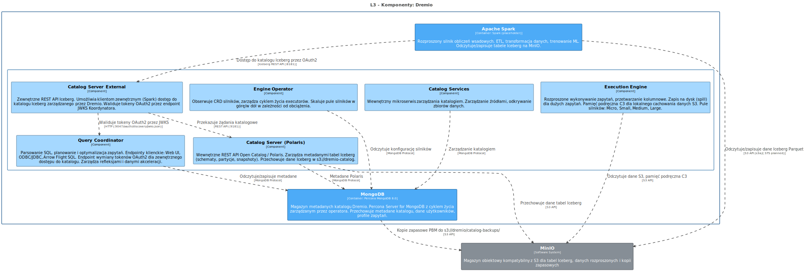

<!-- Wygenerowano automatycznie z workspace.dsl — NIE EDYTUJ RĘCZNIE -->
<!-- Regeneracja: ./scripts/generate-diagrams.sh -->

# L3 - Komponenty: Dremio

> Wewnętrzne moduły logiczne Dremio: Query Coordinator, Execution Engine, Engine Operator, Catalog Server (Polaris), Catalog Server External i Catalog Services.

<!-- Included in: levels/L3-components-dremio.md (container, via !docs in workspace.dsl) -->

# Dremio

Silnik zapytań SQL i platforma Data Lakehouse. Federacyjne zapytania do źródeł S3 i JDBC. Zarządza tabelami Iceberg poprzez Open Catalog (Polaris).

## Interfejsy

| Port | Protokół | Przeznaczenie |
|------|----------|---------------|
| 9047 | HTTPS | Interfejs webowy, REST API, endpoint tokenów OAuth2 |
| 31010 | TCP | Połączenia klientów ODBC/JDBC |
| 32010 | TCP | Arrow Flight SQL (wysokowydajny kolumnowy dostęp) |

## Komponenty L3

| Komponent | Odpowiedzialność |
|-----------|-----------------|
| Query Coordinator | Parsowanie SQL, planowanie, optymalizacja. Endpointy klientów. Wymiana tokenów OAuth2. |
| Execution Engine | Rozproszone wykonywanie zapytań, przetwarzanie kolumnowe, pamięć podręczna C3, zrzut na dysk. |
| Engine Operator | Skalowanie executorów sterowane przez CRD (pule silników Micro/Small/Medium/Large). |
| Catalog Server (Polaris) | Wewnętrzne REST API Iceberg. Zarządza schematami, partycjami, snapshotami. |
| Catalog Server External | Zewnętrzne REST API Iceberg dla Apache Spark. Walidacja tokenów OAuth2. |
| Catalog Services | Wewnętrzne zarządzanie katalogiem, zarządzanie źródłami, odkrywanie zbiorów danych. |

## Kluczowe relacje

- **MongoDB** — przechowuje metadane katalogu, dane użytkowników, profile zapytań
- **MinIO** — tabele Iceberg (`s3://dremio-catalog`), dane rozproszone, reflections, backupy
- **LDAP/AD** — federacja użytkowników (bezpośrednio, nie przez Keycloak)
- **Keycloak** — planowany do OIDC SSO

## Diagram architektury

```plantuml
@startuml
title <size:18>L3 - Komponenty: Dremio</size>

set separator none
top to bottom direction
skinparam ranksep 60
skinparam nodesep 30
hide stereotype

<style>
  root {
    BackgroundColor: #ffffff;
    FontColor: #444444;
  }
  // Element,Component
  .Element-RWxlbWVudCxDb21wb25lbnQ= {
    BackgroundColor: #a5d8ff;
    LineColor: #7397b2;
    LineStyle: 0;
    LineThickness: 2;
    FontColor: #000000;
    FontSize: 16;
    HorizontalAlignment: center;
    Shadowing: 0;
    MaximumWidth: 700;
  }
  // Element,Container
  .Element-RWxlbWVudCxDb250YWluZXI= {
    BackgroundColor: #4dabf7;
    LineColor: #3577ac;
    LineStyle: 0;
    LineThickness: 2;
    FontColor: #ffffff;
    FontSize: 16;
    HorizontalAlignment: center;
    Shadowing: 0;
    MaximumWidth: 700;
  }
  // Element,Software System,External
  .Element-RWxlbWVudCxTb2Z0d2FyZSBTeXN0ZW0sRXh0ZXJuYWw= {
    BackgroundColor: #868e96;
    LineColor: #5d6369;
    LineStyle: 0;
    LineThickness: 2;
    FontColor: #ffffff;
    FontSize: 16;
    HorizontalAlignment: center;
    Shadowing: 0;
    MaximumWidth: 700;
  }
  // Relationship
  .Relationship-UmVsYXRpb25zaGlw {
    LineThickness: 2;
    LineStyle: 10-10;
    LineColor: #444444;
    FontColor: #444444;
    FontSize: 16;
  }
  // Data Lakehouse Platform
  .Boundary-RGF0YSBMYWtlaG91c2UgUGxhdGZvcm0= {
    BackgroundColor: #ffffff;
    LineColor: #114f87;
    LineStyle: 0;
    LineThickness: 2;
    FontColor: #ffffff;
    FontSize: 16;
    HorizontalAlignment: center;
    Shadowing: 0;
  }
  // Dremio
  .Boundary-RHJlbWlv {
    BackgroundColor: #ffffff;
    LineColor: #3577ac;
    LineStyle: 0;
    LineThickness: 2;
    FontColor: #ffffff;
    FontSize: 16;
    HorizontalAlignment: center;
    Shadowing: 0;
  }
</style>

rectangle "==MinIO\n<size:12>[Software System]</size>\n\nMagazyn obiektowy kompatybilny z S3 dla tabel Iceberg, danych rozproszonych i kopii zapasowych" <<Element-RWxlbWVudCxTb2Z0d2FyZSBTeXN0ZW0sRXh0ZXJuYWw=>> as MinIO

rectangle "Data Lakehouse Platform\n<size:12>[Software System]</size>" <<Boundary-RGF0YSBMYWtlaG91c2UgUGxhdGZvcm0=>> {
  rectangle "Dremio\n<size:12>[Container: Dremio EE 26.1]</size>" <<Boundary-RHJlbWlv>> {
    rectangle "==Query Coordinator\n<size:12>[Component]</size>\n\nParsowanie SQL, planowanie i optymalizacja zapytań. Endpointy klienckie: Web UI, ODBC/JDBC, Arrow Flight SQL. Endpoint wymiany tokenów OAuth2 dla zewnętrznego dostępu do katalogu. Zarządza refleksjami i danymi akceleracji." <<Element-RWxlbWVudCxDb21wb25lbnQ=>> as DataLakehousePlatform.Dremio.QueryCoordinator
    rectangle "==Execution Engine\n<size:12>[Component]</size>\n\nRozproszone wykonywanie zapytań, przetwarzanie kolumnowe. Zapis na dysk (spill) dla dużych zapytań. Pamięć podręczna C3 dla lokalnego cachowania danych S3. Pule silników: Micro, Small, Medium, Large." <<Element-RWxlbWVudCxDb21wb25lbnQ=>> as DataLakehousePlatform.Dremio.ExecutionEngine
    rectangle "==Engine Operator\n<size:12>[Component]</size>\n\nObserwuje CRD silników, zarządza cyklem życia executorów. Skaluje pule silników w górę/w dół w zależności od obciążenia." <<Element-RWxlbWVudCxDb21wb25lbnQ=>> as DataLakehousePlatform.Dremio.EngineOperator
    rectangle "==Catalog Server (Polaris)\n<size:12>[Component]</size>\n\nWewnętrzne REST API Open Catalog / Polaris. Zarządza metadanymi tabel Iceberg (schematy, partycje, snapshoty). Przechowuje dane Iceberg w s3://dremio-catalog." <<Element-RWxlbWVudCxDb21wb25lbnQ=>> as DataLakehousePlatform.Dremio.CatalogServerPolaris
    rectangle "==Catalog Server External\n<size:12>[Component]</size>\n\nZewnętrzne REST API Iceberg. Umożliwia klientom zewnętrznym (Spark) dostęp do katalogu Iceberg zarządzanego przez Dremio. Waliduje tokeny OAuth2 przez endpoint JWKS Koordynatora." <<Element-RWxlbWVudCxDb21wb25lbnQ=>> as DataLakehousePlatform.Dremio.CatalogServerExternal
    rectangle "==Catalog Services\n<size:12>[Component]</size>\n\nWewnętrzny mikroserwis zarządzania katalogiem. Zarządzanie źródłami, odkrywanie zbiorów danych." <<Element-RWxlbWVudCxDb21wb25lbnQ=>> as DataLakehousePlatform.Dremio.CatalogServices
  }

  rectangle "==MongoDB\n<size:12>[Container: Percona MongoDB 8.0]</size>\n\nMagazyn metadanych katalogu Dremio. Percona Server for MongoDB z cyklem życia zarządzanym przez operatora. Przechowuje metadane katalogu, dane użytkowników, profile zapytań." <<Element-RWxlbWVudCxDb250YWluZXI=>> as DataLakehousePlatform.MongoDB
  rectangle "==Apache Spark\n<size:12>[Container: Spark (placeholder)]</size>\n\nRozproszony silnik obliczeń wsadowych. ETL, transformacja danych, trenowanie ML. Odczytuje/zapisuje tabele Iceberg na MinIO." <<Element-RWxlbWVudCxDb250YWluZXI=>> as DataLakehousePlatform.ApacheSpark
}

DataLakehousePlatform.MongoDB --> MinIO <<Relationship-UmVsYXRpb25zaGlw>> : "Kopie zapasowe PBM do s3://dremio/catalog-backups/\n<size:12>[S3 API]</size>"
DataLakehousePlatform.ApacheSpark --> MinIO <<Relationship-UmVsYXRpb25zaGlw>> : "Odczytuje/zapisuje dane Iceberg Parquet\n<size:12>[S3 API (s3a://, STS planned)]</size>"
DataLakehousePlatform.Dremio.QueryCoordinator --> DataLakehousePlatform.MongoDB <<Relationship-UmVsYXRpb25zaGlw>> : "Odczytuje/zapisuje metadane\n<size:12>[MongoDB Protocol]</size>"
DataLakehousePlatform.Dremio.CatalogServerPolaris --> DataLakehousePlatform.MongoDB <<Relationship-UmVsYXRpb25zaGlw>> : "Metadane Polaris\n<size:12>[MongoDB Protocol]</size>"
DataLakehousePlatform.Dremio.CatalogServices --> DataLakehousePlatform.MongoDB <<Relationship-UmVsYXRpb25zaGlw>> : "Zarządzanie katalogiem\n<size:12>[MongoDB Protocol]</size>"
DataLakehousePlatform.Dremio.EngineOperator --> DataLakehousePlatform.MongoDB <<Relationship-UmVsYXRpb25zaGlw>> : "Odczytuje konfigurację silników\n<size:12>[MongoDB Protocol]</size>"
DataLakehousePlatform.Dremio.ExecutionEngine --> MinIO <<Relationship-UmVsYXRpb25zaGlw>> : "Odczytuje dane S3, pamięć podręczna C3\n<size:12>[S3 API]</size>"
DataLakehousePlatform.Dremio.CatalogServerPolaris --> MinIO <<Relationship-UmVsYXRpb25zaGlw>> : "Przechowuje dane tabel Iceberg\n<size:12>[S3 API]</size>"
DataLakehousePlatform.Dremio.CatalogServerExternal --> DataLakehousePlatform.Dremio.QueryCoordinator <<Relationship-UmVsYXRpb25zaGlw>> : "Waliduje tokeny OAuth2 przez JWKS\n<size:12>[HTTP (:9047/oauth/discovery/jwks.json)]</size>"
DataLakehousePlatform.Dremio.CatalogServerExternal --> DataLakehousePlatform.Dremio.CatalogServerPolaris <<Relationship-UmVsYXRpb25zaGlw>> : "Przekazuje żądania katalogowe\n<size:12>[REST API (:9181)]</size>"
DataLakehousePlatform.ApacheSpark --> DataLakehousePlatform.Dremio.CatalogServerExternal <<Relationship-UmVsYXRpb25zaGlw>> : "Dostęp do katalogu Iceberg przez OAuth2\n<size:12>[Iceberg REST API (:8181)]</size>"

@enduml
```

Źródło PlantUML

## Systemy

### MinIO

Magazyn obiektowy kompatybilny z S3 dla tabel Iceberg, danych rozproszonych i kopii zapasowych

| Właściwość | Wartość |
|------------|--------|
| STS (planned) | MinIO Security Token Service — temporary credentials via OIDC for Dremio, Spark, JupyterHub |
| Protocol | S3 API |
| Buckets | dremio, dremio-catalog |
| Location | External to OCP |

## Kontenery

### Apache Spark

**Technologia:** Spark (placeholder)

Rozproszony silnik obliczeń wsadowych. ETL, transformacja danych, trenowanie ML. Odczytuje/zapisuje tabele Iceberg na MinIO.

| Właściwość | Wartość |
|------------|--------|
| Status | Placeholder / TODO |
| Namespace | dlh-prd |

### MongoDB

**Technologia:** Percona MongoDB 8.0

Magazyn metadanych katalogu Dremio. Percona Server for MongoDB z cyklem życia zarządzanym przez operatora. Przechowuje metadane katalogu, dane użytkowników, profile zapytań.

| Właściwość | Wartość |
|------------|--------|
| Status | Deployed |
| Operator | Deployment mongodb-operator (1 replica) |
| Metrics | :9216/metrics (mongodb_exporter sidecar) |
| App user | dremio (readWrite on dremio DB) |
| Secrets | dremio-mongodb-app-users, dremio-mongodb-system-users |
| CronJob | dremio-catalog-backups (daily 00:00) |
| Port | :27017/TCP |
| Backup | PBM daily full + PITR oplog to s3://dremio/catalog-backups/ |
| System users | clusterAdmin, clusterMonitor, backup, userAdmin |
| K8s workload | StatefulSet mongodb-rs0 (3 replicas, Percona) |
| Namespace | dlh-prd |

## Komponenty

### Catalog Server (Polaris)

Wewnętrzne REST API Open Catalog / Polaris. Zarządza metadanymi tabel Iceberg (schematy, partycje, snapshoty). Przechowuje dane Iceberg w s3://dremio-catalog.

| Właściwość | Wartość |
|------------|--------|
| Metrics | /metrics |
| Storage bucket | s3://dremio-catalog |
| Memory | 1Gi request / 2Gi limit |
| Port | :9181 (internal) |
| CPU | 200m request / 1 limit |
| S3 credentials | Secret catalog-server-s3-storage-creds |
| K8s workload | Deployment (1 replica) |

### Catalog Server External

Zewnętrzne REST API Iceberg. Umożliwia klientom zewnętrznym (Spark) dostęp do katalogu Iceberg zarządzanego przez Dremio. Waliduje tokeny OAuth2 przez endpoint JWKS Koordynatora.

| Właściwość | Wartość |
|------------|--------|
| K8s service | dremio-client :8181 (LoadBalancer, shared with Coordinator) |
| Endpoint | :8181/api/catalog |
| Authentication | OAuth2 (validates tokens via Coordinator :9047/oauth/discovery/jwks.json) |
| Port | :8181 (Iceberg REST API) |
| K8s workload | Deployment (1 replica) |

### Catalog Services

Wewnętrzny mikroserwis zarządzania katalogiem. Zarządzanie źródłami, odkrywanie zbiorów danych.

| Właściwość | Wartość |
|------------|--------|
| Metrics | /q/metrics |
| Memory | 256Mi request / 1Gi limit |
| CPU | 50m request / 500m limit |
| K8s workload | Deployment (1 replica) |

### Engine Operator

Obserwuje CRD silników, zarządza cyklem życia executorów. Skaluje pule silników w górę/w dół w zależności od obciążenia.

| Właściwość | Wartość |
|------------|--------|
| Metrics | :8080/q/metrics |
| Note | Engines created via Dremio UI, not Helm |
| K8s workload | Deployment (1 replica) |

### Execution Engine

Rozproszone wykonywanie zapytań, przetwarzanie kolumnowe. Zapis na dysk (spill) dla dużych zapytań. Pamięć podręczna C3 dla lokalnego cachowania danych S3. Pule silników: Micro, Small, Medium, Large.

| Właściwość | Wartość |
|------------|--------|
| PVC: C3 cache | executor-c3 10-50Gi |
| Metrics | :9010/metrics |
| Health probe | TCP :45678 (startup 10min, liveness 5min) |
| Engine: Medium | 2 pods, 10Gi memory |
| PVC: spill | executor-volume 10-50Gi |
| Engine: Micro | 1 pod, 4Gi memory |
| Logs | stdout (configurable via writeLogsToFile) |
| Engine: Large | 2 pods, 12Gi memory |
| K8s workload | StatefulSet dremio-executor (0-N replicas, Engine Operator) |
| Engine: Small | 1 pod, 10Gi memory |

### Query Coordinator

Parsowanie SQL, planowanie i optymalizacja zapytań. Endpointy klienckie: Web UI, ODBC/JDBC, Arrow Flight SQL. Endpoint wymiany tokenów OAuth2 dla zewnętrznego dostępu do katalogu. Zarządza refleksjami i danymi akceleracji.

| Właściwość | Wartość |
|------------|--------|
| Metrics | :9010/metrics |
| Memory | 4Gi request / 8Gi limit |
| Ports | Web UI :9047, ODBC/JDBC :31010, Arrow Flight :32010 |
| CPU | 250m request / 2 limit |
| Logs | stdout (configurable via writeLogsToFile) |
| K8s workload | StatefulSet dremio-master (1 replica) |
| OAuth2 token endpoint | :9047/oauth/token (exchanges IdP JWT for Dremio access token) |

## Relacje

| Od | Do | Opis | Technologia |
|----|-----|------|-------------|
| Apache Spark | Catalog Server External | Dostęp do katalogu Iceberg przez OAuth2 | Iceberg REST API (:8181) |
| Apache Spark | MinIO | Odczytuje/zapisuje dane Iceberg Parquet | S3 API (s3a://, STS planned) |
| Catalog Server (Polaris) | MinIO | Przechowuje dane tabel Iceberg | S3 API |
| Catalog Server (Polaris) | MongoDB | Metadane Polaris | MongoDB Protocol |
| Catalog Server External | Query Coordinator | Waliduje tokeny OAuth2 przez JWKS | HTTP (:9047/oauth/discovery/jwks.json) |
| Catalog Server External | Catalog Server (Polaris) | Przekazuje żądania katalogowe | REST API (:9181) |
| Catalog Services | MongoDB | Zarządzanie katalogiem | MongoDB Protocol |
| Engine Operator | MongoDB | Odczytuje konfigurację silników | MongoDB Protocol |
| Execution Engine | MinIO | Odczytuje dane S3, pamięć podręczna C3 | S3 API |
| MongoDB | MinIO | Kopie zapasowe PBM do s3://dremio/catalog-backups/ | S3 API |
| Query Coordinator | MongoDB | Odczytuje/zapisuje metadane | MongoDB Protocol |
