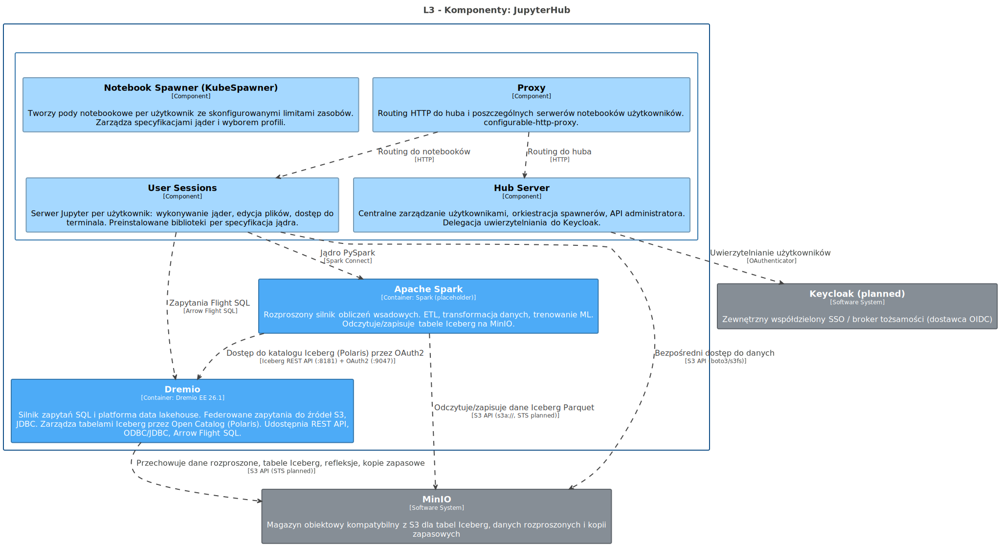
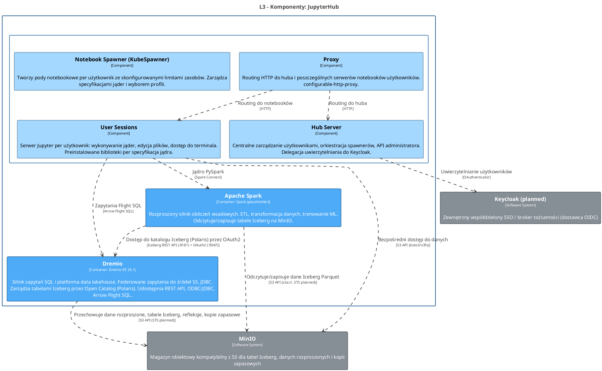

<!-- Wygenerowano automatycznie z workspace.dsl — NIE EDYTUJ RĘCZNIE -->
<!-- Regeneracja: ./scripts/generate-diagrams.sh -->

# L3 - Komponenty: JupyterHub

> Wewnętrzne moduły logiczne JupyterHub: Hub Server, Proxy, Notebook Spawner i User Sessions. Baza danych huba i image puller to infrastruktura wewnętrzna (tylko L4).

<!-- Included in: levels/L3-components-jupyterhub.md (container, via !docs in workspace.dsl) -->

# JupyterHub

Wieloużytkownikowy serwer notebooków. Interaktywna eksploracja danych z jądrami PySpark i Dremio SQL.

## Przeznaczenie

Zapewnia analitykom danych interaktywne środowiska notebookowe. Każdy użytkownik otrzymuje izolowany pod z preinstalowanymi jądrami dla Python, PySpark i Dremio SQL.

## Komponenty L3

| Komponent | Odpowiedzialność |
|-----------|-----------------|
| Hub Server | Centralne zarządzanie użytkownikami, orkiestracja spawnerów, API administratora. Delegacja uwierzytelniania do Keycloak. |
| Proxy | Routing HTTP do huba i poszczególnych serwerów notebooków użytkowników (configurable-http-proxy) |
| Notebook Spawner (KubeSpawner) | Tworzenie podów notebookowych per użytkownik ze skonfigurowanymi limitami zasobów i specyfikacjami jąder |
| User Sessions | Serwer Jupyter per użytkownik: wykonywanie jąder, edycja plików, dostęp do terminala |

## Infrastruktura wewnętrzna (tylko L4)

Hub Database i Image Puller są wewnętrzne dla JupyterHub — nie są widoczne na poziomie L2.

## Kluczowe relacje

- **Dremio** — zapytania Flight SQL z notebooków
- **Spark** — jądro PySpark przez Spark Connect
- **MinIO** — bezpośredni dostęp do danych przez boto3/s3fs
- **Keycloak** — uwierzytelnianie użytkowników przez OAuthenticator

## Diagram architektury

Źródło PlantUML

## Systemy

### Keycloak (planned)

Zewnętrzny współdzielony SSO / broker tożsamości (dostawca OIDC)

| Właściwość | Wartość |
|------------|--------|
| Direct consumers | Dremio, Airflow, JupyterHub, Superset |
| Protocol | OIDC |
| Location | External / shared |

### MinIO

Magazyn obiektowy kompatybilny z S3 dla tabel Iceberg, danych rozproszonych i kopii zapasowych

| Właściwość | Wartość |
|------------|--------|
| STS (planned) | MinIO Security Token Service — temporary credentials via OIDC for Dremio, Spark, JupyterHub |
| Protocol | S3 API |
| Buckets | dremio, dremio-catalog |
| Location | External to OCP |

## Kontenery

### Apache Spark

**Technologia:** Spark (placeholder)

Rozproszony silnik obliczeń wsadowych. ETL, transformacja danych, trenowanie ML. Odczytuje/zapisuje tabele Iceberg na MinIO.

| Właściwość | Wartość |
|------------|--------|
| Status | Placeholder / TODO |
| Namespace | dlh-prd |

### Dremio

**Technologia:** Dremio EE 26.1

Silnik zapytań SQL i platforma data lakehouse. Federowane zapytania do źródeł S3, JDBC. Zarządza tabelami Iceberg przez Open Catalog (Polaris). Udostępnia REST API, ODBC/JDBC, Arrow Flight SQL.

| Właściwość | Wartość |
|------------|--------|
| Status | Deployed |
| Ports | Web UI :9047, ODBC/JDBC :31010, Arrow Flight :32010 |
| Namespace | dlh-prd |

## Komponenty

### Hub Server

Centralne zarządzanie użytkownikami, orkiestracja spawnerów, API administratora. Delegacja uwierzytelniania do Keycloak.

### Notebook Spawner (KubeSpawner)

Tworzy pody notebookowe per użytkownik ze skonfigurowanymi limitami zasobów. Zarządza specyfikacjami jąder i wyborem profili.

### Proxy

Routing HTTP do huba i poszczególnych serwerów notebooków użytkowników. configurable-http-proxy.

| Właściwość | Wartość |
|------------|--------|
| Ports | :80/443 (public), :8001 (API) |

### User Sessions

Serwer Jupyter per użytkownik: wykonywanie jąder, edycja plików, dostęp do terminala. Preinstalowane biblioteki per specyfikacja jądra.

| Właściwość | Wartość |
|------------|--------|
| Kernel: Dremio SQL | pyarrow, flight-sql-dbapi → Dremio Flight :32010 |
| Kernel: Python 3 | numpy, pandas, matplotlib, scikit-learn |
| Kernel: PySpark | pyspark, delta-spark, pyiceberg → Spark Connect |

## Relacje

| Od | Do | Opis | Technologia |
|----|-----|------|-------------|
| Apache Spark | Dremio | Dostęp do katalogu Iceberg (Polaris) przez OAuth2 | Iceberg REST API (:8181) + OAuth2 (:9047) |
| Apache Spark | MinIO | Odczytuje/zapisuje dane Iceberg Parquet | S3 API (s3a://, STS planned) |
| Dremio | MinIO | Przechowuje dane rozproszone, tabele Iceberg, refleksje, kopie zapasowe | S3 API (STS planned) |
| Hub Server | Keycloak (planned) | Uwierzytelnianie użytkowników | OAuthenticator |
| Proxy | User Sessions | Routing do notebooków | HTTP |
| Proxy | Hub Server | Routing do huba | HTTP |
| User Sessions | Dremio | Zapytania Flight SQL | Arrow Flight SQL |
| User Sessions | Apache Spark | Jądro PySpark | Spark Connect |
| User Sessions | MinIO | Bezpośredni dostęp do danych | S3 API (boto3/s3fs) |
