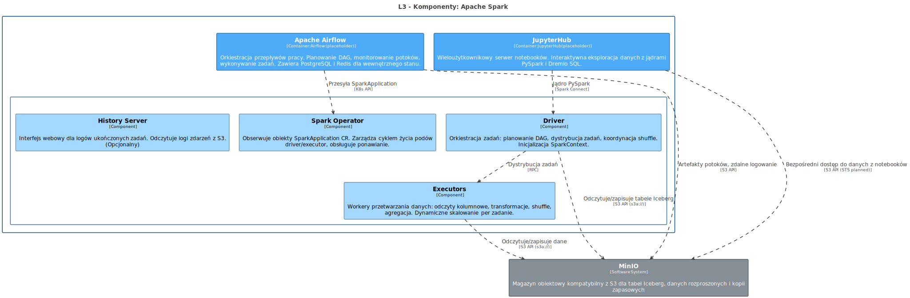

<!-- Wygenerowano automatycznie z workspace.dsl — NIE EDYTUJ RĘCZNIE -->
<!-- Regeneracja: ./scripts/generate-diagrams.sh -->

# L3 - Komponenty: Apache Spark

> Wewnętrzne moduły logiczne Spark: Operator, Driver, Executors i History Server.

<!-- Included in: levels/L3-components-spark.md (container, via !docs in workspace.dsl) -->

# Apache Spark

Rozproszony silnik obliczeń wsadowych. ETL, transformacja danych, trenowanie modeli ML.

## Przeznaczenie

Odczytuje i zapisuje tabele Iceberg na MinIO. Uzyskuje dostęp do Open Catalog (Polaris) Dremio w celu pobrania metadanych Iceberg. Zadania są przesyłane przez Apache Airflow lub interaktywnie z notebooków JupyterHub.

## Komponenty L3

| Komponent | Odpowiedzialność |
|-----------|-----------------|
| Spark Operator | Obserwuje obiekty SparkApplication CR, zarządza cyklem życia podów driver/executor |
| Driver | Orkiestracja zadań: planowanie DAG, dystrybucja zadań, koordynacja shuffle |
| Executors | Workery przetwarzania danych: odczyty kolumnowe, transformacje, agregacja. Dynamiczne skalowanie. |
| History Server | Interfejs webowy dla logów ukończonych zadań. Odczytuje logi zdarzeń z S3. (Opcjonalny) |

## Kluczowe relacje

- **MinIO** — odczyt/zapis danych Iceberg Parquet przez S3 API (s3a://)
- **Dremio** — dostęp do katalogu Iceberg (Polaris) przez REST API + OAuth2
- **Airflow** — przesyła obiekty SparkApplication CR przez K8s API
- **JupyterHub** — jądro PySpark przez Spark Connect

## Diagram architektury

```plantuml
@startuml
title <size:18>L3 - Komponenty: Apache Spark</size>

set separator none
top to bottom direction
skinparam ranksep 60
skinparam nodesep 30
hide stereotype

<style>
  root {
    BackgroundColor: #ffffff;
    FontColor: #444444;
  }
  // Element,Component
  .Element-RWxlbWVudCxDb21wb25lbnQ= {
    BackgroundColor: #a5d8ff;
    LineColor: #7397b2;
    LineStyle: 0;
    LineThickness: 2;
    FontColor: #000000;
    FontSize: 16;
    HorizontalAlignment: center;
    Shadowing: 0;
    MaximumWidth: 700;
  }
  // Element,Container
  .Element-RWxlbWVudCxDb250YWluZXI= {
    BackgroundColor: #4dabf7;
    LineColor: #3577ac;
    LineStyle: 0;
    LineThickness: 2;
    FontColor: #ffffff;
    FontSize: 16;
    HorizontalAlignment: center;
    Shadowing: 0;
    MaximumWidth: 700;
  }
  // Element,Software System,External
  .Element-RWxlbWVudCxTb2Z0d2FyZSBTeXN0ZW0sRXh0ZXJuYWw= {
    BackgroundColor: #868e96;
    LineColor: #5d6369;
    LineStyle: 0;
    LineThickness: 2;
    FontColor: #ffffff;
    FontSize: 16;
    HorizontalAlignment: center;
    Shadowing: 0;
    MaximumWidth: 700;
  }
  // Relationship
  .Relationship-UmVsYXRpb25zaGlw {
    LineThickness: 2;
    LineStyle: 10-10;
    LineColor: #444444;
    FontColor: #444444;
    FontSize: 16;
  }
  // Apache Spark
  .Boundary-QXBhY2hlIFNwYXJr {
    BackgroundColor: #ffffff;
    LineColor: #3577ac;
    LineStyle: 0;
    LineThickness: 2;
    FontColor: #ffffff;
    FontSize: 16;
    HorizontalAlignment: center;
    Shadowing: 0;
  }
  // Data Lakehouse Platform
  .Boundary-RGF0YSBMYWtlaG91c2UgUGxhdGZvcm0= {
    BackgroundColor: #ffffff;
    LineColor: #114f87;
    LineStyle: 0;
    LineThickness: 2;
    FontColor: #ffffff;
    FontSize: 16;
    HorizontalAlignment: center;
    Shadowing: 0;
  }
</style>

rectangle "==MinIO\n<size:12>[Software System]</size>\n\nMagazyn obiektowy kompatybilny z S3 dla tabel Iceberg, danych rozproszonych i kopii zapasowych" <<Element-RWxlbWVudCxTb2Z0d2FyZSBTeXN0ZW0sRXh0ZXJuYWw=>> as MinIO

rectangle "Data Lakehouse Platform\n<size:12>[Software System]</size>" <<Boundary-RGF0YSBMYWtlaG91c2UgUGxhdGZvcm0=>> {
  rectangle "Apache Spark\n<size:12>[Container: Spark (placeholder)]</size>" <<Boundary-QXBhY2hlIFNwYXJr>> {
    rectangle "==Spark Operator\n<size:12>[Component]</size>\n\nObserwuje obiekty SparkApplication CR. Zarządza cyklem życia podów driver/executor, obsługuje ponawianie." <<Element-RWxlbWVudCxDb21wb25lbnQ=>> as DataLakehousePlatform.ApacheSpark.SparkOperator
    rectangle "==Driver\n<size:12>[Component]</size>\n\nOrkiestracja zadań: planowanie DAG, dystrybucja zadań, koordynacja shuffle. Inicjalizacja SparkContext." <<Element-RWxlbWVudCxDb21wb25lbnQ=>> as DataLakehousePlatform.ApacheSpark.Driver
    rectangle "==Executors\n<size:12>[Component]</size>\n\nWorkery przetwarzania danych: odczyty kolumnowe, transformacje, shuffle, agregacja. Dynamiczne skalowanie per zadanie." <<Element-RWxlbWVudCxDb21wb25lbnQ=>> as DataLakehousePlatform.ApacheSpark.Executors
    rectangle "==History Server\n<size:12>[Component]</size>\n\nInterfejs webowy dla logów ukończonych zadań. Odczytuje logi zdarzeń z S3. (Opcjonalny)" <<Element-RWxlbWVudCxDb21wb25lbnQ=>> as DataLakehousePlatform.ApacheSpark.HistoryServer
  }

  rectangle "==Apache Airflow\n<size:12>[Container: Airflow (placeholder)]</size>\n\nOrkiestracja przepływów pracy. Planowanie DAG, monitorowanie potoków, wykonywanie zadań. Zawiera PostgreSQL i Redis dla wewnętrznego stanu." <<Element-RWxlbWVudCxDb250YWluZXI=>> as DataLakehousePlatform.ApacheAirflow
  rectangle "==JupyterHub\n<size:12>[Container: JupyterHub (placeholder)]</size>\n\nWieloużytkownikowy serwer notebooków. Interaktywna eksploracja danych z jądrami PySpark i Dremio SQL." <<Element-RWxlbWVudCxDb250YWluZXI=>> as DataLakehousePlatform.JupyterHub
}

DataLakehousePlatform.ApacheSpark.Driver --> DataLakehousePlatform.ApacheSpark.Executors <<Relationship-UmVsYXRpb25zaGlw>> : "Dystrybucja zadań\n<size:12>[RPC]</size>"
DataLakehousePlatform.ApacheSpark.Driver --> MinIO <<Relationship-UmVsYXRpb25zaGlw>> : "Odczytuje/zapisuje tabele Iceberg\n<size:12>[S3 API (s3a://)]</size>"
DataLakehousePlatform.ApacheSpark.Executors --> MinIO <<Relationship-UmVsYXRpb25zaGlw>> : "Odczytuje/zapisuje dane\n<size:12>[S3 API (s3a://)]</size>"
DataLakehousePlatform.ApacheAirflow --> DataLakehousePlatform.ApacheSpark.SparkOperator <<Relationship-UmVsYXRpb25zaGlw>> : "Przesyła SparkApplication\n<size:12>[K8s API]</size>"
DataLakehousePlatform.JupyterHub --> DataLakehousePlatform.ApacheSpark.Driver <<Relationship-UmVsYXRpb25zaGlw>> : "Jądro PySpark\n<size:12>[Spark Connect]</size>"
DataLakehousePlatform.ApacheAirflow --> MinIO <<Relationship-UmVsYXRpb25zaGlw>> : "Artefakty potoków, zdalne logowanie\n<size:12>[S3 API]</size>"
DataLakehousePlatform.JupyterHub --> MinIO <<Relationship-UmVsYXRpb25zaGlw>> : "Bezpośredni dostęp do danych z notebooków\n<size:12>[S3 API (STS planned)]</size>"

@enduml
```

Źródło PlantUML

## Systemy

### MinIO

Magazyn obiektowy kompatybilny z S3 dla tabel Iceberg, danych rozproszonych i kopii zapasowych

| Właściwość | Wartość |
|------------|--------|
| STS (planned) | MinIO Security Token Service — temporary credentials via OIDC for Dremio, Spark, JupyterHub |
| Protocol | S3 API |
| Buckets | dremio, dremio-catalog |
| Location | External to OCP |

## Kontenery

### Apache Airflow

**Technologia:** Airflow (placeholder)

Orkiestracja przepływów pracy. Planowanie DAG, monitorowanie potoków, wykonywanie zadań. Zawiera PostgreSQL i Redis dla wewnętrznego stanu.

| Właściwość | Wartość |
|------------|--------|
| Status | Placeholder / TODO |
| Namespace | dlh-prd |

### JupyterHub

**Technologia:** JupyterHub (placeholder)

Wieloużytkownikowy serwer notebooków. Interaktywna eksploracja danych z jądrami PySpark i Dremio SQL.

| Właściwość | Wartość |
|------------|--------|
| Status | Placeholder / TODO |
| Namespace | dlh-prd |

## Komponenty

### Driver

Orkiestracja zadań: planowanie DAG, dystrybucja zadań, koordynacja shuffle. Inicjalizacja SparkContext.

### Executors

Workery przetwarzania danych: odczyty kolumnowe, transformacje, shuffle, agregacja. Dynamiczne skalowanie per zadanie.

### History Server

Interfejs webowy dla logów ukończonych zadań. Odczytuje logi zdarzeń z S3. (Opcjonalny)

| Właściwość | Wartość |
|------------|--------|
| Port | :18080 |

### Spark Operator

Obserwuje obiekty SparkApplication CR. Zarządza cyklem życia podów driver/executor, obsługuje ponawianie.

| Właściwość | Wartość |
|------------|--------|
| CRDs | SparkApplication, ScheduledSparkApplication |

## Relacje

| Od | Do | Opis | Technologia |
|----|-----|------|-------------|
| Apache Airflow | Spark Operator | Przesyła SparkApplication | K8s API |
| Apache Airflow | MinIO | Artefakty potoków, zdalne logowanie | S3 API |
| Driver | Executors | Dystrybucja zadań | RPC |
| Driver | MinIO | Odczytuje/zapisuje tabele Iceberg | S3 API (s3a://) |
| Executors | MinIO | Odczytuje/zapisuje dane | S3 API (s3a://) |
| JupyterHub | Driver | Jądro PySpark | Spark Connect |
| JupyterHub | MinIO | Bezpośredni dostęp do danych z notebooków | S3 API (STS planned) |
