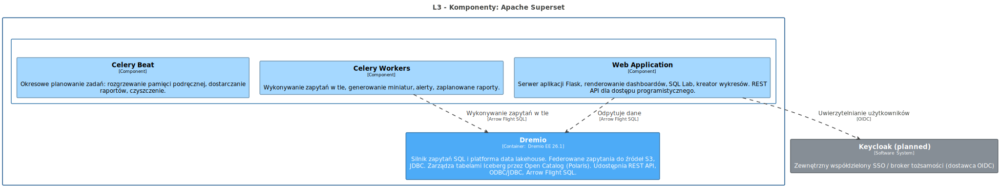

<!-- Wygenerowano automatycznie z workspace.dsl — NIE EDYTUJ RĘCZNIE -->
<!-- Regeneracja: ./scripts/generate-diagrams.sh -->

# L3 - Komponenty: Apache Superset

> Wewnętrzne moduły logiczne Superset: Web Application, Celery Workers i Celery Beat. Redis, PostgreSQL i zadania inicjalizacyjne to infrastruktura wewnętrzna (tylko L4).

<!-- Included in: levels/L3-components-superset.md (container, via !docs in workspace.dsl) -->

# Apache Superset

Platforma BI i wizualizacji danych. Dashboardy, SQL Lab, kreator wykresów, planowanie alertów/raportów.

## Przeznaczenie

Zapewnia samoobsługową analitykę i dashboardy dla analityków danych i programistów BI. Odpytuje dane z Dremio za pośrednictwem Arrow Flight SQL.

## Komponenty L3

| Komponent | Odpowiedzialność |
|-----------|-----------------|
| Web Application | Serwer aplikacji Flask, renderowanie dashboardów, SQL Lab, REST API |
| Celery Workers | Wykonywanie zapytań w tle, generowanie miniatur, alerty, zaplanowane raporty |
| Celery Beat | Okresowe planowanie zadań: rozgrzewanie pamięci podręcznej, dostarczanie raportów, czyszczenie |

## Infrastruktura wewnętrzna (tylko L4)

Redis (broker Celery) i PostgreSQL (baza metadanych) są wewnętrzne dla Superset — nie są widoczne na poziomie L2.

## Kluczowe relacje

- **Dremio** — odpytuje dane za pośrednictwem Arrow Flight SQL
- **Keycloak** — uwierzytelnianie użytkowników przez OIDC

## Diagram architektury

```plantuml
@startuml
title <size:18>L3 - Komponenty: Apache Superset</size>

set separator none
top to bottom direction
skinparam ranksep 60
skinparam nodesep 30
hide stereotype

<style>
  root {
    BackgroundColor: #ffffff;
    FontColor: #444444;
  }
  // Element,Component
  .Element-RWxlbWVudCxDb21wb25lbnQ= {
    BackgroundColor: #a5d8ff;
    LineColor: #7397b2;
    LineStyle: 0;
    LineThickness: 2;
    FontColor: #000000;
    FontSize: 16;
    HorizontalAlignment: center;
    Shadowing: 0;
    MaximumWidth: 700;
  }
  // Element,Container
  .Element-RWxlbWVudCxDb250YWluZXI= {
    BackgroundColor: #4dabf7;
    LineColor: #3577ac;
    LineStyle: 0;
    LineThickness: 2;
    FontColor: #ffffff;
    FontSize: 16;
    HorizontalAlignment: center;
    Shadowing: 0;
    MaximumWidth: 700;
  }
  // Element,Software System,External
  .Element-RWxlbWVudCxTb2Z0d2FyZSBTeXN0ZW0sRXh0ZXJuYWw= {
    BackgroundColor: #868e96;
    LineColor: #5d6369;
    LineStyle: 0;
    LineThickness: 2;
    FontColor: #ffffff;
    FontSize: 16;
    HorizontalAlignment: center;
    Shadowing: 0;
    MaximumWidth: 700;
  }
  // Relationship
  .Relationship-UmVsYXRpb25zaGlw {
    LineThickness: 2;
    LineStyle: 10-10;
    LineColor: #444444;
    FontColor: #444444;
    FontSize: 16;
  }
  // Apache Superset
  .Boundary-QXBhY2hlIFN1cGVyc2V0 {
    BackgroundColor: #ffffff;
    LineColor: #3577ac;
    LineStyle: 0;
    LineThickness: 2;
    FontColor: #ffffff;
    FontSize: 16;
    HorizontalAlignment: center;
    Shadowing: 0;
  }
  // Data Lakehouse Platform
  .Boundary-RGF0YSBMYWtlaG91c2UgUGxhdGZvcm0= {
    BackgroundColor: #ffffff;
    LineColor: #114f87;
    LineStyle: 0;
    LineThickness: 2;
    FontColor: #ffffff;
    FontSize: 16;
    HorizontalAlignment: center;
    Shadowing: 0;
  }
</style>

rectangle "==Keycloak (planned)\n<size:12>[Software System]</size>\n\nZewnętrzny współdzielony SSO / broker tożsamości (dostawca OIDC)" <<Element-RWxlbWVudCxTb2Z0d2FyZSBTeXN0ZW0sRXh0ZXJuYWw=>> as Keycloakplanned

rectangle "Data Lakehouse Platform\n<size:12>[Software System]</size>" <<Boundary-RGF0YSBMYWtlaG91c2UgUGxhdGZvcm0=>> {
  rectangle "Apache Superset\n<size:12>[Container: Superset (placeholder)]</size>" <<Boundary-QXBhY2hlIFN1cGVyc2V0>> {
    rectangle "==Web Application\n<size:12>[Component]</size>\n\nSerwer aplikacji Flask, renderowanie dashboardów, SQL Lab, kreator wykresów. REST API dla dostępu programistycznego." <<Element-RWxlbWVudCxDb21wb25lbnQ=>> as DataLakehousePlatform.ApacheSuperset.WebApplication
    rectangle "==Celery Workers\n<size:12>[Component]</size>\n\nWykonywanie zapytań w tle, generowanie miniatur, alerty, zaplanowane raporty." <<Element-RWxlbWVudCxDb21wb25lbnQ=>> as DataLakehousePlatform.ApacheSuperset.CeleryWorkers
    rectangle "==Celery Beat\n<size:12>[Component]</size>\n\nOkresowe planowanie zadań: rozgrzewanie pamięci podręcznej, dostarczanie raportów, czyszczenie." <<Element-RWxlbWVudCxDb21wb25lbnQ=>> as DataLakehousePlatform.ApacheSuperset.CeleryBeat
  }

  rectangle "==Dremio\n<size:12>[Container: Dremio EE 26.1]</size>\n\nSilnik zapytań SQL i platforma data lakehouse. Federowane zapytania do źródeł S3, JDBC. Zarządza tabelami Iceberg przez Open Catalog (Polaris). Udostępnia REST API, ODBC/JDBC, Arrow Flight SQL." <<Element-RWxlbWVudCxDb250YWluZXI=>> as DataLakehousePlatform.Dremio
}

DataLakehousePlatform.ApacheSuperset.CeleryWorkers --> DataLakehousePlatform.Dremio <<Relationship-UmVsYXRpb25zaGlw>> : "Wykonywanie zapytań w tle\n<size:12>[Arrow Flight SQL]</size>"
DataLakehousePlatform.ApacheSuperset.WebApplication --> DataLakehousePlatform.Dremio <<Relationship-UmVsYXRpb25zaGlw>> : "Odpytuje dane\n<size:12>[Arrow Flight SQL]</size>"
DataLakehousePlatform.ApacheSuperset.WebApplication --> Keycloakplanned <<Relationship-UmVsYXRpb25zaGlw>> : "Uwierzytelnianie użytkowników\n<size:12>[OIDC]</size>"

@enduml
```

Źródło PlantUML

## Systemy

### Keycloak (planned)

Zewnętrzny współdzielony SSO / broker tożsamości (dostawca OIDC)

| Właściwość | Wartość |
|------------|--------|
| Direct consumers | Dremio, Airflow, JupyterHub, Superset |
| Protocol | OIDC |
| Location | External / shared |

## Kontenery

### Dremio

**Technologia:** Dremio EE 26.1

Silnik zapytań SQL i platforma data lakehouse. Federowane zapytania do źródeł S3, JDBC. Zarządza tabelami Iceberg przez Open Catalog (Polaris). Udostępnia REST API, ODBC/JDBC, Arrow Flight SQL.

| Właściwość | Wartość |
|------------|--------|
| Status | Deployed |
| Ports | Web UI :9047, ODBC/JDBC :31010, Arrow Flight :32010 |
| Namespace | dlh-prd |

## Komponenty

### Celery Beat

Okresowe planowanie zadań: rozgrzewanie pamięci podręcznej, dostarczanie raportów, czyszczenie.

| Właściwość | Wartość |
|------------|--------|
| Logs | stdout |

### Celery Workers

Wykonywanie zapytań w tle, generowanie miniatur, alerty, zaplanowane raporty.

| Właściwość | Wartość |
|------------|--------|
| Logs | stdout |

### Web Application

Serwer aplikacji Flask, renderowanie dashboardów, SQL Lab, kreator wykresów. REST API dla dostępu programistycznego.

| Właściwość | Wartość |
|------------|--------|
| Port | :8088 |
| Logs | stdout |

## Relacje

| Od | Do | Opis | Technologia |
|----|-----|------|-------------|
| Celery Workers | Dremio | Wykonywanie zapytań w tle | Arrow Flight SQL |
| Web Application | Keycloak (planned) | Uwierzytelnianie użytkowników | OIDC |
| Web Application | Dremio | Odpytuje dane | Arrow Flight SQL |
