<!-- Wygenerowano automatycznie z workspace.dsl + extras/ — NIE EDYTUJ RĘCZNIE -->
<!-- Właściwości DSL są generowane automatycznie; zawartość extras/ jest utrzymywana ręcznie -->
<!-- Regeneracja: ./scripts/generate-diagrams.sh -->

# L4 - Wdrożenie: MongoDB

> Granica kontenera dla MongoDB w ramach dlh-prd namespace.

<!-- Included in: levels/L4-deployment-mongodb.md (deployment boundary, via extras/) -->
<!-- Source: components/dremio/docs/MONGODB.md -->

## Architektura

**Percona Operator** (zielony) monitoruje zasoby CR `PerconaServerMongoDB` i tworzy obiekty uruchomieniowe (żółte) — StatefulSet, bezgłową usługę Service oraz CronJob kopii zapasowych. **Komponenty Dremio** (szare) łączą się z MongoDB przez bezgłową usługę `dremio-mongodb-rs0` na porcie 27017. **Wcześniej utworzone sekrety** (jasnoniebieski) są tworzone przez `build.sh` z pliku `.env` przed instalacją Helm. Każdy pod MongoDB uruchamia trzy kontenery: `mongod` (baza danych), `pbm-agent` (kopie zapasowe) i `mongodb_exporter` (metryki). **Hook pre-delete** (fioletowy) zapewnia czyste usunięcie zasobów przy `helm uninstall`.

```mermaid
graph TB
    subgraph Operator["MongoDB Operator (subchart)"]
        direction TB
        OpDeploy["Deployment<br/>dremio-mongodb-operator"]
        OpSA["ServiceAccount<br/>dremio-mongodb-operator"]
        OpRole["Role<br/>dremio-mongodb-operator"]
        OpRB["RoleBinding<br/>dremio-mongodb-operator"]
    end

    subgraph CRDs["Custom Resource Definitions"]
        direction LR
        CRD1["PerconaServerMongoDB"]
        CRD2["PerconaServerMongoDBBackup"]
        CRD3["PerconaServerMongoDBRestore"]
    end

    subgraph Cluster["MongoDB Cluster (from templates)"]
        direction TB
        PSMDB["PerconaServerMongoDB<br/>dremio-mongodb<br/>(rs0, 3 replicas)"]
        MongSA["ServiceAccount<br/>dremio-mongodb"]
        BackupSecret["Secret<br/>dremio-mongodb-backup<br/>(S3 access keys)"]
    end

    subgraph Runtime["Created by Operator at Runtime"]
        direction TB
        STS["StatefulSet<br/>dremio-mongodb-rs0"]
        SVC["Service (headless)<br/>dremio-mongodb-rs0"]
        CronJob["CronJob<br/>dremio-catalog-backups<br/>(daily 00:00)"]
    end

    subgraph PreCreated["Pre-created by build.sh"]
        direction TB
        AppSecret2["Secret<br/>dremio-mongodb-app-users<br/>(dremio user, from .env)"]
        SysSecret["Secret<br/>dremio-mongodb-system-users<br/>(4 system users, from .env)"]
    end

    subgraph Clients["Dremio Components (MongoDB clients)"]
        direction LR
        Coord["coordinator"]
        CatSrv["catalog-server"]
        CatSvc["catalog-services"]
        EngOp["engine-operator"]
    end

    subgraph Pods["MongoDB Pod"]
        direction LR
        Mongod["mongod<br/>:27017"]
        PBM["pbm-agent<br/>(backup)"]
        Metrics["mongodb_exporter<br/>:9216"]
    end

    subgraph Storage["Persistent Storage"]
        direction LR
        PVC["PVC<br/>mongod-data-*<br/>10Gi (ceph-block)"]
        S3["S3 bucket: dremio<br/>/catalog-backups/<br/>(full + PITR oplog)"]
    end

    subgraph Hook["Pre-Delete Hook"]
        direction TB
        HookSA["ServiceAccount<br/>dremio-mongodb-pre-delete"]
        HookRole["Role<br/>dremio-mongodb-pre-delete-role"]
        HookRB["RoleBinding<br/>dremio-mongodb-pre-delete-rolebinding"]
        HookJob["Job<br/>delete-mongodbcluster"]
    end

    OpDeploy -->|"watches & reconciles"| PSMDB
    OpRB --> OpRole
    OpRB --> OpSA
    OpDeploy --> OpSA

    PSMDB -.->|"operator creates"| STS
    PSMDB -.->|"operator creates"| SVC
    PSMDB -.->|"operator creates"| CronJob

    PSMDB --> MongSA
    PSMDB --> AppSecret2
    PSMDB --> SysSecret
    PSMDB --> BackupSecret

    STS --> Pods
    SVC -->|":27017"| Mongod

    Coord -->|"mongodb://"| SVC
    CatSrv -->|"mongodb://"| SVC
    CatSvc -->|"mongodb://"| SVC
    EngOp -->|"mongodb://"| SVC

    Mongod --> PVC
    PBM -->|"S3 API"| S3
    CronJob -->|"triggers"| PBM

    Metrics -->|"reads"| SysSecret

    HookRB --> HookRole
    HookRB --> HookSA
    HookJob --> HookSA
    HookJob -.->|"deletes on<br/>helm uninstall"| PSMDB

    classDef operator fill:#69db7c,stroke:#2b8a3e,stroke-width:2px,color:#000
    classDef crd fill:#e8e8e8,stroke:#868e96,stroke-width:2px,color:#000
    classDef cluster fill:#4dabf7,stroke:#1971c2,stroke-width:2px,color:#fff
    classDef runtime fill:#ffd43b,stroke:#f59f00,stroke-width:2px,color:#000
    classDef pod fill:#ff922b,stroke:#e8590c,stroke-width:2px,color:#fff
    classDef storage fill:#ff6b6b,stroke:#c92a2a,stroke-width:2px,color:#fff
    classDef hook fill:#d0bfff,stroke:#7950f2,stroke-width:2px,color:#000
    classDef precreated fill:#74c0fc,stroke:#1864ab,stroke-width:2px,color:#000
    classDef client fill:#e9ecef,stroke:#495057,stroke-width:2px,color:#000

    class Coord,CatSrv,CatSvc,EngOp client
    class OpDeploy,OpSA,OpRole,OpRB operator
    class CRD1,CRD2,CRD3 crd
    class PSMDB,MongSA,BackupSecret cluster
    class STS,SVC,CronJob runtime
    class AppSecret2,SysSecret precreated
    class Mongod,PBM,Metrics pod
    class PVC,S3 storage
    class HookSA,HookRole,HookRB,HookJob hook
```



## Obiekty Kubernetes

### Operator (z subchartu)

| Rodzaj | Nazwa | Przeznaczenie |
|--------|-------|---------------|
| Deployment | `dremio-mongodb-operator` | Percona Operator — monitoruje zasoby CR `PerconaServerMongoDB` i uzgadnia StatefulSety MongoDB |
| ServiceAccount | `dremio-mongodb-operator` | Tożsamość poda operatora |
| Role | `dremio-mongodb-operator` | RBAC: zarządzanie CRD PSMDB, podami, usługami, PVC, sekretami, StatefulSetami, CronJobami, PDB, dzierżawami (leases), zdarzeniami |
| RoleBinding | `dremio-mongodb-operator` | Wiąże rolę z kontem usługowym operatora |

### CRD (instalowane przez subchart operatora)

| CRD | Rodzaj | Przeznaczenie |
|-----|--------|---------------|
| `perconaservermongodbs.psmdb.dremio.com` | PerconaServerMongoDB | Definicja klastra MongoDB |
| `perconaservermongodbbackups.psmdb.dremio.com` | PerconaServerMongoDBBackup | Wyzwalacz kopii zapasowej na żądanie |
| `perconaservermongodbrestores.psmdb.dremio.com` | PerconaServerMongoDBRestore | Wyzwalacz operacji przywracania |

### Klaster MongoDB (z szablonów Helm)

| Rodzaj | Nazwa | Przeznaczenie |
|--------|-------|---------------|
| PerconaServerMongoDB | `dremio-mongodb` | Główny CR — definiuje zestaw replik `rs0`, magazyn danych, kopie zapasowe, użytkowników, bezpieczeństwo |
| ServiceAccount | `dremio-mongodb` | Tożsamość podów MongoDB |
| Secret | `dremio-mongodb-app-users` | Hasło użytkownika aplikacji (użytkownik `dremio`, z `.env` przez build.sh, `helm.sh/resource-policy: keep`) |
| Secret | `dremio-mongodb-system-users` | Użytkownicy systemowi (clusterAdmin, clusterMonitor, backup, userAdmin — z `.env` przez build.sh) |

### Kopie zapasowe

| Rodzaj | Nazwa | Warunek | Przeznaczenie |
|--------|-------|---------|---------------|
| Secret | `dremio-mongodb-backup` | `backup.enabled` + dane uwierzytelniające distStorage | Klucze dostępu S3 dla Percona Backup for MongoDB (PBM) |

### Hook Pre-Delete (czyszczenie przy `helm uninstall`)

| Rodzaj | Nazwa | Przeznaczenie |
|--------|-------|---------------|
| ServiceAccount | `dremio-mongodb-pre-delete` | Tożsamość zadania czyszczącego |
| Role | `dremio-mongodb-pre-delete-role` | RBAC: get/delete/patch CRD PSMDB |
| RoleBinding | `dremio-mongodb-pre-delete-rolebinding` | Wiąże rolę z kontem usługowym hooka |
| Job | `delete-mongodbcluster` | Usuwa zasoby CR przed usunięciem operatora, z awaryjnym usuwaniem finalizerów |

### Tworzone przez Operator w czasie działania

Nie znajdują się w szablonach Helm — tworzone przez operatora podczas uzgadniania zasobu CR `PerconaServerMongoDB`:

| Rodzaj | Nazwa | Przeznaczenie |
|--------|-------|---------------|
| StatefulSet | `dremio-mongodb-rs0` | Pody zestawu replik MongoDB |
| Service | `dremio-mongodb-rs0` | Bezgłowa usługa dla DNS zestawu replik |
| PVC | `mongod-data-dremio-mongodb-rs0-*` | 10Gi na replikę, dane WiredTiger |
| CronJob | `dremio-catalog-backups` | Zaplanowane wykonywanie kopii zapasowych (jeśli kopie zapasowe są włączone) |

### Kontenery pomocnicze (sidecar, na każdy pod MongoDB)

| Kontener | Obraz | Port | Przeznaczenie |
|----------|-------|------|---------------|
| `mongod` | percona/percona-server-mongodb | 27017 | Silnik magazynowania WiredTiger, replikacja, oplog |
| `pbm-agent` | percona/percona-backup-mongodb | — | Sidecar Percona Backup for MongoDB |
| `mongodb_exporter` | `percona/mongodb_exporter:0.47.1` | 9216 | Metryki Prometheus (połączenia, opcounters, opóźnienie replikacji, pamięć podręczna WiredTiger) |

## Sieć

| Port | Protokół | Przeznaczenie |
|------|----------|---------------|
| 27017 | TCP | Protokół MongoDB (zestaw replik + połączenia klientów) |
| 9216 | TCP | Eksporter metryk Prometheus |

**DNS usługi:** `dremio-mongodb-rs0.<namespace>.svc.cluster.local`


## Bezpieczeństwo

- Wszystkie kontenery działają jako użytkownik inny niż root (UID 1001)
- Profil seccomp: `RuntimeDefault`
- Uprawnienia (capabilities): wszystkie usunięte
- TLS: `preferTLS` domyślnie (można wyłączyć za pomocą `mongodb.disableTls: true`)
- Wszystkie hasła (użytkownicy aplikacji i systemowi) tworzone wcześniej przez `build.sh` z pliku `.env`
- Sekret użytkownika aplikacji oznaczony adnotacją `helm.sh/resource-policy: keep` (przetrwa reinstalację Helm)

## Kopie zapasowe i przywracanie

Kopie zapasowe są realizowane przez Percona Backup for MongoDB (PBM) jako kontener sidecar w każdym podzie MongoDB. PBM zapisuje do bucketu S3 `dremio` w katalogu `/catalog-backups/`.

### Konfiguracja kopii zapasowych

| Ustawienie | Wartość |
|------------|---------|
| Typ | Fizyczny (GA od wersji v1.16.0) |
| Harmonogram | `0 0 * * *` (codziennie o 00:00 UTC) |
| Retencja | 3 kopie zapasowe |
| Kompresja | gzip poziom 1 |
| PITR | Włączony — ciągły oplog, interwał wysyłania 10 minut |

### Układ magazynu S3

```
s3://dremio/catalog-backups/
  <timestamp>/           <- pełna fizyczna kopia zapasowa
  pbmPitr/               <- ciągłe fragmenty oplog PITR
```

### Typy kopii zapasowych

| Typ | Status | Opis |
|-----|--------|------|
| **Fizyczny** (aktualny) | GA od wersji v1.16.0 | Kopiuje surowe pliki `dbPath`. Szybki dla dużych zbiorów danych. Obsługuje PITR od wersji v1.15.0 |
| Logiczny | GA | Używa `mongodump`. Wolniejszy, ale obsługuje selektywne przywracanie (konkretne przestrzenie nazw/kolekcje) |
| Przyrostowy | Tech Preview (v1.20.0) | Kopiuje tylko dane zmienione od ostatniej kopii zapasowej |

### Operacje

```bash
# Wyświetlanie kopii zapasowych
kubectl exec -n dremio dremio-mongodb-rs0-0 -c backup-agent -- pbm list
kubectl exec -n dremio dremio-mongodb-rs0-0 -c backup-agent -- pbm status

# Kopia zapasowa na żądanie: utwórz zasób CR PerconaServerMongoDBBackup
# Przywracanie: utwórz zasób CR PerconaServerMongoDBRestore (obsługuje datę PITR lub najnowszą)
# Diagnostyka: kubectl logs -n dremio dremio-mongodb-rs0-0 -c backup-agent -f
```

## Monitorowanie

| Punkt końcowy | Wartość |
|---------------|--------|
| Metrics | :9216/metrics (mongodb_exporter sidecar — connections, opcounters, replication lag, WiredTiger cache) |
| Logs | stdout → external log collector |
| Annotations | metrics.dremio.com/scrape: true (Dremio-specific, not standard prometheus.io/scrape) |

## Właściwości

| Właściwość | Wartość |
|------------|--------|
| Helm chart | Bundled as Dremio subchart — no separate installation needed |
| Operator version | Percona MongoDB Operator v1.21.1 |
| Secret: backup | dremio-mongodb-backup — S3 access keys for PBM |
| Networking | :27017/TCP (MongoDB wire protocol), :9216/TCP (Prometheus metrics) |
| Secret: app-users | dremio-mongodb-app-users — dremio user (readWrite on dremio DB), pre-created by build.sh, helm.sh/resource-policy: keep |
| Secret: system-users | dremio-mongodb-system-users — clusterAdmin, clusterMonitor, backup, userAdmin (pre-created by build.sh) |
| Service DNS | dremio-mongodb-rs0.<namespace>.svc.cluster.local |

## Jednostki uruchomieniowe

### mongodb-backup

**Typ:** CronJob (daily 00:00)

| Właściwość | Wartość |
|------------|--------|
| Compression | gzip level 1 |
| Purpose | Automated daily full backup of all MongoDB data. Combined with continuous oplog streaming, enables point-in-time recovery to any second between backups — protecting against accidental deletes, bad writes, or data corruption. |
| Retention | 3 backups |
| On-demand backup | Create PerconaServerMongoDBBackup CR |
| CronJob name | dremio-catalog-backups |
| Restore | Create PerconaServerMongoDBRestore CR (supports PITR date or latest) |
| Oplog | MongoDB operations log — an ordered journal of every write (insert, update, delete) applied to the replica set. Used for replication between members and for PITR recovery. |
| Secret | dremio-mongodb-backup (S3 access keys for PBM) |
| Type | Physical backup (GA since v1.16.0) — copies raw WiredTiger data files for fast, consistent restore |
| PITR | Point-in-Time Recovery — restores to any specific second, not just the last full backup. PBM continuously streams oplog chunks to S3 every 10 minutes (oplogSpanMin: 10). On restore, PBM replays the full backup + oplog entries up to the target timestamp. |
| Storage | s3://dremio/catalog-backups/ (<timestamp>/ for full backups, pbmPitr/ for oplog chunks) |
| Schedule | 0 0 * * * (daily 00:00 UTC) |
| PITR requirement | At least one full backup must exist before oplog capture starts — the first oplog chunk anchors to the latest full backup |

### mongodb-operator

**Typ:** Deployment (1 replica)

| Właściwość | Wartość |
|------------|--------|
| Role | dremio-mongodb-operator — manage PSMDB CRDs, pods, services, PVCs, secrets, StatefulSets, CronJobs, PDBs, leases, events |
| CRDs | PerconaServerMongoDB, PerconaServerMongoDBBackup, PerconaServerMongoDBRestore |
| ServiceAccount | dremio-mongodb-operator |
| Purpose | Watches PerconaServerMongoDB CRs, reconciles StatefulSet/Service/CronJob/PVC |
| RoleBinding | dremio-mongodb-operator → SA dremio-mongodb-operator |
| Image | percona/percona-server-mongodb-operator:1.21.1 |

### mongodb-pre-delete-hook

**Typ:** Job (helm pre-delete)

| Właściwość | Wartość |
|------------|--------|
| Role | dremio-mongodb-pre-delete-role — get/delete/patch PSMDB CRDs |
| ServiceAccount | dremio-mongodb-pre-delete |
| Job name | delete-mongodbcluster |
| Purpose | Deletes PerconaServerMongoDB CR before operator removal, with finalizer removal fallback |
| RoleBinding | dremio-mongodb-pre-delete-rolebinding → SA dremio-mongodb-pre-delete |

### mongodb-rs0

**Typ:** StatefulSet (3 replicas, Percona)

| Właściwość | Wartość |
|------------|--------|
| ServiceAccount | dremio-mongodb |
| Container: mongod | :27017 — WiredTiger storage engine, replica set member, oplog for replication and PITR |
| Container: pbm-agent | Percona Backup for MongoDB agent — coordinates physical backups and PITR oplog streaming to S3, managed by PBM CLI via the operator |
| Database | dremio (user: dremio, password from .env) |
| Container: mongodb_exporter | percona/mongodb_exporter:0.47.1 — :9216/metrics — exposes connections, opcounters, replication lag, WiredTiger cache stats to Prometheus |
| Service | dremio-mongodb-rs0 (headless, :27017) |
| Purpose | MongoDB replica set — stores Dremio catalog metadata, user data, query profiles. Managed by Percona Operator via PerconaServerMongoDB CR. |
| TLS | preferTLS (default, disable with mongodb.disableTls: true) |
| PVC | mongod-data-dremio-mongodb-rs0-* 10Gi (ceph-block) |
| Security | non-root UID 1001, seccomp RuntimeDefault, all capabilities dropped |
| CR | PerconaServerMongoDB dremio-mongodb (rs0) |
