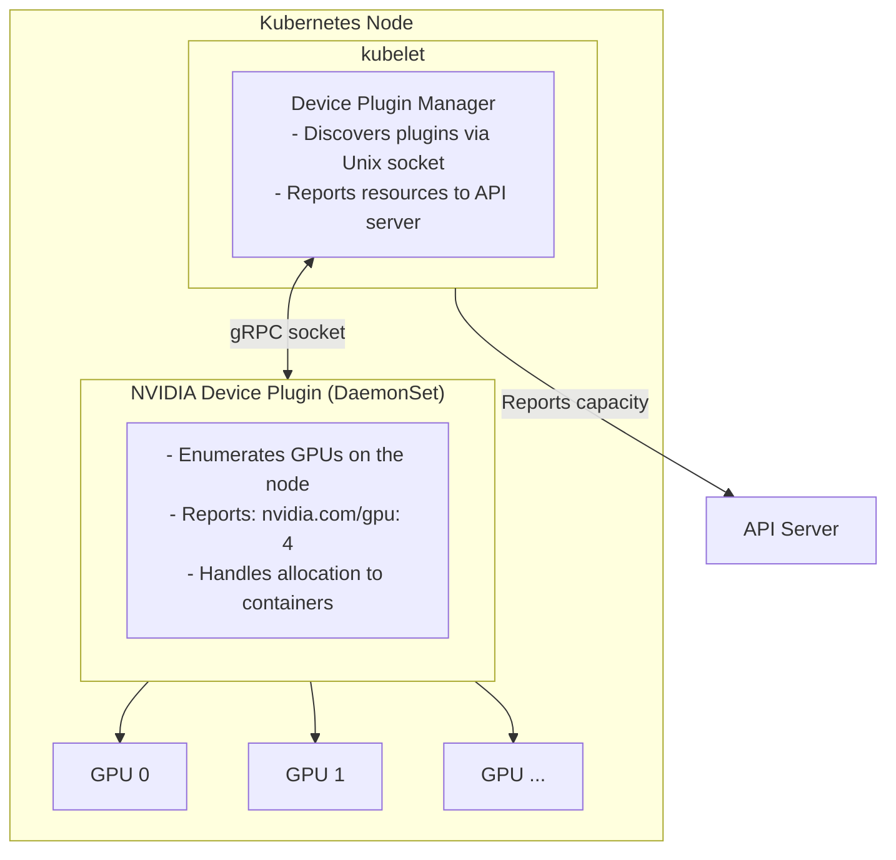
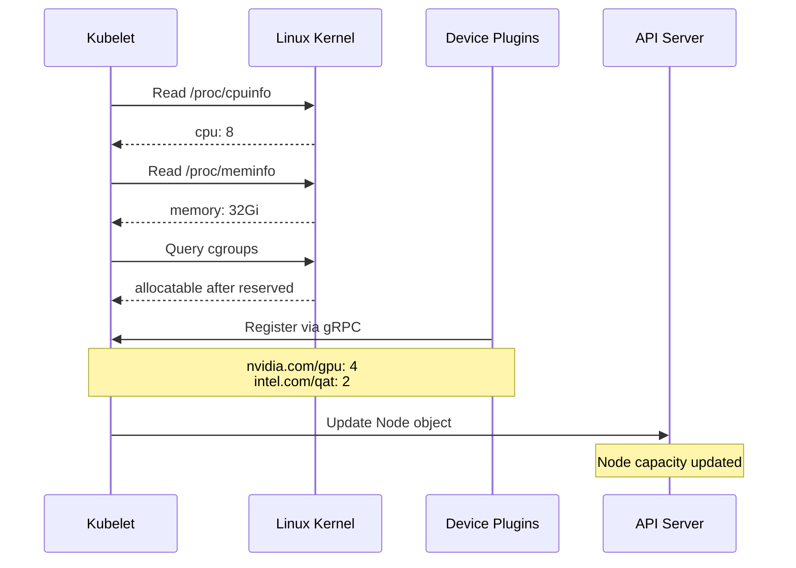
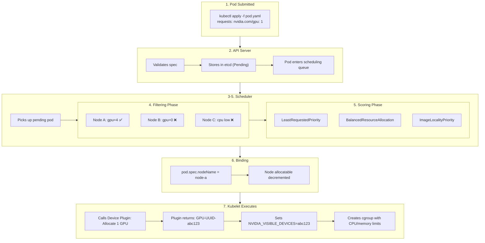
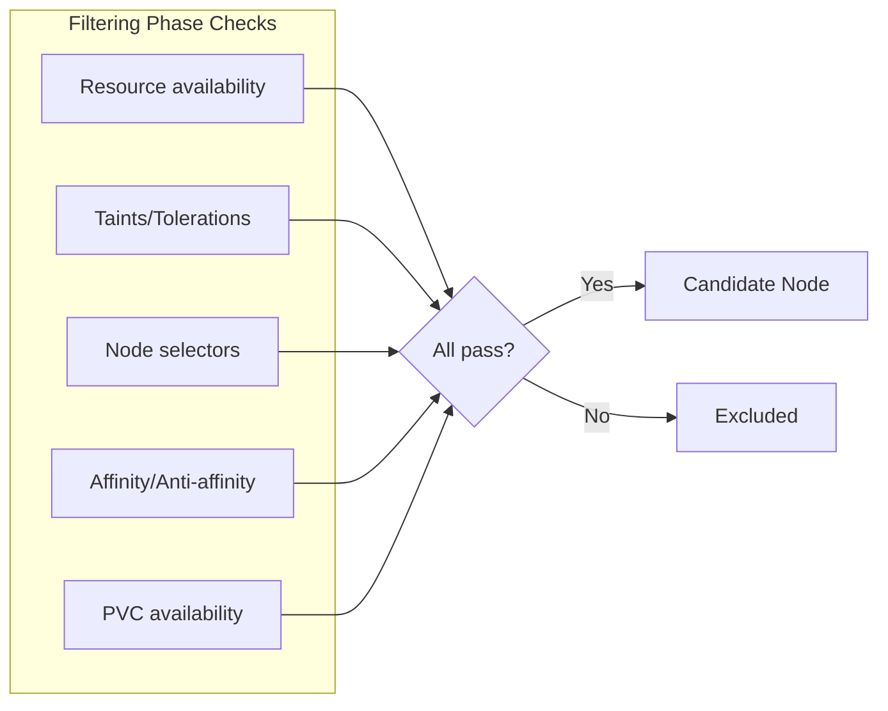

# Kubernetes Scheduling and Device Plugins

A deep dive into how Kubernetes schedules workloads and manages extended resources like GPUs.

## Table of Contents
- [Resource Types](#resource-types)
- [Device Plugin Architecture](#device-plugin-architecture)
- [Scheduling Process](#scheduling-process)
- [Extended Resources](#extended-resources)
- [Advanced Scheduling](#advanced-scheduling)

---

## Resource Types

### Built-in Resources
```yaml
resources:
  requests:       # Minimum guaranteed (used for scheduling)
    cpu: "500m"
    memory: "1Gi"
  limits:         # Maximum allowed (enforced at runtime)
    cpu: "2"
    memory: "4Gi"
```

### Extended Resources (via Device Plugins)
```yaml
resources:
  limits:
    nvidia.com/gpu: 2           # NVIDIA GPUs
    amd.com/gpu: 1              # AMD GPUs
    intel.com/qat: 1            # Intel QuickAssist (crypto)
    hugepages-2Mi: 100Mi        # Huge pages
    rdma/hca: 1                 # RDMA network adapters
    example.com/fpga: 1         # Custom FPGA
```

> **Note:** For extended resources, `requests` and `limits` must be equal—no overcommit allowed.

---

## Device Plugin Architecture



### How Nodes Report Resources



### Kernel Integration

Kubernetes resource management is built on Linux kernel features:

| Kernel Feature | Location | Purpose |
|----------------|----------|---------|
| `/proc/cpuinfo` | procfs | CPU count, model, features |
| `/proc/meminfo` | procfs | Total/free memory |
| cgroups v2 | `/sys/fs/cgroup/` | Resource limits enforcement |
| namespaces | kernel | Process/network/mount isolation |
| `/dev/nvidia*` | devfs | GPU device access |

---

## Scheduling Process



### Filtering Checks



### Requests vs Limits

| | Requests | Limits |
|---|----------|--------|
| **Purpose** | Scheduling guarantee | Hard ceiling |
| **Scheduler uses** | ✅ Yes | ❌ No |
| **Enforced at runtime** | ❌ Soft | ✅ Hard (OOM kill, CPU throttle) |

---

## Extended Resources

### Common Device Plugins

| Resource | Plugin | Use Case |
|----------|--------|----------|
| `nvidia.com/gpu` | NVIDIA device plugin | ML training, CUDA |
| `amd.com/gpu` | AMD GPU device plugin | ROCm workloads |
| `intel.com/qat` | Intel QAT plugin | TLS/crypto offload |
| `intel.com/sgx` | Intel SGX plugin | Secure enclaves |
| `smarter-devices/*` | Smarter device manager | USB, serial ports |

### Custom Extended Resources

You can advertise custom resources without a device plugin:

```bash
# Advertise custom resource via kubectl
kubectl patch node mynode --type='json' -p='[
  {"op": "add", "path": "/status/capacity/example.com~1dongle", "value": "5"}
]'
```

### Minikube GPU Setup

```bash
# Enable NVIDIA device plugin addon
minikube addons enable nvidia-gpu-device-plugin

# Request GPU in pod
spec:
  containers:
  - name: ml-training
    resources:
      limits:
        nvidia.com/gpu: 1
```

---

## Advanced Scheduling

### When You DON'T Need Volcano/Yunikorn

Standard K8s scheduler handles:
- Single pod requesting GPUs
- Basic resource matching
- Node affinity/anti-affinity

### When You DO Need Volcano/Yunikorn

| Scenario | Solution |
|----------|----------|
| Gang scheduling (all-or-nothing) | Volcano |
| Fair-share queuing | Yunikorn |
| Job priorities/preemption | Volcano |
| Multi-tenant GPU sharing | Yunikorn |

### Gang Scheduling Example (Volcano)

Without gang scheduling, distributed training can deadlock:
```
Worker 0 starts → waits for others
Worker 1 starts → waits
Worker 2 can't schedule (no GPUs left)
→ Deadlock! Workers 0,1 hold GPUs forever
```

With Volcano:
```yaml
apiVersion: batch.volcano.sh/v1alpha1
kind: Job
spec:
  minAvailable: 4  # All 4 must be schedulable, or none start
  tasks:
  - replicas: 4
    template:
      spec:
        containers:
        - resources:
            limits:
              nvidia.com/gpu: 1
```

---

## Further Reading

- [Kubernetes Device Plugins](https://kubernetes.io/docs/concepts/extend-kubernetes/compute-storage-net/device-plugins/)
- [NVIDIA Device Plugin](https://github.com/NVIDIA/k8s-device-plugin)
- [Volcano Scheduler](https://volcano.sh/)
- [Yunikorn](https://yunikorn.apache.org/)
- [Extended Resources](https://kubernetes.io/docs/tasks/administer-cluster/extended-resource-node/)
